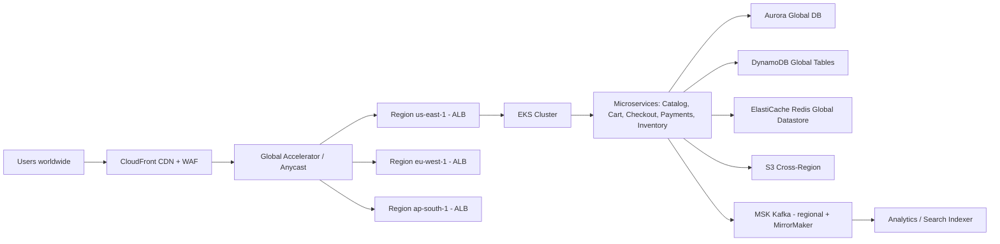
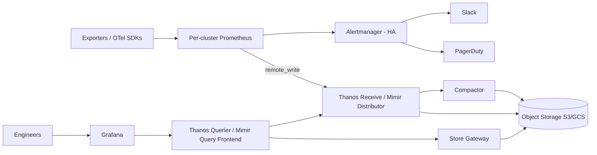
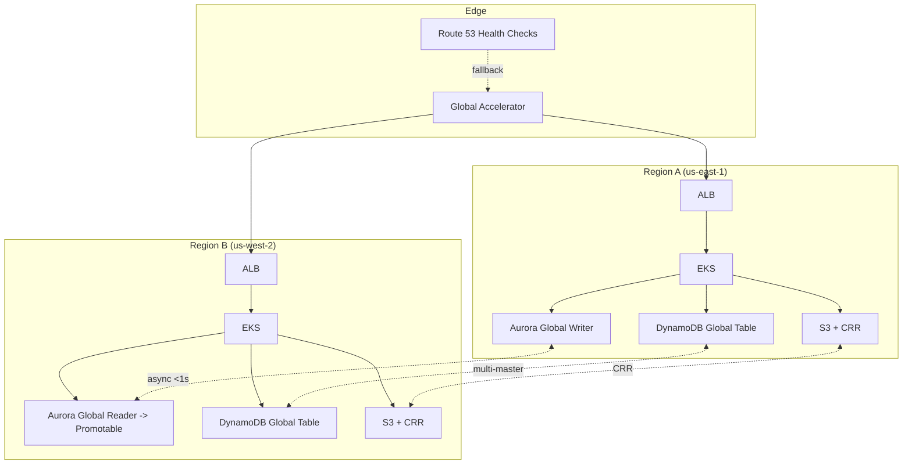
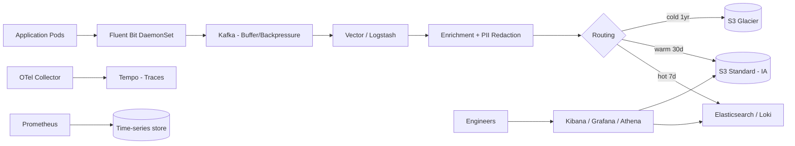
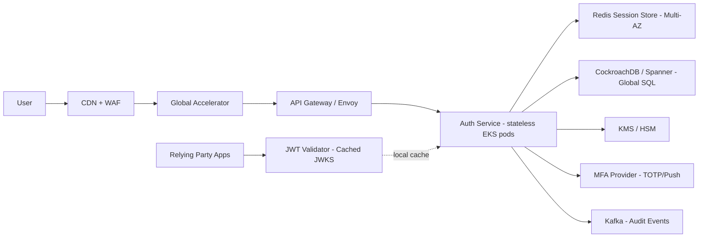
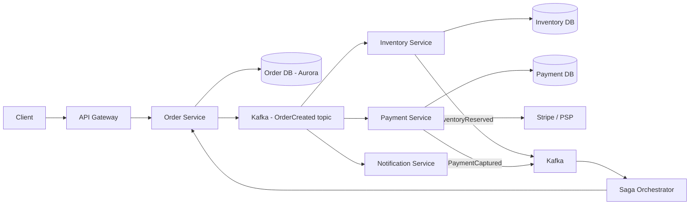
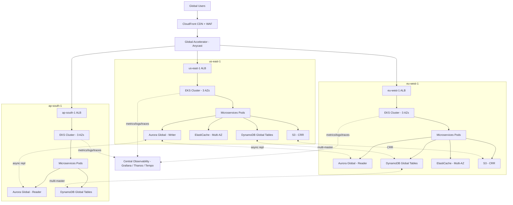
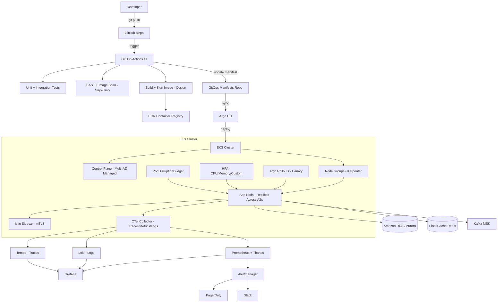
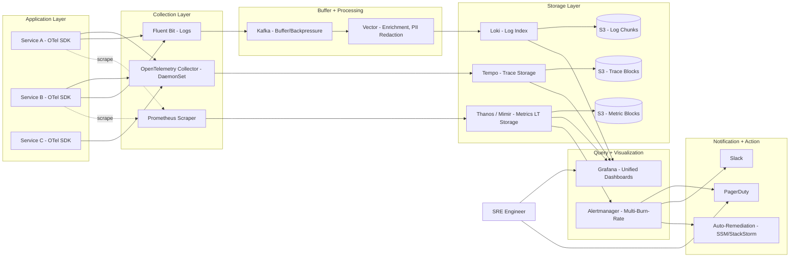

# SRE Architect — Comprehensive Interview Preparation Guide

> **Target Role:** Senior Site Reliability Engineering (SRE) Architect
> **Level:** Advanced (10+ years experience, architecture/leadership)
> **Coverage:** Reliability engineering, distributed systems, cloud, Kubernetes, observability, incident management, chaos engineering, and leadership.

---

## Table of Contents

1. [Section 1 — 50 Interview Questions & Answers](#section-1--50-interview-questions--answers)
   - [A. SRE Fundamentals (Q1–Q8)](#a-sre-fundamentals-q1q8)
   - [B. Distributed Systems & Architecture (Q9–Q14)](#b-distributed-systems--architecture-q9q14)
   - [C. Cloud — AWS/Azure/GCP (Q15–Q19)](#c-cloud--awsazuregcp-q15q19)
   - [D. Kubernetes & Containers (Q20–Q25)](#d-kubernetes--containers-q20q25)
   - [E. CI/CD & Automation (Q26–Q30)](#e-cicd--automation-q26q30)
   - [F. Observability — Metrics, Logs, Traces (Q31–Q36)](#f-observability--metrics-logs-traces-q31q36)
   - [G. Incident Management & RCA (Q37–Q41)](#g-incident-management--rca-q37q41)
   - [H. Performance Tuning & Scalability (Q42–Q44)](#h-performance-tuning--scalability-q42q44)
   - [I. Chaos Engineering (Q45–Q47)](#i-chaos-engineering-q45q47)
   - [J. Leadership & Stakeholder Management (Q48–Q50)](#j-leadership--stakeholder-management-q48q50)
2. [Section 2 — Real-Time Production Scenarios (12)](#section-2--real-time-production-scenarios-12)
3. [Section 3 — System Design Questions (6)](#section-3--system-design-questions-6)
4. [Section 4 — Architecture Diagrams (Mermaid)](#section-4--architecture-diagrams-mermaid)
5. [Appendix — Quick Reference Cheat Sheet](#appendix--quick-reference-cheat-sheet)

---

# Section 1 — 50 Interview Questions & Answers

## A. SRE Fundamentals (Q1–Q8)

### Q1. What is the difference between SLI, SLO, SLA, and Error Budget?

**Answer:**
These four terms are the foundation of reliability engineering and they sit on top of each other.

- **SLI (Service Level Indicator):** A *measurement* of system behavior — e.g., the percentage of HTTP requests returning a 2xx within 300 ms.
- **SLO (Service Level Objective):** A *target* for that SLI — e.g., 99.9% of requests under 300 ms over a 28-day window.
- **SLA (Service Level Agreement):** A *contractual* commitment to a customer that includes financial or business penalties — usually weaker than the SLO (e.g., SLO = 99.9%, SLA = 99.5%).
- **Error Budget:** The acceptable amount of unreliability = `100% – SLO`. If SLO is 99.9%, you have 0.1% (~43 minutes/month) of failures you can "spend."

**Real-world example:** At a payments company, the checkout API SLO is 99.95% availability. We tracked the SLI in Prometheus, computed burn rate alerts in Grafana, and froze risky deployments when 50% of the monthly error budget burned in 6 hours.

**Tools:** Prometheus, Grafana, Nobl9, Sloth (SLO generator), Datadog SLOs.

---

### Q2. How do you choose good SLIs?

**Answer:**
A good SLI must (a) reflect what the user actually experiences, (b) be measurable accurately, and (c) be actionable.

Start by asking, *"If this number drops, will the user notice?"* Map SLIs to the **four golden signals**:

- **Latency** — request duration percentiles (p50/p95/p99)
- **Traffic** — requests per second
- **Errors** — rate of failed requests
- **Saturation** — how full the system is (CPU, memory, queue depth)

Avoid noisy SLIs like raw CPU; prefer user-facing ones like *"% of search queries completed in <500 ms."*

**Real-world example:** For a video streaming app, the right SLI was not "server CPU < 80%" but "% of video starts that begin within 2 seconds." That correlated 1:1 with churn.

---

### Q3. Explain Error Budget Policy and how it influences engineering culture.

**Answer:**
An error budget policy translates SLOs into concrete actions when reliability degrades.

A typical policy:
1. **Budget healthy (>50% remaining):** Teams ship freely, even risky changes.
2. **Budget tight (10–50%):** Increase canary durations, require senior reviewer.
3. **Budget exhausted:** **Feature freeze** — only reliability fixes allowed until budget recovers.

This shifts the SRE/Dev relationship from adversarial ("SRE blocks deployments") to data-driven ("the data says we must slow down"). It also gives developers permission to take measured risks when the budget is healthy.

**Real-world example:** At a fintech, when the budget for the Auth service burned out, all feature work paused for 5 days. Engineers shipped retry-with-backoff, fixed a memory leak, and the team adopted progressive delivery before unfreezing.

---

### Q4. What is the difference between SRE and DevOps?

**Answer:**
DevOps is a **cultural philosophy** that breaks the wall between Dev and Ops — automation, CI/CD, shared ownership.

SRE is a **prescriptive implementation** of DevOps invented at Google. It applies *software engineering* to operations and adds concrete practices: SLOs, error budgets, toil budgets (≤50%), blameless postmortems, and a defined on-call model.

A simple way to put it: *"class SRE implements DevOps."* DevOps says *"reduce silos";* SRE says *"here's exactly how — measure reliability, define error budgets, and use them to govern velocity."*

---

### Q5. What is "toil" and how do you reduce it?

**Answer:**
Toil is operational work that is **manual, repetitive, automatable, tactical, devoid of long-term value, and grows linearly with service size.** Examples: running the same restart playbook every week, manually rotating credentials, copy-pasting cluster IDs.

Google's rule: **toil should be < 50% of an SRE's time.** If higher, the team is firefighting and never improves the system.

**How to reduce:**
1. Track toil per engineer per week (Jira label or survey).
2. Identify the top 3 toil sources.
3. Build automation: self-service portals, ChatOps bots, auto-remediation runbooks.
4. Treat each automation as a project with a measured ROI ("saves 4 hours/week").

**Tools:** Rundeck, StackStorm, Ansible, AWS Systems Manager, internal CLI/portal.

---

### Q6. How does SRE measure success? What KPIs matter most?

**Answer:**

| KPI | What it measures | Target |
|---|---|---|
| **SLO compliance %** | Are services meeting reliability targets? | ≥ 99% of services meeting SLO |
| **MTTD** (Mean Time To Detect) | How fast do we know something broke? | < 5 min |
| **MTTR** (Mean Time To Recover) | How fast do we restore service? | < 30 min for Sev1 |
| **Change failure rate** | % deployments causing incidents | < 15% |
| **Deployment frequency** | How often we ship safely | Daily for elite teams |
| **Toil %** | Manual operational load | < 50% |
| **Automation coverage** | % of runbooks automated | > 70% |
| **Cost per request / per user** | FinOps efficiency | Trend down YoY |

These align well with the **DORA metrics** (Deployment Frequency, Lead Time, Change Failure Rate, MTTR).

---

### Q7. What is the Reliability Maturity Model and where do most enterprises sit?

**Answer:**
A maturity model used to assess and grow SRE practice across an org:

- **Level 1 — Reactive:** No SLOs. Alerts on raw infra metrics. Heroes fix incidents.
- **Level 2 — Defined:** SLOs documented. Postmortems written but rarely actioned.
- **Level 3 — Managed:** Error budgets enforced. Incident reviews drive backlog.
- **Level 4 — Proactive:** Chaos engineering, capacity planning, predictive alerting.
- **Level 5 — Optimized:** Self-healing systems, AIOps, FinOps embedded, reliability as a product.

Most enterprises sit between Level 2 and Level 3. Moving from 3 → 4 is the hardest leap because it requires investment without a visible incident driving it.

---

### Q8. What is "Blameless Postmortem" culture and why does it matter?

**Answer:**
A blameless postmortem assumes that *people did the most reasonable thing given what they knew at the time*. The investigation focuses on **systems and processes**, not individuals.

If an engineer ran a destructive command, the question is not *"Why did Alice run it?"* but *"Why did the system allow a destructive command without a confirmation prompt or canary check?"*

**Why it matters:**
- Encourages honest disclosure of mistakes (the only way to learn)
- Shifts the org from blame culture to systemic-fix culture
- Aligns with HRO (High-Reliability Organization) principles from aviation and nuclear

**Real example:** At an SRE org, an engineer dropped a prod table. The postmortem focused on (a) lack of read-only DB access by default, (b) no `psql` CLI confirmation prompt, (c) no automated backup before destructive ops. Three controls were added; the engineer was praised for rapid disclosure.

---

## B. Distributed Systems & Architecture (Q9–Q14)

### Q9. Explain the CAP theorem and how you apply it as an architect.

**Answer:**
CAP states that in a distributed system you can guarantee at most 2 of: **Consistency** (every read sees the latest write), **Availability** (every request gets a response), **Partition tolerance** (system survives network splits).

Since network partitions are unavoidable in distributed systems, the *real* choice is **CP vs AP**:

- **CP systems:** Stop serving rather than serve stale data. Examples: Zookeeper, etcd, Spanner.
- **AP systems:** Always respond, accept eventual consistency. Examples: DynamoDB (default), Cassandra, Riak.

**As an architect:** I match the data model to the business requirement.
- A **bank ledger** must be CP — reading stale balance is unacceptable.
- A **social feed** can be AP — eventual consistency is fine, availability matters more.

PACELC extends CAP: even when no partition exists, you trade Latency vs Consistency.

---

### Q10. What are idempotency and at-least-once vs exactly-once semantics?

**Answer:**
- **Idempotent operation:** Running it N times has the same effect as running it once. Critical for retry safety.
- **At-least-once:** Message is delivered one or more times — your consumer must be idempotent.
- **Exactly-once:** Message processed exactly once — extremely hard in distributed systems and usually achieved via *idempotent writes + dedup keys*, not true exactly-once delivery.

**Real example:** A payment service uses an `Idempotency-Key` header (Stripe pattern). If a client retries due to network failure, the server checks Redis for the key — if seen, returns the original response without re-charging.

**Tools/Patterns:** Kafka with transactional producers, Outbox pattern, Saga pattern, idempotency keys in API design.

---

### Q11. Explain consistency models: strong, eventual, causal, read-your-writes.

**Answer:**

- **Strong consistency:** All nodes see the same data simultaneously. Linearizable. Used by Spanner, etcd. Slow across regions.
- **Eventual consistency:** Replicas converge over time. Used by DynamoDB, Cassandra. Fast, but a read after a write may return stale data.
- **Causal consistency:** Operations causally related are seen in order; unrelated operations may be seen out of order. Used in collaborative editing.
- **Read-your-writes:** A user always sees their own writes immediately, even on an eventually consistent store. Often implemented by routing the user to the primary or by sticky sessions.

**Real example:** A user updates their profile photo. Eventual consistency would show the old photo for 2 seconds. With *read-your-writes*, the user's own session reads from the primary, so they see the new photo instantly while other users see it eventually.

---

### Q12. What is the Two Generals Problem and why does it matter for distributed systems?

**Answer:**
The Two Generals Problem proves that **reliable communication over an unreliable channel is impossible** — you can never be 100% sure the other side received your message.

**Implication:** No distributed system can guarantee both delivery and acknowledgment. We design around it with:
- **Acks + retries + idempotency** (e.g., TCP, Kafka)
- **Two-phase commit (2PC)** — reduces but doesn't eliminate the problem
- **Saga pattern** — accept partial failures and compensate

**Real example:** A microservice publishes an order to Kafka. The publish call times out. We don't know if Kafka received it. Solution: idempotent producer with deduplication ID — replay safely.

---

### Q13. Explain circuit breakers, bulkheads, and retries with backoff.

**Answer:**
These are **resilience patterns** to prevent cascading failures.

- **Circuit Breaker:** When downstream fails repeatedly, "open" the circuit and fail fast for N seconds. Prevents thread exhaustion. (Hystrix, Resilience4j, Envoy outlier detection.)
- **Bulkhead:** Isolate resources (thread pools, connection pools) per dependency so one slow downstream doesn't drain capacity for others. (Like ship compartments.)
- **Retry with exponential backoff + jitter:** Retry transient failures, but back off (e.g., 100 ms, 200 ms, 400 ms…) and add randomness so retries don't synchronize and create a thundering herd.

**Real example:** Payment service called the Tax service which hung at 8 seconds. Without a circuit breaker, all checkout threads were blocked → site went down. After adding Resilience4j circuit breakers + bulkheads + 2-second timeout with 3 retries (jittered), an isolated Tax outage caused only 2% checkout degradation instead of 100%.

---

### Q14. What is consistent hashing and where do you use it?

**Answer:**
Consistent hashing distributes keys across N nodes such that adding/removing one node only remaps `1/N` of keys, not all of them.

**Mechanism:** Hash both keys and nodes onto a ring. A key is owned by the next clockwise node. Add a node → only its neighbor's keys shift to it.

**Where used:**
- **Cache clusters:** Memcached client, Redis Cluster
- **Distributed databases:** DynamoDB, Cassandra (with token rings)
- **Load balancers:** session affinity ("sticky" routing)
- **CDN edge selection**

**Real example:** A 100-node Memcached cluster with naive `hash(key) % N` would invalidate ~99% of cache entries when one node was added. With consistent hashing + virtual nodes, only ~1% of keys remap → minimal cache stampede on the database.

---

## C. Cloud — AWS/Azure/GCP (Q15–Q19)

### Q15. How do you architect for multi-region high availability on AWS?

**Answer:**
The goal is to survive an entire AWS region outage with minimal RTO/RPO.

**Pattern (Active-Active):**
1. **Compute:** EKS clusters in `us-east-1` and `us-west-2`. Identical workloads.
2. **DNS / Traffic:** Route 53 with **latency-based** or **weighted** routing + health checks. Failover automatically.
3. **Data:**
   - **DynamoDB Global Tables** for low-latency multi-region writes
   - **Aurora Global Database** for SQL — sub-second cross-region replication
   - **S3 Cross-Region Replication** for objects
4. **State:** ElastiCache Global Datastore or session affinity
5. **Edge:** CloudFront in front of everything for caching and DDoS shielding (Shield + WAF)
6. **IaC:** Terraform modules parameterized by region

**Trade-offs:** Active-active doubles cost but gives near-zero RTO. Active-passive (warm standby) is cheaper but RTO is minutes.

**Real example:** An e-commerce platform achieved RTO < 60s and RPO < 1s using Route 53 health checks + DynamoDB Global Tables + Aurora Global DB. During a us-east-1 disruption, traffic shifted seamlessly to us-west-2.

---

### Q16. Compare AWS, Azure, and GCP for SRE workloads.

**Answer:**

| Capability | AWS | Azure | GCP |
|---|---|---|---|
| **Maturity / breadth** | Largest service catalog | Strong enterprise + AD integration | Strongest in data/ML & K8s |
| **Kubernetes** | EKS (good, requires more config) | AKS (simple control plane) | GKE (best UX, Autopilot mode) |
| **Serverless** | Lambda + API Gateway | Functions + APIM | Cloud Run (best DX) |
| **Observability** | CloudWatch (decent), X-Ray | Monitor + App Insights (strong) | Cloud Operations / former Stackdriver |
| **Networking** | VPC, Transit Gateway, Global Accelerator | Virtual WAN, Front Door | Premium tier global network (best) |
| **Hybrid** | Outposts | Arc (best hybrid story) | Anthos |

As an architect, I'd pick based on (a) existing skills/contracts, (b) data gravity, (c) compliance regions. GCP for K8s/data-heavy, Azure for Microsoft-stack enterprises, AWS for breadth and ecosystem.

---

### Q17. How do you implement disaster recovery? Explain RTO and RPO.

**Answer:**
- **RTO (Recovery Time Objective):** Maximum tolerable downtime.
- **RPO (Recovery Point Objective):** Maximum tolerable data loss (in time).

**DR Strategies (cost increases left → right):**

| Strategy | RTO | RPO | Cost |
|---|---|---|---|
| **Backup & Restore** | Hours-days | Hours | $ |
| **Pilot Light** | 10s of min | Minutes | $$ |
| **Warm Standby** | Minutes | Seconds | $$$ |
| **Active-Active (Multi-Site)** | Seconds | ~0 | $$$$ |

**Implementation tips:**
- **Test DR quarterly** with game days — untested DR is fiction
- **Automate failover** (Route 53, Traffic Manager, GCP Load Balancer)
- **Replicate IAM, secrets, KMS keys** — easy to forget
- **Document a runbook** with explicit cutover and rollback steps

**Real example:** A SaaS platform required RTO 15 min, RPO 1 min. We used Aurora Global DB (RPO ~1s), pre-baked AMIs in DR region, Route 53 weighted DNS with auto-failover, and quarterly game days. Last actual failover took 11 minutes.

---

### Q18. How do you optimize cloud cost without hurting reliability (FinOps)?

**Answer:**
Cost optimization is an SRE concern because over-provisioning is waste and under-provisioning kills reliability.

**Levers (impact-ordered):**

1. **Right-sizing:** Use AWS Compute Optimizer, GCP Recommender, K8s VPA. Most clusters run 30–60% over-provisioned.
2. **Spot / Preemptible** for stateless and batch — 70–90% savings. Use with PDBs and graceful drain.
3. **Savings Plans / Reserved Instances** for steady-state — 30–50% savings on commit.
4. **Auto-scaling** (HPA, Cluster Autoscaler, Karpenter on EKS) to match demand.
5. **Storage tiering:** S3 Intelligent-Tiering, Glacier for cold data.
6. **Egress reduction:** CloudFront caching, regional architecture, VPC endpoints to avoid NAT charges.
7. **Idle resource cleanup:** automated tagging + janitor jobs (Cloud Custodian).
8. **Observability cost:** Sample traces at 1–10%, use log tiering (hot/warm/cold).

**Real example:** At a media company we cut $1.2M/yr by introducing Karpenter (replaced over-provisioned node groups), moving non-critical batch to Spot, and dropping log retention from 90 → 30 days for INFO-level logs.

---

### Q19. What is the Well-Architected Framework and how does it tie to SRE?

**Answer:**
AWS Well-Architected (mirrored by Azure WAF and Google Cloud Architecture Framework) defines six pillars:

1. **Operational Excellence** — runbooks, observability, change mgmt
2. **Security** — least privilege, encryption, defense in depth
3. **Reliability** — SLOs, fault tolerance, DR
4. **Performance Efficiency** — right-sizing, scaling
5. **Cost Optimization** — FinOps
6. **Sustainability** — carbon-aware regions, efficient compute

**SRE alignment:** Pillar 1 and Pillar 3 are pure SRE territory. As an Architect, I run Well-Architected Reviews (WARs) on every major workload and feed gaps into the engineering backlog as risk-ranked items.

---

## D. Kubernetes & Containers (Q20–Q25)

### Q20. Walk me through what happens when you run `kubectl apply -f deployment.yaml`.

**Answer:**

1. **kubectl** parses YAML, authenticates via kubeconfig, sends a request to the **kube-apiserver**.
2. **API server** validates the request (admission controllers like OPA/Gatekeeper, mutating webhooks), then writes the desired state to **etcd**.
3. The **Deployment controller** sees the new spec, creates/updates a **ReplicaSet**.
4. The **ReplicaSet controller** creates **Pod** objects to match desired replicas.
5. The **scheduler** picks a node based on resource requests, affinity rules, taints/tolerations.
6. The **kubelet** on the chosen node pulls the container image, calls the **CRI** (containerd) to start the container.
7. **kube-proxy** updates iptables/IPVS rules so the Service routes traffic to the new Pod.
8. **CoreDNS** updates DNS for service discovery.
9. **Liveness/Readiness probes** must pass before traffic is sent.

If any step fails, status flows back through the same chain — visible via `kubectl describe pod`.

---

### Q21. Explain the difference between requests, limits, and QoS classes.

**Answer:**
- **Requests:** Minimum resources guaranteed — used by the scheduler to place the pod.
- **Limits:** Hard cap — exceeding CPU throttles, exceeding memory triggers OOMKill.

**QoS Classes:**
| Class | Condition | Eviction Priority |
|---|---|---|
| **Guaranteed** | requests = limits for all containers | Last to be evicted |
| **Burstable** | requests set, limits higher (or absent) | Mid |
| **BestEffort** | no requests/limits | First to be evicted |

**Pitfalls:**
- Setting CPU limits can cause unexpected throttling (CFS bandwidth issues). Many SRE teams now omit CPU limits and rely on requests + node capacity.
- Memory limits should be set; OOMKill is preferable to a node going down.

**Tools:** Goldilocks, Kubecost, VPA (recommendation mode).

---

### Q22. How do you make a Kubernetes cluster highly available?

**Answer:**

1. **Control plane HA:** 3 or 5 replicas of API server, scheduler, controller-manager (odd number for etcd quorum). Spread across AZs.
2. **etcd HA:** Run a 3- or 5-node etcd cluster on dedicated nodes; back up etcd snapshots to S3 every 30 min.
3. **Worker HA:** Multiple node groups across AZs, Cluster Autoscaler / Karpenter.
4. **Workload HA:**
   - `topologySpreadConstraints` to spread pods across zones
   - `PodDisruptionBudgets` to limit voluntary disruption
   - `replicas >= 2`, anti-affinity rules
   - Liveness/Readiness/Startup probes
5. **Networking:** Multi-AZ load balancers (ALB/NLB), CNI with redundancy (Calico, Cilium).
6. **Multi-cluster:** For critical workloads, federate with tools like ArgoCD App-of-Apps or Karmada; one cluster failure ≠ outage.

**Managed offerings** (EKS, GKE, AKS) handle control-plane HA for you, but you still own data-plane and workload HA.

---

### Q23. What strategies do you use for safe Kubernetes deployments?

**Answer:**

| Strategy | What it is | When to use |
|---|---|---|
| **Rolling update** | Default; replace pods incrementally | Stateless services, low risk |
| **Recreate** | Kill all, then create | Stateful single-instance services |
| **Blue/Green** | Run two full stacks; switch service selector | Need instant rollback, schema changes |
| **Canary** | Send 1–5% of traffic to new version, observe | Reduce blast radius |
| **Progressive delivery** | Automated canary with metric analysis (Argo Rollouts, Flagger) | Mature SRE orgs |

**Reliability gates** in CI/CD:
- Smoke tests post-deploy
- SLO check: abort rollout if error rate > threshold
- Auto-rollback on critical alerts

**Real example:** Using **Argo Rollouts + Flagger + Prometheus**, we deployed 30 services daily with 0.1% canary → automated promotion based on success rate and latency. Bad deploys auto-rolled back in under 3 minutes.

---

### Q24. How do you secure a Kubernetes cluster?

**Answer:**
Defense in depth across 5 layers:

1. **Cluster:** Private API server endpoint, short-lived OIDC tokens, audit logging, etcd encryption at rest.
2. **Node:** Hardened OS (Bottlerocket, COS), no SSH (use SSM/IAP), kernel-level guardrails (gVisor, Kata).
3. **Network:** NetworkPolicies (default-deny), service mesh mTLS (Istio/Linkerd), Cilium for L7 policies.
4. **Workload:** Pod Security Standards (restricted), no privileged containers, runAsNonRoot, read-only root FS, drop ALL capabilities.
5. **Supply chain:** Image signing (Cosign/Sigstore), SBOMs, vulnerability scanning (Trivy, Snyk) in CI, admission control (Kyverno, OPA Gatekeeper).

Plus **secrets** in External Secrets Operator + AWS Secrets Manager / Vault — never as plain ConfigMaps.

---

### Q25. What is a service mesh, and when do you actually need one?

**Answer:**
A service mesh is an infrastructure layer (typically sidecar proxies like Envoy) that handles **service-to-service communication concerns**: mTLS, traffic shifting, retries, circuit breaking, observability — without requiring code changes.

**Examples:** Istio, Linkerd, Consul Connect, Cilium Service Mesh (eBPF, no sidecar).

**When you need one:**
- Many polyglot microservices (50+) needing uniform observability and security
- Strict zero-trust mTLS requirement
- Advanced traffic management (canary, mirroring, fault injection)
- Multi-cluster service discovery

**When you don't:**
- < 10 services
- Mostly monolith or simple architecture
- Team can't operate the added complexity (mesh outages are painful)

I'd start with **Linkerd** for simplicity or **Cilium** if you also need network policy. Istio is powerful but heavyweight.

---

## E. CI/CD & Automation (Q26–Q30)

### Q26. What does a production-grade CI/CD pipeline look like for a microservice?

**Answer:**

```
[Developer push] → CI (build, unit test, SAST, image scan, sign) →
[Artifact registry] → CD (Argo CD GitOps) →
[Dev → Staging → Canary 5% → 25% → 100%] with SLO gates at each step
```

**Stages:**
1. **Build:** Multi-stage Dockerfile, reproducible (`buildkit`), tagged with git SHA.
2. **Test:** Unit, integration, contract (Pact), load-smoke.
3. **Security:** SAST (SonarQube), SCA (Snyk), image scan (Trivy), policy check (Conftest/OPA).
4. **Sign & SBOM:** Cosign + Syft.
5. **Deploy via GitOps:** Push manifests to Git → Argo CD reconciles.
6. **Progressive delivery:** Argo Rollouts/Flagger watches metrics; auto-promote or roll back.
7. **Post-deploy:** Synthetic checks, alert if SLO degrades.

**Tools:** GitHub Actions / GitLab CI / Jenkins for CI; Argo CD / Flux for CD; Argo Rollouts / Flagger for progressive delivery.

---

### Q27. What are reliability gates in CI/CD?

**Answer:**
Reliability gates are automated checks that must pass before code progresses to the next stage. Examples:

- **Test gate:** Coverage > 80%, all tests pass.
- **Security gate:** No critical CVEs, no secrets in code.
- **Performance gate:** p99 latency in load test < threshold.
- **SLO gate:** Post-deploy, if error rate > 0.5% over 5 min, auto-rollback.
- **Error budget gate:** If service has < 10% error budget, block deploys.
- **Change approval gate:** For Sev-1 services during business hours, require human approval.

These gates encode policy as code — no human gatekeeping, no exceptions, fully auditable.

---

### Q28. Compare GitOps vs traditional CD.

**Answer:**

| Aspect | Traditional CD (push) | GitOps (pull) |
|---|---|---|
| **Source of truth** | CI server logs | Git repository |
| **Deployment** | CI pushes to cluster | Agent in cluster pulls from Git |
| **Drift detection** | Manual | Automatic (continuous reconciliation) |
| **Rollback** | Re-run pipeline | `git revert` |
| **Audit** | Pipeline history | Git history (better) |
| **Security** | CI server needs cluster credentials | Cluster pulls; no inbound creds needed |

**Tools:** Argo CD, Flux.

GitOps wins for Kubernetes workloads — declarative, self-healing, and the cluster never trusts external pushers.

---

### Q29. How do you manage Infrastructure as Code at enterprise scale?

**Answer:**

1. **Modular Terraform:** Reusable modules per service (network, EKS, RDS), versioned in their own repos.
2. **Workspace isolation:** Per-env state files in remote backend (S3 + DynamoDB lock, or Terraform Cloud).
3. **Policy as Code:** OPA/Sentinel/Checkov enforces "no public S3 buckets," "tags required," etc.
4. **Plan-Review-Apply pipeline:** PRs run `terraform plan`, post diff as PR comment; merge triggers `apply`.
5. **Drift detection:** Run `terraform plan` nightly, alert on drift.
6. **Secrets:** Never in tfvars — use Vault/AWS Secrets Manager + data sources.
7. **Layering:** Foundation (VPC, IAM) → Platform (EKS, RDS) → App (workloads). Apply bottom-up; never one giant root module.

**Tools:** Terraform, Terragrunt, Atlantis, Spacelift, AWS CloudFormation, Pulumi.

---

### Q30. What is "Self-Healing System" and how do you build one?

**Answer:**
A self-healing system detects degradation and remediates without human intervention.

**Layers:**
1. **Process level:** systemd or container restart policies.
2. **Pod level:** Liveness probes restart unhealthy pods.
3. **Node level:** Node Problem Detector + Cluster Autoscaler replace bad nodes.
4. **Service level:** HPA scales out on load; circuit breakers shed traffic.
5. **Application level:** Auto-rollback on SLO breach (Argo Rollouts).
6. **Workflow level:** Auto-remediation runbooks triggered by alerts (StackStorm, AWS SSM Automation).

**Real example:** When disk usage on log nodes > 85%, an event in EventBridge triggered an SSM Automation that rotated logs, archived to S3, and notified Slack — no human paged. Reduced disk-related pages from 8/month to 0.

---

## F. Observability — Metrics, Logs, Traces (Q31–Q36)

### Q31. What are the three pillars of observability?

**Answer:**

1. **Metrics** — numeric measurements over time (Prometheus, CloudWatch). Cheap, aggregatable. Best for SLIs and alerting.
2. **Logs** — discrete event records (ELK, Loki, Splunk). High cardinality. Best for debugging specific events.
3. **Traces** — request flow across services (Jaeger, Tempo, Datadog APM, X-Ray). Best for understanding latency in distributed systems.

A mature **OpenTelemetry** strategy unifies all three with consistent context propagation (trace ID, span ID, baggage), letting you jump from a metric anomaly → trace → relevant logs in one click.

**Honorable 4th pillar:** **Profiling** (continuous profiling with Pyroscope/Parca) — flamegraphs in production.

---

### Q32. Compare Prometheus and Datadog for SRE.

**Answer:**

| Aspect | Prometheus | Datadog |
|---|---|---|
| **Cost model** | Open source / self-host | SaaS, expensive at scale |
| **Pull vs push** | Pull (scrape) | Push (agent) |
| **Long-term storage** | Needs Thanos/Mimir | Built-in |
| **Logs** | Separate (Loki) | Integrated |
| **APM/Traces** | Separate (Tempo/Jaeger) | Integrated |
| **Alerting** | Alertmanager | Built-in |
| **Out-of-box dashboards** | Build yourself | Hundreds bundled |
| **Cardinality** | Hard limit, expensive | Pricing penalty |

**Choice:** Prometheus + Grafana + Loki + Tempo for cost-controlled, cloud-agnostic stacks. Datadog when you want a single pane of glass and TCO of engineering time matters more than license cost.

---

### Q33. What are the Golden Signals and RED method?

**Answer:**

**Golden Signals** (Google SRE book) — for any service:
- **Latency** — request duration
- **Traffic** — requests/sec
- **Errors** — % failed
- **Saturation** — resource utilization

**RED Method** (Tom Wilkie, Weaveworks) — focused on request-driven services:
- **Rate** (requests/sec)
- **Errors** (failed requests)
- **Duration** (latency)

**USE Method** (Brendan Gregg) — for resources:
- **Utilization** (busy %)
- **Saturation** (queue depth)
- **Errors** (count)

I use **RED** for microservices and **USE** for nodes/disks/queues. Together, they cover request-level and resource-level reliability.

---

### Q34. How do you reduce alert fatigue?

**Answer:**

1. **Alert on symptoms, not causes.** Alert on "checkout error rate > 1%," not "DB CPU > 80%."
2. **SLO-based alerts** with **multi-window burn rate** (e.g., 2% of monthly budget burned in 1 hour AND 5 min). Two windows = high precision, fast detection.
3. **Severity discipline:** Sev1 = page, Sev2 = ticket, Sev3 = log only. Audit ratios monthly.
4. **Auto-close** transient alerts (de-duplication, flapping detection).
5. **Routing:** Route alerts to the team that *can act* — not generic on-call.
6. **Quarterly alert review:** retire unused alerts, demote noisy ones.
7. **Track signal:noise ratio** as a KPI — target > 80% actionable.

**Real example:** A team had 600 alerts/week, 92% non-actionable. Migrating to SLO burn-rate alerts dropped pages to 30/week with no incident detection regression.

---

### Q35. How does distributed tracing work?

**Answer:**
Each incoming request gets a **trace ID**. As it flows through services, each operation creates a **span** carrying that trace ID and a parent span ID. Spans are sent to a tracing backend (Jaeger, Tempo, Datadog APM) that reconstructs the full request graph.

**Context propagation:** via headers (W3C Trace Context: `traceparent`, `tracestate`).

**Key value:** When latency spikes, tracing tells you which downstream call is slow — invaluable in microservice meshes.

**Sampling:** 100% sampling at scale is too expensive. Use:
- **Head-based sampling** (1–10%) — simple, may miss rare errors
- **Tail-based sampling** — keep all errored or slow traces, sample the rest. More complex but better signal.

**Tools:** OpenTelemetry SDK, Jaeger, Tempo, Honeycomb, Datadog APM, AWS X-Ray.

---

### Q36. How do you design a logging strategy for a large platform?

**Answer:**

1. **Structured logs (JSON)** — never plain text. Consistent fields: `timestamp`, `level`, `service`, `trace_id`, `user_id`, `request_id`, `message`.
2. **Log levels with discipline:** DEBUG off in prod by default; can be toggled per service via config.
3. **Tiered storage:** Hot (7d in Elasticsearch), Warm (30d in S3 + Athena/Loki), Cold (1y in S3 Glacier).
4. **Sampling at high volume:** Sample INFO logs at 10%, keep all WARN/ERROR.
5. **PII redaction** at the agent (Fluent Bit/Vector) before leaving the host.
6. **Correlation IDs:** Every log carries `trace_id` linking to traces.
7. **Cost guardrails:** Daily ingestion budget per service; alert if exceeded.
8. **Pipeline:** App → Fluent Bit (sidecar/daemonset) → Kafka (buffer) → Logstash/Vector → ES/Loki/S3.

**Real example:** A 200-service platform was spending $400K/yr on logs. Adding sampling, dropping debug logs, and tiering to S3 cut it to $90K/yr with no loss in incident debugging capability.

---

## G. Incident Management & RCA (Q37–Q41)

### Q37. Walk through your end-to-end incident management process.

**Answer:**

**1. Detect:** Alert fires (Prometheus → Alertmanager → PagerDuty).
**2. Triage:** On-call ack within 5 min, sets severity (Sev1/2/3).
**3. Mobilize:** For Sev1, open Slack incident channel, page IC (Incident Commander), assign roles: Comms Lead, Ops Lead, Scribe.
**4. Investigate:** Use observability triad. Hypothesize → test → eliminate. Avoid HiPPO bias (highest-paid person's opinion).
**5. Mitigate first, then fix:** Roll back, drain traffic, scale up — restore service before perfect RCA.
**6. Communicate:** Status page update every 30 min; clear, blameless language.
**7. Resolve & verify:** Confirm with synthetic checks and customer support.
**8. Postmortem within 5 business days:** Blameless, timeline, contributing factors, action items with owners and due dates.
**9. Track action items to closure** — measure % completion as a KPI.

**Tools:** PagerDuty, Opsgenie, Statuspage, Jeli, FireHydrant, Incident.io.

---

### Q38. What's the difference between MTTD, MTTA, MTTR, and MTBF?

**Answer:**

- **MTTD** (Mean Time To Detect) — alert firing → human notified
- **MTTA** (Mean Time To Acknowledge) — page sent → on-call ack
- **MTTR** (Mean Time To Recover/Repair/Resolve) — incident start → service restored
- **MTBF** (Mean Time Between Failures) — reliability of the system over time

**Improving each:**
- **MTTD ↓:** Better SLO-based alerting, synthetic monitoring.
- **MTTA ↓:** Clear on-call rotations, escalation policies, mobile app notifications.
- **MTTR ↓:** Runbooks, auto-remediation, observability that surfaces root cause fast.
- **MTBF ↑:** Chaos engineering, code quality gates, post-incident action items.

The Architect's job is to drive these as visible, trended metrics — not vanity numbers.

---

### Q39. Walk me through a real RCA you led.

**Answer (use the "5 Whys + Contributing Factors" model):**

*Incident:* Checkout API returned 500s for 22 minutes during peak Black Friday traffic. Revenue impact ~$340K.

**Timeline:** [include detection time, escalation, mitigation, resolution]

**5 Whys:**
1. *Why* did checkout fail? → Database connection pool exhausted.
2. *Why* exhausted? → Long-running query held connections.
3. *Why* long-running? → A new ORDER BY on un-indexed column on a 200M-row table.
4. *Why* did this reach prod? → Schema change PR was approved without DBA review.
5. *Why* no DBA review? → No required reviewer policy on migrations folder.

**Contributing factors:** No query timeout in app config; no slow-query alert; canary did not catch it because canary traffic was 0.5% and table was small in canary env.

**Action Items (with owners):**
- Add CODEOWNERS for `/migrations` requiring DBA approval — **DBA Lead, 5 days**
- Set 5-second statement timeout app-wide — **Backend Lead, 2 days**
- Add slow-query alert (Datadog) — **SRE, 3 days**
- Use prod-sized data subset in staging — **Platform Eng, 30 days**
- Increase canary to 5% with auto-rollback on error rate — **SRE, 14 days**

**Lessons:** Multiple shallow defenses missing — added 5 layers of protection.

---

### Q40. How do you run a productive postmortem?

**Answer:**

1. **Schedule within 5 business days** — memory fades fast.
2. **Blameless framing** at the start: "We're here to fix the system, not blame people."
3. **Walk through the timeline** with real evidence (Slack, dashboards, logs) — not memory.
4. **Identify contributing factors**, not "the" root cause. Real outages are multi-causal (Swiss cheese model).
5. **Action items must be SMART**: Specific, Measurable, Assigned, Realistic, Time-bound. Avoid "improve monitoring."
6. **Distinguish quick wins** (week) from structural fixes (quarter).
7. **Publish broadly** so other teams learn.
8. **Review action item completion** in next month's ops review.

**Anti-patterns:** "Add training" as an action (rarely solves systems issues). Single root cause (oversimplifies). Punishment.

---

### Q41. What is "incident severity" classification?

**Answer:**

| Sev | Impact | Example | Response |
|---|---|---|---|
| **Sev 1** | Major — full outage or revenue loss | Checkout down | Page primary + secondary, exec notified, all hands |
| **Sev 2** | Significant — degraded but functional | Search slow | Page primary, status page updated |
| **Sev 3** | Minor — non-critical feature broken | Recommendations engine off | Ticket, fix in business hours |
| **Sev 4** | Cosmetic / internal | Bad log message | Backlog |

Clear severity definitions prevent on-call burnout and ensure proportional response. Re-evaluate severity throughout the incident — escalate or downgrade as new info emerges.

---

## H. Performance Tuning & Scalability (Q42–Q44)

### Q42. How do you investigate high latency in a microservices system?

**Answer:**

1. **Confirm the symptom** — which endpoint, which percentile (p50/p95/p99), what users.
2. **Look at the trace** — find the slow span. Is it one downstream call or many?
3. **Correlate with deploys** — anything shipped in the last 30 min?
4. **Check resource saturation** — CPU, memory, GC pauses, connection pools, thread pools.
5. **Check downstream dependencies** — DB query latency (slow query log), cache hit rate, third-party APIs.
6. **Look for noisy neighbors** — co-tenant on K8s node, RDS multi-tenant.
7. **Profile** — flamegraph (Pyroscope, async-profiler) shows hot code paths.
8. **Network** — DNS, packet loss, MTU issues, SSL handshake overhead.

**Common culprits:** N+1 queries, missing indexes, GC pauses, cold caches, connection pool too small, retries amplifying load, unbounded log writes.

---

### Q43. How do you do capacity planning for a high-traffic service?

**Answer:**

1. **Know your peak:** historical data + business forecast (e.g., 2x growth, Black Friday 8x baseline).
2. **Find the bottleneck:** load test until something breaks (CPU, memory, DB connections, network).
3. **Establish headroom:** target 50–60% utilization at peak — leaves room for failover.
4. **Calculate scale-out time:** if HPA takes 90s and traffic spikes in 30s, you need pre-warming or higher minReplicas.
5. **Test the math:** game day at 2x load.
6. **Right-size cost vs reliability:** cheaper to over-provision compute than to violate SLO.
7. **Plan dependencies:** DB connection limits, third-party rate limits, license counts.
8. **Quarterly review:** re-do based on actual growth and seasonality.

**Tools:** k6, Locust, Gatling, JMeter for load tests; AWS Load Balancer access logs + Athena for traffic analysis.

---

### Q44. Vertical vs Horizontal scaling — when to choose what?

**Answer:**

| Aspect | Vertical (scale up) | Horizontal (scale out) |
|---|---|---|
| **What** | Bigger machine | More machines |
| **Best for** | Stateful (RDBMS), single-threaded | Stateless services, web tier |
| **Limits** | Hardware ceiling | Coordination overhead |
| **Failure tolerance** | One bigger SPOF | Distributed |
| **Cost** | Often non-linear (bigger = much pricier) | Linear |

**As an architect:** I default to horizontal for new designs (cloud-native, K8s, stateless, autoscaled). Vertical is acceptable for monolithic legacy DBs, single-writer queues, and short-term remediation while horizontal redesign happens.

---

## I. Chaos Engineering (Q45–Q47)

### Q45. What is chaos engineering and why do we need it?

**Answer:**
Chaos engineering is the **disciplined practice of injecting controlled failures** into a system to discover weaknesses **before** they cause outages.

**Why:** Distributed systems are too complex to fully understand from architecture diagrams. The only way to know how it fails is to make it fail in a safe way.

**Principles (Principles of Chaos):**
1. Hypothesize about steady-state behavior.
2. Vary real-world events (instance death, network latency, disk full).
3. Run in production (with safety controls).
4. Automate continuously.
5. Minimize blast radius.

**Tools:** Chaos Mesh, LitmusChaos, Gremlin, AWS Fault Injection Simulator, Netflix Chaos Monkey/Simian Army.

**Real example:** Game day in staging — kill 30% of pods in checkout service. Discovered HPA was set with min=2, scale-out cooldown 60s; service went red for 90s. Fixed: min=4, faster scale-out. Repeat in prod safely.

---

### Q46. How do you run a chaos experiment safely in production?

**Answer:**

1. **Steady state first:** define a measurable "normal" (e.g., success rate > 99.9%, p99 < 200 ms).
2. **Hypothesis:** "Killing 1 of 6 checkout pods will not violate the SLO."
3. **Blast radius minimization:** start with smallest scope (one pod, one AZ, 1% traffic).
4. **Abort criteria:** If success rate < 99.5% or p99 > 500 ms for 60s → auto-stop.
5. **Communicate:** announce in #incidents-channel, ensure on-call is aware.
6. **Run and observe:** real-time dashboard.
7. **Document findings:** what broke, what surprised you, what to fix.
8. **Iterate** with bigger scope only after confidence builds.

Always have a **kill switch** and **automatic rollback**.

---

### Q47. What kinds of chaos experiments are most valuable?

**Answer:**

1. **Instance/Pod kill** (Chaos Monkey) — tests redundancy
2. **AZ failure** — tests multi-AZ deployment
3. **Region failure** (game day) — tests DR
4. **Network latency injection** (e.g., +200ms to DB) — tests timeouts/circuit breakers
5. **Network partition** — tests CAP behavior
6. **DNS failures** — tests resolver caching/fallbacks
7. **Disk full** — tests log rotation, alerting
8. **CPU/memory pressure** — tests autoscaling, OOM handling
9. **Dependency failure** (kill cache, kill third party) — tests degraded mode
10. **Clock skew** — tests time-sensitive logic

The most valuable are the ones whose outcome you **can't confidently predict** — they teach you the most about your system.

---

## J. Leadership & Stakeholder Management (Q48–Q50)

### Q48. How do you sell SRE to a skeptical engineering organization?

**Answer:**

1. **Lead with their pain:** "How many weekend pages last month?" — quantify cost of unreliability.
2. **Start small:** pick one critical service, define SLOs, ship error budget policy. Show win in 90 days.
3. **Speak their language:** for engineers, "reduce 3am pages." For execs, "improve customer NPS, reduce revenue loss."
4. **Give freedom for reliability:** error budget = permission to ship fast when budget is healthy. SRE isn't the brake; it's the steering.
5. **Embed SREs** with product teams initially (not a central tower).
6. **Celebrate wins publicly:** "Auth team: 0 Sev-1s for 90 days, MTTR down 60%."
7. **Run blameless postmortems openly** — proves SRE is here to learn, not police.
8. **Tooling investment:** make doing the right thing the easy thing (templates, golden paths).

The hardest part isn't tech — it's earning trust and showing that SRE makes engineers' lives better, not harder.

---

### Q49. How do you handle conflict between Dev velocity and Reliability?

**Answer:**
This is the central tension SRE was designed to resolve — and the answer is **error budgets**.

- **Don't argue from opinion:** "you're shipping too fast" vs "you're slowing us down" goes nowhere.
- **Argue from data:** "We're at 60% error budget burn this week. Per policy, we slow risky changes."
- **Pre-agree the policy** with leadership so it's not negotiated mid-incident.
- **Frame trade-offs in business terms:** "Choosing to ship feature X means accepting Y minutes of additional risk per month."
- **When velocity wins,** invest in safety nets: better canaries, faster rollback, feature flags.
- **When reliability wins,** invest in toil reduction so safety doesn't kill productivity.

Healthy orgs see this tension as productive friction, not a war.

---

### Q50. How do you mentor and grow an SRE team?

**Answer:**

1. **Hire for systems thinking,** not just tool experience. Tools change; mindset doesn't.
2. **Career ladders for both IC and management** — many great SREs don't want to manage.
3. **Rotate roles** — production support, on-call, project work, architecture. Prevents burnout, builds breadth.
4. **Game days and incident retrospectives** are training opportunities — pair juniors with seniors.
5. **Encourage writing:** internal RFCs, postmortems, runbooks. Writing forces clear thinking.
6. **External growth:** conferences (SREcon, KubeCon), CNCF involvement, blog posts.
7. **Protect on-call sustainability:** max 25% of time on-call; comp time after Sev1s; never punish escalation.
8. **Psychological safety:** the team must feel safe to admit mistakes — that's the foundation of learning.
9. **Set technical vision** but let the team own execution. Architects guide, they don't dictate.

A great SRE Architect leaves behind not just a system, but a *team that can build the next system without them*.

---

# Section 2 — Real-Time Production Scenarios (12)

> Each scenario follows: **Problem → Investigation → Root Cause → Fix → Prevention.**

---

### Scenario 1 — Multi-region service outage during failover

**Problem:** Active-active service in us-east-1 and us-west-2. us-east-1 went hard down. Route 53 DNS failover engaged but customers reported errors for 18 minutes.

**Investigation:**
1. Confirmed Route 53 health checks flipped within 60s.
2. CloudWatch showed us-west-2 capacity saturated at 100% CPU.
3. Connection counts on us-west-2 RDS hit max.
4. ALB returned 503s due to no healthy targets (autoscaling lagging).

**Root Cause:** us-west-2 was sized for **its own** baseline traffic, not 2x for failover. HPA scale-out was capped at +100% per 5 min. RDS connection limit not multi-AZ-aware.

**Fix (immediate):**
- Manually scaled us-west-2 ASG and EKS node groups.
- Increased RDS instance class.
- Bypassed HPA cap temporarily.

**Prevention:**
- Capacity sizing rule: each region must handle 100% of total traffic.
- HPA scale-out policy raised to allow 200% in 1 min during incidents.
- Quarterly DR game day with synthetic traffic doubled.
- Pre-warmed standby capacity (over-provisioned warm pool).

---

### Scenario 2 — Kubernetes cluster instability after node group upgrade

**Problem:** After upgrading EKS node group from 1.27 → 1.28, pods kept entering CrashLoopBackOff. p99 latency spiked across the platform.

**Investigation:**
1. `kubectl get events` showed many `FailedScheduling` and `OOMKilled`.
2. New AMI bumped kernel; new memory accounting (cgroup v2) made some pods exceed limits.
3. Older Java apps had heap sized to "container memory," but JVM was reading the cgroup v2 view differently.

**Root Cause:** cgroup v1 → v2 transition changed how memory limits were enforced. Java workloads with `-XX:MaxRAMPercentage` exceeded actual limits → OOM.

**Fix:**
- Drained problematic node group, rolled back to previous AMI.
- Patched JVM flags and bumped memory limits before re-upgrading.

**Prevention:**
- **Mandatory canary node group** for Kubernetes/AMI upgrades — 5% of capacity for 7 days.
- Standardize on JDK 17+ (better cgroup v2 support).
- Image-baseline tests catching memory regressions in CI.
- Pre-upgrade checklist including cgroup compatibility.

---

### Scenario 3 — High latency in microservices chain

**Problem:** Checkout p99 went from 200 ms to 2.5s. No deploys in last 24 hours.

**Investigation:**
1. Tracing (Jaeger) showed the slow span was the Inventory service.
2. Inventory dashboards: CPU normal, memory normal, but DB call latency 10x.
3. RDS Performance Insights: a single query consuming 80% of DB time.
4. Query was a `SELECT … ORDER BY` that previously used an index — now full table scan.
5. Discovered the index was dropped overnight by a DBA cleanup script.

**Root Cause:** Automated DBA "unused index" cleanup mis-classified an index as unused (only used during peak hours when stats were sampled less).

**Fix:**
- Recreated index online (`pg_create_index_concurrently`).
- p99 returned to baseline within 4 minutes.

**Prevention:**
- Cleanup script now requires 30-day usage observation across full peak cycles.
- Code change must require DBA review on indexes (via CODEOWNERS).
- Slow-query alert added at the DB layer (independent of app metrics).
- Query plan regression detection in CI for known critical queries.

---

### Scenario 4 — Memory leak in production microservice

**Problem:** OrderService pods restart every 6 hours due to OOMKill. No customer-visible impact yet, but pages every night.

**Investigation:**
1. Memory graphs show monotonic growth from 400 MB to 2 GB over 6 hours.
2. Pyroscope continuous profiling shows growing retained heap in `OrderEventCache`.
3. Heap dump analysis (`jmap`/`async-profiler`) confirms a `ConcurrentHashMap` adding entries with no eviction.
4. Code review: cache populated on every order, never expired.

**Root Cause:** A developer added an in-memory cache to speed up duplicate detection but forgot a TTL or LRU bound.

**Fix:**
- Replaced with **Caffeine** cache, max 100K entries, 1-hour TTL.
- Bumped memory limit temporarily until hotfix shipped.

**Prevention:**
- Static analysis rule: any new `Map`/`Cache` must declare bounds.
- Continuous profiling (Pyroscope) dashboards reviewed in weekly ops review.
- Memory growth alert in addition to absolute usage.
- Code review checklist updated.

---

### Scenario 5 — Cascade failure from third-party API outage

**Problem:** Tax-calculation third-party API went slow (8s instead of 200ms). Within 5 minutes, the entire checkout went down.

**Investigation:**
1. Checkout threads waiting on Tax service exhausted Tomcat thread pool.
2. New checkout requests had no thread → 503s.
3. No circuit breaker on the Tax client.

**Root Cause:** No timeout, no circuit breaker, no fallback for a non-critical dependency.

**Fix (during incident):**
- Pushed config change to disable tax calculation (default to 0 + flag for back-office reconciliation).
- Service recovered in 4 minutes.

**Prevention:**
- **Resilience4j** circuit breaker (50% error → open for 30s) on every external call.
- **Bulkhead:** Tax calls limited to 20 concurrent threads, separate pool.
- **Timeout:** 2s default for all HTTP clients.
- **Fallback:** explicit "degraded mode" with clear UX.
- **Chaos test:** quarterly inject latency on Tax API.

---

### Scenario 6 — Kafka consumer lag growing uncontrollably

**Problem:** Kafka lag for the OrderEvents consumer grew to 4 million messages. Downstream analytics 6 hours behind.

**Investigation:**
1. Consumer group dashboard: lag growing 50K msg/min.
2. Consumer pods CPU pegged at 100%.
3. Log inspection: each message triggered a 200ms DB call.
4. Recent code change added a synchronous DB write per event.

**Root Cause:** Synchronous DB write per Kafka message; throughput bound by DB latency.

**Fix:**
- Batched writes (100 events / 1-second window).
- Scaled consumer replicas from 4 → 16.
- Lag drained in 90 minutes.

**Prevention:**
- **Lag SLO + burn-rate alert** (alert at 30 min lag, page at 2 hours).
- Consumer perf test in CI with realistic message rate.
- Architecture review for any Kafka consumer adding sync I/O.
- Auto-scaling consumers based on lag (KEDA).

---

### Scenario 7 — Database connection pool exhaustion during sale event

**Problem:** During flash sale, App returned "could not get DB connection" errors. RDS itself was healthy.

**Investigation:**
1. App-side metric: connection pool 100% in-use.
2. RDS active connections at 1500 (limit 1800).
3. Some queries running 30+ seconds — long-running held connections.
4. Specific query: `SELECT … WHERE user_id IN (very large list)`.

**Root Cause:** A new "wishlist" feature passed a list of all wishlist items into a single query, sometimes 10K IDs → query slow → held connection.

**Fix:**
- Added query timeout (5s).
- Hotfix: limit wishlist query to 200 IDs.
- Increased pool size and added PgBouncer in front of RDS.

**Prevention:**
- All DB queries must have a server-side `statement_timeout`.
- Connection pool monitoring with alerts at 80%.
- PgBouncer between app and RDS for connection multiplexing.
- DBA review on schema/queries hitting large tables.

---

### Scenario 8 — DNS propagation delay during failover

**Problem:** Active-passive DR failover. Route 53 weighted change pushed, but ~30% of users continued hitting the dead endpoint for 25 minutes.

**Investigation:**
1. TTL on the DNS record was 300s — should have been faster.
2. Some ISPs and corporate DNS resolvers ignored TTL and cached for hours.
3. Mobile clients had OS-level DNS caching.

**Root Cause:** DNS-only failover assumes well-behaved resolvers. Real-world resolvers cache aggressively.

**Fix:**
- Used AWS Global Accelerator (anycast IP) — failover at the network layer, no DNS involved.
- For existing sessions, server-side connection draining.

**Prevention:**
- For critical paths, prefer **Global Accelerator / Cross-Connect / GLB anycast** over DNS-only failover.
- DNS TTL ≤ 60s for critical records.
- Mobile SDK with custom resolver respecting short TTLs.
- Failover game days measure user-visible recovery, not just DNS.

---

### Scenario 9 — Slow disk causing service degradation

**Problem:** Logging service started backing up. Logs delayed by 20 minutes. Eventually, app pods using log sidecars started lagging.

**Investigation:**
1. Node disk I/O wait time spiked.
2. EBS volume hit IOPS limit (gp2 baseline).
3. Massive log file growth — DEBUG logging accidentally enabled in prod via config rollout.

**Root Cause:** Config change toggled DEBUG logs on a high-traffic service → 50x log volume → exceeded disk IOPS.

**Fix:**
- Reverted config flag.
- Migrated EBS volumes to gp3 (independent IOPS scaling).

**Prevention:**
- Config changes flow through canary like code.
- Disk IOPS saturation alert (USE method).
- Log-rate alerts per service (sudden 10x growth).
- Default storage class = gp3 with provisioned IOPS.

---

### Scenario 10 — Certificate expiry causes outage

**Problem:** API stopped accepting traffic at 3:00 AM. Browsers showed cert error.

**Investigation:**
1. SSL handshake failures in ALB logs.
2. Cert expired the night before — no one renewed.

**Root Cause:** Manually managed cert. Renewal reminder went to a person who left the company.

**Fix:**
- Issued new cert via ACM, attached to ALB. Recovery in 12 minutes.

**Prevention:**
- **AWS Certificate Manager (ACM)** with auto-renewal for ALL certs.
- For non-AWS certs, **cert-manager** in K8s + Let's Encrypt.
- Cert expiry monitoring in Prometheus blackbox exporter — alert 30/14/7/3 days out.
- No human-managed certs allowed (policy as code).

---

### Scenario 11 — Cost spike from misconfigured autoscaling

**Problem:** Monthly AWS bill for staging jumped 4x. Finance escalated.

**Investigation:**
1. Cost Explorer showed EKS node group in staging spent $80K/mo (was $20K).
2. HPA scaled a service from 3 → 200 pods.
3. New endpoint had a tight retry loop calling itself recursively.

**Root Cause:** Bug in load test framework caused recursive calls; HPA dutifully scaled out forever.

**Fix:**
- Capped HPA `maxReplicas` per service (was unbounded).
- Set staging-wide compute budget guardrails.

**Prevention:**
- All HPAs have explicit `maxReplicas` based on capacity plan.
- Cost anomaly detection (AWS Cost Anomaly Detection / Cloud Custodian).
- Staging budget alerts at 50/80/100%.
- Karpenter / Cluster Autoscaler with hard node count limits.

---

### Scenario 12 — Silent data corruption in cache

**Problem:** Customers reported wrong prices for 4 hours. No alerts fired.

**Investigation:**
1. Pricing service queries Redis cache; all "wrong" prices were stale by 24+ hours.
2. Cache invalidation message bus (Kafka) was up but consumer was paused (manual debug from previous day).
3. Service kept serving stale cache as if normal.

**Root Cause:** No SLO on data freshness; only on availability and latency.

**Fix:**
- Restarted invalidation consumer; flushed cache.
- Cache rebuilt within 10 minutes.

**Prevention:**
- New SLI: **% of cache reads where age < expected freshness window.**
- TTL on cache entries (defense in depth — even if invalidation breaks, cache expires).
- Alert if any consumer is paused for > 10 min.
- Synthetic check that compares cache vs source-of-truth periodically.

---

# Section 3 — System Design Questions (6)

> Each design covers: **Requirements → Architecture → Components → Trade-offs → Scaling → Failure handling.**

---

## Design 1 — Highly Available Global E-Commerce Platform

**Requirements:**
- 10M active users globally, peak 100K RPS
- 99.99% availability (~52 min downtime/yr)
- < 200 ms p95 latency for product browse
- PCI-compliant checkout
- Multi-region with DR

**Architecture (high level):**



**Key Components:**

| Layer | Technology | Why |
|---|---|---|
| Edge | CloudFront + WAF + Shield | Caching, DDoS, geo-routing |
| Routing | Global Accelerator | Anycast, faster failover than DNS |
| Compute | EKS in 3 regions, Karpenter | Elastic scale, multi-AZ |
| API | API Gateway / Envoy + Istio | Auth, rate limit, mTLS |
| Catalog DB | DynamoDB Global Tables | Multi-region writes, 5ms reads |
| Order DB | Aurora Global DB | Strong consistency in writer region, async cross-region |
| Cache | ElastiCache Redis | Session, hot product cache |
| Search | OpenSearch | Faceted product search |
| Object | S3 + CloudFront | Images, assets |
| Async | MSK Kafka | Order events, inventory updates |
| Payments | Stripe / Adyen + idempotency keys | PCI offload |

**Trade-offs:**
- **DynamoDB vs Aurora:** DynamoDB for high-RPS catalog (eventual consistency OK), Aurora for ACID orders. Polyglot persistence is intentional.
- **Active-active vs active-passive:** Chose active-active for catalog (low risk), active-passive for orders (simpler, avoids write conflicts).
- **Cost vs reliability:** 3 regions = 3x compute cost. Justified by $X revenue/min downtime.

**Scaling:**
- HPA on services (CPU + custom metric: queue depth)
- DynamoDB auto-scaling on RCU/WCU
- Aurora reader replicas auto-scaled
- Karpenter for node-level elasticity

**Failure Handling:**
- Region failure → Global Accelerator shifts traffic in seconds
- Service failure → Circuit breaker + fallback (e.g., recommended products → trending)
- Pod failure → K8s reschedules; PDBs prevent voluntary disruption
- DB writer failure → Aurora promotes replica in another AZ (~30s)
- Payment provider failure → secondary provider via routing logic

**Observability:** OpenTelemetry SDK in every service → Prometheus + Tempo + Loki, centralized in Grafana. Per-region SLO dashboards rolled up to global.

---

## Design 2 — Global-Scale Monitoring System (a la Prometheus@Scale)

**Requirements:**
- 100K hosts, 1B time series
- 13-month retention
- Sub-second query response for last 24h
- Multi-region, multi-tenant
- 99.95% query availability

**Architecture:**



**Key Components:**
- **Collection:** Prometheus per cluster (scrape locally, low blast radius). Push gateway only for batch jobs.
- **Long-term:** Thanos / Cortex / Mimir. Object storage decouples retention from compute.
- **Query:** Querier fans out across regions; query frontend caches and splits.
- **Alerting:** Alertmanager HA cluster (3 replicas, gossip).
- **Dashboards:** Grafana with multi-datasource.

**Trade-offs:**
- **Pull vs Push:** Pull (Prometheus) preferred — simpler discovery; push needed for ephemeral jobs.
- **Thanos vs Mimir vs VictoriaMetrics:** Mimir scales further; VM is more efficient on CPU/memory. Choose based on team familiarity and cost model.
- **Cardinality** is the killer — strict label policies, rejecting high-cardinality metrics at ingestion.

**Scaling:**
- Horizontal sharding of Receive/Distributor
- Cardinality limits per tenant
- Recording rules for expensive queries
- Downsampling (5m, 1h) for old data

**Failure Handling:**
- Ingestion: replication factor 3 across AZs
- Object storage SLA backs durability
- Querier degraded mode: serve from Receive only if Store unavailable
- Alertmanager: gossip cluster + redundant routes

**Cost Control:** Per-tenant ingestion quotas, alert on quota burn, monthly cardinality audits.

---

## Design 3 — Multi-Region Active-Active Disaster Recovery Architecture

**Requirements:**
- RTO < 60s, RPO < 5s
- Zero data loss for committed transactions
- Automated failover, no human in loop
- Customer-facing API + transactional system

**Architecture:**



**Key Components:**
- **Traffic Routing:** Global Accelerator with anycast IPs and health checks; sub-30s detection.
- **Compute:** Identical EKS clusters in both regions, deployed via Argo CD GitOps to both.
- **Strongly consistent data:** Aurora Global Database — single writer, async replication < 1s.
- **Eventually consistent data:** DynamoDB Global Tables for catalog/session.
- **Object data:** S3 Cross-Region Replication.
- **Secrets/Config:** Replicated via AWS Secrets Manager multi-region.
- **Observability:** Federated Prometheus, central Grafana, alerts route to global on-call.

**Trade-offs:**
- **Active-Active for reads, single-writer for writes** — avoids cross-region conflict resolution complexity.
- **Cost:** ~2x compute, but justified for revenue-critical services.
- **Data consistency:** RPO 1–5s for Aurora; for true zero-RPO, would need synchronous replication (latency penalty).

**Scaling:** Each region sized for 100% of total traffic (not 50% — failover requires headroom).

**Failure Handling:**

| Failure | Detection | Action | RTO |
|---|---|---|---|
| Pod crash | K8s probe | Reschedule | < 30s |
| AZ failure | Health check | Other AZs absorb | < 1 min |
| Region failure | GA health check | Traffic shifts to Region B | < 60s |
| Aurora writer failure | RDS health | Auto-failover, reader promoted | < 1 min |
| DynamoDB region issue | Built-in | Other region serves | Seconds |
| Catastrophic data corruption | App alerts | Restore from PITR backup | RTO 30 min |

**Game day:** Quarterly full region blackhole for 2 hours.

---

## Design 4 — Logging & Observability Platform for 500+ Microservices

**Requirements:**
- 10 TB logs/day, 1B events/day
- 30-day hot retention, 1-year cold
- < 30s lag for live tail
- Per-team isolation and quotas
- PII redaction
- Cost-controlled

**Architecture:**



**Key Components:**
- **Collection:** Fluent Bit (low overhead, sidecar/daemonset).
- **Buffer:** Kafka (handles burst, backpressure, replay).
- **Processing:** Vector or Logstash for enrichment, redaction, sampling.
- **Hot store:** Elasticsearch (powerful query) or Loki (cheaper, label-based).
- **Warm/cold:** S3 + Athena/AWS Glue for archive search.
- **Tracing:** OpenTelemetry → Tempo / Jaeger.
- **Metrics:** Prometheus + Thanos / Mimir.

**Trade-offs:**
- **ELK vs Loki:** ELK = full-text expensive search; Loki = cheap label-based, cheaper at scale, weaker query.
- **Sampling:** Drops fidelity but essential at 10TB/day. Use head sampling for INFO; keep all WARN/ERROR.
- **Per-team isolation vs cost of separate clusters:** chose multi-tenant with quotas.

**Scaling:**
- Kafka partitions sized per service throughput
- ES hot/warm/cold tiering
- Auto-scaling Vector/Logstash based on Kafka lag
- Index lifecycle management (ILM) auto-rolls over and deletes

**Failure Handling:**
- Kafka MirrorMaker for cross-region resilience
- ES data nodes across AZs, replication factor 2
- If ES down, Kafka buffers up to 24h
- Cold storage independent of hot path

**Governance:**
- Each team has a quota (e.g., 200 GB/day)
- Slack alert at 80%, hard cap at 100%
- Quarterly cost review per team
- PII schema validated at the collector

---

## Design 5 — Highly Available Authentication / Identity Service

**Requirements:**
- 1B users, 50K auth req/s
- < 100 ms p99
- 99.999% availability
- Global, low-latency token validation
- MFA, OIDC, SSO support

**Architecture:**



**Key Components:**
- **Stateless auth pods** behind ALB. Tokens are JWTs signed by KMS-backed key.
- **Session store:** Redis (multi-AZ, multi-region) for refresh token state.
- **User DB:** CockroachDB or Spanner for global, strongly-consistent ACID.
- **Crypto:** AWS KMS / HSM — keys never leave hardware.
- **JWT validation:** Relying parties cache JWKS; no roundtrip per request.
- **MFA:** Pluggable — TOTP, push (via APNs/FCM), WebAuthn.
- **Audit:** Every auth event → Kafka → SIEM.

**Trade-offs:**
- **Stateful sessions vs stateless JWT:** JWT for performance, short TTL (15 min) + refresh tokens for revocability.
- **Global SQL vs eventual:** Auth needs strong consistency for password change; chose CockroachDB.
- **Self-hosted vs Auth0/Okta:** Build for scale + control; buy for speed.

**Scaling:**
- Pods auto-scale on QPS
- Read-heavy: cache user lookups in Redis
- DB sharded by user_id

**Failure Handling:**
- KMS failover automatic
- Cached JWKS allows RP validation even during auth outage (until key rotation)
- Redis multi-AZ; on full failure, degrade to no-session mode (re-auth)
- MFA provider failover to backup
- Rate limiting per IP / per account to absorb credential stuffing

**Security:**
- Bcrypt/Argon2 for passwords
- Account lockout + adaptive risk scoring
- WebAuthn for phishing-resistant MFA
- All audit events immutable in Kafka → S3

---

## Design 6 — Real-Time Order Processing System (Event-Driven)

**Requirements:**
- 100K orders/min peak
- Idempotent, exactly-once semantics from user POV
- < 2s end-to-end latency
- Resilient to downstream failures (inventory, payment)

**Architecture:**



**Pattern:** **Saga + Outbox + Idempotency.**

**Key Components:**
- **Idempotency key** in API request — Order Service dedups via Redis.
- **Outbox table:** Order written to DB + outbox row in same transaction; CDC (Debezium) publishes to Kafka — guarantees no message lost.
- **Saga orchestrator** coordinates inventory reservation and payment capture; on failure, compensating actions (release inventory, void payment).
- **Dead Letter Queue (DLQ)** for unprocessable messages with auto-replay tooling.

**Trade-offs:**
- **Choreography vs orchestration:** Chose orchestration for visibility; choreography scales further but harder to debug.
- **Exactly-once illusion:** True exactly-once is impossible; we get *effectively once* via idempotency + dedup.
- **Latency vs durability:** Kafka acks=all, replication=3 — slightly slower writes but no data loss.

**Scaling:**
- Kafka partitions sized for parallelism (one partition per consumer thread)
- KEDA scales consumers on lag
- Aurora reader replicas for queries

**Failure Handling:**
- Payment provider down → retry with exponential backoff; if persistent, mark order "pending payment" and notify user
- Inventory unavailable → saga compensates, refunds payment
- Kafka broker failure → replication keeps cluster healthy
- Database failover → Aurora promotes reader (~30s); orders queue in API Gateway briefly

**Observability:** Each order carries a `correlation_id`; tracing shows full saga across services. Dashboard for order conversion funnel + failures by step.

---

# Section 4 — Architecture Diagrams (Mermaid)

## Diagram 1 — Multi-Region Active-Active Architecture



---

## Diagram 2 — Kubernetes-Based Production Deployment



---

## Diagram 3 — End-to-End Observability Pipeline (Metrics, Logs, Traces)



---

# Appendix — Quick Reference Cheat Sheet

### SLO Burn Rate Alerting

| Burn Rate | Window | Meaning | Action |
|---|---|---|---|
| 14.4x | 1h + 5m | 2% of monthly budget burned in 1h | **Page** (Sev1) |
| 6x | 6h + 30m | 5% in 6h | **Page** (Sev2) |
| 3x | 24h + 2h | 10% in 1 day | **Ticket** |
| 1x | 3d | Slow burn | **Review** |

### On-Call Health Checklist (per quarter)

- Pages per on-call shift < 5
- After-hours pages < 2 per shift
- Postmortem action items closed > 80%
- On-call satisfaction score > 4/5
- No single point of human failure

### Top 10 Architect Anti-Patterns

1. SLOs without burn-rate alerts
2. Alerting on causes (CPU) not symptoms (errors)
3. No timeouts on external calls
4. Manual cert management
5. DNS-only failover
6. One giant Terraform root module
7. Logging at DEBUG in production
8. HPA without `maxReplicas`
9. Synchronous I/O in event consumers
10. Postmortems without owners/dates

### Mature SRE Tech Stack

| Layer | Recommended Tools |
|---|---|
| Metrics | Prometheus + Thanos / Mimir |
| Logs | Loki / ELK / Datadog |
| Traces | OpenTelemetry + Tempo / Jaeger |
| Alerting | Alertmanager + PagerDuty |
| Dashboards | Grafana |
| CI | GitHub Actions / GitLab / Jenkins |
| CD | Argo CD / Flux |
| Progressive delivery | Argo Rollouts / Flagger |
| IaC | Terraform / Terragrunt |
| Secrets | Vault / AWS Secrets Manager |
| K8s | EKS / GKE / AKS + Karpenter |
| Service mesh | Istio / Linkerd / Cilium |
| Chaos | Chaos Mesh / Litmus / Gremlin / AWS FIS |
| Incident mgmt | PagerDuty / Incident.io / FireHydrant |
| Cost | Kubecost / CloudHealth / AWS Cost Explorer |

---

## Final Interview Tips

1. **Always start with requirements clarification.** Ask: scale, SLO targets, budget, regions, compliance.
2. **Draw on the whiteboard early** — even rough diagrams beat words alone.
3. **State trade-offs explicitly** — "I chose X over Y because…". Senior interviewers love this.
4. **Use real numbers** — "100K RPS, 200 ms p99, 99.95% SLO, $X/mo budget."
5. **Cite real incidents.** Architect-level interviews want "the time we…"
6. **Lead with metrics and SLOs**, not tools. Tools are commodities; reasoning is what they're hiring.
7. **Show humility** — "Here's what I'd validate before committing to this."
8. **For leadership questions**, use the STAR framework (Situation, Task, Action, Result) with metrics.

> **Good luck — and remember: SRE Architecture is about turning operational pain into engineered solutions. Your job is to make reliability boring.**
