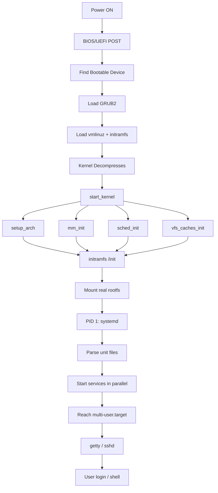
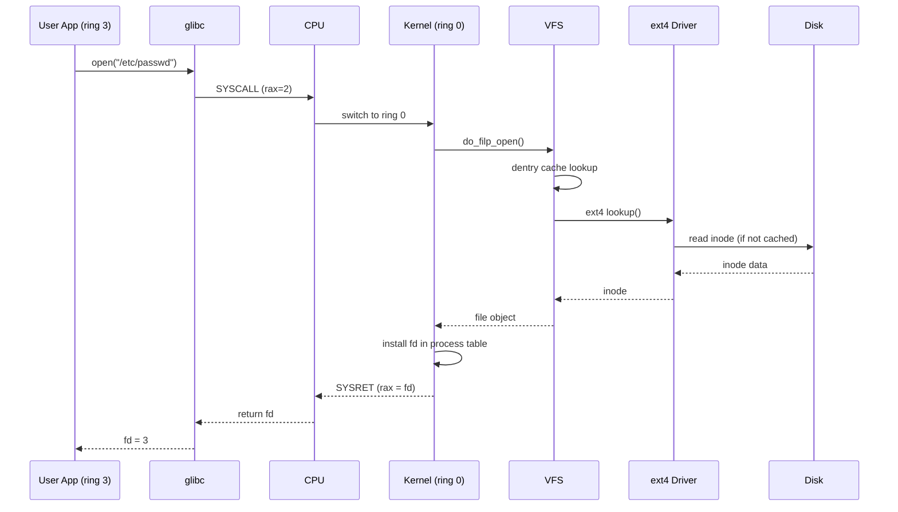
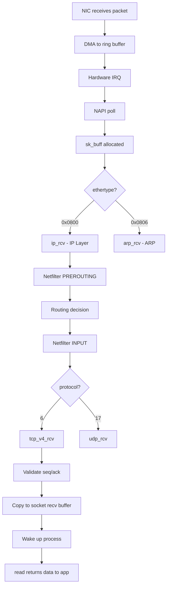

# Module 1: Linux Deep Internals

> **Phase:** 1 — Foundations | **Level:** Beginner → Expert | **Prerequisites:** None

---

## Table of Contents

1. [Tool Introduction](#1-tool-introduction)
2. [Internal Backend Architecture](#2-internal-backend-architecture)
3. [Boot Process Deep Dive](#3-boot-process-deep-dive)
4. [Kernel Internals](#4-kernel-internals)
5. [Process Management](#5-process-management)
6. [Memory Management](#6-memory-management)
7. [Filesystem Internals](#7-filesystem-internals)
8. [Network Communication](#8-network-communication)
9. [Diagrams](#9-diagrams)
10. [Implementation & Commands](#10-implementation--commands)
11. [Production Real-Time Issues](#11-production-real-time-issues)
12. [Observability](#12-observability)
13. [Security](#13-security)
14. [Scaling & Performance](#14-scaling--performance)
15. [System Design](#15-system-design)
16. [Interview Questions](#16-interview-questions)
17. [Hands-On Labs](#17-hands-on-labs)

---

## 1. Tool Introduction

### What is Linux?

Linux is a **free, open-source, Unix-like operating system kernel** created by Linus Torvalds in 1991. It is not an OS by itself — it is the **kernel** (the core). When combined with GNU tools, system libraries, and a package manager, it forms a complete OS distribution (Ubuntu, RHEL, Debian, etc.).

### Why was Linux created?

- Linus Torvalds wanted a free alternative to MINIX (a teaching OS) that he could modify without licensing restrictions.
- At the time, Unix was proprietary and expensive. Linux filled the gap for a production-grade, free, open operating system.

### What problem does Linux solve?

| Problem | Linux Solution |
|---|---|
| Expensive proprietary OS | Free, open-source kernel |
| Single-tasking systems | True multi-tasking, multi-user |
| No source access | Full kernel source available |
| Vendor lock-in | Runs on every architecture |
| No customization | Fully configurable, kernel recompilable |

### Why companies use Linux

- **Cost:** No licensing fees. Saves millions at scale (Google, Amazon, Meta run millions of Linux servers).
- **Stability:** Can run for years without rebooting.
- **Performance:** Tunable at every layer — kernel params, scheduler, I/O.
- **Security:** Open source → audited by thousands. SELinux, namespaces, cgroups.
- **Container foundation:** Docker, Kubernetes, and all container tech are built on Linux primitives (namespaces + cgroups).

### Industry Adoption

- **100% of top 500 supercomputers** run Linux.
- **96.4% of web servers** run Linux.
- **Android** is built on the Linux kernel.
- AWS, GCP, Azure all run Linux as the default OS.

### Alternatives and why they aren't used

| Alternative | Why Linux wins |
|---|---|
| Windows Server | Expensive licensing, less performant for containers |
| FreeBSD | Smaller community, less hardware support |
| macOS Server | Apple dropped it, not production viable |
| Solaris | Oracle licensing, declining adoption |

### When NOT to use Linux

- Desktop gaming (Windows still dominates, though improving with Proton).
- Organizations deeply integrated with Active Directory and Windows-only software.
- Embedded systems where a RTOS (Real-Time OS like FreeRTOS) is needed for hard real-time guarantees.

---

## 2. Internal Backend Architecture

### Linux Architecture — Layers

```
+----------------------------------------------------------+
|                    USER SPACE                            |
|  Applications: bash, nginx, python, docker, kubectl      |
|  System Libraries: glibc, libpthread, libssl             |
|  System Call Interface (POSIX API)                       |
+----------------------------------------------------------+
|               KERNEL BOUNDARY (ring 0 / ring 3)         |
+----------------------------------------------------------+
|                    KERNEL SPACE                          |
|  +---------------+  +-------------+  +---------------+  |
|  | Process Mgmt  |  |  Memory Mgmt|  |  Filesystem   |  |
|  | (scheduler,   |  |  (VMM, page |  |  (VFS, ext4,  |  |
|  |  signals,     |  |   cache,    |  |   xfs, btrfs) |  |
|  |  fork/exec)   |  |   mmap)     |  |               |  |
|  +---------------+  +-------------+  +---------------+  |
|  +---------------+  +-------------+  +---------------+  |
|  | Network Stack |  |  IPC        |  |  Device Drivers|  |
|  | (TCP/IP,      |  |  (pipes,    |  |  (NIC, block,  |  |
|  |  netfilter,   |  |   sockets,  |  |   char, USB)   |  |
|  |  sk_buff)     |  |   shmem)    |  |               |  |
|  +---------------+  +-------------+  +---------------+  |
+----------------------------------------------------------+
|                    HARDWARE                              |
|  CPU  |  RAM  |  Disk  |  NIC  |  GPU  |  USB          |
+----------------------------------------------------------+
```

### CPU Privilege Rings

Modern x86-64 CPUs have 4 privilege rings. Linux uses only 2:

```
Ring 0 — Kernel mode
  - Full hardware access
  - Can execute privileged instructions (HLT, LGDT, IN/OUT)
  - Can access all memory
  - Kernel code runs here

Ring 3 — User mode
  - Restricted hardware access
  - Cannot directly access kernel memory
  - Cannot execute privileged instructions
  - All application code runs here

Transition from Ring 3 → Ring 0:
  - System call (SYSCALL instruction on x86-64)
  - Interrupt (hardware IRQ)
  - Exception (page fault, divide by zero)
```

### Key Kernel Subsystems

#### 1. Process Scheduler (sched/)
- Decides which process runs on which CPU core
- Implementation: Completely Fair Scheduler (CFS)
- Data structure: Red-black tree sorted by `vruntime`

#### 2. Memory Manager (mm/)
- Virtual memory, physical memory, page tables
- Page cache (disk data cached in RAM)
- OOM killer

#### 3. Virtual Filesystem (fs/)
- Abstracts all filesystem types (ext4, xfs, tmpfs, procfs)
- Provides unified API: open(), read(), write(), close()
- Inodes, dentries, file objects

#### 4. Network Stack (net/)
- Full TCP/IP implementation
- Socket interface
- Netfilter (iptables hooks)
- sk_buff (socket buffer) — the core network packet structure

#### 5. Device Drivers (drivers/)
- Interface between kernel and hardware
- Character devices, block devices, network devices
- Loaded as kernel modules (.ko files)

#### 6. IPC — Inter-Process Communication (ipc/)
- Pipes, FIFOs
- POSIX message queues
- Shared memory (shmem)
- Semaphores
- Unix domain sockets

---

## 3. Boot Process Deep Dive

### Complete Linux Boot Sequence

```
Power ON
    ↓
BIOS/UEFI (firmware)
    - POST (Power-On Self Test)
    - Initializes CPU, RAM, PCI bus
    - Looks for bootable device (NVMe, SATA, USB, PXE)
    ↓
Bootloader (GRUB2)
    - Loaded from MBR (BIOS) or EFI System Partition (UEFI)
    - Reads /boot/grub2/grub.cfg
    - Loads kernel image: /boot/vmlinuz-<version>
    - Loads initial ramdisk: /boot/initramfs-<version>.img
    ↓
Kernel Decompression
    - vmlinuz is a compressed (gzip/lz4/zstd) kernel image
    - Decompresses itself into RAM
    - Runs arch-specific setup code (arch/x86/boot/main.c)
    ↓
Kernel Initialization (start_kernel())
    - setup_arch()          — CPU, NUMA, ACPI
    - trap_init()           — interrupt descriptor table (IDT)
    - mm_init()             — memory zones, buddy allocator
    - sched_init()          — scheduler runqueues
    - time_init()           — system timers
    - softirq_init()        — software interrupt subsystem
    - console_init()        — early printk output
    - vfs_caches_init()     — inode/dentry cache
    - signals_init()        — signal handling
    ↓
initramfs / initrd
    - Temporary root filesystem in RAM
    - Contains: busybox, udev, LVM tools, LUKS tools, modules
    - Mounts real root filesystem (handles LVM, RAID, encryption)
    - Runs /init script inside initramfs
    ↓
Real Root Filesystem Mounted
    ↓
PID 1: systemd (or SysVinit / OpenRC / runit)
    - systemd reads unit files from /etc/systemd/system/
    - Parallelizes service startup
    - Reaches target (multi-user.target or graphical.target)
    ↓
Login / Shell
    - getty spawns on TTYs
    - SSH daemon (sshd) listening on port 22
    - User logs in → shell spawned
```

### BIOS vs UEFI

| Feature | BIOS | UEFI |
|---|---|---|
| Partition table | MBR (Master Boot Record) | GPT (GUID Partition Table) |
| Max disk size | 2 TB | 9.4 ZB |
| Max partitions | 4 primary | 128 partitions |
| Boot mode | 16-bit real mode | 32/64-bit protected mode |
| Secure Boot | No | Yes |
| Boot speed | Slower | Faster |

### systemd Unit Files

```ini
# /etc/systemd/system/myapp.service
[Unit]
Description=My Application
After=network.target postgresql.service
Requires=postgresql.service

[Service]
Type=simple
User=appuser
WorkingDirectory=/opt/myapp
ExecStart=/opt/myapp/bin/server
Restart=on-failure
RestartSec=5
LimitNOFILE=65536

[Install]
WantedBy=multi-user.target
```

```bash
# systemd commands
systemctl start myapp       # start service
systemctl stop myapp        # stop service
systemctl enable myapp      # enable at boot
systemctl status myapp      # show status + logs
systemctl daemon-reload     # reload unit files after changes
journalctl -u myapp -f      # follow logs for unit
systemd-analyze blame       # show slow boot services
systemd-analyze critical-chain  # show critical path
```

---

## 4. Kernel Internals

### System Calls — The Kernel Interface

A **system call** is the mechanism by which user-space programs request services from the kernel.

**Why system calls exist:**
- User space cannot directly access hardware (no privilege).
- System calls are a controlled, secure gate into kernel space.
- They form the POSIX API: open, read, write, close, socket, fork, exec, mmap, etc.

**How a system call works (x86-64):**

```
User space:
  open("/etc/passwd", O_RDONLY)
  ↓
  glibc wrapper sets up:
    rax = syscall number (2 for open)
    rdi = first argument (filename pointer)
    rsi = second argument (flags)
  ↓
  SYSCALL instruction
  ↓ (CPU switches to ring 0, saves user context)
  
Kernel space:
  entry_SYSCALL_64() — assembly entry point
  ↓
  do_syscall_64()
  ↓
  sys_call_table[2]  →  __x64_sys_open()
  ↓
  do_sys_open()
  ↓
  getname() — copy filename from user space (safety check)
  ↓
  get_unused_fd_flags() — allocate file descriptor
  ↓
  do_filp_open() — VFS path walk → inode → file object
  ↓
  fd_install() — install file into process's fd table
  ↓
  return fd to user space via rax register
  ↓
  SYSRET instruction — switches back to ring 3
  ↓
  glibc returns fd to application
```

**Most important system calls for DevOps:**

```bash
# Trace all system calls of a process
strace -p <pid>
strace -p <pid> -e trace=network   # only network syscalls
strace -p <pid> -e trace=file      # only file syscalls
strace -c -p <pid>                 # count syscalls, show summary

# Common syscalls and what triggers them
open/openat     → any file open operation
read/write      → file I/O, pipe I/O
socket          → any network connection creation
connect         → TCP/UDP connect
accept          → server accepting connection
fork/clone      → process/thread creation
exec            → running a program
mmap            → memory mapping
ioctl           → device control
epoll_wait      → event loop (nginx, nodejs)
futex           → mutex/lock operations
```

### Interrupts and IRQs

```
Hardware interrupt (IRQ):
  NIC receives packet
    ↓ hardware triggers IRQ line
  CPU pauses current task
    ↓ saves register state
  Runs interrupt handler (ISR — Interrupt Service Routine)
    ↓ minimal work done here (top half)
  Schedules softirq for rest (bottom half)
    ↓ NET_RX_SOFTIRQ processes the packet
  Resumes interrupted task

Types:
  Hardware IRQs: NIC, disk, keyboard, timer
  Software IRQs (softirqs): NET_RX, NET_TX, BLOCK, TASKLET
  Timer interrupt: fires every 1/HZ seconds (HZ=250 on most kernels)

View IRQ stats:
  cat /proc/interrupts
  watch -n1 cat /proc/interrupts   # live IRQ counts per CPU
```

---

## 5. Process Management

### Process States

```
TASK_RUNNING (R)
  - Process is running on a CPU, OR
  - Process is in the run queue waiting for a CPU
  - Load average counts this state

TASK_INTERRUPTIBLE (S)
  - Sleeping, waiting for an event (I/O, timer, signal)
  - Can be woken by a signal
  - Most common sleep state (bash waiting for input)

TASK_UNINTERRUPTIBLE (D)
  - Sleeping in kernel, waiting for I/O
  - CANNOT be interrupted by signal (not even kill -9)
  - High D-state count → disk/NFS I/O problems
  - Load average counts this state

TASK_STOPPED (T)
  - Process stopped by SIGSTOP or SIGTSTP (Ctrl+Z)
  - Resumes with SIGCONT

TASK_ZOMBIE (Z)
  - Process finished, but parent hasn't called wait()
  - Holds PID + exit status in process table
  - No memory except process table entry
  - Fix: fix the parent to call waitpid(), or kill parent
```

### Fork, Exec, Clone

```c
// fork() — creates exact copy of process
pid_t pid = fork();
if (pid == 0) {
    // child process
} else {
    // parent process, pid = child's PID
}

// exec() — replaces current process image with new program
execve("/bin/ls", args, env);
// After execve: new code, new stack, new heap
// PID remains the same

// clone() — low-level, used by threads
// Threads share: address space, file descriptors, signal handlers
// Processes share: nothing (copy-on-write pages)

// Copy-on-Write (COW):
// fork() does NOT copy all memory immediately
// Parent and child share pages marked read-only
// When either writes → page fault → kernel copies the page
// Makes fork() fast even for large processes
```

### Signals

```bash
# Common signals
SIGHUP  (1)  — terminal hangup / reload config
SIGINT  (2)  — Ctrl+C
SIGQUIT (3)  — Ctrl+\ (core dump)
SIGKILL (9)  — force kill (cannot be caught or ignored)
SIGTERM (15) — graceful shutdown (can be caught)
SIGSTOP (19) — pause (cannot be caught)
SIGCONT (18) — resume
SIGCHLD (17) — child process terminated
SIGUSR1 (10) — user-defined (nginx: reopen logs)
SIGUSR2 (12) — user-defined (nginx: upgrade binary)

# Send signals
kill -15 <pid>     # SIGTERM — graceful
kill -9 <pid>      # SIGKILL — force
kill -HUP <pid>    # reload (nginx config reload)
killall nginx       # send SIGTERM to all nginx processes
pkill -f "myapp"   # kill by process name pattern

# View signals received by process
cat /proc/<pid>/status | grep Sig
```

### Completely Fair Scheduler (CFS)

```
Goal: Give every process a "fair" share of CPU time.

Implementation:
  - Each process has a vruntime (virtual runtime in nanoseconds)
  - vruntime increases while process runs on CPU
  - vruntime increases SLOWER for high-priority (nice -20)
  - vruntime increases FASTER for low-priority (nice +19)
  - The process with the LOWEST vruntime runs next
  - Stored in a red-black tree (O(log n) insert/delete/find-min)

Nice values:
  -20  → highest priority (gets most CPU)
   0   → default
  +19  → lowest priority (gets least CPU)

Real-time scheduling (for latency-sensitive work):
  SCHED_FIFO   — first in, first out
  SCHED_RR     — round-robin with timeslice
  SCHED_DEADLINE — earliest deadline first

Commands:
  nice -n 10 myprogram       # run with nice +10
  renice -n -5 -p <pid>      # change running process priority
  chrt -f -p 50 <pid>        # set SCHED_FIFO priority 50
  cat /proc/<pid>/sched      # scheduler stats for process
```

---

## 6. Memory Management

### Virtual Memory

```
Every process has its own virtual address space (64-bit: 128 TB usable)
Physical RAM is shared between all processes via page tables

Virtual Address Space Layout (x86-64):
  0x0000000000000000 — NULL (unmapped)
  0x0000000000001000 — Text segment (code, read-only)
  0x0000000000xxxxx — Data segment (initialized globals)
  0x0000000000xxxxx — BSS (uninitialized globals, zeroed)
  0x0000000000xxxxx ↑ Heap (grows upward via brk/mmap)
                    
           ... (huge gap) ...
  
  0x00007fffffffffff ↓ Stack (grows downward)
  
  0xffff800000000000 — Kernel space (user cannot access)
  
Page Tables:
  MMU translates virtual → physical addresses
  4-level page table on x86-64 (PGD → PUD → PMD → PTE)
  Each page = 4KB (or huge pages: 2MB / 1GB)
  TLB (Translation Lookaside Buffer): cache for page table entries
```

### Page Fault Handling

```
Types of page faults:

Minor fault:
  Page is in memory but not mapped in process page table
  Example: first access to a COW page after fork()
  Cost: ~100ns

Major fault:
  Page is NOT in memory (on disk or never loaded)
  Kernel must read from disk → swap or file
  Cost: ~1ms (SSD) to ~10ms (HDD)

Invalid fault:
  Access to unmapped/protected memory
  Results in SIGSEGV (segmentation fault)

Page fault flow:
  Process accesses virtual address
    ↓ MMU looks up page table → not present
    ↓ CPU raises #PF exception
    ↓ do_page_fault() in kernel
    ↓ Find VMA (virtual memory area) for address
    ↓ If no VMA → SIGSEGV
    ↓ If VMA found:
      - Anonymous: allocate new page, zero it
      - File-backed: read from file into page cache
      - COW: copy the page, map new copy
    ↓ Install PTE (page table entry)
    ↓ Return to user space, instruction retried
```

### Page Cache

```
Linux uses ALL free RAM as page cache (disk cache).
When you read a file, it is cached in RAM.
When you write, it goes to page cache first (writeback).

free -h output:
  total    used    free    shared  buff/cache  available
  15G      4G      2G      500M    9G          10G
         
  "free" is nearly always small — that's GOOD.
  "available" = free + reclaimable cache

Memory zones:
  ZONE_DMA    (0-16MB): for old ISA DMA devices
  ZONE_NORMAL (16MB-896MB on 32-bit, all on 64-bit)
  ZONE_HIGHMEM (>896MB on 32-bit only, not on 64-bit)

Buddy allocator:
  Manages physical pages
  Allocates in powers of 2 (1, 2, 4, 8... pages)
  cat /proc/buddyinfo — see free pages per order

Slab allocator (SLUB):
  For small kernel objects (inodes, dentries, sk_buff)
  Avoids buddy allocator overhead for frequent small allocs
  cat /proc/slabinfo
```

### OOM Killer

```
When system runs out of memory:
  1. Kernel tries to reclaim: page cache, inactive pages
  2. Tries swap (if configured)
  3. If still no memory: OOM killer activates

OOM killer process selection:
  Scores each process (0-1000)
  Higher score = more likely to be killed
  Score based on: memory usage, nice value, OOM score adj

# Control OOM killer behavior
echo -17 > /proc/<pid>/oom_score_adj  # never kill (root only)
echo 1000 > /proc/<pid>/oom_score_adj # kill first
cat /proc/<pid>/oom_score             # current score

# OOM kill events
dmesg | grep -i "oom\|killed process"
journalctl -k | grep -i oom
```

---

## 7. Filesystem Internals

### VFS — Virtual Filesystem Switch

```
VFS is the abstraction layer that allows Linux to support multiple
filesystem types through a single unified API.

VFS Objects:
  superblock  — represents a mounted filesystem
  inode       — represents a file/directory (metadata)
  dentry      — directory entry (path component cache)
  file        — represents an open file (per-process)

VFS Operations flow for open("/var/log/nginx/access.log"):
  1. open() syscall → vfs_open()
  2. Path walk: "/" → "var" → "log" → "nginx" → "access.log"
  3. Each component: lookup dentry cache → if miss, call filesystem's lookup()
  4. Final dentry → inode → call filesystem's open()
  5. Create file object → install in process fd table
  6. Return file descriptor
```

### ext4 Filesystem

```
ext4 on-disk layout:

  [ Boot sector | Superblock | Block Group 0 | Block Group 1 | ... ]

  Superblock (at byte 1024):
    - Total inodes, total blocks
    - Block size (1K/2K/4K)
    - Filesystem state
    - Last mount/check time

  Block Group:
    - Block bitmap: which blocks are free
    - Inode bitmap: which inodes are free
    - Inode table: array of inode structures
    - Data blocks

  Inode structure:
    - File type and permissions (i_mode)
    - Owner UID/GID
    - Size in bytes
    - Access/modify/change timestamps
    - Link count (hard links)
    - Pointers to data blocks (extent tree in ext4)
    - NO filename — filenames are in directory entries

  Directory entry (dentry):
    - inode number
    - record length
    - file type
    - filename

Key ext4 features:
  - Extents (contiguous block ranges, vs block lists)
  - Journaling (journal before writing — crash recovery)
  - Delayed allocation (batch block allocation → less fragmentation)
  - dir_index (HTree — fast directory lookup)
```

```bash
# Filesystem inspection
stat /etc/passwd           # inode, size, timestamps
ls -i /etc                 # show inode numbers
df -h                      # disk usage by filesystem
df -i                      # inode usage (important!)
lsblk -f                   # filesystems on block devices
blkid                      # UUIDs of block devices
dumpe2fs /dev/sda1         # ext4 superblock info
tune2fs -l /dev/sda1       # read superblock
fsck /dev/sda1             # filesystem check (unmounted)
debugfs /dev/sda1          # interactive fs debugger
```

### /proc and /sys — Virtual Filesystems

```
/proc — process and kernel information (procfs)
  /proc/<pid>/           — per-process info
  /proc/<pid>/status     — process status, memory
  /proc/<pid>/fd/        — open file descriptors
  /proc/<pid>/maps       — virtual memory map
  /proc/<pid>/cmdline    — command line arguments
  /proc/<pid>/environ    — environment variables
  /proc/<pid>/net/       — network stats
  /proc/cpuinfo          — CPU information
  /proc/meminfo          — memory statistics
  /proc/net/tcp          — TCP socket table
  /proc/sys/             — tunable kernel parameters

/sys — sysfs (hardware, kernel objects)
  /sys/class/net/        — network interfaces
  /sys/block/            — block devices
  /sys/kernel/           — kernel parameters
  /sys/module/           — loaded kernel modules
```

---

## 8. Network Communication

### Linux Network Stack Internals

```
Packet Receive Path:

NIC receives packet
    ↓ DMA: packet copied to ring buffer in RAM
    ↓ Hardware IRQ to CPU
    ↓ Interrupt handler: acks IRQ, schedules NAPI poll
    ↓ NAPI poll: reads packets from ring buffer
    ↓ netif_receive_skb(skb)
        ↓ Allocates sk_buff (socket buffer)
        ↓ Protocol demux: check ethertype
            ↓ IPv4 (0x0800) → ip_rcv()
            ↓ IPv6 (0x86DD) → ipv6_rcv()
            ↓ ARP  (0x0806) → arp_rcv()
        ↓ Netfilter hook: NF_INET_PRE_ROUTING (iptables PREROUTING)
        ↓ ip_rcv_finish(): routing decision
        ↓ If for local host: NF_INET_LOCAL_IN (INPUT chain)
        ↓ ip_local_deliver() → protocol demux
            ↓ TCP (proto 6) → tcp_v4_rcv()
            ↓ UDP (proto 17) → udp_rcv()
        ↓ tcp_rcv_state_process()
        ↓ Sequence number validation, ACK sending
        ↓ Data copied to socket receive buffer
        ↓ Socket wakeup: wakes up process blocked in read()
    ↓ Application's read() copies data from socket buffer to user space

Packet Send Path:

Application calls write()/send()
    ↓ Data copied from user space to socket send buffer
    ↓ tcp_sendmsg()
    ↓ TCP segments data, adds TCP header
    ↓ ip_queue_xmit() — adds IP header, routing lookup
    ↓ Netfilter: NF_INET_LOCAL_OUT, NF_INET_POST_ROUTING
    ↓ dev_queue_xmit() — queues to NIC TX queue
    ↓ NIC driver: transmits, DMA to NIC
    ↓ NIC sends packet
    ↓ TX complete interrupt → free skb
```

### sk_buff — The Core Network Structure

```c
// sk_buff (socket buffer) — represents a network packet in kernel
struct sk_buff {
    struct sk_buff *next, *prev;  // linked list
    
    // Packet data pointers
    unsigned char *head;   // start of allocated buffer
    unsigned char *data;   // start of actual data
    unsigned char *tail;   // end of actual data
    unsigned char *end;    // end of allocated buffer
    
    // Protocol headers (pointers into data buffer)
    struct iphdr   *nh.iph;   // IP header
    struct tcphdr  *h.th;     // TCP header
    
    // Metadata
    struct net_device *dev;   // network interface
    u32 priority;             // QoS priority
    ktime_t tstamp;           // timestamp
};
// As packet moves up/down the stack:
// Headers are added (send) or stripped (receive) by adjusting pointers
// No data copying between layers — zero-copy architecture
```

---

## 9. Diagrams

### ASCII: Complete Linux Architecture

```
┌─────────────────────────────────────────────────────────────────┐
│                        USER SPACE                               │
│  ┌──────────┐  ┌──────────┐  ┌──────────┐  ┌──────────────┐   │
│  │  Shell   │  │  nginx   │  │  python  │  │    docker    │   │
│  └──────────┘  └──────────┘  └──────────┘  └──────────────┘   │
│  ┌─────────────────────────────────────────────────────────┐   │
│  │              glibc / system libraries                   │   │
│  └─────────────────────────────────────────────────────────┘   │
└────────────────────────┬────────────────────────────────────────┘
                         │ SYSCALL (ring 3 → ring 0)
┌────────────────────────▼────────────────────────────────────────┐
│                      KERNEL SPACE                               │
│ ┌──────────┐ ┌──────────┐ ┌──────────┐ ┌──────────┐           │
│ │Scheduler │ │  Memory  │ │   VFS    │ │ Network  │           │
│ │  (CFS)   │ │  Manager │ │  Layer   │ │  Stack   │           │
│ └──────────┘ └──────────┘ └──────────┘ └──────────┘           │
│ ┌──────────┐ ┌──────────┐ ┌──────────┐ ┌──────────┐           │
│ │  Signals │ │  IPC     │ │ Netfilter│ │  Cgroups │           │
│ └──────────┘ └──────────┘ └──────────┘ └──────────┘           │
│ ┌─────────────────────────────────────────────────────────┐    │
│ │               Device Drivers                            │    │
│ └─────────────────────────────────────────────────────────┘    │
└────────────────────────┬────────────────────────────────────────┘
                         │
┌────────────────────────▼────────────────────────────────────────┐
│                       HARDWARE                                  │
│    CPU    │    RAM    │    SSD    │    NIC    │    GPU           │
└─────────────────────────────────────────────────────────────────┘
```

### Mermaid: Boot Process



### Mermaid: System Call Flow



### Mermaid: TCP/IP Network Stack



### Mermaid: Process Memory Layout

```mermaid
graph TD
    A["0xFFFF... Kernel Space<br/>(inaccessible from user space)"]
    B["Stack (grows ↓)<br/>local vars, return addresses, args"]
    C["... gap (random ASLR) ..."]
    D["mmap region<br/>shared libs (.so), anonymous maps"]
    E["Heap (grows ↑)<br/>malloc / calloc / new"]
    F["BSS — uninitialized globals<br/>zeroed at startup"]
    G["Data — initialized globals<br/>int x = 5;"]
    H["Text — program code<br/>read-only, executable"]
    I["0x0000 — NULL"]

    style A fill:#f96,stroke:#333
    style B fill:#9cf,stroke:#333
    style D fill:#fc9,stroke:#333
    style E fill:#9fc,stroke:#333
    style H fill:#c9f,stroke:#333
```



---

## 10. Implementation & Commands

### Essential Linux Commands for DevOps

#### Process Management

```bash
# View processes
ps aux                         # all processes, BSD format
ps -ef                         # all processes, UNIX format
ps auxf                        # process tree
ps -o pid,ppid,cmd,%cpu,%mem --sort=-%cpu  # custom format, sorted

# Real-time monitoring
top                            # classic
htop                           # better top (install: apt/yum install htop)
atop                           # disk + net + process

# Process details
cat /proc/<pid>/status         # process status
cat /proc/<pid>/maps           # virtual memory map
cat /proc/<pid>/fd | wc -l    # count open file descriptors
ls -la /proc/<pid>/fd          # list open files

# Kill processes
kill -15 <pid>                 # SIGTERM (graceful)
kill -9 <pid>                  # SIGKILL (force)
killall -9 nginx               # kill all matching name
pkill -f "python app.py"       # kill by command pattern

# Process priority
nice -n 10 ./program           # start with lower priority
renice -n -5 -p <pid>          # change running process priority
ionice -c 3 -p <pid>           # set I/O priority (idle class)
```

#### Memory Analysis

```bash
# Memory overview
free -h                        # human-readable memory stats
cat /proc/meminfo              # detailed memory info
vmstat 1 5                     # memory, swap, I/O, CPU (5 samples)
sar -r 1 5                     # memory utilization report

# Per-process memory
ps aux --sort=-%rss | head -10  # top memory consumers (RSS)
cat /proc/<pid>/status | grep -i vm  # virtual/resident/swap
pmap -x <pid>                  # detailed memory map
smem -r -k                     # shared memory aware (install smem)

# Page cache
vmstat -s | grep -i page       # page statistics
sysctl vm.drop_caches           # view cache drop setting
echo 1 > /proc/sys/vm/drop_caches  # drop page cache (testing only!)

# Swap
swapon --show                  # show swap usage
cat /proc/swaps                # swap devices
vmstat 1 | awk '{print $7,$8}' # si/so = swap in/out
```

#### Filesystem & Disk

```bash
# Disk usage
df -h                          # filesystem disk usage
df -i                          # inode usage (CRITICAL to check)
du -sh /var/log/*              # size of directories
du -sh /* 2>/dev/null | sort -rh | head -20  # find largest dirs
ncdu /                         # interactive disk usage (install ncdu)

# Find large/old files
find / -size +100M -type f 2>/dev/null | sort
find /var/log -name "*.log" -mtime +30 -delete  # delete old logs
lsof | grep deleted            # find deleted files still open (holding space!)

# Disk I/O
iostat -x 1 5                  # I/O stats per device
iotop                          # per-process I/O (like top for disk)
dstat -d                       # disk throughput
hdparm -t /dev/sda             # raw disk read speed test

# Filesystem ops
lsblk -f                       # block devices + filesystems
blkid                          # UUIDs
mount | column -t              # mounted filesystems
findmnt                        # mounted filesystems (tree view)
```

#### System Performance — 60-Second Checklist

```bash
# 1. Load average and uptime
uptime

# 2. Kernel errors
dmesg | tail -20
journalctl -k --no-pager | tail -30

# 3. Running processes
ps auxf | head -30

# 4. CPU stats per core
mpstat -P ALL 1 5

# 5. Per-process CPU
pidstat 1 5

# 6. Memory
free -m
vmstat 1 5

# 7. Disk I/O
iostat -xz 1 5

# 8. Network
sar -n DEV 1 5
ss -s              # socket summary

# 9. Top CPU consumers
ps aux --sort=-%cpu | head -10

# 10. Top memory consumers  
ps aux --sort=-%rss | head -10
```

#### Kernel Parameters (sysctl)

```bash
# View all parameters
sysctl -a

# Common tuning parameters
# Network
sysctl net.core.somaxconn              # max socket listen backlog (default 128!)
sysctl net.ipv4.tcp_max_syn_backlog   # SYN queue size
sysctl net.ipv4.ip_local_port_range   # ephemeral port range
sysctl net.ipv4.tcp_tw_reuse          # reuse TIME_WAIT sockets
sysctl net.core.rmem_max              # max receive buffer
sysctl net.core.wmem_max              # max send buffer
sysctl net.ipv4.tcp_syncookies        # SYN flood protection

# Memory
sysctl vm.swappiness                  # 0=no swap, 60=default, 100=aggressive swap
sysctl vm.dirty_ratio                 # max % of memory for dirty pages
sysctl vm.overcommit_memory           # 0=heuristic, 1=always, 2=never

# File descriptors
sysctl fs.file-max                    # max open files system-wide

# Apply temporarily
sysctl -w net.core.somaxconn=65535

# Apply permanently
echo "net.core.somaxconn=65535" >> /etc/sysctl.conf
sysctl -p

# Production-grade sysctl for a busy web server
cat >> /etc/sysctl.conf << 'EOF'
net.core.somaxconn = 65535
net.core.netdev_max_backlog = 65535
net.ipv4.tcp_max_syn_backlog = 65535
net.ipv4.ip_local_port_range = 1024 65535
net.ipv4.tcp_tw_reuse = 1
net.ipv4.tcp_fin_timeout = 15
net.core.rmem_max = 16777216
net.core.wmem_max = 16777216
net.ipv4.tcp_rmem = 4096 87380 16777216
net.ipv4.tcp_wmem = 4096 65536 16777216
vm.swappiness = 10
fs.file-max = 2097152
EOF
sysctl -p
```

---

## 11. Production Real-Time Issues

### Issue 1: High Load Average

```
Symptoms:
  - uptime shows load average 20+ on a 4-core machine
  - Slow response times
  - SSH login slow or impossible

Diagnosis:
  uptime                          # load trend (1m, 5m, 15m)
  top → look at CPU idle% and wa%
  If high CPU% → process consuming CPU
  If high wa% → waiting on I/O (disk)
  
  vmstat 1 5
  If r (runnable) column high → CPU bound
  If b (blocked) column high → I/O bound
  
  ps aux --sort=-%cpu | head -10   # top CPU users
  ps aux | awk '$8=="D"'           # D-state processes (I/O wait)
  iostat -x 1 5                    # disk utilization

Root causes:
  - Runaway process (bug, infinite loop)
  - NFS hang (causes many D-state processes)
  - Failing disk (high await time in iostat)
  - Memory exhaustion causing swap thrashing

Fix:
  - Kill runaway: kill -9 <pid>
  - NFS: umount -f -l /nfs-mount or reboot
  - Disk: check dmesg for I/O errors, replace disk
  - Memory: add RAM or increase swap

Prevention:
  - CPU limits via cgroups
  - Memory limits
  - NFS mount with timeout option
```

### Issue 2: Memory Leak / OOMKilled

```
Symptoms:
  - Process RSS grows over hours/days
  - System becomes slow (swapping)
  - Process suddenly restarts (OOMKilled in dmesg/journalctl)

Diagnosis:
  dmesg | grep -i "oom\|killed process"   # OOM killer logs
  journalctl -k | grep oom
  
  # Track memory over time
  watch -n5 'ps aux --sort=-%rss | head -10'
  
  # Detailed process memory
  cat /proc/<pid>/status | grep VmRSS
  pmap -x <pid> | tail -5              # total RSS
  
  # System memory pressure
  vmstat 1 | awk '{print $7,$8,$9,$10}' # si so bi bo
  sar -r 1 10

Root causes:
  - Application bug: malloc without free
  - Memory not released after processing (missing cleanup)
  - Cache growing unbounded
  - Memory fragmentation

Fix:
  - Restart service (temporary)
  - Profile with valgrind / heaptrack (long-term)
  - Set memory limits (cgroup, Java -Xmx, ulimit)
  - Add swap as buffer

Prevention:
  - Set OOM score: echo -500 > /proc/<pid>/oom_score_adj
  - Container memory limits (Docker --memory)
  - Kubernetes resource limits + requests
  - Monitoring: alert on RSS growth trend
```

### Issue 3: Disk Full

```
Symptoms:
  - Write operations failing
  - "No space left on device" errors
  - Application crashes

Diagnosis:
  df -h                    # filesystem usage
  df -i                    # inode usage (CRITICAL)
  du -sh /* 2>/dev/null | sort -rh | head -20   # largest dirs
  
  # Find large files
  find / -size +500M -type f 2>/dev/null
  
  # Find deleted files still holding space
  lsof | grep deleted | awk '{print $7, $9}' | sort -rn | head

Root causes:
  - Logs unbounded (most common)
  - Core dumps accumulating
  - Docker images/containers filling /var
  - Inode exhaustion (many small files)
  - Deleted files held by running process

Fix:
  # Quick wins:
  journalctl --vacuum-size=500M     # trim journal
  docker system prune -af           # clean docker
  find /var/log -name "*.log" -mtime +7 -delete
  
  # If inode exhaustion:
  df -i                             # confirm
  find / -xdev -printf '%h\n' | sort | uniq -c | sort -rn | head

Prevention:
  - logrotate configuration
  - /etc/docker/daemon.json log limits
  - Monitoring: alert at 80% disk usage
```

### Issue 4: Process Won't Die (D-state)

```
Symptoms:
  - kill -9 has no effect
  - Process shows 'D' in ps
  - Usually many processes in D-state

Diagnosis:
  ps aux | awk '$8=="D"'
  cat /proc/<pid>/wchan           # what kernel function waiting on
  
  # Usually NFS, CIFS, or failing disk
  dmesg | tail -50               # kernel errors
  iostat -x 1 5                  # disk I/O health
  cat /proc/<pid>/stack          # kernel stack trace

Root causes:
  - NFS server unreachable
  - Hanging disk I/O
  - CIFS/SMB mount unresponsive

Fix:
  # For NFS:
  umount -f -l /mnt/nfs          # force lazy unmount
  # Then fix NFS server
  
  # For disk:
  dmesg | grep -i 'error\|reset\|failed'
  # May require reboot if disk hardware failing

Prevention:
  - NFS mount: soft,timeo=10,retrans=2 options
  - Use overlay/local storage instead of NFS for containers
```

---

## 12. Observability

### Logs

```bash
# System logs
journalctl -f                        # follow all logs
journalctl -u nginx -f               # service logs
journalctl --since "1 hour ago"      # time-based
journalctl -p err -n 100             # only errors, last 100
journalctl -k                        # kernel logs
dmesg -T                             # kernel ring buffer with timestamps
tail -f /var/log/syslog              # classic syslog
tail -f /var/log/auth.log            # auth events

# Application logs
tail -f /var/log/nginx/access.log
tail -f /var/log/nginx/error.log
multitail -f /var/log/nginx/*.log   # multiple log tailing
```

### Metrics

```bash
# CPU
mpstat -P ALL 1              # per-CPU utilization
sar -u 1 60                  # CPU utilization history
perf stat -p <pid>           # CPU performance counters

# Memory
free -h
vmstat 1
sar -r 1 60

# Disk
iostat -x 1                  # I/O utilization, await, queue
iotop -ao                    # accumulated I/O per process
sar -d 1 60                  # disk activity history

# Network
sar -n DEV 1                 # network throughput per interface
sar -n TCP 1                 # TCP connection stats
ss -s                        # socket summary
netstat -s                   # protocol statistics
```

### Key Metrics to Monitor

| Metric | Warning | Critical | Command |
|---|---|---|---|
| CPU utilization | >70% | >90% | `mpstat` |
| Load average | >2x CPU count | >4x CPU count | `uptime` |
| Memory used | >80% | >95% | `free` |
| Swap used | >10% | >50% | `swapon --show` |
| Disk used | >80% | >90% | `df -h` |
| Inode used | >80% | >90% | `df -i` |
| Disk await | >10ms | >100ms | `iostat -x` |
| Open files | >80% of limit | >95% | `lsof \| wc -l` |

### eBPF / BPF Tools (Modern Observability)

```bash
# bpftrace — eBPF tracing
# Requires: apt install bpftrace

# Count syscalls per second
bpftrace -e 'tracepoint:syscalls:sys_enter_* { @[probe] = count(); }'

# Trace process exec
bpftrace -e 'tracepoint:syscalls:sys_enter_execve { printf("%s execve %s\n", comm, str(args->filename)); }'

# TCP latency
bpftrace -e 'kprobe:tcp_rcv_established { @[comm] = hist(nsecs - @start[tid]); }'

# BCC tools (apt install bpfcc-tools)
execsnoop          # trace process exec
opensnoop          # trace file opens
biolatency         # disk I/O latency histogram
tcpconnect         # trace TCP connections
tcpaccept          # trace TCP accepts
runqlat            # CPU run queue latency
```

---

## 13. Security

### File Permissions

```bash
# Permission format: [type][user][group][other]
# Example: -rwxr-xr-- 
#   -    = regular file (d=dir, l=symlink, b=block, c=char, p=pipe)
#   rwx  = owner: read+write+execute
#   r-x  = group: read+execute
#   r--  = others: read only

# Numeric: r=4, w=2, x=1
chmod 755 /opt/myapp/bin/server    # rwxr-xr-x
chmod 640 /etc/myapp/config        # rw-r-----
chmod 600 ~/.ssh/id_rsa            # rw------- (SSH key must be 600)

# Special permissions
chmod u+s /usr/bin/passwd   # SUID: run as file owner (root)
chmod g+s /shared/dir       # SGID: new files inherit group
chmod +t /tmp               # Sticky bit: only owner can delete

# Ownership
chown user:group file
chown -R appuser:appuser /opt/myapp

# Find dangerous permissions
find / -perm -4000 -type f 2>/dev/null   # SUID files
find / -perm -2000 -type f 2>/dev/null   # SGID files
find / -writable -type f 2>/dev/null     # world-writable files
```

### SELinux

```bash
# SELinux — mandatory access control (MAC)
getenforce                    # Enforcing / Permissive / Disabled
sestatus                      # detailed status
setenforce 0                  # set permissive (temporary)
setenforce 1                  # set enforcing (temporary)

# Permanent: /etc/selinux/config
SELINUX=enforcing

# SELinux denials
ausearch -m avc -ts recent    # recent AVC denials
sealert -a /var/log/audit/audit.log  # human-readable
audit2allow -a -M mypol       # generate policy from denials

# File contexts
ls -Z /etc/nginx/nginx.conf   # view SELinux context
restorecon -Rv /var/www/html  # restore correct context
chcon -t httpd_sys_content_t /srv/www  # change context
```

### Capabilities (instead of root)

```bash
# Linux capabilities — split root power into granular abilities
# Instead of running as root, grant only needed capabilities

# View capabilities
getcap /usr/bin/ping          # check file capabilities
cat /proc/<pid>/status | grep Cap  # process capabilities
capsh --decode=<hex>          # decode capability bitmask

# Set capabilities (instead of SUID root)
setcap cap_net_bind_service=+ep /opt/myapp/server  # allow bind <1024
setcap cap_sys_ptrace=+ep /usr/bin/strace

# Important capabilities
CAP_NET_BIND_SERVICE  # bind to ports < 1024
CAP_NET_ADMIN         # network administration
CAP_SYS_PTRACE        # ptrace other processes
CAP_SYS_ADMIN         # broad admin (avoid if possible)
CAP_KILL              # send signals to any process
CAP_CHOWN             # change file ownership
```

### /etc/limits and ulimits

```bash
# View current limits
ulimit -a                     # all limits
ulimit -n                     # open file descriptors
ulimit -u                     # max user processes
ulimit -v                     # virtual memory limit

# Set limits
ulimit -n 65535               # temporary (current shell)

# Permanent: /etc/security/limits.conf
*    soft    nofile    65535
*    hard    nofile    65535
nginx soft   nofile    65535
nginx hard   nofile    65535

# Systemd service limits
[Service]
LimitNOFILE=65535
LimitNPROC=4096
```

---

## 14. Scaling & Performance

### CPU Performance Tuning

```bash
# CPU governor (performance vs power saving)
cat /sys/devices/system/cpu/cpu0/cpufreq/scaling_governor
echo performance > /sys/devices/system/cpu/cpu0/cpufreq/scaling_governor
# For all CPUs:
for f in /sys/devices/system/cpu/cpu*/cpufreq/scaling_governor; do echo performance > $f; done

# NUMA — Non-Uniform Memory Access
numactl --hardware              # NUMA topology
numastat                        # NUMA statistics
numactl --cpunodebind=0 --membind=0 ./program  # pin to NUMA node 0

# IRQ affinity (spread NIC interrupts across CPUs)
cat /proc/interrupts | grep eth0
echo 2 > /proc/irq/<N>/smp_affinity  # pin IRQ to CPU 1 (bitmask)

# Huge pages (for databases, JVMs)
cat /proc/sys/vm/nr_hugepages
echo 1024 > /proc/sys/vm/nr_hugepages    # allocate 1024 huge pages (2MB each)
grep Huge /proc/meminfo
```

### I/O Tuning

```bash
# I/O schedulers
cat /sys/block/sda/queue/scheduler    # current scheduler
echo mq-deadline > /sys/block/sda/queue/scheduler  # set scheduler
# mq-deadline: good for SSDs
# bfq: good for desktops (bandwidth fairness)
# none: best for NVMe (no queuing needed)

# Read-ahead
blockdev --getra /dev/sda             # current read-ahead
blockdev --setra 256 /dev/sda         # 256 * 512 = 128KB read-ahead

# Dirty page writeback
sysctl vm.dirty_background_ratio=5    # start writeback at 5%
sysctl vm.dirty_ratio=10             # block at 10%
sysctl vm.dirty_writeback_centisecs=500  # writeback interval (5s)
```

### Network Tuning for High Traffic

```bash
# Increase socket buffers
sysctl -w net.core.rmem_max=268435456     # 256MB
sysctl -w net.core.wmem_max=268435456
sysctl -w net.ipv4.tcp_rmem="4096 87380 268435456"
sysctl -w net.ipv4.tcp_wmem="4096 65536 268435456"

# Increase listen backlog
sysctl -w net.core.somaxconn=65535
sysctl -w net.ipv4.tcp_max_syn_backlog=65535

# TCP optimization
sysctl -w net.ipv4.tcp_tw_reuse=1         # reuse TIME_WAIT
sysctl -w net.ipv4.tcp_fin_timeout=15     # reduce FIN_WAIT2
sysctl -w net.ipv4.tcp_keepalive_time=300  # keepalive
sysctl -w net.ipv4.tcp_keepalive_intvl=30
sysctl -w net.ipv4.tcp_keepalive_probes=5

# Enable BBR (Google's congestion control)
sysctl -w net.core.default_qdisc=fq
sysctl -w net.ipv4.tcp_congestion_control=bbr
```

---

## 15. System Design

### Small-Scale (Startup / Dev)

```
Single Linux VM:
  - Ubuntu 22.04 LTS
  - 4 CPU, 8GB RAM, 100GB SSD
  - nginx → application → PostgreSQL
  - logrotate for log management
  - Basic iptables rules
  - fail2ban for SSH protection
```

### Mid-Scale (Growing Company)

```
Multiple Linux servers:
  - Load balancer: 2x HAProxy (active-passive)
  - App servers: 4-10x Linux VMs (auto-scaling group)
  - Database: PostgreSQL primary + 2x replicas
  - Cache: Redis cluster
  - Monitoring: Prometheus + Grafana
  - Log aggregation: ELK or Loki
  - Configuration management: Ansible
```

### Enterprise Scale (Netflix/Google style)

```
Thousands of Linux servers:
  - Kubernetes on Linux (container orchestration)
  - Custom kernel patches for performance
  - eBPF for zero-overhead observability
  - NUMA-aware workload placement
  - Custom TCP tuning per workload type
  - SR-IOV for network virtualization
  - Huge pages for databases
  - cgroups v2 for resource isolation
  - Seccomp profiles for container security
```

---

## 16. Interview Questions

### Beginner Questions

**Q1: What is the difference between a process and a thread?**

```
Answer:
  Process:
    - Independent execution unit with its own memory space
    - Has: PID, virtual address space, file descriptors, signal handlers
    - Created via fork() — copy-on-write of parent
    - Communication: IPC (pipes, sockets, shared memory)
    - Context switch cost: HIGH (switch page tables, flush TLB)

  Thread:
    - Lightweight execution unit WITHIN a process
    - Shares: address space, file descriptors, signal handlers with process
    - Has its own: stack, registers, thread-local storage
    - Created via clone() with CLONE_VM flag (pthreads use this)
    - Communication: shared memory (easy but needs locking)
    - Context switch cost: LOW (same page tables)

  Linux kernel: no true distinction. Both are "tasks" (task_struct).
  Thread = clone() with resource sharing flags.
  Process = clone() without sharing.

What interviewer wants:
  - You understand copy-on-write in fork()
  - You know threads share address space but have own stack
  - You know context switch cost difference
  - Bonus: mention pthreads use clone() internally
```

**Q2: What is a zombie process and how do you fix it?**

```
Answer:
  A zombie process:
    - Has completed execution (called exit())
    - BUT parent hasn't called wait()/waitpid() to collect exit status
    - Holds: PID, exit status, entry in process table
    - Holds NO: memory, file descriptors, CPU
    - Shows as 'Z' in ps, <defunct> in process name

  Why bad at scale:
    - PIDs are finite (default max 32768, up to 4M)
    - Too many zombies → can't fork new processes

  Fix:
    1. Fix the application — parent must call waitpid() after fork()
    2. Send SIGCHLD to parent: kill -CHLD <parent_pid>
    3. Kill the parent — orphaned zombie adopted by init (PID 1), which reaps it
    4. If parent is init/systemd: can't kill, reboot required

  Find zombies:
    ps aux | awk '$8=="Z"'
    ps aux | grep defunct
```

**Q3: What happens when you type `ls` in a shell?**

```
Answer (simplified system call trace):
  1. Shell reads "ls" from stdin (read syscall)
  2. Shell forks() — creates child process
  3. Child calls execve("/bin/ls", ["ls"], env)
     - Kernel loads ELF binary from disk
     - Sets up new stack with args/env
     - Maps text/data segments
     - Jumps to entry point (_start in libc)
  4. ls opens "." via openat() syscall
  5. ls calls getdents64() to read directory entries
  6. ls calls stat() for each file (for -l format)
  7. ls calls write() to stdout
  8. ls calls exit() 
  9. Shell calls waitpid() → collects exit status
  10. Shell prints next prompt

Bonus: If "ls" is an alias, shell handles that before fork.
Bonus: PATH is searched: /usr/local/bin:/usr/bin:/bin
```

### Intermediate Questions

**Q4: Explain page cache and how it affects performance**

```
Answer:
  Page cache = Linux uses free RAM to cache disk data.
  
  How:
    - First read: kernel reads from disk → stores page in cache → returns to app
    - Second read: page already in cache → returns from RAM (microseconds)
    - Write: written to page cache (writeback), marked dirty
    - Kernel flushes dirty pages to disk periodically (pdflush/kworker)
  
  Why "available" matters more than "free":
    free -h shows buff/cache as "used" — but cache is reclaimable
    "available" = free + reclaimable cache
  
  Performance impact:
    Cache hit: ~100ns (RAM speed)
    Cache miss SSD: ~50-100µs
    Cache miss HDD: ~5-10ms
    
  Production implications:
    - After server restart: cache is cold → initial slowness normal
    - Don't allocate swap on SSD if page cache is working well
    - Database servers: ensure enough RAM for working set in cache
    - `echo 1 > /proc/sys/vm/drop_caches` = drop cache (never in production)
```

**Q5: How does iptables work internally?**

```
Answer:
  iptables is a userspace tool to configure Netfilter — the kernel's
  packet filtering framework.

  Netfilter hooks in the kernel:
    PREROUTING  → packet arrives (before routing decision)
    INPUT       → packet destined for local machine
    FORWARD     → packet being routed through machine
    OUTPUT      → packet from local process going out
    POSTROUTING → packet leaving (after routing)

  Tables (ordered processing):
    raw     → connection tracking bypass
    mangle  → packet modification
    nat     → NAT/masquerading
    filter  → ACCEPT/DROP/REJECT (what most people use)

  Rule evaluation:
    Packet hits hook → iptables chains evaluated top-to-bottom
    First matching rule wins (unless policy override)
    Default policy if no rule matches: ACCEPT or DROP

  Example:
    iptables -A INPUT -p tcp --dport 80 -j ACCEPT
    iptables -A INPUT -j DROP  # drop everything else

  Modern alternative: nftables (replaces iptables)
  
  Kubernetes uses iptables for Service networking (kube-proxy)
  Or eBPF/ipvs as alternative backends.
```

### Advanced Questions

**Q6: What happens at the kernel level when a TCP SYN arrives on a busy server?**

```
Answer:
  1. NIC DMA's packet into ring buffer
  2. Hardware IRQ → NAPI poll
  3. sk_buff allocated, packet parsed
  4. Netfilter PREROUTING → iptables rules checked
  5. Routing: packet for local → Netfilter INPUT
  6. tcp_v4_rcv() called
  7. Kernel looks up socket (4-tuple: src IP, src port, dst IP, dst port)
  8. Socket in LISTEN state → tcp_conn_request()
  9. SYN added to SYN queue (half-open connections)
     - SYN queue size: net.ipv4.tcp_max_syn_backlog
     - If full → SYN dropped (or SYN cookie sent if tcp_syncookies=1)
  10. Kernel sends SYN-ACK
  11. Client sends ACK → tcp_rcv_state_process()
  12. Connection moved from SYN queue to accept queue
      - Accept queue size: listen(fd, backlog) — capped by somaxconn
      - If accept queue full → connection dropped
  13. Application calls accept() → dequeues connection
  
  Production tuning:
    net.core.somaxconn = 65535
    net.ipv4.tcp_max_syn_backlog = 65535
    net.ipv4.tcp_syncookies = 1     # SYN flood protection
```

**Q7: Explain eBPF and its role in modern DevOps**

```
Answer:
  eBPF = extended Berkeley Packet Filter.
  Originally for network packet filtering, now a general-purpose
  in-kernel virtual machine for safe kernel programming.

  How it works:
    1. Write eBPF program in restricted C
    2. Compile to eBPF bytecode (clang/LLVM)
    3. Load into kernel via bpf() syscall
    4. Kernel verifier ensures safety (no infinite loops, no crashes)
    5. JIT-compiled to native machine code
    6. Attached to kernel hooks (tracepoints, kprobes, network hooks)
    7. Runs in kernel space — zero context switch overhead

  Use cases in DevOps:
    Observability:  Cilium/Hubble, Pixie, Tetragon — see all syscalls, 
                    network flows, file access without modifying app
    Networking:     Cilium uses eBPF for Kubernetes pod networking 
                    (bypasses iptables entirely)
    Security:       Falco, Tetragon — detect and block suspicious syscalls
    Performance:    bpftrace, BCC tools — production profiling
    Load balancing: Facebook uses eBPF for Katran L4 load balancer

  Why it matters:
    No kernel module (safe, no crashes)
    No code changes to applications
    Minimal overhead (JIT compiled)
    Used by: Google, Meta, Netflix, Cloudflare, Datadog

  Tools: bpftrace, BCC, libbpf, Cilium, Falco, Tetragon, Pixie
```

### Scenario Questions

**Q8: Production server load average is 40, only 4 CPUs. What do you do?**

```
Step-by-step:
  1. uptime — confirm load average, check 1m/5m/15m trend
     - If 1m > 5m > 15m: problem worsening
     - If 1m < 5m: problem improving

  2. top — press '1' to see per-CPU
     - High %us → user space CPU burn
     - High %sy → kernel CPU (syscalls, interrupts)
     - High %wa → I/O wait (disk or network)
     - High %si → software interrupts (network flood?)

  3. vmstat 1 5
     - r column = runnable processes (CPU bound)
     - b column = blocked on I/O

  4. ps aux | awk '$8=="D"' — D-state processes?
     - If many D-state → NFS hang or disk failure
     - dmesg | tail → disk errors?

  5. ps aux --sort=-%cpu | head -10 — CPU hog?
     - strace -p <pid> — what syscalls?
     - perf top -p <pid> — which function?

  6. iostat -x 1 — disk saturated?
     - %util > 80%, await > 100ms → disk problem
     - iotop → which process?

  7. Immediate actions:
     - Kill runaway process: kill -9 <pid>
     - If NFS: umount -f -l
     - If disk: switch to replica, investigate disk health

  8. Root cause + prevention
```

---

## 17. Hands-On Labs

### Lab 1: Beginner — Process Exploration

```bash
# Objective: understand process hierarchy and states

# 1. View your current shell's process tree
pstree -p $$
ps auxf | grep -A5 bash

# 2. Create a background process and examine it
sleep 1000 &
SLEEP_PID=$!
ls -la /proc/$SLEEP_PID/fd     # open file descriptors
cat /proc/$SLEEP_PID/status    # process status
cat /proc/$SLEEP_PID/maps      # memory mappings

# 3. Create a zombie process (educational)
python3 -c "
import os, time
pid = os.fork()
if pid > 0:
    print(f'Parent: child pid={pid}')
    time.sleep(30)   # parent sleeps without waiting
else:
    print('Child: exiting now')
" &
sleep 2
ps aux | grep defunct          # see the zombie!
kill $!                        # kill parent → zombie cleaned up

# 4. Examine system calls
strace -c ls /tmp              # count syscalls used by ls
strace -e trace=open,read,write ls /tmp  # only file syscalls
```

### Lab 2: Intermediate — Memory and Filesystem

```bash
# Objective: understand memory, page cache, inode exhaustion

# 1. Memory analysis
free -h
cat /proc/meminfo | grep -E "MemTotal|MemFree|Cached|Buffers|Available"
vmstat -s | grep -E "total|active|cached"

# 2. Demonstrate page cache
dd if=/dev/zero of=/tmp/testfile bs=1M count=512  # create 512MB file
free -h     # note buff/cache increase
time cat /tmp/testfile > /dev/null                # first read (cache cold? warm?)
time cat /tmp/testfile > /dev/null                # second read (should be faster)

# 3. Inode exhaustion simulation
mkdir /tmp/inode_test
for i in $(seq 1 10000); do touch /tmp/inode_test/file_$i; done
df -i /tmp  # see inode usage
rm -rf /tmp/inode_test

# 4. Find large files and deleted-but-open files
du -sh /var/log/* 2>/dev/null | sort -rh | head -10
lsof | grep deleted             # files deleted but still open

# 5. strace a file open
strace -e openat cat /etc/hostname   # see the open syscall
```

### Lab 3: Advanced — Network Internals

```bash
# Objective: understand TCP stack, sockets, kernel parameters

# 1. Examine socket queues
ss -tlnp              # listening sockets with queue info
ss -s                 # socket statistics summary

# 2. TCP connection states  
ss -tan | awk '{print $1}' | sort | uniq -c | sort -rn

# 3. Capture a TCP handshake
tcpdump -i lo -n 'tcp port 8080' &  # capture in background
python3 -m http.server 8080 &
curl http://localhost:8080
kill %1 %2

# 4. Check and tune kernel network parameters
sysctl net.core.somaxconn
sysctl net.ipv4.tcp_max_syn_backlog
cat /proc/net/sockstat

# 5. DNS resolution trace
strace -e trace=network python3 -c "import socket; socket.gethostbyname('google.com')"
# Watch: socket(AF_INET, SOCK_DGRAM), connect(), sendto(), recvfrom()

# 6. View routing table
ip route show
ip route get 8.8.8.8         # which interface would be used?
```

### Lab 4: Production Simulation

```bash
# Objective: diagnose and fix a simulated production issue
# Simulated issue: memory-leaking process

# 1. Create a memory "leak" simulation
python3 -c "
import time
leaky = []
while True:
    leaky.append(' ' * 1024 * 1024)  # allocate 1MB per second
    print(f'Allocated: {len(leaky)}MB')
    time.sleep(1)
" &
LEAK_PID=$!

# 2. Monitor memory
watch -n2 'ps aux --sort=-%rss | head -5; echo "---"; free -h'

# 3. Identify the problem
ps aux | grep python3
cat /proc/$LEAK_PID/status | grep VmRSS
pmap -x $LEAK_PID | tail -3

# 4. Set OOM score (protect other processes)
echo 900 > /proc/$LEAK_PID/oom_score_adj   # kill this first if OOM

# 5. Monitor with vmstat
vmstat 1 &
VMSTAT_PID=$!

# 6. Kill the "leaky" process
kill -15 $LEAK_PID
sleep 2
kill $VMSTAT_PID

# 7. Observe memory return
free -h
```

---

## Summary

| Topic | Key Takeaway |
|---|---|
| Kernel architecture | Ring 0 (kernel) vs Ring 3 (user). System calls are the interface. |
| Boot process | BIOS → GRUB → Kernel → systemd → services |
| Processes | task_struct, states (R/S/D/Z/T), CFS scheduler with vruntime |
| Memory | Virtual memory, page tables, page cache, OOM killer |
| Filesystems | VFS abstraction, ext4 inodes, page cache |
| Network | sk_buff, Netfilter hooks, TCP state machine |
| Performance | USE method, sysctl tuning, eBPF observability |
| Security | DAC (permissions), MAC (SELinux), capabilities |

---

> **Next Module:** [Module 2 — Networking Deep Dive](./phase1-module2-networking-deep-dive.md)
