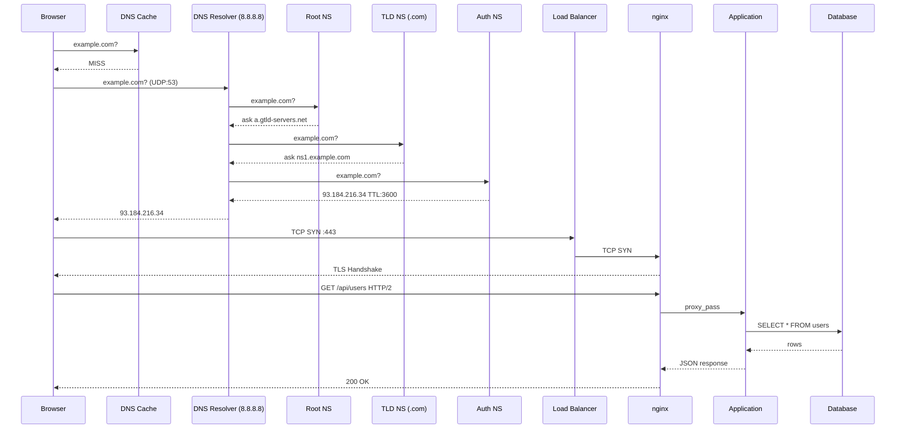
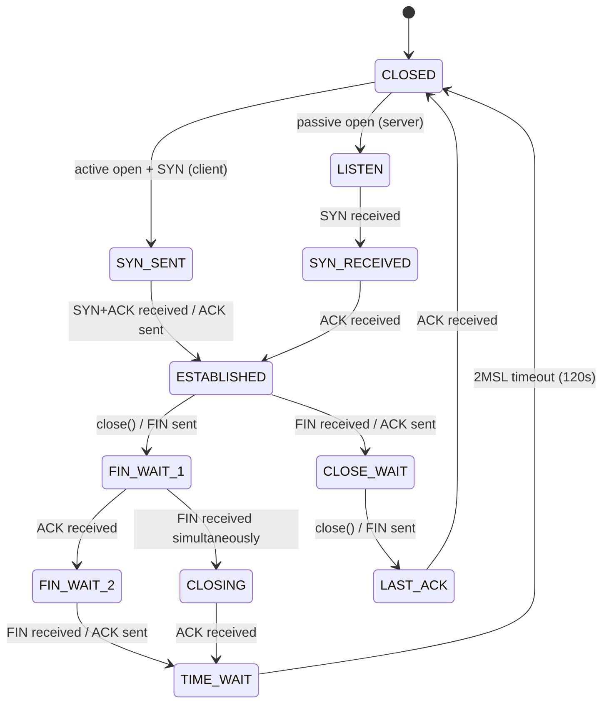

# Module 2: Networking Deep Dive

> **Phase:** 1 — Foundations | **Level:** Beginner → Expert | **Prerequisites:** Module 1 (Linux Internals)

---

## Table of Contents

1. [Introduction](#1-introduction)
2. [OSI Model — Real Production Mapping](#2-osi-model--real-production-mapping)
3. [TCP/IP Deep Dive](#3-tcpip-deep-dive)
4. [DNS Internals](#4-dns-internals)
5. [HTTP / HTTPS](#5-http--https)
6. [SSH Internals](#6-ssh-internals)
7. [Firewalls & iptables](#7-firewalls--iptables)
8. [Network Namespaces](#8-network-namespaces)
9. [Diagrams](#9-diagrams)
10. [Implementation & Commands](#10-implementation--commands)
11. [Production Issues](#11-production-issues)
12. [Observability](#12-observability)
13. [Security](#13-security)
14. [Interview Questions](#14-interview-questions)
15. [Hands-On Labs](#15-hands-on-labs)

---

## 1. Introduction

### Why Networking is Critical for DevOps

Every production system communicates over a network. Every Kubernetes pod, every microservice, every database connection — all networking. When things break in production, it is almost always networking: DNS failure, TCP timeout, TLS handshake error, firewall blocking traffic, or packet loss.

**What you need to master:**
- How data actually moves from app A to app B
- What TCP really does at the kernel level
- How DNS works (not just "it converts names to IPs")
- What happens during HTTPS (TLS handshake, cipher negotiation)
- How to debug any network problem in < 5 minutes
- How containers get networking (namespaces, veth pairs, bridges)

---

## 2. OSI Model — Real Production Mapping

### The 7 Layers (with real tools at each layer)

```
Layer 7 — Application
  Protocols: HTTP, HTTPS, FTP, SMTP, DNS, gRPC, WebSocket
  Tools:     curl, wget, httpie, postman
  DevOps:    nginx, HAProxy, Envoy, API gateways
  Debug:     curl -v, tcpdump -A (see HTTP body)

Layer 6 — Presentation
  Role:      Encryption, encoding, compression
  Protocols: TLS/SSL, gzip, JSON encoding
  DevOps:    Let's Encrypt, cert-manager, openssl
  Debug:     openssl s_client, ssldump

Layer 5 — Session
  Role:      Establish, manage, terminate sessions
  Protocols: RPC, NetBIOS, SQL sessions
  DevOps:    Mostly handled by application/TLS
  Debug:     wireshark session tracking

Layer 4 — Transport
  Protocols: TCP, UDP, SCTP, QUIC
  Role:      Port numbers, reliability, flow control
  Tools:     ss, netstat, iperf3
  Debug:     tcpdump 'tcp port 8080', ss -tan

Layer 3 — Network
  Protocols: IPv4, IPv6, ICMP, ARP (sort of)
  Role:      IP addressing, routing
  Tools:     ip route, traceroute, ping, mtr
  Debug:     ping, traceroute, ip route get <dest>

Layer 2 — Data Link
  Protocols: Ethernet, 802.11 (WiFi), ARP, VLAN (802.1Q)
  Role:      MAC addresses, frame delivery on local segment
  Tools:     ip link, arp, ethtool
  Debug:     arping, tcpdump -e (show MAC)

Layer 1 — Physical
  Role:      Bits on wire, electrical/optical signals
  Tools:     ethtool (link speed, duplex)
  Debug:     ethtool eth0, dmesg | grep eth0
```

### TCP/IP Model (what Linux actually implements)

```
Application Layer  (OSI 5+6+7)  →  HTTP, DNS, SSH, gRPC
Transport Layer    (OSI 4)       →  TCP, UDP
Internet Layer     (OSI 3)       →  IPv4, IPv6, ICMP
Link Layer         (OSI 1+2)     →  Ethernet, WiFi, ARP
```

---

## 3. TCP/IP Deep Dive

### IP Addressing

```
IPv4: 32-bit address, written as 4 octets (192.168.1.100)
IPv6: 128-bit address (2001:db8::1)

CIDR notation:
  192.168.1.0/24  = 256 addresses (192.168.1.0 - 192.168.1.255)
  10.0.0.0/8      = 16M addresses (entire 10.x.x.x range)
  172.16.0.0/12   = 1M addresses (172.16.x.x - 172.31.x.x)

Private IP ranges (RFC 1918 — not routable on internet):
  10.0.0.0/8        (Class A — large enterprise)
  172.16.0.0/12     (Class B — medium)
  192.168.0.0/16    (Class C — home/small office)

Special addresses:
  127.0.0.0/8       loopback (localhost)
  169.254.0.0/16    link-local (APIPA — no DHCP)
  0.0.0.0           default route / unspecified
  255.255.255.255   broadcast

Subnet math (important for DevOps):
  /24 = 256 hosts, 254 usable (minus network + broadcast)
  /25 = 128 hosts, 126 usable
  /26 = 64 hosts, 62 usable
  /27 = 32 hosts, 30 usable
  /28 = 16 hosts, 14 usable (common for AWS subnets)

  Formula: usable hosts = 2^(32-prefix) - 2
```

### IP Routing

```
Routing table — determines where to send a packet:

  ip route show
  default via 10.0.0.1 dev eth0          # default gateway
  10.0.0.0/24 dev eth0 proto kernel      # directly connected
  172.16.0.0/16 via 10.0.0.254 dev eth0 # static route

Routing algorithm (longest prefix match):
  Destination: 10.0.1.50
  Routes:
    10.0.0.0/8   via 10.255.0.1
    10.0.1.0/24  via 10.0.0.1    ← wins (most specific)
    default      via 192.168.1.1

  The most specific (longest prefix) match wins.

Routing decision in kernel (ip_route_input):
  1. Check routing cache (rcu lookup)
  2. Longest prefix match in FIB (Forwarding Information Base)
  3. If match: determine nexthop, output interface
  4. If no match: use default route
  5. If no default: ENETUNREACH error

ip route get <destination>   # which route would be used?
ip route get 8.8.8.8         # output: shows interface, src IP, gateway
```

### ARP — Address Resolution Protocol

```
ARP bridges Layer 3 (IP) and Layer 2 (MAC):
  "I have IP 10.0.0.50, what MAC address owns it?"

ARP process:
  Host A (10.0.0.1) wants to send to Host B (10.0.0.2):
  
  1. Host A checks ARP cache: ip neigh show
  2. If not found: broadcast ARP request
     "Who has 10.0.0.2? Tell 10.0.0.1"
     (Dst MAC: ff:ff:ff:ff:ff:ff — broadcast)
  3. Host B sees broadcast (has 10.0.0.2):
     Sends ARP reply directly to Host A:
     "10.0.0.2 is at 00:11:22:33:44:55"
  4. Host A caches entry (ip neigh show shows it)
  5. Host A sends frame to MAC 00:11:22:33:44:55

ARP table / neighbor cache:
  ip neigh show               # view ARP cache
  ip neigh flush all          # flush ARP cache
  arp -n                      # classic arp command
  arping -I eth0 10.0.0.1    # ARP ping (layer 2 test)

Gratuitous ARP:
  Host broadcasts its own IP → MAC mapping
  Used when: IP changes, failover, virtual IP moves
  
ARP spoofing (attack):
  Attacker sends fake ARP replies → MITM attack
  Defense: Dynamic ARP Inspection (DAI) on switches
```

### TCP — Transmission Control Protocol

```
TCP provides: reliable, ordered, flow-controlled, byte-stream delivery

TCP Header fields:
  Source Port:       16 bits (0-65535)
  Destination Port:  16 bits (0-65535)
  Sequence Number:   32 bits (position of first byte in this segment)
  Ack Number:        32 bits (next byte expected from other side)
  Data Offset:       4 bits (header length in 32-bit words)
  Flags:             9 bits
    URG: urgent pointer valid
    ACK: ack number valid
    PSH: push data to application immediately
    RST: reset connection
    SYN: synchronize sequence numbers (connection setup)
    FIN: no more data from sender (connection teardown)
  Window Size:       16 bits (receive window = flow control)
  Checksum:          16 bits
  Urgent Pointer:    16 bits

TCP connection states (full state machine):

  CLOSED
    ↓ (server calls listen())
  LISTEN
    ↓ (client sends SYN)
  SYN_RECEIVED  ← server
  SYN_SENT      ← client (after sending SYN)
    ↓ (SYN-ACK received by client, ACK sent)
  ESTABLISHED ← both sides
    ↓ (FIN sent — active closer)
  FIN_WAIT_1
    ↓ (FIN-ACK received)
  FIN_WAIT_2
    ↓ (passive closer sends FIN)
  TIME_WAIT ← lasts 2 * MSL (Maximum Segment Lifetime = 60s → 120s wait)
    ↓
  CLOSED

  Passive closer:
  CLOSE_WAIT → LAST_ACK → CLOSED

  TIME_WAIT explains:
    Why: ensures stale packets from old connection don't corrupt new connection
    Problem: millions of connections → too many TIME_WAIT sockets
    Fix: net.ipv4.tcp_tw_reuse = 1 (reuse for outgoing connections)
```

### TCP Flow Control and Congestion Control

```
Flow Control (receiver tells sender to slow down):
  Receiver advertises window size in each ACK
  Sender cannot have more unacked data than window size
  If receiver overwhelmed → advertises window=0 (zero window)
  
  Zero window probe: sender periodically probes with 1 byte
  Window update: receiver sends ACK with new window when ready

Congestion Control (prevent network congestion):
  Slow start:
    Start with cwnd (congestion window) = 1-10 MSS
    Double cwnd every RTT until ssthresh
    
  Congestion avoidance:
    After ssthresh: increase cwnd by 1 MSS per RTT (linear)
    
  Packet loss detected (timeout or 3 dup ACKs):
    ssthresh = cwnd / 2
    Restart slow start
    
Algorithms:
  CUBIC: Linux default. Fast convergence, good for high BDP networks.
  BBR: Google's algorithm. Measures bandwidth + RTT, not loss-based.
        Better for long-fat networks, satellite links.
  RENO: Classic, loss-based. Legacy.

Enable BBR:
  sysctl -w net.core.default_qdisc=fq
  sysctl -w net.ipv4.tcp_congestion_control=bbr
  cat /proc/sys/net/ipv4/tcp_congestion_control  # verify
  sysctl net.ipv4.tcp_available_congestion_control  # list available
```

### UDP — User Datagram Protocol

```
UDP: connectionless, unreliable, no ordering, no flow control.
Faster, lower overhead than TCP.

UDP Header (8 bytes vs TCP 20+ bytes):
  Source Port    (2 bytes)
  Dest Port      (2 bytes)
  Length         (2 bytes)
  Checksum       (2 bytes)

Use UDP when:
  - Speed more important than reliability (video streaming, gaming)
  - Application handles reliability itself (QUIC = UDP + reliability)
  - One-to-many (multicast, broadcast)
  - Request-response where loss = retry (DNS, DHCP, NTP)
  - Low latency critical (VoIP, real-time telemetry)

Protocols using UDP:
  DNS      (port 53)    — query-response, small, fast
  DHCP     (67/68)      — broadcast-based
  NTP      (123)        — time sync
  QUIC     (443 UDP)    — HTTP/3
  syslog   (514)        — log shipping
  SNMP     (161/162)    — network monitoring
  VXLAN    (4789)       — container networking overlay
  WireGuard (51820)     — VPN
```

### ICMP — Internet Control Message Protocol

```
ICMP: network-level control and error reporting.
Runs on top of IP (protocol number 1).

Key ICMP types:
  Type 0  Code 0   — Echo Reply (ping response)
  Type 3  Code 0   — Destination Unreachable: network
  Type 3  Code 1   — Destination Unreachable: host
  Type 3  Code 3   — Destination Unreachable: port
  Type 8  Code 0   — Echo Request (ping)
  Type 11 Code 0   — Time Exceeded (TTL = 0) — used by traceroute
  Type 12 Code 0   — Parameter Problem

Ping flow:
  ping 8.8.8.8
  → ICMP Echo Request (type 8) sent with TTL=64
  → 8.8.8.8 replies with ICMP Echo Reply (type 0)
  → RTT measured

Traceroute mechanism:
  Send packet with TTL=1  → first router → TTL exceeded (ICMP type 11)
  Send packet with TTL=2  → second router → TTL exceeded
  ...
  Send packet with TTL=N  → destination → ICMP port unreachable OR Echo Reply
  
  This reveals each hop in the path.
  traceroute uses UDP (default) or ICMP (traceroute -I) or TCP (tcptraceroute)

ICMP blocking:
  Never block ALL ICMP — breaks PMTUD (Path MTU Discovery)
  PMTUD: kernel sends large packet → router returns ICMP "Fragmentation Needed"
  → kernel reduces MTU for that destination
  Blocking ICMP type 3 code 4 → connection hangs mysteriously (black hole)
```

---

## 4. DNS Internals

### DNS Resolution — Step by Step

```
User types: https://www.example.com

Browser:
  1. Check browser DNS cache (chrome://net-internals/#dns)
  2. Check OS resolver cache
  3. Check /etc/hosts
  4. Check /etc/resolv.conf for nameserver IP
  5. Send DNS query to resolver (e.g., 8.8.8.8)

Recursive Resolver (8.8.8.8):
  6. Check resolver cache → if hit, return answer
  7. If miss: query root nameserver

Root Nameserver (13 clusters, anycast):
  8. Returns NS record for .com TLD
     "I don't know example.com, ask a.gtld-servers.net"

TLD Nameserver (a.gtld-servers.net for .com):
  9. Returns NS record for example.com
     "I don't know www.example.com, ask ns1.exampledns.com"

Authoritative Nameserver (ns1.exampledns.com):
  10. Returns A record: www.example.com → 93.184.216.34
      TTL: 3600 (cache for 1 hour)

Back to resolver:
  11. Caches result for TTL seconds
  12. Returns answer to client

Client:
  13. Caches result
  14. Opens TCP connection to 93.184.216.34:443

Total time: ~50-200ms (first resolution)
Cached: < 1ms
```

### DNS Packet Format

```
DNS uses UDP port 53 (< 512 bytes)
DNS uses TCP port 53 (> 512 bytes, zone transfers, DNSSEC)
DNS-over-TLS (DoT): TCP port 853
DNS-over-HTTPS (DoH): HTTPS port 443

DNS message format:
  Header:
    ID          (2 bytes) — match query to response
    Flags       (2 bytes) — QR, Opcode, AA, TC, RD, RA, Z, RCODE
    QDCOUNT     (2 bytes) — number of questions
    ANCOUNT     (2 bytes) — number of answers
    NSCOUNT     (2 bytes) — number of authority records
    ARCOUNT     (2 bytes) — number of additional records
  
  Question section:
    QNAME  — domain name (labels separated by length bytes)
    QTYPE  — record type (A=1, AAAA=28, CNAME=5, MX=15, TXT=16)
    QCLASS — class (IN = internet = 1)

  Answer section:
    NAME   — domain name
    TYPE   — record type
    CLASS  — class
    TTL    — time to live (seconds)
    RDLENGTH — length of RDATA
    RDATA  — the actual answer (IP address, hostname, etc.)
```

### DNS Record Types (Complete)

```
A      — hostname → IPv4 address
         www.example.com → 93.184.216.34

AAAA   — hostname → IPv6 address
         www.example.com → 2606:2800:220:1:248:1893:25c8:1946

CNAME  — alias → canonical name
         www.example.com → example.com (CNAME)
         Cannot coexist with other records for same name!
         Root domain (APEX) CANNOT use CNAME → use ALIAS/ANAME

MX     — mail exchanger (with priority)
         example.com → 10 mail1.example.com
                        20 mail2.example.com (higher number = lower priority)

NS     — nameserver for a zone
         example.com → ns1.exampledns.com
                        ns2.exampledns.com

PTR    — reverse DNS (IP → hostname)
         34.216.184.93.in-addr.arpa → www.example.com
         Used by: mail servers (spam checking), SSH, logs

TXT    — arbitrary text
         SPF:   "v=spf1 include:_spf.google.com ~all"
         DKIM:  "v=DKIM1; k=rsa; p=<public-key>"
         DMARC: "v=DMARC1; p=quarantine; rua=mailto:dmarc@example.com"
         Verification: "google-site-verification=<token>"

SRV    — service location
         _etcd-server._tcp.example.com → 0 0 2380 etcd1.example.com
         _https._tcp.example.com → 0 0 443 www.example.com
         Used by: Kubernetes, SRV-based service discovery

SOA    — Start of Authority (zone metadata)
         Primary NS, admin email, serial, refresh, retry, expire, min-TTL

CAA    — Certification Authority Authorization
         example.com → "0 issue letsencrypt.org"
         Only Let's Encrypt can issue certs for this domain

NAPTR  — Name Authority Pointer (VoIP/SIP)

ALIAS/ANAME — non-standard, CDN-friendly CNAME for apex domain
```

### /etc/resolv.conf and /etc/nsswitch.conf

```
/etc/resolv.conf — DNS resolver configuration
  nameserver 8.8.8.8           # primary DNS
  nameserver 8.8.4.4           # secondary DNS
  search example.com internal  # search domains (appended to short names)
  options ndots:5              # if <5 dots, try search domains first
  options timeout:2            # UDP timeout seconds
  options attempts:3           # retry count

/etc/nsswitch.conf — name service switch (what to check and in what order)
  hosts: files dns myhostname
         |     |   |
         |     |   └── /etc/hostname
         |     └── DNS servers in resolv.conf
         └── /etc/hosts (checked first)

/etc/hosts — static hostname mappings
  127.0.0.1    localhost
  ::1          localhost
  10.0.0.10    db1.internal db1
  10.0.0.11    db2.internal db2
  # Kubernetes pods: /etc/hosts managed by kubelet

systemd-resolved (modern Linux):
  Caches DNS responses
  Supports DoT, DoH
  resolvectl status        # show resolver status
  resolvectl query google.com  # query with details
  resolvectl flush-caches  # flush DNS cache
```

---

## 5. HTTP / HTTPS

### HTTP/1.1 Deep Dive

```
HTTP Request format:
  GET /api/users HTTP/1.1\r\n
  Host: api.example.com\r\n
  User-Agent: curl/7.68.0\r\n
  Accept: application/json\r\n
  Authorization: Bearer eyJ...\r\n
  \r\n
  [body — for POST/PUT/PATCH]

HTTP Response format:
  HTTP/1.1 200 OK\r\n
  Content-Type: application/json\r\n
  Content-Length: 256\r\n
  Cache-Control: no-cache\r\n
  Connection: keep-alive\r\n
  \r\n
  {"users": [...]}

HTTP Methods:
  GET     — retrieve resource, idempotent, no body
  POST    — create resource, not idempotent, has body
  PUT     — replace resource, idempotent
  PATCH   — partial update
  DELETE  — delete resource
  HEAD    — GET without body (check existence, headers)
  OPTIONS — preflight CORS check

HTTP Status Codes:
  1xx — Informational
    100 Continue
    101 Switching Protocols (WebSocket upgrade)
  
  2xx — Success
    200 OK
    201 Created (POST response)
    204 No Content (DELETE response)
  
  3xx — Redirect
    301 Moved Permanently (SEO-safe redirect, cached)
    302 Found (temporary redirect)
    304 Not Modified (conditional GET, use cache)
  
  4xx — Client Error
    400 Bad Request (malformed JSON, missing field)
    401 Unauthorized (not authenticated)
    403 Forbidden (authenticated but no permission)
    404 Not Found
    408 Request Timeout
    429 Too Many Requests (rate limited)
  
  5xx — Server Error
    500 Internal Server Error
    502 Bad Gateway (upstream returned invalid response)
    503 Service Unavailable (overloaded or down)
    504 Gateway Timeout (upstream took too long)
```

### HTTP/2 Internals

```
HTTP/2 improvements over HTTP/1.1:

1. Binary framing (not text):
   HTTP/1.1: text-based, human-readable headers
   HTTP/2:   binary frames — more efficient to parse

2. Multiplexing:
   HTTP/1.1: one request per connection (or 6 parallel connections)
             head-of-line blocking: slow request blocks others
   HTTP/2:   multiple streams over ONE connection
             each request = stream ID
             frames interleaved: stream 1 frame, stream 3 frame, stream 5 frame
             no head-of-line blocking at HTTP level (still at TCP)

3. Header compression (HPACK):
   HTTP/1.1: full headers sent every request (e.g., User-Agent repeated)
   HTTP/2:   header table maintained — send only changed headers

4. Server Push:
   Server can push resources before client requests them
   Example: client requests index.html → server also pushes styles.css

5. Stream priority:
   Client can indicate stream priority weights

HTTP/2 frame types:
  DATA        (0x0) — carries request/response body
  HEADERS     (0x1) — request/response headers (with HPACK encoding)
  PRIORITY    (0x2) — stream priority
  RST_STREAM  (0x3) — cancel a stream
  SETTINGS    (0x4) — connection settings
  PING        (0x6) — keepalive
  GOAWAY      (0x7) — graceful shutdown
  WINDOW_UPDATE (0x8) — flow control
```

### TLS/SSL Handshake (TLS 1.3)

```
TLS 1.3 Handshake (1 RTT):

Client → Server:
  ClientHello:
    - TLS version: 1.3
    - Random bytes (client_random)
    - Supported cipher suites:
        TLS_AES_256_GCM_SHA384
        TLS_CHACHA20_POLY1305_SHA256
        TLS_AES_128_GCM_SHA256
    - Supported groups (key exchange): x25519, secp256r1
    - Key share (client's public key for x25519)
    - SNI (Server Name Indication) extension: "api.example.com"
      (allows multiple certs on same IP)

Server → Client:
  ServerHello:
    - Selected cipher suite: TLS_AES_256_GCM_SHA384
    - Selected key share algorithm: x25519
    - Server's public key share
    
  {Certificate}:  (encrypted already!)
    - Server's certificate (X.509): contains public key + identity
    - Intermediate CA certificates
    
  {CertificateVerify}:
    - Signature over handshake transcript (proves server has private key)
    
  {Finished}:
    - MAC over handshake transcript

  ← At this point, server can already send application data!

Client → Server:
  {Finished}: client's MAC
  {Application Data}: HTTP request (ENCRYPTED)

Server → Client:
  {Application Data}: HTTP response

Key Exchange (ECDHE — Elliptic Curve Diffie-Hellman Ephemeral):
  Client has: private key a, public key A = a*G
  Server has: private key b, public key B = b*G
  Shared secret: a*B = b*A = a*b*G
  Even if server's private key is later compromised:
  → attacker cannot decrypt past sessions (Perfect Forward Secrecy)

TLS 1.2 vs TLS 1.3:
  TLS 1.2: 2 RTT handshake (slower)
  TLS 1.3: 1 RTT handshake
  TLS 1.3 0-RTT: send data with first message (resumption, replay risk)
  
  TLS 1.2 weaknesses removed in 1.3:
    - RSA key exchange (no PFS)
    - RC4, 3DES, MD5, SHA-1 cipher suites
    - renegotiation

Certificate validation:
  1. Certificate signed by trusted CA (in OS/browser trust store)
  2. Certificate not expired (notBefore, notAfter)
  3. Certificate not revoked (OCSP / CRL)
  4. CN or SAN (Subject Alternative Name) matches hostname
  5. Certificate chain valid up to root CA
```

### HTTPS in nginx

```nginx
server {
    listen 443 ssl http2;
    listen [::]:443 ssl http2;
    server_name api.example.com;

    ssl_certificate     /etc/letsencrypt/live/api.example.com/fullchain.pem;
    ssl_certificate_key /etc/letsencrypt/live/api.example.com/privkey.pem;

    # TLS hardening
    ssl_protocols TLSv1.2 TLSv1.3;
    ssl_prefer_server_ciphers off;  # TLS 1.3: client order preferred
    ssl_ciphers ECDHE-ECDSA-AES128-GCM-SHA256:ECDHE-RSA-AES128-GCM-SHA256:ECDHE-ECDSA-AES256-GCM-SHA384;

    # Session resumption
    ssl_session_cache   shared:SSL:10m;
    ssl_session_timeout 1d;
    ssl_session_tickets off;

    # OCSP stapling
    ssl_stapling on;
    ssl_stapling_verify on;
    resolver 8.8.8.8 valid=300s;

    # HSTS
    add_header Strict-Transport-Security "max-age=63072000" always;

    location / {
        proxy_pass http://localhost:8080;
        proxy_set_header Host $host;
        proxy_set_header X-Real-IP $remote_addr;
        proxy_set_header X-Forwarded-For $proxy_add_x_forwarded_for;
        proxy_set_header X-Forwarded-Proto $scheme;
    }
}

# Redirect HTTP to HTTPS
server {
    listen 80;
    server_name api.example.com;
    return 301 https://$host$request_uri;
}
```

---

## 6. SSH Internals

### How SSH Works

```
SSH = Secure Shell. Encrypted remote login and command execution.
Default port: 22 (TCP)

SSH Connection phases:

1. TCP connection established (client → server port 22)

2. Version exchange:
   Client: "SSH-2.0-OpenSSH_8.2p1"
   Server: "SSH-2.0-OpenSSH_8.4p1"

3. Algorithm negotiation (SSH_MSG_KEXINIT):
   Both sides exchange:
   - Key exchange algorithms: curve25519-sha256, ecdh-sha2-nistp256
   - Host key algorithms: ecdsa-sha2-nistp256, ssh-ed25519, rsa-sha2-512
   - Encryption: chacha20-poly1305, aes256-gcm@openssh.com
   - MAC: hmac-sha2-256, umac-128-etm
   - Compression: none, zlib@openssh.com

4. Key exchange (Diffie-Hellman or ECDH):
   → Establishes shared secret
   → Session keys derived from shared secret

5. Server authentication:
   Server signs exchange hash with private host key
   Client verifies against known_hosts (or asks user to accept)
   TRUST ON FIRST USE (TOFU) — first connection asks "Are you sure?"

6. User authentication (one of):
   a) Password: encrypted and sent (secure — encrypted channel)
   b) Public key:
      - Client sends public key
      - Server checks ~/.ssh/authorized_keys
      - Server sends challenge encrypted with client's public key
      - Client decrypts with private key, signs challenge
      - Server verifies signature
   c) GSSAPI/Kerberos
   d) Certificate (signed SSH key)

7. Session established:
   Channel opened (SSH_MSG_CHANNEL_OPEN)
   Terminal requested or subsystem (sftp)
   Commands executed

SSH Key Types:
  RSA     — legacy, 2048/4096 bit (still widely supported)
  DSA     — deprecated (fixed 1024-bit, insecure)
  ECDSA   — elliptic curve, 256/384/521 bit
  Ed25519 — best: fast, secure, small keys (recommended)

Generate keys:
  ssh-keygen -t ed25519 -C "user@company.com"
  ssh-keygen -t rsa -b 4096 -C "user@company.com"
```

### SSH Configuration and Hardening

```bash
# /etc/ssh/sshd_config — server configuration
Port 22
AddressFamily inet
ListenAddress 0.0.0.0

# Disable root login
PermitRootLogin no

# Use only key authentication
PasswordAuthentication no
PubkeyAuthentication yes
AuthorizedKeysFile .ssh/authorized_keys

# Disable unused features
X11Forwarding no
AllowTcpForwarding no    # disable unless needed for tunnels
PermitEmptyPasswords no

# Timeout
LoginGraceTime 30
ClientAliveInterval 300
ClientAliveCountMax 3
MaxAuthTries 3
MaxSessions 10

# Restrict users/groups
AllowUsers devops admin
AllowGroups sshusers sudo

# Key exchange and cipher restrictions (hardening)
KexAlgorithms curve25519-sha256,diffie-hellman-group16-sha512
Ciphers chacha20-poly1305@openssh.com,aes256-gcm@openssh.com
MACs hmac-sha2-256-etm@openssh.com,hmac-sha2-512-etm@openssh.com

# Apply changes
systemctl restart sshd
# Verify before closing current session!
sshd -t  # test config syntax
```

### SSH Tunneling

```bash
# Local port forwarding:
# Forward local:8080 to remote_host:80 (through ssh_server)
ssh -L 8080:remote_host:80 user@ssh_server
# Use case: access internal web service not exposed publicly
# Then: curl http://localhost:8080

# Remote port forwarding:
# Forward remote_server:8080 to local:3000
ssh -R 8080:localhost:3000 user@remote_server
# Use case: expose local development server to internet

# SOCKS proxy (dynamic forwarding):
ssh -D 1080 user@bastion
# Configure browser to use SOCKS5 proxy localhost:1080
# All traffic routes through bastion

# Jump hosts (ProxyJump):
ssh -J bastion.example.com user@internal-server.example.com

# ~/.ssh/config
Host bastion
  HostName bastion.example.com
  User ec2-user
  IdentityFile ~/.ssh/id_ed25519

Host internal
  HostName 10.0.1.50
  User ubuntu
  ProxyJump bastion
  IdentityFile ~/.ssh/id_ed25519

# Then simply: ssh internal

# SSH agent forwarding (use local key on remote server)
ssh -A user@bastion      # forward agent
# Then from bastion: ssh user@internal (uses your local key)
# SECURITY: only use on trusted servers (root can steal agent socket)
```

---

## 7. Firewalls & iptables

### iptables Architecture

```
iptables = userspace tool to configure Netfilter (kernel packet filtering)

Tables (processed in order):
  raw     → connection tracking decisions
  mangle  → modify packets (TTL, TOS, mark)
  nat     → NAT, masquerade, port forwarding
  filter  → ACCEPT/DROP/REJECT (what most people use)
  security → SELinux security labels

Built-in chains per table:
  filter: INPUT, OUTPUT, FORWARD
  nat:    PREROUTING, INPUT, OUTPUT, POSTROUTING
  mangle: PREROUTING, INPUT, OUTPUT, FORWARD, POSTROUTING

Packet traversal:

Incoming packet (for local host):
  PREROUTING (raw, mangle, nat)
    ↓
  routing decision (is it for us?)
    ↓
  INPUT (mangle, filter)
    ↓
  local process

Outgoing packet (from local host):
  local process
    ↓
  OUTPUT (raw, mangle, nat, filter)
    ↓
  POSTROUTING (mangle, nat)
    ↓
  out to network

Forwarded packet (routing):
  PREROUTING (raw, mangle, nat)
    ↓
  routing decision (forward)
    ↓
  FORWARD (mangle, filter)
    ↓
  POSTROUTING (mangle, nat)
    ↓
  out to network
```

### iptables Rules

```bash
# View rules
iptables -L -v -n                    # all filter rules, verbose, numeric
iptables -L INPUT -v -n --line-numbers  # INPUT chain with line numbers
iptables -t nat -L -v -n             # NAT table rules

# Basic rules
iptables -A INPUT -p tcp --dport 22 -j ACCEPT      # allow SSH
iptables -A INPUT -p tcp --dport 80 -j ACCEPT      # allow HTTP
iptables -A INPUT -p tcp --dport 443 -j ACCEPT     # allow HTTPS
iptables -A INPUT -i lo -j ACCEPT                  # allow loopback
iptables -A INPUT -m state --state ESTABLISHED,RELATED -j ACCEPT  # allow return traffic
iptables -P INPUT DROP                             # default DROP (policy)

# Stateful rules (using connection tracking)
iptables -A INPUT -m state --state NEW,ESTABLISHED -p tcp --dport 22 -j ACCEPT
iptables -A OUTPUT -m state --state ESTABLISHED -j ACCEPT

# Rate limiting (anti-brute-force)
iptables -A INPUT -p tcp --dport 22 -m recent --set --name SSH
iptables -A INPUT -p tcp --dport 22 -m recent --update --seconds 60 --hitcount 5 --name SSH -j DROP

# Port forwarding (DNAT)
iptables -t nat -A PREROUTING -p tcp --dport 80 -j DNAT --to-destination 10.0.0.10:8080

# Masquerade (SNAT for internet sharing)
iptables -t nat -A POSTROUTING -o eth0 -j MASQUERADE

# Save rules (persist across reboots)
iptables-save > /etc/iptables/rules.v4       # Debian/Ubuntu
service iptables save                         # RHEL/CentOS

# Delete a rule
iptables -D INPUT -p tcp --dport 80 -j ACCEPT
iptables -D INPUT 5                           # delete by line number

# Flush rules
iptables -F                                   # flush all chains
iptables -t nat -F                            # flush NAT table
```

### nftables (Modern Replacement)

```bash
# nftables — replaces iptables, ip6tables, arptables, ebtables
# More consistent syntax, better performance

# View ruleset
nft list ruleset

# Create table and chain
nft add table inet filter
nft add chain inet filter input { type filter hook input priority 0 \; policy drop \; }
nft add chain inet filter output { type filter hook output priority 0 \; policy accept \; }

# Add rules
nft add rule inet filter input iif lo accept
nft add rule inet filter input ct state established,related accept
nft add rule inet filter input tcp dport { 22, 80, 443 } accept

# NAT
nft add table ip nat
nft add chain ip nat prerouting { type nat hook prerouting priority -100 \; }
nft add chain ip nat postrouting { type nat hook postrouting priority 100 \; }
nft add rule ip nat postrouting oif eth0 masquerade

# Save
nft list ruleset > /etc/nftables.conf
systemctl enable nftables
```

### firewalld (Enterprise Linux)

```bash
# firewalld — dynamic firewall with zones
# Default on RHEL/CentOS/Fedora

systemctl start firewalld
systemctl enable firewalld

# Zones (trust levels)
firewall-cmd --get-zones
firewall-cmd --get-active-zones
# Common zones: public, trusted, work, home, dmz, drop

# Allow services
firewall-cmd --permanent --add-service=http
firewall-cmd --permanent --add-service=https
firewall-cmd --permanent --add-service=ssh

# Allow ports
firewall-cmd --permanent --add-port=8080/tcp
firewall-cmd --permanent --add-port=9090-9099/tcp

# Allow from specific source
firewall-cmd --permanent --add-rich-rule='rule family="ipv4" source address="10.0.0.0/24" accept'

# Reload rules
firewall-cmd --reload

# View current rules
firewall-cmd --list-all
```

---

## 8. Network Namespaces

### Container Networking Internals

```
Linux network namespaces allow completely isolated network stacks.
Each namespace has: interfaces, routing table, iptables, sockets.

Docker/Kubernetes uses namespaces for container network isolation:

Physical setup:
  ┌─────────────────────────────────────────────────────────┐
  │                      Host Network                       │
  │  eth0 (192.168.1.100)                                   │
  │  docker0 bridge (172.17.0.1/16)                        │
  │     ├── veth1a ←──── veth1b (container 1: 172.17.0.2) │
  │     └── veth2a ←──── veth2b (container 2: 172.17.0.3) │
  └─────────────────────────────────────────────────────────┘

veth pair = virtual ethernet cable connecting two namespaces
One end in host, other end in container namespace.

Container packet flow (container 1 → internet):
  Container 1 app sends to 8.8.8.8
    ↓ default route: 172.17.0.1 (docker0)
    ↓ via veth1b → veth1a (crosses namespace boundary)
    ↓ arrives at docker0 bridge in host namespace
    ↓ iptables FORWARD check
    ↓ iptables POSTROUTING MASQUERADE: src changed to eth0 IP
    ↓ Sent via eth0 to internet
    ← Reply arrives: dst = host eth0 IP
    ← iptables connection tracking: unmask → docker0 → veth1a → veth1b
    ← Arrives in container 1
```

### Hands-On Network Namespace

```bash
# Create network namespace (simulates container)
ip netns add mynamespace

# Create veth pair
ip link add veth0 type veth peer name veth1

# Move veth1 into namespace
ip link set veth1 netns mynamespace

# Configure host side
ip addr add 10.10.10.1/24 dev veth0
ip link set veth0 up

# Configure namespace side
ip netns exec mynamespace ip addr add 10.10.10.2/24 dev veth1
ip netns exec mynamespace ip link set veth1 up
ip netns exec mynamespace ip link set lo up

# Test connectivity
ping 10.10.10.2                                          # host → namespace
ip netns exec mynamespace ping 10.10.10.1               # namespace → host

# Add internet access (NAT)
iptables -t nat -A POSTROUTING -s 10.10.10.0/24 -j MASQUERADE
echo 1 > /proc/sys/net/ipv4/ip_forward
ip netns exec mynamespace ip route add default via 10.10.10.1
ip netns exec mynamespace ping 8.8.8.8                  # namespace → internet

# Cleanup
ip netns del mynamespace
ip link del veth0
```

---

## 9. Diagrams

### Mermaid: Complete Request Flow



### Mermaid: TCP State Machine



### ASCII: OSI Layers with Protocols

```
┌────────────────────────────────────────────────────────────┐
│ Layer 7: Application   HTTP/2, gRPC, WebSocket, DNS        │
├────────────────────────────────────────────────────────────┤
│ Layer 6: Presentation  TLS 1.3, gzip, JSON encoding        │
├────────────────────────────────────────────────────────────┤
│ Layer 5: Session       TLS sessions, RPC sessions          │
├────────────────────────────────────────────────────────────┤
│ Layer 4: Transport     TCP (reliable) / UDP (fast)         │
│                        Port numbers: src:ephemeral dst:443  │
├────────────────────────────────────────────────────────────┤
│ Layer 3: Network       IPv4/IPv6, ICMP, routing            │
│                        IP addresses, TTL, fragmentation     │
├────────────────────────────────────────────────────────────┤
│ Layer 2: Data Link     Ethernet, MAC addresses, ARP        │
│                        VLAN, 802.1Q, switches              │
├────────────────────────────────────────────────────────────┤
│ Layer 1: Physical      Bits on wire, fiber, copper, radio  │
│                        Link speed, duplex, signal strength  │
└────────────────────────────────────────────────────────────┘
```

### ASCII: Container Network Architecture

```
┌──────────────────────────────────────────────────────┐
│                    HOST MACHINE                       │
│                                                       │
│  eth0 (10.0.0.5)  ←─── internet/VPC                 │
│       │                                               │
│  ┌────▼──────────────────────────────────────────┐  │
│  │  docker0 bridge (172.17.0.1/16)               │  │
│  │   │                    │                       │  │
│  │  veth0a               veth1a                   │  │
│  └───│───────────────────│───────────────────────┘  │
│      │ (namespace bdry)   │ (namespace bdry)          │
│  ┌───▼──────────────┐  ┌─▼─────────────────────┐    │
│  │ Container 1 NS   │  │ Container 2 NS          │    │
│  │ eth0=172.17.0.2  │  │ eth0=172.17.0.3        │    │
│  │ App: port 8080   │  │ App: port 9090          │    │
│  └──────────────────┘  └─────────────────────────┘   │
│                                                       │
│  iptables MASQUERADE: 172.17.0.0/16 → eth0 IP       │
└──────────────────────────────────────────────────────┘
```

---

## 10. Implementation & Commands

### Network Debugging Toolkit

```bash
#─────────────────────────────────────────────
# LAYER 1/2: Physical and Data Link
#─────────────────────────────────────────────
ethtool eth0                   # link speed, duplex, auto-negotiation
ethtool -S eth0                # NIC statistics (errors, drops)
ip link show eth0              # interface state (UP/DOWN, MTU)
ip link set eth0 mtu 9000      # set jumbo frames
arping -I eth0 10.0.0.1        # ARP-level ping (bypasses IP/ICMP blocks)
ip neigh show                  # ARP table

#─────────────────────────────────────────────
# LAYER 3: Network / IP
#─────────────────────────────────────────────
ip addr show                   # all IP addresses
ip addr add 10.0.0.5/24 dev eth0     # add IP
ip addr del 10.0.0.5/24 dev eth0     # remove IP

ip route show                  # routing table
ip route add 10.10.0.0/16 via 10.0.0.1 dev eth0  # static route
ip route del 10.10.0.0/16
ip route get 8.8.8.8           # which route would be used + src IP

ping -c4 8.8.8.8               # ICMP echo (latency, packet loss)
ping -c4 -s 1472 -M do 8.8.8.8  # ping with large packet, no fragment (MTU test)

traceroute 8.8.8.8             # hop-by-hop path
traceroute -I 8.8.8.8          # use ICMP (not UDP)
traceroute -T -p 443 8.8.8.8  # TCP traceroute port 443
mtr 8.8.8.8                    # real-time traceroute + packet loss per hop

#─────────────────────────────────────────────
# LAYER 4: Transport
#─────────────────────────────────────────────
ss -tlnp                       # listening TCP sockets with process
ss -ulnp                       # listening UDP sockets
ss -tan                        # all TCP sockets with state
ss -s                          # socket statistics summary
ss -o state established        # only established connections

# Connection count by state
ss -tan | awk '{print $1}' | sort | uniq -c | sort -rn

# Check if port is reachable
nc -zv 10.0.0.5 8080           # TCP port check
nc -zvu 10.0.0.5 53            # UDP port check
timeout 3 bash -c 'cat < /dev/tcp/10.0.0.5/8080' && echo "open"

# Bandwidth test
iperf3 -s                      # server mode
iperf3 -c server_ip -t 30      # client: 30-second test
iperf3 -c server_ip -u -b 100M  # UDP test at 100Mbps

#─────────────────────────────────────────────
# LAYER 7: Application
#─────────────────────────────────────────────
# HTTP debugging
curl -v https://api.example.com/health     # verbose (headers)
curl -w "\nDNS: %{time_namelookup}s\nConnect: %{time_connect}s\nTLS: %{time_appconnect}s\nTotal: %{time_total}s\n" -o /dev/null -s https://api.example.com

# DNS debugging
dig example.com                # basic A record query
dig example.com A              # explicit record type
dig example.com MX             # mail records
dig @8.8.8.8 example.com A     # query specific resolver
dig +trace example.com         # full recursive trace (see all steps)
dig -x 8.8.8.8                 # reverse DNS lookup
dig example.com +short         # only show answer

nslookup example.com           # simple DNS lookup
host example.com               # simple DNS lookup

# TLS debugging
openssl s_client -connect api.example.com:443 -servername api.example.com
openssl s_client -connect api.example.com:443 -showcerts   # full chain
openssl x509 -in cert.pem -text -noout   # inspect certificate
openssl verify -CAfile ca.pem cert.pem   # verify certificate chain

# Check certificate expiry
echo | openssl s_client -connect api.example.com:443 2>/dev/null | openssl x509 -noout -dates

#─────────────────────────────────────────────
# PACKET CAPTURE
#─────────────────────────────────────────────
tcpdump -i eth0                      # capture all on eth0
tcpdump -i eth0 port 443             # filter by port
tcpdump -i eth0 host 10.0.0.5       # filter by host
tcpdump -i eth0 'tcp and port 8080 and host 10.0.0.5'
tcpdump -i eth0 -w capture.pcap      # save to file
tcpdump -r capture.pcap              # read from file
tcpdump -i eth0 -nn                  # don't resolve names/ports
tcpdump -i eth0 -A port 80           # show HTTP body (ASCII)
tcpdump -i any 'tcp[tcpflags] & (tcp-syn) != 0'  # capture SYN packets

# tshark (Wireshark CLI)
tshark -i eth0 -f "tcp port 443"
tshark -r capture.pcap -Y "http.response.code == 500"  # filter 500s
```

### Network Performance Tuning

```bash
# Check current network interface stats
ethtool -S eth0 | grep -i 'drop\|error\|miss'
ip -s link show eth0

# Increase receive buffer size
sysctl -w net.core.rmem_max=268435456
sysctl -w net.core.rmem_default=131072

# TCP buffer tuning
sysctl -w net.ipv4.tcp_rmem="4096 87380 268435456"
sysctl -w net.ipv4.tcp_wmem="4096 65536 268435456"

# Enable TCP fast open (reduce latency)
sysctl -w net.ipv4.tcp_fastopen=3

# Receive side scaling (RSS) — spread NIC IRQs across CPUs
ethtool -l eth0                     # current queue count
ethtool -L eth0 combined 8          # set to 8 queues (= CPU count)
cat /proc/interrupts | grep eth0    # see IRQ assignment

# Network queue discipline
tc qdisc show dev eth0
# Set fq (Fair Queue) — required for BBR
tc qdisc replace dev eth0 root fq
```

---

## 11. Production Issues

### Issue 1: Intermittent Connection Timeouts

```
Symptoms:
  - App returns timeout errors occasionally
  - Works fine when tested manually
  - Errors spike under load

Diagnosis:
  # Check for packet drops
  ethtool -S eth0 | grep drop
  ip -s link show eth0        # RX/TX errors and drops
  
  # Check socket queue overflow
  netstat -s | grep -i "failed\|overflow\|drop"
  ss -tan | awk '{print $1}' | sort | uniq -c
  
  # Large TIME_WAIT count?
  ss -tan | grep TIME_WAIT | wc -l
  
  # Check iptables drops
  iptables -L -v -n | grep -v "0     0"
  
  # Check if kernel dropping due to backlog
  netstat -s | grep "SYNs to LISTEN"
  
  # Packet loss at what layer?
  mtr --report --report-cycles 100 <target>

Root causes and fixes:
  TIME_WAIT exhaustion:
    sysctl -w net.ipv4.tcp_tw_reuse=1
    sysctl -w net.ipv4.ip_local_port_range="1024 65535"
    
  Accept queue full:
    sysctl -w net.core.somaxconn=65535
    sysctl -w net.ipv4.tcp_max_syn_backlog=65535
    Also check: listen(fd, backlog) in application code
    
  NIC buffer drops:
    ethtool -G eth0 rx 4096   # increase ring buffer
    
  MTU mismatch (PMTUD blackhole):
    ping -s 1472 -M do <target>  # test with large packet
    If fails: MTU mismatch or ICMP blocked
    Fix: reduce MTU, or fix ICMP filtering
```

### Issue 2: DNS Resolution Failures

```
Symptoms:
  - "Could not resolve host" errors
  - Works with IP but not hostname
  - Intermittent DNS timeouts

Diagnosis:
  # Test DNS resolution
  dig @127.0.0.53 example.com    # systemd-resolved
  dig @$(cat /etc/resolv.conf | grep nameserver | awk '{print $2}' | head -1) example.com
  
  # Check /etc/resolv.conf
  cat /etc/resolv.conf
  # Correct nameserver? Too many search domains?
  
  # Test with specific resolver
  dig @8.8.8.8 example.com
  dig @1.1.1.1 example.com
  
  # If Kubernetes:
  kubectl exec -it <pod> -- cat /etc/resolv.conf
  kubectl exec -it <pod> -- nslookup kubernetes.default
  kubectl exec -it <pod> -- nslookup kubernetes.default.svc.cluster.local
  kubectl -n kube-system logs -l k8s-app=kube-dns
  
  # DNS performance
  for i in $(seq 1 10); do time dig example.com +short @8.8.8.8; done

Root causes:
  - Too many search domains (ndots causes many failed queries)
  - DNS server overloaded or unreachable
  - /etc/resolv.conf pointing to wrong server
  - Kubernetes CoreDNS overloaded (scale up CoreDNS pods)
  - TTL too low (excessive re-resolution)

Fix for Kubernetes DNS performance:
  # Increase CoreDNS replicas
  kubectl scale -n kube-system deployment/coredns --replicas=4
  
  # Enable NodeLocal DNSCache
  # Caches DNS on each node → avoids network hop to CoreDNS
```

### Issue 3: TLS Certificate Errors

```
Symptoms:
  - "SSL certificate problem" / "certificate verify failed"
  - "certificate has expired"
  - "hostname mismatch"

Diagnosis:
  # Check certificate
  openssl s_client -connect example.com:443 -servername example.com 2>/dev/null | openssl x509 -noout -dates -subject -issuer
  
  # Check expiry
  echo | openssl s_client -connect example.com:443 2>/dev/null | openssl x509 -noout -dates
  
  # Check certificate chain
  openssl s_client -connect example.com:443 -showcerts 2>/dev/null
  
  # Verify from command line
  curl -v https://example.com 2>&1 | grep -i 'ssl\|cert\|verify'

Root causes:
  - Certificate expired → renew (Let's Encrypt: certbot renew)
  - Certificate not trusted → install CA bundle
  - Hostname mismatch → check CN/SAN in certificate
  - Intermediate CA missing → check nginx fullchain.pem
  - Clock skew → sync NTP

Fix expired cert (Let's Encrypt):
  certbot renew --force-renewal
  systemctl reload nginx
  
Check cert validity in monitoring:
  # Prometheus + blackbox exporter:
  # probe_ssl_earliest_cert_expiry metric
  # Alert: (probe_ssl_earliest_cert_expiry - time()) / 86400 < 30
```

### Issue 4: High Network Latency

```
Symptoms:
  - High API response times
  - mtr shows packet loss at specific hop
  - tcp_info shows high RTT

Diagnosis:
  # Measure RTT
  ping -c100 <target> | tail -2
  
  # Find which hop has latency/loss
  mtr --report --report-cycles 100 <target>
  
  # TCP retransmissions
  netstat -s | grep -i retransmit
  ss -i dst <ip>               # TCP info including RTT, retrans
  
  # Per-connection TCP info
  ss -tin dst <ip>
  # Look for: rtt, rttvar, retrans, rcv_space

Root causes:
  - Network congestion (ISP, cloud provider issue)
  - Packet loss causing TCP retransmissions
  - MTU mismatch causing fragmentation
  - CPU soft IRQ not keeping up with NIC
  - TCP buffer too small for high-BDP paths

Fixes:
  # For high BDP (bandwidth-delay product) paths:
  sysctl -w net.ipv4.tcp_rmem="4096 87380 134217728"
  sysctl -w net.ipv4.tcp_wmem="4096 65536 134217728"
  
  # Enable BBR for better congestion control:
  sysctl -w net.core.default_qdisc=fq
  sysctl -w net.ipv4.tcp_congestion_control=bbr
```

---

## 12. Observability

### Network Monitoring Commands

```bash
# Real-time bandwidth
iftop -n                       # per-connection bandwidth
nethogs eth0                   # per-process bandwidth
bmon                           # interface bandwidth monitor
sar -n DEV 1 5                # network interface stats

# Connection tracking
conntrack -L                   # list all tracked connections
conntrack -L | wc -l           # total connections
sysctl net.netfilter.nf_conntrack_count  # current count
sysctl net.netfilter.nf_conntrack_max   # maximum allowed

# Socket statistics
ss -s                          # summary
ss -tan state established      # established connections
ss -tan state time-wait | wc -l  # TIME_WAIT count
ss -tan '( dport = :443 or sport = :443 )'  # HTTPS connections

# TCP statistics
netstat -s | grep -E "segments|retransmit|failed|overflow"
cat /proc/net/snmp              # SNMP counters (detailed)
cat /proc/net/netstat           # more TCP statistics

# Per-interface errors
ip -s -s link show eth0         # double -s for full stats
ethtool -S eth0                 # NIC-level stats
```

### Key Metrics for Alerting

| Metric | How to Collect | Alert Threshold |
|---|---|---|
| Packet loss | `mtr`, `ping` | > 0.1% |
| TCP retransmissions | `netstat -s` | > 1% of segments |
| DNS resolution time | blackbox exporter | > 500ms |
| TLS cert expiry | probe_ssl_earliest_cert_expiry | < 30 days |
| TIME_WAIT sockets | `ss -tan` | > 100,000 |
| Connection errors | nginx/HAProxy logs | > 0.1% error rate |
| NIC drops | `ethtool -S` | any non-zero |
| Network throughput | `sar -n DEV` | > 80% of link capacity |

---

## 13. Security

### Network Security Hardening

```bash
# Disable IP forwarding (if not a router)
sysctl -w net.ipv4.ip_forward=0
# Enable for NAT/routing:
sysctl -w net.ipv4.ip_forward=1

# Disable source routing (prevents IP spoofing)
sysctl -w net.ipv4.conf.all.accept_source_route=0
sysctl -w net.ipv4.conf.default.accept_source_route=0

# Enable reverse path filtering (anti-spoofing)
sysctl -w net.ipv4.conf.all.rp_filter=1
sysctl -w net.ipv4.conf.default.rp_filter=1

# Disable ICMP redirects (prevent MITM)
sysctl -w net.ipv4.conf.all.accept_redirects=0
sysctl -w net.ipv4.conf.all.send_redirects=0

# SYN flood protection
sysctl -w net.ipv4.tcp_syncookies=1

# Log martian packets (invalid source IPs)
sysctl -w net.ipv4.conf.all.log_martians=1

# Disable broadcast ping response
sysctl -w net.ipv4.icmp_echo_ignore_broadcasts=1

# Complete /etc/sysctl.d/90-network-security.conf
cat > /etc/sysctl.d/90-network-security.conf << 'EOF'
net.ipv4.ip_forward=0
net.ipv4.conf.all.accept_source_route=0
net.ipv4.conf.default.accept_source_route=0
net.ipv4.conf.all.rp_filter=1
net.ipv4.conf.default.rp_filter=1
net.ipv4.conf.all.accept_redirects=0
net.ipv4.conf.default.accept_redirects=0
net.ipv4.conf.all.send_redirects=0
net.ipv4.conf.default.send_redirects=0
net.ipv4.tcp_syncookies=1
net.ipv4.icmp_echo_ignore_broadcasts=1
net.ipv6.conf.all.accept_redirects=0
net.ipv6.conf.default.accept_redirects=0
EOF
sysctl -p /etc/sysctl.d/90-network-security.conf
```

### Minimal Firewall for a Web Server

```bash
#!/bin/bash
# Production web server firewall rules
# Replace eth0 with your interface name

ETH=eth0
ADMIN_IP="10.0.0.0/24"    # your management network

# Flush
iptables -F
iptables -X
iptables -t nat -F
iptables -t mangle -F

# Default policies
iptables -P INPUT DROP
iptables -P FORWARD DROP
iptables -P OUTPUT ACCEPT    # allow all outbound

# Allow loopback
iptables -A INPUT -i lo -j ACCEPT

# Allow established/related
iptables -A INPUT -m state --state ESTABLISHED,RELATED -j ACCEPT

# Allow ICMP (needed for PMTUD, don't block all ICMP!)
iptables -A INPUT -p icmp --icmp-type echo-request -m limit --limit 1/s -j ACCEPT
iptables -A INPUT -p icmp --icmp-type 3 -j ACCEPT       # destination unreachable
iptables -A INPUT -p icmp --icmp-type 11 -j ACCEPT      # time exceeded

# Allow HTTP/HTTPS from anywhere
iptables -A INPUT -p tcp --dport 80 -j ACCEPT
iptables -A INPUT -p tcp --dport 443 -j ACCEPT

# Allow SSH only from management network
iptables -A INPUT -p tcp --dport 22 -s $ADMIN_IP -j ACCEPT

# Allow custom app ports from specific source
iptables -A INPUT -p tcp --dport 8080 -s $ADMIN_IP -j ACCEPT

# Log and drop everything else
iptables -A INPUT -m limit --limit 5/min -j LOG --log-prefix "IPT DROP: " --log-level 4
iptables -A INPUT -j DROP

# Save
iptables-save > /etc/iptables/rules.v4
```

---

## 14. Interview Questions

### Beginner

**Q1: Explain the difference between TCP and UDP. When would you use each?**

```
TCP:
  - Connection-oriented (3-way handshake)
  - Reliable: guarantees delivery (ACK, retransmit)
  - Ordered: data arrives in sequence
  - Flow control + congestion control
  - Overhead: 20-byte header minimum
  - Use when: HTTP, database queries, file transfer, SSH
    — correctness matters more than speed

UDP:
  - Connectionless (no handshake)
  - No reliability (fire and forget)
  - No ordering guarantees
  - No flow/congestion control
  - Overhead: 8-byte header
  - Use when: DNS, NTP, video streaming, VoIP, gaming
    — speed matters, occasional loss acceptable

Real-world: HTTP/3 uses QUIC (UDP-based) but implements
reliability and ordering in the protocol itself.
```

**Q2: What happens when you run `curl https://api.example.com`?**

```
1. DNS Resolution:
   - Check /etc/hosts
   - Check /etc/resolv.conf for nameserver
   - UDP query to resolver → A record returned

2. TCP connection:
   - socket() → connect() → TCP 3-way handshake
   - Client ephemeral port → server port 443

3. TLS handshake (TLS 1.3):
   - ClientHello: cipher suites, key share, SNI
   - ServerHello: selected cipher, key share, certificate
   - Both derive session keys via ECDHE
   - Mutual Finished messages

4. HTTP/1.1 or HTTP/2 request:
   - GET / HTTP/1.1
   - Host: api.example.com
   - (encrypted in TLS record)

5. Server processes, returns response

6. curl reads response, displays to stdout

7. Connection may be kept alive or closed (Connection: keep-alive)
```

### Intermediate

**Q3: What is a SYN flood attack and how does Linux defend against it?**

```
SYN flood:
  Attacker sends many SYN packets with spoofed source IPs.
  Server responds with SYN-ACK to fake IPs (never gets ACK).
  Server's SYN queue fills up → legitimate connections dropped.

Linux defenses:
  1. tcp_syncookies=1:
     When SYN queue full, encode connection info in SYN-ACK seq number.
     No state stored. If ACK arrives, decode from sequence number.
     Legitimate clients complete → connection established.
     Spoofed IPs → ACK never arrives → no state wasted.
  
  2. SYN queue size: net.ipv4.tcp_max_syn_backlog
  
  3. tcp_synack_retries: reduce retransmission of SYN-ACK
  
  4. Rate limiting with iptables:
     iptables -A INPUT -p tcp --syn -m limit --limit 1/s -j ACCEPT
     iptables -A INPUT -p tcp --syn -j DROP

Production: Use cloud provider DDOS protection + iptables + syncookies.
```

**Q4: Explain PATH MTU Discovery and why blocking ICMP breaks it.**

```
MTU = Maximum Transmission Unit. Default Ethernet: 1500 bytes.
Packet > MTU must be fragmented OR path must support jumbo frames.

PMTUD allows host to discover the minimum MTU on a path:
  1. Host sends packet with DF (Don't Fragment) bit set
  2. If a router has smaller MTU, it can't forward it
  3. Router sends ICMP type 3, code 4: "Fragmentation Needed, MTU=1400"
  4. Host reduces segment size and retries

If you block ICMP type 3 code 4:
  → Host never learns about MTU limit
  → Large packets are silently dropped
  → TCP connection establishes but hangs after small initial exchange
  → "Black hole" connection — very hard to debug

Fix:
  iptables -A INPUT -p icmp --icmp-type fragmentation-needed -j ACCEPT
  OR reduce MTU on interface: ip link set eth0 mtu 1400
  OR set TCP MSS clamp: iptables -t mangle -A FORWARD -p tcp --tcp-flags SYN,RST SYN -j TCPMSS --clamp-mss-to-pmtu
```

### Advanced

**Q5: How does Kubernetes networking work? What happens when pod A sends a request to pod B on a different node?**

```
Pod-to-pod communication (different nodes, e.g. Flannel/VXLAN):

Pod A (node1, 10.244.1.5) → Pod B (node2, 10.244.2.7)

1. Pod A sends packet to 10.244.2.7
2. Pod A's eth0 (veth pair → cbr0/cni0 bridge on node1)
3. cbr0 routing: 10.244.2.0/24 not local → kernel routing table
4. Node1 routing: 10.244.2.0/24 via flannel0/VNI
5. Flannel VXLAN: encapsulates in UDP packet
   Inner: src=10.244.1.5, dst=10.244.2.7
   Outer: src=node1_IP, dst=node2_IP, UDP port 8472
6. Packet travels as regular UDP between nodes
7. Node2 flannel decapsulates
8. Routes to cbr0 (bridge) → veth pair → pod B

With Cilium (eBPF):
  - Bypasses iptables entirely
  - eBPF programs handle routing at XDP/TC layer
  - Much more efficient (no context switches to netfilter)

Services (ClusterIP):
  kube-proxy writes iptables DNAT rules:
  -A KUBE-SERVICES -d 10.96.0.10/32 -p tcp --dport 80 -j KUBE-SVC-ABCDEF
  -A KUBE-SVC-ABCDEF -m statistic --mode random --probability 0.33 -j KUBE-SEP-1
  -A KUBE-SVC-ABCDEF -m statistic --mode random --probability 0.50 -j KUBE-SEP-2
  -A KUBE-SVC-ABCDEF -j KUBE-SEP-3
  Each KUBE-SEP-N DNATs to a pod IP.
```

**Q6: What is a conntrack table and when does it cause problems?**

```
Connection tracking (conntrack) in Netfilter:
  Kernel maintains table of all network connections.
  Tracks: src IP, src port, dst IP, dst port, protocol, state
  Required for: stateful firewall rules, NAT

Problems at scale:
  1. Table full:
     cat /proc/sys/net/netfilter/nf_conntrack_max
     cat /proc/sys/net/netfilter/nf_conntrack_count
     If count approaches max: new connections dropped
     Error in dmesg: "nf_conntrack: table full, dropping packet"
     
     Fix:
     sysctl -w net.netfilter.nf_conntrack_max=1048576
     sysctl -w net.nf_conntrack_max=1048576
     
  2. Many short-lived connections (TIME_WAIT entries fill table):
     sysctl -w net.netfilter.nf_conntrack_tcp_timeout_time_wait=30
     
  3. High CPU from conntrack hashing:
     Huge tables = slow hash lookups
     Fix: Cilium/eBPF can bypass conntrack entirely
     
  4. NAT hairpinning issues in Kubernetes:
     Pod connecting to its own Service IP → conntrack SNAT/DNAT
     Can cause asymmetric routing problems
     Fix: masquerade rules, or use direct routing mode
```

### Scenario

**Q7: An app team says "our service is intermittently failing — connection refused on port 8080". Walk through your debugging.**

```
Step 1: Reproduce — is it really connection refused?
  nc -zv <target_ip> 8080
  curl -v http://<target_ip>:8080
  "Connection refused" = RST received = port not listening
  "Timeout" = packet dropped (firewall or network issue)
  These are DIFFERENT problems!

Step 2: Is service listening?
  On target server:
  ss -tlnp | grep 8080
  If not listening: service crashed or wrong port config

Step 3: Intermittent? Check service logs
  journalctl -u myapp -n 100 --no-pager
  Are there crash/restart events?
  systemctl status myapp

Step 4: Check firewall
  iptables -L -v -n | grep 8080
  firewall-cmd --list-all (if firewalld)

Step 5: Check from different source
  From app server itself:
  curl http://localhost:8080  — bypasses firewall, tests if app works

  From same network segment:
  nc -zv target 8080

Step 6: Socket queue full?
  ss -tlnp — check Recv-Q and Send-Q on port 8080
  If Recv-Q growing: app not calling accept() fast enough

Step 7: Resource limits
  Check open file limit: cat /proc/<pid>/limits
  Check current fd count: ls /proc/<pid>/fd | wc -l
  If at limit: connection refused despite app running

Resolution depends on root cause:
  - Service crashing: fix bug, add restart policy
  - Firewall: add rule
  - File descriptor limit: ulimit -n 65535, systemd LimitNOFILE
  - Accept queue full: increase listen backlog + optimize app
```

---

## 15. Hands-On Labs

### Lab 1: Beginner — Network Exploration

```bash
# 1. Explore network interfaces
ip addr show
ip link show
ethtool eth0            # or whatever interface name

# 2. View routing table
ip route show
ip route get 8.8.8.8    # which route + source IP

# 3. DNS investigation
cat /etc/resolv.conf
cat /etc/hosts
dig google.com +trace   # full recursive trace
dig @8.8.8.8 google.com # bypass local resolver

# 4. TCP connection states
ss -tan | awk '{print $1}' | sort | uniq -c | sort -rn

# 5. Capture a DNS query
tcpdump -i any -n 'udp port 53' &
dig example.com
sleep 2
kill %1

# 6. Trace a web request
curl -w "\n--- Timing ---\nDNS: %{time_namelookup}s\nConnect: %{time_connect}s\nTLS: %{time_appconnect}s\nFirst byte: %{time_starttransfer}s\nTotal: %{time_total}s\n" \
  -o /dev/null -s https://example.com
```

### Lab 2: Intermediate — TCP and Firewall

```bash
# 1. Set up a simple server
python3 -m http.server 8080 &
SERVER_PID=$!

# 2. Check it's listening
ss -tlnp | grep 8080

# 3. Connect and observe
curl -v http://localhost:8080 &>/dev/null &

# 4. Capture the handshake
tcpdump -i lo -n 'tcp port 8080' -c 10 &
curl http://localhost:8080 > /dev/null
sleep 2

# 5. Block the port with iptables
iptables -A INPUT -p tcp --dport 8080 -j DROP
curl -v --max-time 5 http://localhost:8080   # should timeout
iptables -D INPUT -p tcp --dport 8080 -j DROP

# 6. Block with REJECT (RST)
iptables -A INPUT -p tcp --dport 8080 -j REJECT --reject-with tcp-reset
curl -v --max-time 5 http://localhost:8080   # connection refused immediately
iptables -D INPUT -p tcp --dport 8080 -j REJECT --reject-with tcp-reset

# What's the difference between DROP and REJECT?
# DROP: client waits for timeout (looks like network issue)
# REJECT: client immediately gets RST (looks like service down)

kill $SERVER_PID
```

### Lab 3: Advanced — Network Namespace and Routing

```bash
# Build a mini network: NS1 ←→ NS2 ←→ internet
# Demonstrates routing, NAT, and namespace isolation

# Create namespaces
ip netns add ns1
ip netns add ns2

# Create veth pairs
ip link add veth-ns1-host type veth peer name veth-host-ns1
ip link add veth-ns2-host type veth peer name veth-host-ns2
ip link add veth-ns1-ns2-a type veth peer name veth-ns1-ns2-b

# Move interfaces into namespaces
ip link set veth-host-ns1 netns ns1
ip link set veth-host-ns2 netns ns2

# Configure host side
ip addr add 10.10.1.1/24 dev veth-ns1-host
ip addr add 10.10.2.1/24 dev veth-ns2-host
ip link set veth-ns1-host up
ip link set veth-ns2-host up

# Configure ns1
ip netns exec ns1 ip addr add 10.10.1.2/24 dev veth-host-ns1
ip netns exec ns1 ip link set veth-host-ns1 up
ip netns exec ns1 ip link set lo up
ip netns exec ns1 ip route add default via 10.10.1.1

# Configure ns2
ip netns exec ns2 ip addr add 10.10.2.2/24 dev veth-host-ns2
ip netns exec ns2 ip link set veth-host-ns2 up
ip netns exec ns2 ip link set lo up
ip netns exec ns2 ip route add default via 10.10.2.1

# Enable routing and NAT on host
echo 1 > /proc/sys/net/ipv4/ip_forward
iptables -t nat -A POSTROUTING -s 10.10.1.0/24 -j MASQUERADE
iptables -t nat -A POSTROUTING -s 10.10.2.0/24 -j MASQUERADE

# Test connectivity
ip netns exec ns1 ping -c2 10.10.1.1       # ns1 → host
ip netns exec ns1 ping -c2 10.10.2.1       # ns1 → host side of ns2
ip netns exec ns2 ping -c2 10.10.1.2       # ns2 → ns1 (routed through host)
ip netns exec ns1 ping -c2 8.8.8.8         # ns1 → internet (NAT)

# Capture routing
ip netns exec ns1 traceroute 8.8.8.8       # trace through NAT

# Cleanup
ip netns del ns1
ip netns del ns2
ip link del veth-ns1-host
ip link del veth-ns2-host
iptables -t nat -D POSTROUTING -s 10.10.1.0/24 -j MASQUERADE
iptables -t nat -D POSTROUTING -s 10.10.2.0/24 -j MASQUERADE
```

### Lab 4: Production Simulation — Debug a broken connection

```bash
# Setup: intentionally break something and debug it

# Start a server
python3 -m http.server 9090 &
SERVER_PID=$!

# Verify it works
curl -v http://localhost:9090

# Break it (simulate firewall issue)
iptables -I INPUT 1 -p tcp --dport 9090 -j DROP

# Try to connect (observe timeout behavior)
timeout 5 curl http://localhost:9090 ; echo "Exit: $?"

# Debug like a production engineer:
echo "=== Is port listening? ==="
ss -tlnp | grep 9090

echo "=== Can we connect locally (bypass iptables INPUT for lo)? ==="
curl -s --max-time 2 http://127.0.0.1:9090 > /dev/null && echo "local works" || echo "local failed"

echo "=== iptables rules? ==="
iptables -L INPUT -v -n --line-numbers | head -5

echo "=== Fix: remove the blocking rule ==="
iptables -D INPUT -p tcp --dport 9090 -j DROP

echo "=== Verify fixed ==="
curl -v http://localhost:9090 2>&1 | grep -E "Connected|200|failed"

kill $SERVER_PID
echo "Lab complete"
```

---

## Summary

| Topic | Key Takeaway |
|---|---|
| OSI Model | Layers 4+3 (TCP/IP) matter most in production. Know which tools work at which layer. |
| IP/Routing | Longest prefix match. Know private ranges. `ip route get` for debugging. |
| TCP | 3-way handshake, state machine, TIME_WAIT, SYN queues — know these deeply. |
| DNS | Full recursive resolution. TTL matters. Search domains can cause issues. |
| TLS | 1.3 is 1 RTT, ECDHE for PFS, SNI for virtual hosting. Never block ICMP type 3. |
| SSH | Ed25519 keys, disable password auth, ProxyJump for bastions. |
| iptables/netfilter | Hooks: PREROUTING → FORWARD/INPUT → POSTROUTING. Stateful with conntrack. |
| Namespaces | Foundation of containers. veth pairs, bridges, NAT/masquerade. |

---

> **Next Module:** [Module 3 — DNS Deep Dive](./phase1-module3-dns.md) | [Module 4 — TCP/IP](./phase1-module4-tcpip.md)
