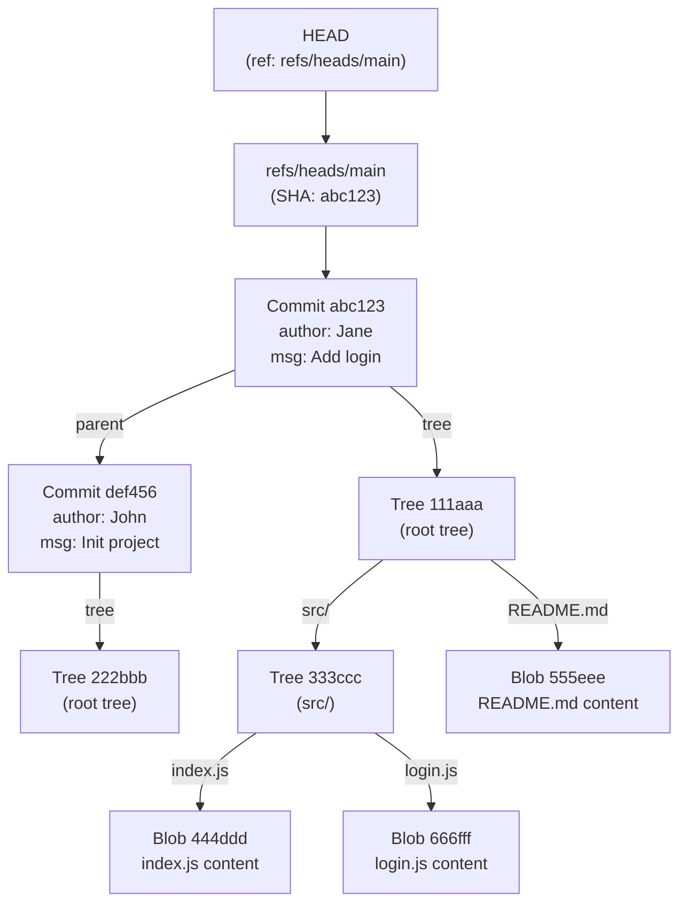
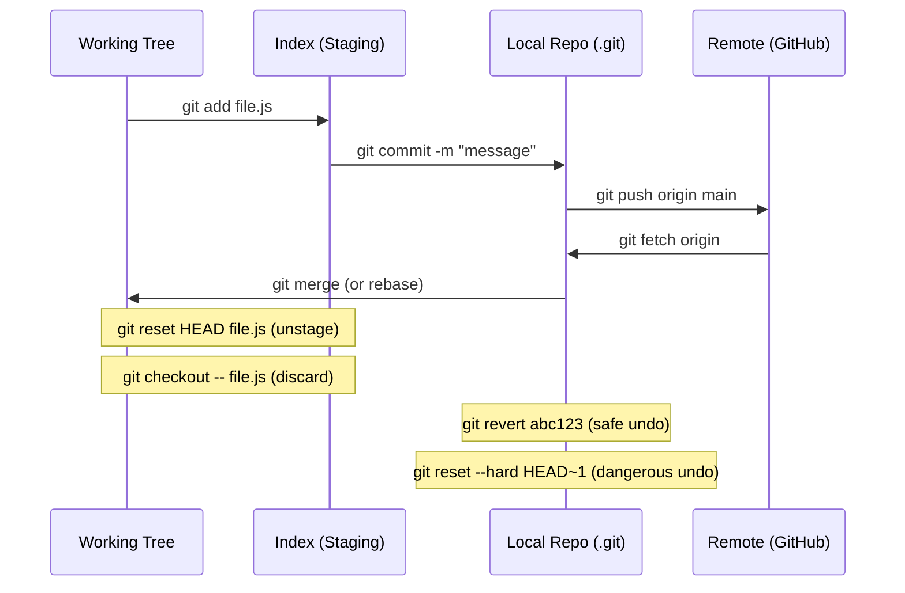

# Module 8: Git Internals

> **Phase:** 2 — Version Control | **Level:** Beginner → Expert | **Prerequisites:** Module 1 (Linux), Module 2 (Networking)

---

## Table of Contents

1. [Introduction](#1-introduction)
2. [Internal Backend Architecture](#2-internal-backend-architecture)
3. [Git Object Model](#3-git-object-model)
4. [Branching & Merging Internals](#4-branching--merging-internals)
5. [Remote Operations](#5-remote-operations)
6. [Advanced Git Internals](#6-advanced-git-internals)
7. [Diagrams](#7-diagrams)
8. [Implementation & Commands](#8-implementation--commands)
9. [Production Real-Time Issues](#9-production-real-time-issues)
10. [Observability](#10-observability)
11. [Security](#11-security)
12. [Scaling & Performance](#12-scaling--performance)
13. [Interview Questions](#13-interview-questions)
14. [Hands-On Labs](#14-hands-on-labs)

---

## 1. Introduction

### What is Git?

Git is a **distributed version control system** created by Linus Torvalds in 2005. It was built to manage the Linux kernel source code after the team lost access to BitKeeper (a proprietary VCS). Git is not just a tool — it is a **content-addressable filesystem** with a version control interface on top.

### Why Git was created

- BitKeeper (used for Linux kernel) revoked free license in 2005.
- Linus needed something faster, more reliable, and fully distributed.
- Built with these design goals:
  - Speed (operations in milliseconds)
  - Data integrity (SHA-1/SHA-256 hashing of every object)
  - Distributed (every clone is a full backup)
  - Non-linear development (thousands of parallel branches)

### What problem does Git solve?

| Problem | Git Solution |
|---|---|
| "Who changed this line and why?" | Every commit has author, timestamp, message |
| "The new release broke prod — roll back" | git revert / git reset |
| "Two engineers changed the same file" | Merge/rebase with conflict resolution |
| "We need a hotfix without including new features" | Branching model |
| "Our code repo was deleted" | Every clone is a full backup |
| "We need to experiment safely" | Branches are free and instant |

### Industry Adoption

- **96%+ of developers** use Git (Stack Overflow survey).
- GitHub: 420M+ repositories, 100M+ developers.
- GitLab, Bitbucket, Gitea all built on Git.
- Linux kernel, Android, Windows, Chrome — all use Git.

### Alternatives and why Git won

| Tool | Why Git replaced it |
|---|---|
| SVN (Subversion) | Centralized — offline work impossible, slow branching |
| CVS | Even older centralized, poor merge support |
| Mercurial (Hg) | Similar to Git but smaller community |
| Perforce | Expensive, proprietary, centralized |
| BitKeeper | Proprietary, trigger of Git's creation |

### When NOT to use Git

- **Very large binary files** (videos, game assets, ML models): use Git LFS or DVC.
- **Extremely large monorepos** (millions of files): consider Mercurial (Meta uses Sapling) or pijul.
- **Database schema versioning**: use Flyway/Liquibase alongside Git.

---

## 2. Internal Backend Architecture

### The .git Directory — Git's Complete State

```
.git/
├── HEAD                    # pointer to current branch (or commit in detached)
├── config                  # repository configuration
├── description             # used by GitWeb only
├── index                   # staging area (binary file)
├── packed-refs             # packed branches and tags
│
├── objects/                # content-addressable object store
│   ├── pack/               # packed objects (efficient storage)
│   │   ├── pack-abc123.idx # index for fast lookup
│   │   └── pack-abc123.pack # compressed objects
│   ├── 2f/                 # loose objects (first 2 chars of hash = dir)
│   │   └── 3a4b5c6d...    # full object stored here
│   ├── info/
│   └── ...
│
├── refs/                   # references (branches, tags)
│   ├── heads/              # local branches
│   │   ├── main            # contains commit SHA of branch tip
│   │   └── feature/login
│   ├── remotes/            # remote tracking branches
│   │   └── origin/
│   │       ├── main
│   │       └── HEAD
│   └── tags/               # tags
│       └── v1.0.0
│
├── logs/                   # reflog — history of HEAD movements
│   ├── HEAD
│   └── refs/heads/main
│
└── hooks/                  # scripts triggered by git events
    ├── pre-commit
    ├── commit-msg
    ├── pre-push
    └── post-receive
```

### How Git stores data — content addressability

```
Git does NOT store diffs. Git stores SNAPSHOTS.

Every object is:
  1. Content prefixed with type and size
  2. Compressed with zlib
  3. Named by SHA-1 hash of the compressed content

SHA-1 = 40 hex chars = 160 bits
Every unique content → unique SHA-1 (cryptographic guarantee)
Same content → same SHA-1 (deduplication automatic)

Example:
  echo "Hello, World!" | git hash-object --stdin
  → 8ab686eafeb1f44702738c8b0f24f2567c36da6d

  git cat-file -t 8ab686   # → blob
  git cat-file -p 8ab686   # → Hello, World!
```

---

## 3. Git Object Model

### Four Object Types

#### 1. BLOB — File Content

```
A blob stores raw file content. No filename, no metadata.
If two files have identical content → they share ONE blob.

Structure:
  "blob <size>\0<content>"
  Compressed with zlib → stored as .git/objects/<first2>/<remaining38>

Create manually:
  echo "Hello World" | git hash-object -w --stdin
  # -w writes to object store

Inspect:
  git cat-file -t <sha>      # type: blob
  git cat-file -p <sha>      # content
  git cat-file -s <sha>      # size in bytes
```

#### 2. TREE — Directory Structure

```
A tree stores directory contents: filenames, permissions, child trees/blobs.

Structure:
  "tree <size>\0"
  followed by entries:
  "<mode> <name>\0<20-byte-sha>"

Mode values:
  100644 — regular file
  100755 — executable file
  120000 — symbolic link
  040000 — directory (subtree)
  160000 — gitlink (submodule)

Example:
  git cat-file -p HEAD^{tree}
  040000 tree 3c4b5d... src
  100644 blob 8ab686... README.md
  100755 blob 2f3e4a... run.sh

Trees are recursive: a tree can point to other trees (subdirectories).
The root tree is the snapshot of the entire project at a point in time.
```

#### 3. COMMIT — Snapshot + Metadata

```
A commit stores:
  - Pointer to root tree (the project snapshot)
  - Parent commit SHA(s)
  - Author: name, email, timestamp
  - Committer: name, email, timestamp (may differ for rebased commits)
  - Commit message

Structure:
  "commit <size>\0"
  "tree <tree-sha>\n"
  "parent <parent-sha>\n"    (omitted for initial commit)
  "author <name> <email> <timestamp> <tz>\n"
  "committer <name> <email> <timestamp> <tz>\n"
  "\n"
  "<commit message>\n"

Example:
  git cat-file -p HEAD
  tree 8f3e2a...
  parent 7d2c1b...
  author Jane Doe <jane@example.com> 1703001600 +0530
  committer Jane Doe <jane@example.com> 1703001600 +0530

  Fix authentication bug in login handler

Merge commit has TWO parent lines:
  parent abc123...
  parent def456...

Initial commit has ZERO parent lines.
```

#### 4. TAG — Named Commit Pointer

```
Two types of tags:

Lightweight tag:
  Just a ref file pointing to a commit SHA.
  git tag v1.0                    # creates .git/refs/tags/v1.0

Annotated tag (creates a tag object):
  git tag -a v1.0 -m "Release 1.0"
  Creates a tag object with: tagger, date, message → points to commit
  git cat-file -p v1.0            # show tag object

Why annotated?
  - Has its own timestamp and message
  - Can be signed (GPG)
  - Included in git describe output
  - Recommended for releases
```

### The DAG — Directed Acyclic Graph

```
Git history is a DAG (Directed Acyclic Graph) of commits.
Each commit points to parent(s). No cycles possible.

Linear history:
  A ← B ← C ← D (HEAD, main)

Feature branch:
  A ← B ← C ← D (main)
               ↑
               E ← F (feature/login)

After merge:
  A ← B ← C ← D ← G (main, merge commit)
               ↑   ↑
               E ← F

After rebase (feature rebased onto main):
  A ← B ← C ← D ← E' ← F' (feature/login)
                ↑
               (main)

Note: E' and F' are NEW commits (different SHA than E, F)
      Rebase rewrites history — never rebase public/shared branches!
```

---

## 4. Branching & Merging Internals

### What a Branch Really Is

```
A branch is just a FILE containing a 40-character commit SHA.

cat .git/refs/heads/main
→ a3f2e1d4c8b7a9f0e2d1c3b4a5f6e7d8c9b0a1f2

That's it. Creating a branch:
  echo "a3f2e1..." > .git/refs/heads/feature-x
  OR: git branch feature-x

When you commit on a branch:
  1. New commit object created (points to parent = current HEAD)
  2. Branch file updated to new commit SHA
  3. HEAD still points to branch name

HEAD:
  cat .git/HEAD
  → ref: refs/heads/main       # attached HEAD (normal)
  → a3f2e1d4c8b7...            # detached HEAD (checked out commit directly)
```

### Merge Strategies

#### Fast-Forward Merge

```
Condition: target branch has no new commits since branch point.
No merge commit created — just moves the pointer forward.

Before:
  main: A ← B ← C
  feature:          C ← D ← E

After (git merge feature on main):
  main: A ← B ← C ← D ← E
  (HEAD just moved forward — no new commit)

Commands:
  git merge feature              # fast-forward if possible
  git merge --ff-only feature    # fail if not fast-forward possible
  git merge --no-ff feature      # always create merge commit
```

#### 3-Way Merge

```
Condition: both branches have diverged (new commits on both sides).
Git finds the merge base (common ancestor).
Compares: base → ours, base → theirs.
Creates a new merge commit.

Before:
  main:    A ← B ← C ← D
  feature: A ← B ← E ← F

Merge base: B

Changes:
  B → D: what main changed
  B → F: what feature changed
  
  If same lines changed differently → CONFLICT
  If different lines changed → auto-merged

Conflict markers:
  <<<<<<< HEAD (ours)
  const timeout = 5000;
  =======
  const timeout = 3000;
  >>>>>>> feature/login (theirs)

After resolving:
  git add <file>
  git merge --continue    # or: git commit

Merge commit:
  tree <merged-tree-sha>
  parent <D-sha>          # first parent = main tip
  parent <F-sha>          # second parent = feature tip
```

#### Rebase

```
Rebase replays commits from one branch on top of another.
Each commit becomes a NEW commit (new SHA, same changes).

Before:
  main:    A ← B ← C ← D
  feature: A ← B ← E ← F

git checkout feature
git rebase main

Process:
  1. Find merge base: B
  2. Save E and F as patches
  3. Reset feature to D (tip of main)
  4. Apply E → creates E' (same diff, new parent, new SHA)
  5. Apply F → creates F' (same diff, new parent, new SHA)

After:
  main:    A ← B ← C ← D
  feature:              D ← E' ← F'

Benefits of rebase:
  - Linear history (easier to read)
  - Each commit applies cleanly on top of main
  - git bisect works better

DANGER:
  Never rebase commits that have been pushed to shared remote.
  Others have built on E and F — you're rewriting history.
  They will have diverged history → force-push required → conflicts for everyone.

Interactive rebase (rewrite local history before pushing):
  git rebase -i HEAD~5           # interactive: last 5 commits
  # Options: pick, reword, edit, squash, fixup, drop, reorder
```

### Cherry-Pick

```
Apply a specific commit from one branch to another.
Creates a new commit (new SHA) with same changes.

git checkout main
git cherry-pick abc123          # apply commit abc123 to main

Use cases:
  - Hotfix: fix bug on main, cherry-pick to release branch
  - Partial feature: apply just one commit from a feature branch
  - Backport: apply fix to older release branch

Range:
  git cherry-pick abc123..def456  # apply a range of commits

Abort:
  git cherry-pick --abort
```

---

## 5. Remote Operations

### Remote Tracking and fetch/push/pull

```
Remote:
  git remote add origin git@github.com:org/repo.git
  cat .git/config
  [remote "origin"]
      url = git@github.com:org/repo.git
      fetch = +refs/heads/*:refs/remotes/origin/*

Remote tracking branches:
  .git/refs/remotes/origin/main   # local copy of remote's main
  Updated only on: git fetch

git fetch:
  1. Connect to remote (SSH or HTTPS)
  2. List remote refs (branches, tags)
  3. Download missing objects
  4. Update refs/remotes/origin/*
  Does NOT touch local branches or working tree.

git pull:
  = git fetch + git merge (or git rebase if pull.rebase=true)
  git pull --rebase origin main   # fetch + rebase (cleaner history)

git push:
  1. Connect to remote
  2. Tell remote: "I want to update refs/heads/main to <sha>"
  3. Remote checks: is your new SHA ahead of current? (fast-forward)
  4. Send missing objects
  5. Remote updates its ref

Force push (dangerous):
  git push --force-with-lease    # safer: fails if remote has new commits
  git push --force               # dangerous: overwrites without checking
  Only acceptable: private branch, never shared/main/master

Tracking relationship:
  git branch --set-upstream-to=origin/main main
  git branch -vv                  # show tracking relationships
```

### Git Transfer Protocols

```
HTTPS:
  URL: https://github.com/org/repo.git
  Authentication: username/password or token (stored in credential helper)
  Port: 443
  Protocol: Smart HTTP — two-phase: discovery then pack transfer

SSH:
  URL: git@github.com:org/repo.git
  Authentication: SSH key pair (private key local, public on GitHub)
  Port: 22
  Protocol: git-receive-pack / git-upload-pack over SSH tunnel

SSH flow:
  git push origin main
  → ssh -p 22 git@github.com
  → SSH handshake + key auth
  → git-receive-pack 'org/repo.git'
  → pack negotiation (what does remote have?)
  → send packfile with new objects
  → remote updates refs

Git protocol (fast, unauthenticated — read-only CDN use):
  URL: git://github.com/org/repo.git
  Port: 9418 (rarely used today)

Pack format:
  git send-pack sends a "packfile" — all needed objects compressed together
  Reference discovery: remote lists its refs
  Negotiation: client says "I have X, you need Y, please send Z"
  Efficient: only missing objects transferred
```

---

## 6. Advanced Git Internals

### The Index (Staging Area)

```
The index (.git/index) is a binary file representing the "next commit".
It's a sorted list of:
  - file path
  - mode (permissions)
  - blob SHA
  - stat data (mtime, ctime, size — for fast dirty detection)

Three states:
  Working tree → (git add) → Index → (git commit) → Repository

git status comparison:
  Index vs HEAD: "Changes to be committed" (staged)
  Working tree vs Index: "Changes not staged" (modified, unstaged)
  Files only in working tree: "Untracked files"

Why index matters:
  - You can stage partial changes: git add -p (patch mode)
  - Stage one file version and keep working tree different
  - Stage file deletions, renames separately

Read the index:
  git ls-files --stage           # list indexed files with SHA
  git diff --cached              # diff between index and HEAD
  git diff                       # diff between working tree and index
```

### Git Garbage Collection

```
Over time:
  - Loose objects accumulate (one file per object)
  - Unreachable objects from deleted branches, rebases
  - Many small objects → slow

git gc:
  1. Packs loose objects into pack files
  2. Removes unreachable objects (after 2-week grace period)
  3. Repacks existing packs
  4. Updates commit-graph (for faster graph traversal)

git gc --auto:
  Run automatically when loose object count exceeds threshold
  Default: gc.auto=6700 loose objects

git prune:
  Remove unreachable objects immediately
  Normally don't run manually — gc handles it

Packfile format:
  .pack file: variable-length records, delta-compressed
  .idx file: sorted SHA index for O(log n) lookup
  
  Delta compression:
    git stores similar objects as: base_object + delta
    Example: version 1 of file as base, version 2 as delta
    Result: very efficient storage for multiple versions of same file

git repack -adf:
  Full repack: all objects into one pack, aggressive delta
  Used on servers with many small packs (after many pushes)
```

### Reflog — Your Safety Net

```
Reflog records every movement of HEAD and branch tips.
Commits are NEVER immediately deleted after reset/rebase — reflog saves them.

git reflog                     # full reflog
git reflog show main           # reflog for main branch

Output:
  a3f2e1d HEAD@{0}: commit: Add login feature
  7c8b9d2 HEAD@{1}: reset: moving to HEAD~1
  a3f2e1d HEAD@{2}: commit: Add login feature
  5e6f7g8 HEAD@{3}: checkout: moving from feature to main

Recovery scenarios:
  # Accidentally reset and lost commits:
  git reset --hard HEAD@{2}    # go back to where you were

  # Deleted branch and lost commits:
  git reflog | grep "feature-x"  # find last commit on deleted branch
  git checkout -b feature-x <sha>  # recreate branch

  # Reflog retention:
  gc.reflogExpire=90 days (default)
  gc.reflogExpireUnreachable=30 days
```

### Git Hooks

```
Hooks = scripts in .git/hooks/ that run at specific Git events.
Not committed to repo (local only) — unless using tools like pre-commit.

Client-side hooks:
  pre-commit      — runs before commit message editor
                   Exit non-zero → commit aborted
                   Use: linting, tests, formatting
                   
  commit-msg      — runs after commit message written
                   Receives: path to commit message file
                   Use: enforce message format (Conventional Commits)
                   
  pre-push        — runs before push
                   Exit non-zero → push aborted
                   Use: run tests before pushing

  post-checkout   — after checkout/switch
  post-merge      — after merge
  pre-rebase      — before rebase

Server-side hooks (in bare repository):
  pre-receive     — before any ref is updated
                   Use: enforce branch policies, block force-push
                   
  update          — for each ref being updated
                   Use: per-branch policies
                   
  post-receive    — after all refs updated
                   Use: trigger CI/CD, send notifications, deploy

Example pre-commit hook:
  #!/bin/sh
  # Prevent committing to main directly
  branch=$(git rev-parse --abbrev-ref HEAD)
  if [ "$branch" = "main" ]; then
    echo "ERROR: Direct commits to main are not allowed"
    exit 1
  fi
  
  # Run linter
  npm run lint
  if [ $? -ne 0 ]; then
    echo "ERROR: Linting failed"
    exit 1
  fi

Make executable:
  chmod +x .git/hooks/pre-commit

Sharing hooks (use pre-commit framework):
  pip install pre-commit
  # .pre-commit-config.yaml in repo root
  pre-commit install            # installs hook
  pre-commit run --all-files    # run manually
```

### Submodules and Worktrees

```
Git Submodules:
  A repo within a repo.
  .gitmodules file tracks: path and URL for each submodule
  Parent repo stores: just the commit SHA of the submodule

  git submodule add https://github.com/org/lib.git libs/mylib
  git submodule update --init --recursive
  
  Pitfalls:
    - Submodule is pinned to a specific SHA
    - Must manually update: git submodule update --remote
    - Developers often forget to init submodules after clone
    - Clone with submodules: git clone --recurse-submodules <url>

Git Worktrees:
  Check out multiple branches simultaneously in separate directories.
  One .git directory, multiple working trees.
  
  git worktree add ../hotfix-branch hotfix/2.0.1
  # Now: ../hotfix-branch has the hotfix branch checked out
  # While current dir still has main
  
  Use cases:
    - Work on hotfix while keeping feature branch open
    - Build multiple versions simultaneously
    - Review PRs without stashing
  
  git worktree list
  git worktree remove ../hotfix-branch
```

---

## 7. Diagrams

### Mermaid: Git Object Graph



### Mermaid: Branching and Merging


### Mermaid: Git Data Flow



### ASCII: .git Directory Structure

```
.git/
├── HEAD          ──→ "ref: refs/heads/main"
├── index         ──→ binary staging area
├── config        ──→ [core] [remote "origin"] [branch "main"]
│
├── objects/
│   ├── ab/
│   │   └── cdef1234...  (blob, tree, commit, or tag)
│   └── pack/
│       ├── pack-xxx.pack  (compressed objects)
│       └── pack-xxx.idx   (hash index)
│
└── refs/
    ├── heads/
    │   ├── main           ──→ "abc123def456..."
    │   └── feature/login  ──→ "789abcdef012..."
    ├── remotes/
    │   └── origin/
    │       └── main       ──→ "abc123def456..."
    └── tags/
        └── v1.0.0         ──→ "tag-sha or commit-sha"
```

---

## 8. Implementation & Commands

### Daily Workflow Commands

```bash
#─────────────────────────────────────────────
# SETUP
#─────────────────────────────────────────────
git config --global user.name "Jane Doe"
git config --global user.email "jane@example.com"
git config --global core.editor "vim"
git config --global pull.rebase true              # rebase instead of merge on pull
git config --global init.defaultBranch main       # default branch name
git config --global core.autocrlf input           # LF on commit (Linux/Mac)
git config --list --show-origin                   # show all config + source file

#─────────────────────────────────────────────
# INSPECTION
#─────────────────────────────────────────────
git log --oneline --graph --all --decorate        # visual branch history
git log --oneline -20                             # last 20 commits, compact
git log --author="Jane" --since="1 week ago"      # filter commits
git log -p filename                               # changes to specific file
git log --follow -p filename                      # follow renames
git blame filename                                # line-by-line authorship
git blame -L 10,20 filename                       # blame specific lines
git show HEAD                                     # show last commit + diff
git show abc123                                   # show specific commit
git diff                                          # unstaged changes
git diff --staged                                 # staged changes (vs HEAD)
git diff main..feature                            # between two branches
git diff HEAD~3 HEAD -- file.js                  # file changes over 3 commits
git status -s                                     # compact status

#─────────────────────────────────────────────
# STAGING AND COMMITTING
#─────────────────────────────────────────────
git add -p                                        # interactive staging (hunks)
git add -u                                        # stage all modified/deleted (not new)
git add .                                         # stage everything

git commit -m "feat: add login endpoint"
git commit --amend                                # modify last commit (before push!)
git commit --amend --no-edit                      # amend without changing message

# Conventional Commits format (recommended):
# type(scope): description
# Types: feat, fix, docs, style, refactor, perf, test, chore, ci
git commit -m "feat(auth): add JWT token validation"
git commit -m "fix(api): handle null user in login endpoint"
git commit -m "chore(deps): bump express to 4.18.2"

#─────────────────────────────────────────────
# BRANCHING
#─────────────────────────────────────────────
git branch                                        # list local branches
git branch -a                                     # list all (including remote)
git branch -v                                     # list with last commit
git branch -vv                                    # list with tracking info

git checkout -b feature/login                     # create + switch
git switch -c feature/login                       # modern syntax (git 2.23+)
git switch main                                   # switch branch

git branch -d feature/login                       # delete (merged only)
git branch -D feature/login                       # force delete

git branch -m old-name new-name                   # rename

#─────────────────────────────────────────────
# MERGING AND REBASING
#─────────────────────────────────────────────
git merge feature/login                           # merge into current branch
git merge --no-ff feature/login                  # always create merge commit
git merge --squash feature/login                  # squash all commits, then commit

git rebase main                                   # rebase current branch onto main
git rebase -i HEAD~5                              # interactive rebase last 5 commits
git rebase --abort                                # cancel rebase
git rebase --continue                             # after resolving conflict

git cherry-pick abc123                            # apply specific commit
git cherry-pick abc123..def456                    # apply range

#─────────────────────────────────────────────
# UNDOING CHANGES
#─────────────────────────────────────────────
# Staged changes:
git restore --staged file.js                      # unstage (keep working tree changes)
git reset HEAD file.js                            # older syntax

# Working tree changes:
git restore file.js                               # discard changes (PERMANENT)
git checkout -- file.js                           # older syntax

# Commits (safe — creates new commit):
git revert HEAD                                   # revert last commit
git revert abc123                                 # revert specific commit
git revert abc123..def456                         # revert range

# Commits (rewrites history — local only!):
git reset --soft HEAD~1       # undo commit, keep changes staged
git reset --mixed HEAD~1      # undo commit, keep changes unstaged (default)
git reset --hard HEAD~1       # undo commit, DISCARD ALL CHANGES (DANGEROUS)

# Stashing:
git stash                                         # save changes temporarily
git stash push -m "WIP: login feature"           # with description
git stash list                                    # show stashes
git stash pop                                     # apply + remove stash
git stash apply stash@{2}                         # apply specific stash
git stash branch feature/new stash@{0}           # create branch from stash
git stash drop stash@{0}                          # delete stash
git stash clear                                   # delete all stashes

#─────────────────────────────────────────────
# REMOTE
#─────────────────────────────────────────────
git remote -v                                     # list remotes
git remote add upstream https://github.com/orig/repo.git  # fork workflow
git fetch --all                                   # fetch all remotes
git fetch origin --prune                          # fetch + remove deleted remote branches

git push origin feature/login                     # push branch
git push -u origin feature/login                  # push + set tracking
git push --force-with-lease origin feature/login  # safe force push
git push origin --delete feature/login            # delete remote branch
git push origin --tags                            # push all tags

git pull origin main                              # fetch + merge
git pull --rebase origin main                     # fetch + rebase (cleaner)

#─────────────────────────────────────────────
# TAGS
#─────────────────────────────────────────────
git tag                                           # list tags
git tag v1.0.0                                   # lightweight tag
git tag -a v1.0.0 -m "Release 1.0.0"            # annotated tag
git tag -a v1.0.0 abc123 -m "Tag old commit"    # tag specific commit
git push origin v1.0.0                           # push single tag
git push origin --tags                            # push all tags
git tag -d v1.0.0                                # delete local tag
git push origin --delete v1.0.0                  # delete remote tag

#─────────────────────────────────────────────
# SEARCHING
#─────────────────────────────────────────────
git grep "pattern"                                # search in tracked files (fast)
git grep -n "TODO"                                # with line numbers
git log --all -S "function login"                 # find when string added/removed
git log --all -G "regex.*pattern"                # find when regex changed
git log --all --grep="bug fix"                    # search commit messages
git bisect start                                  # binary search for bug-introducing commit
git bisect bad HEAD                               # mark current as bad
git bisect good v1.0.0                           # mark known-good
# Git will checkout middle commit for you to test
git bisect good/bad                               # repeat until found
git bisect reset                                  # end bisect
```

### Production Git Workflow (GitFlow simplified)

```bash
# Branch naming conventions:
# main          — production code
# develop       — integration branch
# feature/*     — new features
# fix/*         — bug fixes
# hotfix/*      — emergency production fixes
# release/*     — release preparation

# Feature development:
git switch develop
git pull --rebase origin develop
git switch -c feature/TICKET-123-user-authentication
# ... code ...
git add -p                                        # review what you're staging
git commit -m "feat(auth): add JWT middleware"
git push -u origin feature/TICKET-123-user-authentication
# Open Pull Request

# Hotfix (emergency fix to production):
git switch main
git pull --rebase origin main
git switch -c hotfix/fix-null-pointer-crash
# ... fix ...
git commit -m "fix: handle null session in auth middleware"
git push -u origin hotfix/fix-null-pointer-crash
# PR → merge to main AND develop

# Squash and merge (clean main history):
git switch main
git merge --squash hotfix/fix-null-pointer-crash
git commit -m "fix: handle null session in auth middleware (#456)"
```

---

## 9. Production Real-Time Issues

### Issue 1: Merge Conflict Hell

```
Symptoms:
  Multiple developers working on same files
  Frequent, complex merge conflicts
  "I can't push — rejected"

Root cause:
  Long-lived branches diverging from main
  No consistent code ownership
  Missing automated conflict prevention

Diagnosis:
  git diff --name-only main...feature     # files changed on feature vs main
  git log --oneline main..feature | wc -l  # how many commits behind?
  git log --oneline feature..main | wc -l  # how much has main moved?

Fix:
  # Update feature branch regularly:
  git fetch origin
  git rebase origin/main   # replay feature commits on updated main
  
  # If conflict during rebase:
  # Edit conflicted files → git add → git rebase --continue
  
  # Use rerere (remember conflict resolutions):
  git config --global rerere.enabled true
  # Next time same conflict occurs, Git auto-resolves it

Prevention:
  - Short-lived branches (< 2 days)
  - Merge main into feature daily via rebase
  - Clear code ownership (CODEOWNERS file)
  - Feature flags instead of long-lived branches
```

### Issue 2: Accidentally Committed Secrets

```
Symptoms:
  API key / password committed to repo
  GitHub shows "We found a secret in your push" warning

Diagnosis:
  git log --all -S "SECRET_KEY"
  git log --all --full-history -- path/to/file

Fix (remove from ALL history):
  # Option 1: git-filter-repo (recommended)
  pip install git-filter-repo
  git filter-repo --path credentials.txt --invert-paths
  git filter-repo --replace-text expressions.txt   # replace specific strings
  
  # Option 2: BFG Repo Cleaner (Java)
  java -jar bfg.jar --delete-files credentials.txt
  java -jar bfg.jar --replace-text passwords.txt
  
  # After rewriting history:
  git push origin --force --all
  git push origin --force --tags
  
  # CRITICAL: Rotate the secret immediately!
  # All old commits visible until GitHub GC (24-48 hours)
  # If repo is public: assume secret is compromised immediately

Prevention:
  - .gitignore for .env, *.key, *.pem, credentials.*
  - pre-commit hook with secret scanning
  - git-secrets or truffleHog in CI
  - GitHub secret scanning enabled
  - Use secret management: HashiCorp Vault, AWS Secrets Manager
```

### Issue 3: Repository Performance Issues

```
Symptoms:
  git status takes > 10 seconds
  git fetch is very slow
  .git/objects is gigabytes

Diagnosis:
  du -sh .git                       # total git size
  du -sh .git/objects               # object store size
  git count-objects -vH             # object count + size
  git verify-pack -v .git/objects/pack/pack-*.idx | sort -k3 -n | tail -10  # largest objects

Root causes:
  - Large binary files committed
  - Build artifacts committed
  - Many loose objects (need gc)

Fix:
  # Run GC
  git gc --aggressive --prune=now
  git repack -adf
  
  # Find and remove large files from history:
  git filter-repo --strip-blobs-bigger-than 10M
  
  # Enable Git LFS for large files going forward:
  git lfs install
  git lfs track "*.psd" "*.zip" "*.mp4"
  git add .gitattributes
  
  # Enable fsmonitor for faster status:
  git config core.fsmonitor true
  git config core.untrackedcache true

Prevention:
  - .gitignore: node_modules/, dist/, *.jar, *.war
  - Git LFS for binary assets
  - Pre-commit hook blocking files > 1MB
  - Commit graph for faster history traversal:
    git commit-graph write --reachable
```

### Issue 4: Detached HEAD State

```
Symptoms:
  git status shows: "HEAD detached at abc123"
  New commits "lost" after checkout

What happened:
  git checkout abc123          # checked out a commit, not a branch
  git checkout origin/main     # checked out remote tracking (not local branch)
  
  In detached HEAD: new commits have no branch pointing to them
  After checkout to another branch: commits appear "lost"

Fix:
  # Recover lost commits (they're in reflog for 90 days):
  git reflog                   # find your commit SHA
  git branch recovered-work <sha>   # create branch pointing to it
  
  # Or if you're still in detached HEAD:
  git checkout -b my-work      # create branch before losing commits

Prevention:
  Always work on a branch.
  If exploring old commits: git checkout -b exploration abc123
```

---

## 10. Observability

### Repository Health Checks

```bash
# Object store health
git fsck                                # check for corruption
git fsck --unreachable                  # show unreachable objects
git count-objects -vH                   # count and size

# History analysis
git log --oneline --all | wc -l         # total commit count
git shortlog -sn                        # commits per author
git log --since="30 days ago" --oneline | wc -l  # recent activity

# Branch health
git branch -a --sort=-committerdate | head -20   # recently active branches
git branch --merged main | grep -v main  # merged branches (safe to delete)
git branch --no-merged main              # unmerged branches

# Large file detection
git rev-list --all --objects | \
  git cat-file --batch-check='%(objecttype) %(objectname) %(objectsize) %(rest)' | \
  sort -k3 -rn | head -20

# Find branches with no recent activity (>30 days)
git for-each-ref --sort=-committerdate refs/heads \
  --format='%(committerdate:short) %(refname:short)' | \
  awk '$1 < "'$(date -d '30 days ago' +%Y-%m-%d)'"'
```

---

## 11. Security

### Signing Commits and Tags

```bash
# GPG commit signing (proves identity, prevents author spoofing)
gpg --gen-key
gpg --list-secret-keys --keyid-format LONG
git config --global user.signingkey <GPG-KEY-ID>
git config --global commit.gpgsign true           # sign all commits

git commit -S -m "feat: signed commit"           # sign single commit
git tag -s v1.0.0 -m "Signed release"           # sign tag

# Verify signatures
git log --show-signature
git verify-commit abc123
git verify-tag v1.0.0

# SSH commit signing (Git 2.34+ — easier than GPG)
git config --global gpg.format ssh
git config --global user.signingkey ~/.ssh/id_ed25519.pub
git config --global commit.gpgsign true
```

### Protected Branches and CODEOWNERS

```
# GitHub/GitLab branch protection rules:
  - Require pull requests (no direct push to main)
  - Require N approvals
  - Require status checks (CI must pass)
  - Require signed commits
  - Restrict who can push
  - Block force pushes

# CODEOWNERS file (GitHub/GitLab):
# .github/CODEOWNERS or CODEOWNERS

# Global owners
*                   @org/core-team

# Frontend
src/frontend/       @org/frontend-team
*.css               @user/css-specialist

# Infrastructure
*.tf                @org/infra-team
.github/workflows/  @org/devops-team
Dockerfile          @org/devops-team

# Docs
docs/               @org/docs-team
```

### .gitignore Best Practices

```gitignore
# .gitignore — never commit these

# Secrets and credentials
.env
.env.*
*.pem
*.key
*.p12
credentials.json
*secret*
*password*

# Build artifacts
dist/
build/
target/
*.class
*.jar
*.war

# Dependencies
node_modules/
vendor/
.venv/
__pycache__/

# IDE
.idea/
.vscode/
*.swp
.DS_Store
Thumbs.db

# Logs
*.log
logs/

# OS
.DS_Store
Thumbs.db
desktop.ini

# Test coverage
coverage/
.nyc_output/

# Language-specific (Node)
npm-debug.log*
yarn-error.log
.npm
```

---

## 12. Scaling & Performance

### Monorepo Strategies

```
Monorepo = multiple projects/services in one Git repository.
Used by: Google, Meta, Twitter, Airbnb, Uber.

Challenges:
  - Repository size (Google's is 86TB)
  - Slow git operations (status, fetch)
  - Too many files in working tree

Solutions:

Sparse checkout (only check out what you need):
  git clone --filter=blob:none --sparse <url>
  git sparse-checkout set path/to/service
  git sparse-checkout add another/path

Partial clone (don't download all objects):
  git clone --filter=blob:none <url>     # skip blobs on clone
  git clone --filter=tree:0 <url>        # skip trees (very shallow)
  Objects downloaded on demand.

Shallow clone (for CI — don't need full history):
  git clone --depth=1 <url>              # only latest commit
  git clone --depth=50 --branch main <url>  # last 50 commits

commit-graph (faster history traversal):
  git commit-graph write --reachable
  git config fetch.writeCommitGraph true

fsmonitor (faster working tree status):
  git config core.fsmonitor true
  git config core.untrackedcache true

Tools for large monorepos:
  - Sapling (Meta's open-source Mercurial fork)
  - Pants, Bazel (build tools aware of monorepo)
  - git-cinnabar (Mozilla)
  - VFS for Git (Microsoft — used for Windows repo)
```

---

## 13. Interview Questions

### Beginner

**Q1: What is the difference between `git fetch` and `git pull`?**

```
git fetch:
  Downloads objects and refs from remote.
  Updates refs/remotes/origin/* (remote tracking branches).
  Does NOT modify your working tree or local branches.
  Safe to run anytime.

git pull:
  = git fetch + git merge (by default)
  OR = git fetch + git rebase (if pull.rebase=true)
  Modifies your current branch and working tree.
  Can cause merge conflicts.

Best practice:
  Use git fetch + git rebase:
    git fetch origin
    git rebase origin/main
  
  Or: git pull --rebase origin main

Why it matters:
  git pull with merge creates unnecessary merge commits.
  "Rebase then push" keeps history linear and clean.
```

**Q2: Explain `git reset --soft`, `--mixed`, and `--hard`.**

```
All three move the HEAD (and branch tip) to a specified commit.
They differ in what happens to the index and working tree.

--soft HEAD~1:
  HEAD moves to previous commit.
  Index unchanged (changes remain staged).
  Working tree unchanged.
  Effect: "undo commit, keep changes staged, ready to recommit"
  Use: made wrong commit message, want to recommit

--mixed HEAD~1 (DEFAULT):
  HEAD moves to previous commit.
  Index reset to that commit (changes become unstaged).
  Working tree unchanged.
  Effect: "undo commit + unstage, but keep changes in working tree"
  Use: committed too much, want to re-stage selectively

--hard HEAD~1:
  HEAD moves to previous commit.
  Index reset.
  Working tree reset. CHANGES ARE DISCARDED.
  Effect: "completely undo commit + all its changes"
  Use: throw away a bad commit entirely
  WARNING: lost changes recoverable only via reflog within 90 days

Memory aid: soft=fewest changes, hard=most changes
```

### Intermediate

**Q3: What is git rebase and when would you NOT use it?**

```
Rebase replays commits from the current branch on top of another branch.
Each commit is recreated with a new SHA.
Result: linear history (no merge commits).

When NOT to use rebase:
  1. Never rebase public/shared branches.
     If others have cloned or branched from your branch,
     rebase creates divergent history.
     They'll need to force-pull or re-clone.
     Golden rule: "Never rebase after push (to shared branches)"
  
  2. When you want to preserve exact merge history.
     Merges in history show the actual integration points.
     Rebase rewrites to appear as if everything was sequential.
  
  3. Very complex conflict-heavy rebases.
     Each conflicting commit must be resolved individually.
     Merge conflicts happen once, rebase conflicts can happen per commit.

When TO use rebase:
  - Local feature branches (before pushing)
  - Keeping feature branch up-to-date: git rebase origin/main
  - Interactive rebase to clean up local commits: git rebase -i HEAD~5
  - Squash many small commits into clean logical commits
```

**Q4: How does `git bisect` work and when would you use it?**

```
git bisect performs binary search through commit history to find
which commit introduced a bug.

How it works:
  You mark: one good commit (bug didn't exist) and one bad commit (bug exists).
  Git checks out the middle commit.
  You test and mark good/bad.
  Git narrows search by half each time.
  O(log N) commits to test — find bug in 10 tests for 1000 commits.

Usage:
  git bisect start
  git bisect bad HEAD             # current commit is bad
  git bisect good v2.0.0          # v2.0.0 was good
  # Git checks out middle commit
  # Run your test
  git bisect good                 # OR
  git bisect bad
  # Repeat until: "abc123 is the first bad commit"
  git bisect reset                # return to HEAD

Automation:
  git bisect start HEAD v2.0.0
  git bisect run ./test.sh        # automatically runs script
  # Script exits 0=good, 1-127=bad (125=skip)

Use when:
  - "This worked in last release but not now"
  - Large codebases where reading all commits is impractical
  - Regression bugs with clear good/bad state
```

### Advanced

**Q5: Walk me through what happens internally when you run `git commit`.**

```
1. git reads the index (.git/index)
   Finds all staged files with their blob SHAs.

2. Creates tree objects:
   For each staged directory: creates a tree object.
   Root tree: points to all staged files and subdirectory trees.
   All trees written to .git/objects/

3. Creates commit object:
   Content: "tree <root-tree-sha>\nparent <HEAD-sha>\nauthor...\ncommitter...\n\n<message>"
   Zlib-compressed.
   Named by SHA-1 of compressed content.
   Written to .git/objects/

4. Updates branch ref:
   Reads HEAD → "ref: refs/heads/main"
   Writes new commit SHA to .git/refs/heads/main

5. Updates reflog:
   Appends to .git/logs/refs/heads/main and .git/logs/HEAD

6. Runs post-commit hook (if exists)

Result: new commit with new SHA, branch pointing to it.
Working tree and index unchanged (they match the new commit).

Why this matters for DevOps:
  Understanding this explains:
  - Why git commit is instant (no network)
  - Why two identical commits have different SHAs (timestamps differ)
  - Why rebase changes SHAs (committer timestamp changes)
  - Why git is fast (hashing + compression is local)
```

**Q6: Explain Git's packfile format and delta compression.**

```
Loose objects:
  Initially, every git object = one file in .git/objects/
  Inefficient: millions of files, no compression across files

Packfile:
  git gc or automatic trigger packs loose objects.
  Pack = many objects in one file, with delta compression.

Delta compression:
  Objects are stored as: base object + list of changes
  
  Example: file with 10000 lines, one line changed:
    Store: original file (base)
    Store: "at offset 500, replace 20 bytes with 25 bytes <new content>"
    Much smaller than storing entire file twice.
  
  Git is smart: base can be ANY similar object — even newer versions!
  (stored delta can point to a "future" base for better compression)
  
  Similar blobs in history → huge space savings.

Packfile format:
  PACK header: 4-byte magic, version, num objects
  For each object:
    - Type (blob/tree/commit/tag/ofs_delta/ref_delta)
    - Uncompressed size (variable-length encoding)
    - Delta base reference (for delta types)
    - Zlib-compressed data
  SHA-1 checksum at end

.idx file:
  Index into .pack file for O(log n) SHA lookup.
  4 layers: fan-out table, sorted SHAs, CRC32, offsets.

Why it matters:
  Packfiles are why git repositories are so compact.
  Linux kernel: 70k files, 1M commits, ~4GB packed (vs ~40GB uncompressed).
```

### Scenario Questions

**Q7: A developer accidentally force-pushed to main and erased the last 20 commits. What do you do?**

```
Don't panic. Objects remain in any clone's reflog for 90 days.

Step 1: Find the lost commits.
  # From any developer who had the up-to-date main:
  git reflog show origin/main        # if they did git fetch recently
  git log --all --oneline | head -30  # see all commits in their local repo
  
  # Or from a developer's local main before they pulled:
  git log main --oneline | head -5   # find last good SHA

Step 2: Recover.
  # Option A: recover from another developer's clone
  git remote add colleague git@github.com:colleague/repo.git
  git fetch colleague
  git log colleague/main             # verify correct history
  git push --force-with-lease origin colleague/main:main
  
  # Option B: if you have reflog on a recent clone
  git reflog | grep "origin/main"
  git push --force-with-lease origin <sha>:main

Step 3: Prevention.
  # Enable branch protection rules:
  - Disallow force push to main
  - Require PR + review
  - Keep at least 1 signed commit
  
  # Server-side hook:
  # pre-receive: reject force push to protected branches

Lesson:
  "Every push is safe if you can recover from any push."
  Always: branch protection, regular backups (bundle), multiple clones.
```

---

## 14. Hands-On Labs

### Lab 1: Beginner — Git Object Exploration

```bash
# Objective: understand Git's object model

mkdir git-internals-lab && cd git-internals-lab
git init

# Create first commit
echo "Hello World" > README.md
git add README.md
git commit -m "Initial commit"

# Inspect objects
find .git/objects -type f | sort   # see all objects

# Get the commit SHA
COMMIT=$(git rev-parse HEAD)
echo "Commit SHA: $COMMIT"
git cat-file -t $COMMIT            # type: commit
git cat-file -p $COMMIT            # commit content

# Get the tree SHA
TREE=$(git cat-file -p $COMMIT | grep tree | awk '{print $2}')
git cat-file -t $TREE              # type: tree
git cat-file -p $TREE              # tree content

# Get the blob SHA
BLOB=$(git cat-file -p $TREE | awk '{print $3}')
git cat-file -t $BLOB              # type: blob
git cat-file -p $BLOB              # blob content: Hello World

# Read the branch ref
cat .git/HEAD                      # ref: refs/heads/main
cat .git/refs/heads/main           # the commit SHA

# Verify they match
echo "Same SHA? $(git rev-parse HEAD) = $(cat .git/refs/heads/main)"
```

### Lab 2: Intermediate — Branching, Conflicts, and Rebase

```bash
# Objective: practice branching, create conflict, resolve

mkdir branch-lab && cd branch-lab
git init

# Setup
echo "Line 1
Line 2
Line 3" > file.txt
git add . && git commit -m "Initial"

# Create feature branch
git checkout -b feature/update
echo "Line 1
Line 2 MODIFIED BY FEATURE
Line 3" > file.txt
git commit -am "Feature: modify line 2"

# Modify main
git checkout main
echo "Line 1 MODIFIED BY MAIN
Line 2
Line 3" > file.txt
git commit -am "Main: modify line 1"

# Attempt merge — conflict!
git merge feature/update
# See conflict markers in file.txt
cat file.txt

# Resolve manually
echo "Line 1 MODIFIED BY MAIN
Line 2 MODIFIED BY FEATURE
Line 3" > file.txt
git add file.txt
git commit -m "Merge: combine both changes"

# View history
git log --oneline --graph --all

# Now try rebase approach (on clean slate)
git checkout feature/update
git log --oneline

# Interactive rebase to clean up commits
git rebase -i main
# In editor: squash commits if multiple, reword message
# resolve conflicts if needed
git log --oneline --graph --all
```

### Lab 3: Advanced — Recover Lost Work with Reflog

```bash
# Objective: simulate disaster, recover with reflog

mkdir reflog-lab && cd reflog-lab
git init

# Create some commits
for i in 1 2 3 4 5; do
  echo "Commit $i content" > file$i.txt
  git add . && git commit -m "Add file$i"
done

git log --oneline

# "Disaster": accidentally reset --hard 3 commits back
git reset --hard HEAD~3
git log --oneline   # 3 commits appear lost!

echo "Commits look lost..."
ls                   # only file1.txt and file2.txt visible

# Recovery using reflog
git reflog           # see all HEAD movements
GOOD_SHA=$(git reflog | grep "commit: Add file5" | head -1 | awk '{print $1}')
echo "Recovering to: $GOOD_SHA"

git reset --hard $GOOD_SHA    # restore!
git log --oneline             # all 5 commits back
ls                            # all files back

echo "Recovery successful!"
```

### Lab 4: Production — Set Up Git Hooks and GPG Signing

```bash
# Objective: set up pre-commit hook + conventional commit enforcement

mkdir hooks-lab && cd hooks-lab
git init

# Create pre-commit hook (lint check simulation)
cat > .git/hooks/pre-commit << 'EOF'
#!/bin/sh
# Check for debug statements
if git diff --cached --name-only | xargs grep -l "console.log\|debugger\|TODO:" 2>/dev/null; then
  echo "ERROR: Found debug statements or TODOs in staged files"
  echo "Please remove them before committing"
  exit 1
fi
echo "Pre-commit checks passed"
exit 0
EOF
chmod +x .git/hooks/pre-commit

# Create commit-msg hook (enforce conventional commits)
cat > .git/hooks/commit-msg << 'EOF'
#!/bin/sh
COMMIT_MSG=$(cat "$1")
PATTERN="^(feat|fix|docs|style|refactor|perf|test|chore|ci)(\(.+\))?: .{1,72}"
if ! echo "$COMMIT_MSG" | grep -qE "$PATTERN"; then
  echo "ERROR: Commit message must follow Conventional Commits format"
  echo "Example: feat(auth): add JWT validation"
  echo "Types: feat|fix|docs|style|refactor|perf|test|chore|ci"
  exit 1
fi
exit 0
EOF
chmod +x .git/hooks/commit-msg

# Test the hooks
echo "const x = 1;" > app.js
git add app.js

# This should succeed
git commit -m "feat(app): add initial app"

# Add debug code — this should fail pre-commit
echo "console.log('debug')" >> app.js
git add app.js
git commit -m "feat: add debug"   # Should fail!

# Fix it
sed -i '/console.log/d' app.js
git add app.js

# Bad commit message — should fail commit-msg
git commit -m "added stuff"    # Should fail!

# Good commit message
git commit -m "feat(app): remove debug statement"   # Should succeed!

git log --oneline
```

---

## Summary

| Concept | Key Takeaway |
|---|---|
| Object model | 4 types: blob (content), tree (directory), commit (snapshot+meta), tag. All SHA-1 addressed. |
| Branches | Just a file with a commit SHA. Instant to create. |
| Merge vs Rebase | Merge preserves history, rebase creates linear history. Never rebase public branches. |
| Index | Binary staging area. The "next commit". `git add` updates it. |
| Reflog | Safety net. Commits recoverable for 90 days even after reset. |
| Packfiles | Delta compression. Why git repos stay small. |
| Hooks | Automation at every git event. Key for CI/CD gates. |
| Remote | Just a named URL + tracking refs. fetch≠pull. |

---

> **Next Module:** [Module 9 — GitHub](./phase2-module9-github.md) | [Module 10 — GitLab](./phase2-module10-gitlab.md)
