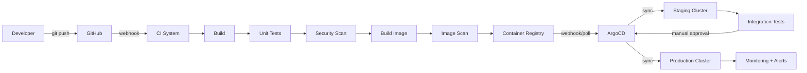
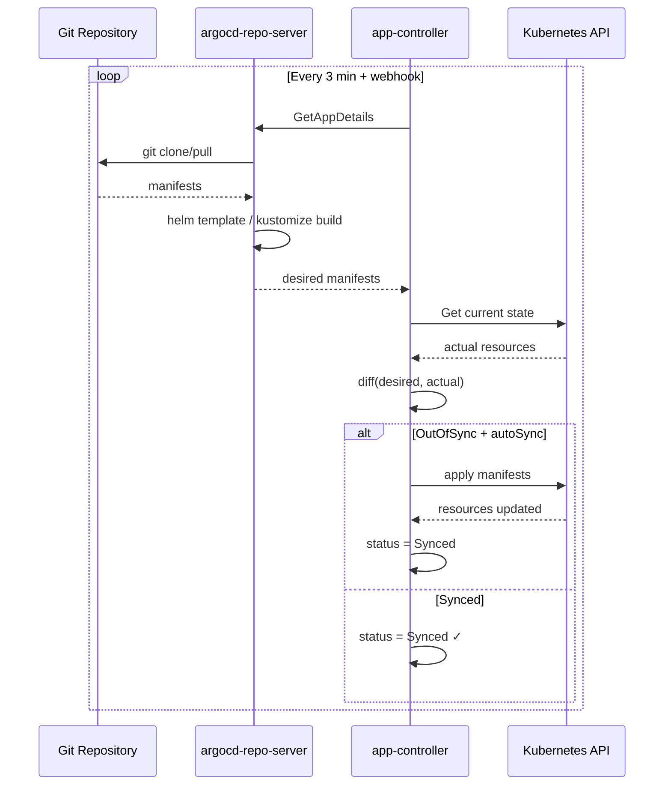

# Module: CI/CD — Jenkins, GitHub Actions, GitLab CI, ArgoCD

> **Phase:** 3 — CI/CD | **Level:** Beginner → Expert | **Prerequisites:** Git, Docker, Kubernetes

---

## Table of Contents

1. [CI/CD Concepts](#1-cicd-concepts)
2. [Jenkins Deep Internals](#2-jenkins-deep-internals)
3. [GitHub Actions](#3-github-actions)
4. [GitLab CI](#4-gitlab-ci)
5. [ArgoCD — GitOps](#5-argocd--gitops)
6. [Diagrams](#6-diagrams)
7. [Production Pipelines](#7-production-pipelines)
8. [Security in CI/CD](#8-security-in-cicd)
9. [Interview Questions](#9-interview-questions)
10. [Hands-On Labs](#10-hands-on-labs)

---

## 1. CI/CD Concepts

### What is CI/CD?

```
CI — Continuous Integration:
  Developers merge code frequently (multiple times/day).
  Every merge triggers automated: build + test + static analysis.
  Goal: detect integration problems early (minutes, not days).

CD — Continuous Delivery:
  Software is always in a deployable state.
  Every successful CI run produces a deployable artifact.
  Deployment to production requires manual approval.

CD — Continuous Deployment:
  Every successful CI run is AUTOMATICALLY deployed to production.
  No human approval step.
  Requires very mature testing and monitoring.

DevOps Pipeline stages:
  Code → SCM → Build → Test → SAST → Package → 
  Artifact Registry → Deploy Staging → Integration Tests → 
  Deploy Production → Monitor
```

### Why CI/CD Matters

| Without CI/CD | With CI/CD |
|---|---|
| Monthly big-bang releases | Multiple deploys per day |
| "Integration hell" at release time | Issues caught immediately |
| Manual builds and deploys | Fully automated |
| Fear of deploying on Friday | Confident deployments anytime |
| Hours of rollback | Minutes to roll back |

### Pipeline as Code

```
All modern CI/CD tools use "Pipeline as Code":
  Pipeline defined in a file in the repo (Jenkinsfile, .github/workflows/, .gitlab-ci.yml)
  
Benefits:
  - Version controlled (history of pipeline changes)
  - Reviewed via PR (peer review of pipeline changes)
  - Reproducible (same pipeline across environments)
  - Testable (can lint/validate pipeline files)
```

---

## 2. Jenkins Deep Internals

### Jenkins Architecture

```
Jenkins Controller (Master):
  - Orchestrates the build pipeline
  - Stores job configs, build history, logs
  - Schedules builds on agents
  - Serves the Web UI and REST API
  - Manages plugins
  - Does NOT run build steps (delegates to agents)

Jenkins Agents (Workers):
  - Execute build steps
  - Connected via SSH, JNLP (Java Web Start), or Kubernetes pod
  - Types:
    Permanent agents: always connected, traditional VMs
    Ephemeral agents: Kubernetes pods, spun up per build, destroyed after
  
  Each agent has:
  - Labels (identifies capabilities: linux, docker, maven, nodejs)
  - Executors (concurrent jobs, typically = CPU cores)
  - Workspace (temp directory per job)

Storage on Controller:
  $JENKINS_HOME (default: /var/lib/jenkins/)
  ├── config.xml          — global Jenkins config
  ├── jobs/               — job configurations and build history
  │   └── myjob/
  │       ├── config.xml      — job definition
  │       ├── builds/         — build logs and artifacts
  │       └── workspace/      — build workspace (local agent)
  ├── plugins/            — installed plugins
  ├── nodes/              — agent configurations
  ├── users/              — user accounts
  └── secrets/            — encrypted credentials
```

### Jenkins Internal Request Flow

```
Developer pushes to GitHub
    │
    ▼ GitHub webhook → POST http://jenkins:8080/github-webhook/
Jenkins Controller:
    │
    ├── Receives webhook payload
    ├── Identifies which job(s) to trigger
    ├── Creates build in queue
    │
    ├── Queue processing:
    │   - Find available agent matching job's label
    │   - If no agent available: wait in queue
    │
    ├── Agent selected:
    │   - Checkout SCM (git clone/pull) to workspace
    │   - Execute pipeline stages sequentially
    │
    ├── Build steps on Agent:
    │   sh 'mvn clean package'   → forks process on agent
    │   docker.build(...)        → calls docker daemon on agent
    │   sh 'kubectl apply ...'   → calls kubectl on agent
    │
    ├── Results collected:
    │   - Test reports (JUnit XML) parsed
    │   - Artifacts archived
    │   - Build logs streamed to controller
    │
    └── Notifications:
        - Slack, email, GitHub commit status
        - BUILD SUCCESS / FAILURE
```

### Jenkins High Availability

```
Jenkins controller = single point of failure by default.

Options:
  1. Jenkins + Persistent Volume:
     - Controller on Kubernetes with PVC for JENKINS_HOME
     - If controller pod crashes: Kubernetes restarts it
     - Builds in progress are lost (no state)
  
  2. CloudBees CI (commercial):
     - Active-active HA controllers
     - Hot standby controller
     - Operations Center for multi-controller management
  
  3. Jenkins X / Tekton:
     - Kubernetes-native CI/CD
     - No single controller — pipeline = Kubernetes resources
     - Every build = ephemeral Kubernetes pod
  
  Production standard:
    - Jenkins controller on K8s with PVC
    - Kubernetes plugin for ephemeral build pods
    - Regular JENKINS_HOME backups
```

### Jenkinsfile — Pipeline as Code

```groovy
// Declarative Pipeline (recommended)
pipeline {
    agent none  // no default agent — each stage declares its own

    options {
        buildDiscarder(logRotator(numToKeepStr: '10'))
        timeout(time: 30, unit: 'MINUTES')
        disableConcurrentBuilds()
        timestamps()
    }

    environment {
        DOCKER_REGISTRY = 'myregistry.io'
        IMAGE_NAME      = 'myapp'
        IMAGE_TAG       = "${env.GIT_COMMIT[0..7]}"
        KUBECONFIG      = credentials('kubeconfig-production')
    }

    stages {
        stage('Checkout') {
            agent { label 'linux' }
            steps {
                checkout scm
                sh 'git log --oneline -5'
            }
        }

        stage('Build & Unit Tests') {
            agent {
                kubernetes {
                    yaml '''
                        apiVersion: v1
                        kind: Pod
                        spec:
                          containers:
                          - name: maven
                            image: maven:3.9-eclipse-temurin-17
                            command: [sleep, infinity]
                            resources:
                              limits:
                                cpu: "2"
                                memory: "4Gi"
                    '''
                }
            }
            steps {
                container('maven') {
                    sh 'mvn clean test package -DskipTests=false'
                }
            }
            post {
                always {
                    junit 'target/surefire-reports/*.xml'
                    publishHTML([allowMissing: false, reportDir: 'target/site/jacoco',
                        reportFiles: 'index.html', reportName: 'Code Coverage'])
                }
            }
        }

        stage('Security Scan') {
            parallel {
                stage('SAST — Sonar') {
                    agent { label 'linux' }
                    steps {
                        withSonarQubeEnv('SonarQube') {
                            sh 'mvn sonar:sonar'
                        }
                        timeout(time: 5, unit: 'MINUTES') {
                            waitForQualityGate abortPipeline: true
                        }
                    }
                }
                stage('Dependency Check') {
                    agent { label 'linux' }
                    steps {
                        sh 'trivy fs --exit-code 1 --severity HIGH,CRITICAL .'
                    }
                }
            }
        }

        stage('Build Docker Image') {
            agent { label 'docker' }
            steps {
                script {
                    docker.withRegistry("https://${DOCKER_REGISTRY}", 'registry-credentials') {
                        def image = docker.build("${IMAGE_NAME}:${IMAGE_TAG}", 
                            "--build-arg BUILD_DATE=${new Date().format('yyyy-MM-dd')} .")
                        image.push()
                        image.push('latest')
                    }
                }
            }
        }

        stage('Image Scan') {
            agent { label 'linux' }
            steps {
                sh """
                    trivy image --exit-code 1 \
                        --severity HIGH,CRITICAL \
                        --ignore-unfixed \
                        ${DOCKER_REGISTRY}/${IMAGE_NAME}:${IMAGE_TAG}
                """
            }
        }

        stage('Deploy to Staging') {
            agent { label 'linux' }
            steps {
                sh """
                    helm upgrade --install myapp ./helm/myapp \
                        --namespace staging \
                        --set image.tag=${IMAGE_TAG} \
                        --set replicaCount=2 \
                        --wait --timeout 5m
                """
            }
        }

        stage('Integration Tests') {
            agent { label 'linux' }
            steps {
                sh 'pytest tests/integration/ --junit-xml=integration-results.xml'
            }
            post {
                always {
                    junit 'integration-results.xml'
                }
            }
        }

        stage('Deploy to Production') {
            when {
                branch 'main'
            }
            agent { label 'linux' }
            steps {
                // Manual approval gate
                timeout(time: 24, unit: 'HOURS') {
                    input(message: "Deploy ${IMAGE_TAG} to production?",
                          submitter: 'senior-engineers,team-leads')
                }
                sh """
                    helm upgrade --install myapp ./helm/myapp \
                        --namespace production \
                        --set image.tag=${IMAGE_TAG} \
                        --set replicaCount=5 \
                        --wait --timeout 10m
                """
            }
        }
    }

    post {
        success {
            slackSend(color: 'good', 
                message: "✅ ${env.JOB_NAME} #${env.BUILD_NUMBER} succeeded - ${IMAGE_TAG}")
        }
        failure {
            slackSend(color: 'danger', 
                message: "❌ ${env.JOB_NAME} #${env.BUILD_NUMBER} FAILED")
            emailext(subject: "FAILED: ${env.JOB_NAME}",
                     body: "See: ${env.BUILD_URL}",
                     to: 'team@company.com')
        }
        always {
            cleanWs()  // clean workspace
        }
    }
}
```

### Jenkins Configuration as Code (JCasC)

```yaml
# /var/lib/jenkins/casc.yaml — configure Jenkins via YAML
jenkins:
  systemMessage: "Jenkins managed by Configuration as Code"
  numExecutors: 0  # controller has no executors — use agents only
  
  securityRealm:
    ldap:
      configurations:
      - server: ldap://ldap.company.com:389
        rootDN: "dc=company,dc=com"
        userSearchBase: "ou=users"
        
  authorizationStrategy:
    roleBased:
      roles:
        global:
        - name: "admin"
          permissions: ["Overall/Administer"]
          entries:
          - group: "jenkins-admins"
        - name: "developer"
          permissions: ["Job/Build", "Job/Read", "Job/Workspace"]
          entries:
          - group: "developers"

credentials:
  system:
    domainCredentials:
    - credentials:
      - usernamePassword:
          id: "github-credentials"
          username: "jenkins-bot"
          password: "${GITHUB_TOKEN}"
          description: "GitHub API token"
      - string:
          id: "sonarqube-token"
          secret: "${SONAR_TOKEN}"

unclassified:
  slackNotifier:
    teamDomain: "mycompany"
    tokenCredentialId: "slack-token"
    
  githubPluginConfig:
    hookUrl: "https://jenkins.company.com/github-webhook/"
```

---

## 3. GitHub Actions

### Architecture

```
GitHub Actions components:

Workflow:         YAML file in .github/workflows/
  └── defines when to run (on:) and what to run (jobs:)

Job:             runs on a runner, has steps
  └── Steps run sequentially on same runner

Step:            individual task
  └── run: (shell command) OR uses: (action)

Action:          reusable step (from Marketplace or local)
  └── docker://image OR path: ./local-action OR owner/repo@ref

Runner:          machine that executes jobs
  └── GitHub-hosted: ubuntu-22.04, windows-2022, macos-13
  └── Self-hosted:   your own servers/VMs/pods

Workflow trigger examples (on:):
  push:                    any push
  pull_request:            PR opened/updated
  schedule: "0 2 * * *"   cron (every day at 2am UTC)
  workflow_dispatch:       manual trigger via UI/API
  release: {types: [published]}
  workflow_call:           called by another workflow (reusable)
```

### Production GitHub Actions Workflow

```yaml
# .github/workflows/ci-cd.yml
name: CI/CD Pipeline

on:
  push:
    branches: [main, develop]
  pull_request:
    branches: [main]
  workflow_dispatch:
    inputs:
      environment:
        description: 'Deploy to'
        required: true
        default: 'staging'
        type: choice
        options: [staging, production]

# Cancel in-progress runs when new commit pushed
concurrency:
  group: ${{ github.workflow }}-${{ github.ref }}
  cancel-in-progress: true

env:
  REGISTRY: ghcr.io
  IMAGE_NAME: ${{ github.repository }}

jobs:
  # ─── Test ──────────────────────────────────────────────────
  test:
    name: Build and Test
    runs-on: ubuntu-22.04
    
    # Matrix testing: run on multiple versions
    strategy:
      matrix:
        node-version: [18, 20]
      fail-fast: false
    
    steps:
    - uses: actions/checkout@v4
    
    - name: Setup Node.js ${{ matrix.node-version }}
      uses: actions/setup-node@v4
      with:
        node-version: ${{ matrix.node-version }}
        cache: 'npm'
    
    - name: Install dependencies
      run: npm ci
    
    - name: Run linter
      run: npm run lint
    
    - name: Run unit tests
      run: npm test -- --coverage
    
    - name: Upload coverage
      uses: codecov/codecov-action@v3
      with:
        token: ${{ secrets.CODECOV_TOKEN }}

  # ─── Security ──────────────────────────────────────────────
  security:
    name: Security Scan
    runs-on: ubuntu-22.04
    permissions:
      security-events: write  # for code scanning
    
    steps:
    - uses: actions/checkout@v4
    
    - name: Run Trivy vulnerability scan
      uses: aquasecurity/trivy-action@master
      with:
        scan-type: 'fs'
        scan-ref: '.'
        severity: 'HIGH,CRITICAL'
        exit-code: '1'
        format: 'sarif'
        output: 'trivy-results.sarif'
    
    - name: Upload Trivy results to GitHub Security tab
      uses: github/codeql-action/upload-sarif@v2
      with:
        sarif_file: 'trivy-results.sarif'
    
    - name: Run SAST with CodeQL
      uses: github/codeql-action/analyze@v2

  # ─── Build Docker Image ────────────────────────────────────
  build:
    name: Build Docker Image
    runs-on: ubuntu-22.04
    needs: [test, security]
    permissions:
      contents: read
      packages: write
    
    outputs:
      image-digest: ${{ steps.build.outputs.digest }}
      image-tag: ${{ steps.meta.outputs.tags }}
    
    steps:
    - uses: actions/checkout@v4
    
    - name: Set up Docker Buildx
      uses: docker/setup-buildx-action@v3
    
    - name: Log in to GitHub Container Registry
      uses: docker/login-action@v3
      with:
        registry: ${{ env.REGISTRY }}
        username: ${{ github.actor }}
        password: ${{ secrets.GITHUB_TOKEN }}
    
    - name: Extract image metadata
      id: meta
      uses: docker/metadata-action@v5
      with:
        images: ${{ env.REGISTRY }}/${{ env.IMAGE_NAME }}
        tags: |
          type=sha,prefix=sha-
          type=ref,event=branch
          type=semver,pattern={{version}}
          type=raw,value=latest,enable={{is_default_branch}}
    
    - name: Build and push
      id: build
      uses: docker/build-push-action@v5
      with:
        context: .
        push: true
        tags: ${{ steps.meta.outputs.tags }}
        labels: ${{ steps.meta.outputs.labels }}
        cache-from: type=gha
        cache-to: type=gha,mode=max
        platforms: linux/amd64,linux/arm64
        build-args: |
          GIT_SHA=${{ github.sha }}
          BUILD_DATE=${{ github.event.head_commit.timestamp }}
    
    - name: Scan built image
      uses: aquasecurity/trivy-action@master
      with:
        image-ref: ${{ env.REGISTRY }}/${{ env.IMAGE_NAME }}:sha-${{ github.sha }}
        severity: 'HIGH,CRITICAL'
        exit-code: '1'

  # ─── Deploy Staging ────────────────────────────────────────
  deploy-staging:
    name: Deploy to Staging
    runs-on: ubuntu-22.04
    needs: [build]
    environment:
      name: staging
      url: https://staging.myapp.com
    
    steps:
    - uses: actions/checkout@v4
    
    - name: Configure AWS credentials
      uses: aws-actions/configure-aws-credentials@v4
      with:
        role-to-assume: arn:aws:iam::123456789:role/GitHubActionsRole
        aws-region: us-east-1
    
    - name: Update kubeconfig
      run: aws eks update-kubeconfig --name staging-cluster --region us-east-1
    
    - name: Deploy with Helm
      run: |
        helm upgrade --install myapp ./helm/myapp \
          --namespace staging \
          --set image.repository=${{ env.REGISTRY }}/${{ env.IMAGE_NAME }} \
          --set image.tag=sha-${{ github.sha }} \
          --set image.digest=${{ needs.build.outputs.image-digest }} \
          --wait --timeout 5m \
          --atomic  # rollback on failure

    - name: Run smoke tests
      run: |
        sleep 30
        curl -f https://staging.myapp.com/health || exit 1

  # ─── Deploy Production ─────────────────────────────────────
  deploy-production:
    name: Deploy to Production
    runs-on: ubuntu-22.04
    needs: [deploy-staging]
    if: github.ref == 'refs/heads/main'
    environment:
      name: production    # requires manual approval (configured in GitHub UI)
      url: https://myapp.com
    
    steps:
    - uses: actions/checkout@v4
    
    - name: Configure AWS credentials (prod)
      uses: aws-actions/configure-aws-credentials@v4
      with:
        role-to-assume: arn:aws:iam::987654321:role/GitHubActionsRole
        aws-region: us-east-1
    
    - name: Update kubeconfig (prod)
      run: aws eks update-kubeconfig --name production-cluster --region us-east-1
    
    - name: Deploy with Helm (canary)
      run: |
        # Deploy canary first (10% traffic)
        helm upgrade --install myapp-canary ./helm/myapp \
          --namespace production \
          --set image.tag=sha-${{ github.sha }} \
          --set replicaCount=1 \
          --set ingress.canary.enabled=true \
          --set ingress.canary.weight=10 \
          --wait --timeout 5m
    
    - name: Monitor canary (5 minutes)
      run: |
        echo "Monitoring canary deployment..."
        sleep 300
        # Check error rate
        ERROR_RATE=$(curl -s "https://prometheus.internal/api/v1/query?query=rate(http_requests_total{status='5xx',version='canary'}[5m])/rate(http_requests_total{version='canary'}[5m])" | jq '.data.result[0].value[1]')
        if (( $(echo "$ERROR_RATE > 0.01" | bc -l) )); then
          echo "Error rate $ERROR_RATE > 1% - aborting!"
          exit 1
        fi
    
    - name: Full production deploy
      run: |
        helm upgrade --install myapp ./helm/myapp \
          --namespace production \
          --set image.tag=sha-${{ github.sha }} \
          --set replicaCount=10 \
          --wait --timeout 10m \
          --atomic
```

### Reusable Workflows

```yaml
# .github/workflows/deploy-template.yml — reusable workflow
on:
  workflow_call:
    inputs:
      environment:
        required: true
        type: string
      image-tag:
        required: true
        type: string
      replicas:
        required: false
        type: number
        default: 3
    secrets:
      AWS_ROLE_ARN:
        required: true

jobs:
  deploy:
    runs-on: ubuntu-22.04
    environment: ${{ inputs.environment }}
    steps:
    - uses: actions/checkout@v4
    - name: Configure AWS
      uses: aws-actions/configure-aws-credentials@v4
      with:
        role-to-assume: ${{ secrets.AWS_ROLE_ARN }}
        aws-region: us-east-1
    - name: Deploy
      run: |
        helm upgrade --install myapp ./helm/myapp \
          --namespace ${{ inputs.environment }} \
          --set image.tag=${{ inputs.image-tag }} \
          --set replicaCount=${{ inputs.replicas }} \
          --wait --atomic

# Caller workflow:
jobs:
  deploy-staging:
    uses: ./.github/workflows/deploy-template.yml
    with:
      environment: staging
      image-tag: sha-${{ github.sha }}
      replicas: 2
    secrets:
      AWS_ROLE_ARN: ${{ secrets.STAGING_AWS_ROLE }}
```

---

## 4. GitLab CI

### Architecture

```
GitLab CI components:

GitLab Server:
  - CI coordinator (like Jenkins controller)
  - Stores pipeline definitions (.gitlab-ci.yml)
  - Manages pipeline state and job queue
  - Provides GitLab UI for pipeline visualization

GitLab Runner:
  - Executes jobs (like Jenkins agent)
  - Registered to GitLab Server with a token
  - Executors:
    Shell:      runs directly on runner host
    Docker:     runs each job in a Docker container
    Kubernetes: runs each job in a Kubernetes pod
    Virtual Machine: runs in VMs (for full OS isolation)

.gitlab-ci.yml:
  Pipeline defined in root of repository
  Uploaded to GitLab on every push
  GitLab Server parses and executes
```

### GitLab CI Pipeline

```yaml
# .gitlab-ci.yml
stages:
  - test
  - security
  - build
  - deploy-staging
  - deploy-production

variables:
  DOCKER_REGISTRY: registry.gitlab.com
  IMAGE_NAME: $CI_PROJECT_PATH
  IMAGE_TAG: $CI_COMMIT_SHORT_SHA
  DOCKER_DRIVER: overlay2
  DOCKER_TLS_CERTDIR: "/certs"

# Cache node_modules between jobs
.cache-template: &cache
  cache:
    key:
      files:
        - package-lock.json
    paths:
      - node_modules/
    policy: pull-push

# ─── Test ─────────────────────────────────────────────────
unit-tests:
  stage: test
  image: node:20-alpine
  <<: *cache
  script:
    - npm ci
    - npm run lint
    - npm test -- --coverage --ci
  coverage: '/Lines\s*:\s*(\d+.\d+)%/'
  artifacts:
    when: always
    reports:
      junit: junit.xml
      coverage_report:
        coverage_format: cobertura
        path: coverage/cobertura-coverage.xml
    paths:
      - coverage/
    expire_in: 1 week
  rules:
    - if: '$CI_PIPELINE_SOURCE == "merge_request_event"'
    - if: '$CI_COMMIT_BRANCH == "main"'

# ─── Security ─────────────────────────────────────────────
sast:
  stage: security
  # GitLab built-in SAST
  include:
    - template: Security/SAST.gitlab-ci.yml
  rules:
    - if: '$CI_COMMIT_BRANCH'

dependency-scan:
  stage: security
  image: aquasec/trivy:latest
  script:
    - trivy fs --exit-code 1 --severity HIGH,CRITICAL --no-progress .
  rules:
    - if: '$CI_COMMIT_BRANCH'

# ─── Build ────────────────────────────────────────────────
build-image:
  stage: build
  image: docker:24-dind
  services:
    - docker:24-dind
  before_script:
    - docker login -u $CI_REGISTRY_USER -p $CI_REGISTRY_PASSWORD $CI_REGISTRY
  script:
    - |
      docker build \
        --build-arg GIT_SHA=$CI_COMMIT_SHA \
        --cache-from $CI_REGISTRY_IMAGE:latest \
        -t $CI_REGISTRY_IMAGE:$IMAGE_TAG \
        -t $CI_REGISTRY_IMAGE:latest \
        .
    - docker push $CI_REGISTRY_IMAGE:$IMAGE_TAG
    - docker push $CI_REGISTRY_IMAGE:latest
    # Scan the built image
    - docker run --rm -v /var/run/docker.sock:/var/run/docker.sock
        aquasec/trivy:latest image
        --exit-code 1 --severity HIGH,CRITICAL
        $CI_REGISTRY_IMAGE:$IMAGE_TAG
  rules:
    - if: '$CI_COMMIT_BRANCH == "main"'

# ─── Deploy Staging ───────────────────────────────────────
deploy-staging:
  stage: deploy-staging
  image: alpine/helm:3.13
  environment:
    name: staging
    url: https://staging.myapp.com
  before_script:
    - helm repo add stable https://charts.helm.sh/stable
    - echo "$KUBECONFIG_STAGING" | base64 -d > /tmp/kubeconfig
    - export KUBECONFIG=/tmp/kubeconfig
  script:
    - |
      helm upgrade --install myapp ./helm/myapp \
        --namespace staging \
        --set image.repository=$CI_REGISTRY_IMAGE \
        --set image.tag=$IMAGE_TAG \
        --wait --timeout 5m --atomic
    - sleep 30
    - curl -f https://staging.myapp.com/health
  rules:
    - if: '$CI_COMMIT_BRANCH == "main"'

# ─── Deploy Production ────────────────────────────────────
deploy-production:
  stage: deploy-production
  image: alpine/helm:3.13
  environment:
    name: production
    url: https://myapp.com
  when: manual    # requires manual click in GitLab UI
  allow_failure: false
  before_script:
    - echo "$KUBECONFIG_PRODUCTION" | base64 -d > /tmp/kubeconfig
    - export KUBECONFIG=/tmp/kubeconfig
  script:
    - |
      helm upgrade --install myapp ./helm/myapp \
        --namespace production \
        --set image.repository=$CI_REGISTRY_IMAGE \
        --set image.tag=$IMAGE_TAG \
        --set replicaCount=5 \
        --wait --timeout 10m --atomic
  rules:
    - if: '$CI_COMMIT_BRANCH == "main"'
```

---

## 5. ArgoCD — GitOps

### What is GitOps?

```
GitOps = Git as the single source of truth for infrastructure and application state.

Principles:
  1. Declarative: system described declaratively (YAML, Helm, Kustomize)
  2. Versioned: all desired state in Git (history, rollback, audit)
  3. Pulled: agent pulls from Git and applies (not pushed by CI)
  4. Reconciled: automated agent continuously ensures actual = desired

Benefits:
  - Audit trail: every change = Git commit
  - Rollback: git revert → cluster reverted
  - Drift detection: ArgoCD detects out-of-sync state
  - Multi-cluster: manage many clusters from one place
  - Separation of CI and CD: CI builds image, CD deploys it
```

### ArgoCD Architecture

```
ArgoCD components (all run in Kubernetes):

argocd-server:
  - Serves Web UI (HTTPS)
  - Serves gRPC/REST API (for argocd CLI)
  - Handles authentication (OIDC, LDAP, GitHub OAuth)

argocd-repo-server:
  - Clones and pulls Git repositories
  - Renders manifests: Helm, Kustomize, Jsonnet, plain YAML
  - Caches rendered manifests

argocd-application-controller:
  - Main reconciliation loop
  - Compares desired state (Git) with actual state (Kubernetes)
  - Detects OutOfSync → triggers sync

argocd-applicationset-controller:
  - Generates Applications from templates
  - Patterns: cluster generator, git generator, matrix generator

argocd-dex:
  - OpenID Connect provider (SSO connector)
  - Integrates with LDAP, GitHub, Google, Okta

argocd-redis:
  - Caches cluster state (reduces apiserver load)

Storage:
  - Desired state: Git repository
  - Application definitions: Kubernetes CRDs in argocd namespace
  - Cluster state: cached in Redis, fetched from apiserver
```

### ArgoCD Reconciliation Loop

```
Every 3 minutes (or on webhook):

1. argocd-application-controller reads Application CRD:
   targetRevision: HEAD
   repoURL: https://github.com/myorg/myapp-gitops
   path: deploy/production

2. argocd-repo-server clones/pulls repo
   Renders manifests: helm template / kustomize build / kubectl apply --dry-run

3. Controller compares:
   Desired (from Git/rendered manifests)
   vs
   Actual (from Kubernetes API)
   
   Diff computed using strategic merge patch logic

4. If OutOfSync AND autoSync enabled:
   Apply manifests to Kubernetes
   Create/Update/Delete resources as needed
   
5. Status reported:
   Synced:    desired == actual
   OutOfSync: desired != actual (pending changes)
   Degraded:  resources not healthy (pod crash, etc.)

6. Health assessment:
   Each resource type has health assessment logic
   Deployment: healthy if replicas desired == available
   Pod: healthy if Running and Ready
   PVC: healthy if Bound
```

### ArgoCD Application Definition

```yaml
# ArgoCD Application — deploys myapp to production cluster
apiVersion: argoproj.io/v1alpha1
kind: Application
metadata:
  name: myapp-production
  namespace: argocd
  finalizers:
  - resources-finalizer.argocd.argoproj.io  # cascade delete
spec:
  project: production
  
  source:
    repoURL: https://github.com/myorg/myapp-gitops
    targetRevision: HEAD   # or specific branch/tag/SHA
    path: deploy/production
    
    # If using Helm:
    helm:
      valueFiles:
      - values.yaml
      - values-production.yaml
      parameters:
      - name: image.tag
        value: sha-abc1234
  
  destination:
    server: https://kubernetes.default.svc   # same cluster
    # Or remote cluster:
    # server: https://production-cluster.example.com
    namespace: production
  
  syncPolicy:
    automated:
      prune: true       # delete resources removed from Git
      selfHeal: true    # re-apply if manually changed in cluster
    syncOptions:
    - CreateNamespace=true
    - PrunePropagationPolicy=foreground
    - RespectIgnoreDifferences=true
    retry:
      limit: 5
      backoff:
        duration: 5s
        factor: 2
        maxDuration: 3m
  
  ignoreDifferences:
  - group: apps
    kind: Deployment
    jsonPointers:
    - /spec/replicas    # HPA manages replicas — ignore drift

---
# AppProject — RBAC and restrictions
apiVersion: argoproj.io/v1alpha1
kind: AppProject
metadata:
  name: production
  namespace: argocd
spec:
  description: Production applications
  
  # Allow only these source repos
  sourceRepos:
  - 'https://github.com/myorg/*'
  
  # Allow only these destination clusters/namespaces
  destinations:
  - namespace: production
    server: https://kubernetes.default.svc
  
  # Block dangerous resources
  namespaceResourceBlacklist:
  - group: ''
    kind: ResourceQuota
  
  # Allow only these resource types
  clusterResourceWhitelist:
  - group: '*'
    kind: '*'
  
  # RBAC for this project
  roles:
  - name: developer
    description: Developer access
    policies:
    - p, proj:production:developer, applications, get, production/*, allow
    - p, proj:production:developer, applications, sync, production/*, allow
    groups:
    - developers
  
  - name: admin
    policies:
    - p, proj:production:admin, applications, *, production/*, allow
    groups:
    - platform-team
```

### ApplicationSet — Multiple Environments

```yaml
# Deploy to all clusters automatically
apiVersion: argoproj.io/v1alpha1
kind: ApplicationSet
metadata:
  name: myapp-all-clusters
  namespace: argocd
spec:
  generators:
  # Generate one Application per cluster
  - clusters:
      selector:
        matchLabels:
          environment: production
  
  # OR: generate from Git directories
  - git:
      repoURL: https://github.com/myorg/myapp-gitops
      revision: HEAD
      directories:
      - path: clusters/*
  
  # OR: matrix generator (cluster × environment)
  - matrix:
      generators:
      - clusters: {}
      - list:
          elements:
          - env: staging
          - env: production
  
  template:
    metadata:
      name: 'myapp-{{name}}'   # {{name}} = cluster name
    spec:
      project: default
      source:
        repoURL: https://github.com/myorg/myapp-gitops
        targetRevision: HEAD
        path: 'deploy/{{metadata.labels.environment}}'
      destination:
        server: '{{server}}'   # cluster server URL
        namespace: myapp
      syncPolicy:
        automated:
          prune: true
          selfHeal: true
```

### ArgoCD + CI Integration (Image Updater)

```yaml
# ArgoCD Image Updater: auto-update image tag when new image pushed
apiVersion: argoproj.io/v1alpha1
kind: Application
metadata:
  name: myapp
  annotations:
    # Auto-update image tag when new semver tag pushed
    argocd-image-updater.argoproj.io/image-list: myapp=myregistry.io/myapp
    argocd-image-updater.argoproj.io/myapp.update-strategy: semver
    argocd-image-updater.argoproj.io/myapp.helm.image-name: image.repository
    argocd-image-updater.argoproj.io/myapp.helm.image-tag: image.tag
    argocd-image-updater.argoproj.io/write-back-method: git    # commit to git
    argocd-image-updater.argoproj.io/git-branch: main

# CI pipeline:
# 1. Push code → GitHub Actions
# 2. Build + test + scan → docker build + push
# 3. Push new tag to registry: myregistry.io/myapp:v1.2.3
# 4. ArgoCD Image Updater detects new tag
# 5. Commits new tag to Git: image.tag: v1.2.3
# 6. ArgoCD syncs → deploys new version

# Full GitOps: CD is event-driven from registry + Git
# CI system never touches cluster directly
```

---

## 6. Diagrams

### Mermaid: Complete CI/CD Pipeline



### Mermaid: ArgoCD Reconciliation



---

## 7. Production Pipelines

### GitOps Repository Structure

```
myapp-gitops/               ← separate repo from application code
├── apps/                   ← ArgoCD Application definitions
│   ├── staging/
│   │   └── myapp.yaml
│   └── production/
│       └── myapp.yaml
│
├── clusters/               ← per-cluster ArgoCD configs
│   ├── staging/
│   │   ├── argocd/        ← ArgoCD itself (manage ArgoCD with ArgoCD!)
│   │   └── infrastructure/ ← cert-manager, ingress-nginx, etc.
│   └── production/
│       ├── argocd/
│       └── infrastructure/
│
└── deploy/                 ← application Helm charts/Kustomize
    ├── base/               ← base manifests
    │   ├── deployment.yaml
    │   ├── service.yaml
    │   └── kustomization.yaml
    ├── staging/
    │   ├── kustomization.yaml   ← patches for staging
    │   └── values.yaml
    └── production/
        ├── kustomization.yaml   ← patches for production
        └── values.yaml
```

### Deployment Strategies

```
Rolling Update (default):
  Replace pods gradually (maxSurge=1, maxUnavailable=0)
  Safe, zero downtime
  No traffic control (users may hit old + new simultaneously)

Blue/Green:
  Two identical environments: Blue (current) and Green (new)
  Deploy to Green → test → switch LB/Ingress to Green
  Blue stays running for immediate rollback
  Cost: 2x resources during transition

Canary:
  New version receives small % of traffic (5-10%)
  Monitor error rate, latency, custom metrics
  Gradually increase % until 100%
  Abort: shift 100% back to old version

A/B Testing:
  Route specific users to new version (header, cookie, user ID)
  Not just for reliability — for testing features
  Requires L7 routing (Istio, nginx annotations)

Feature Flags:
  New code deployed but feature disabled
  Enable per-user, per-group, gradually
  Tools: LaunchDarkly, Unleash, Flagsmith
  Independent of deployment (better for continuous deployment)

# ArgoCD Rollouts (Argo Rollouts):
apiVersion: argoproj.io/v1alpha1
kind: Rollout
metadata:
  name: myapp
spec:
  replicas: 10
  strategy:
    canary:
      canaryService: myapp-canary
      stableService: myapp-stable
      trafficRouting:
        istio:
          virtualService:
            name: myapp-vsvc
      steps:
      - setWeight: 10        # 10% to canary
      - pause: {duration: 5m}
      - analysis:            # automated analysis gate
          templates:
          - templateName: success-rate
          args:
          - name: service-name
            value: myapp-canary
      - setWeight: 50        # 50% to canary
      - pause: {duration: 5m}
      - setWeight: 100       # full rollout
      
      autoPromotionEnabled: false  # require manual promotion OR automated analysis pass
```

---

## 8. Security in CI/CD

### Secrets Management

```bash
# Never store secrets in:
# ❌ Plaintext in .github/workflows, Jenkinsfile, .gitlab-ci.yml
# ❌ Docker images (docker history shows all layers)
# ❌ Git history (even if deleted — use git-secrets, gitleaks)

# Best practices:

# 1. GitHub Actions: use GitHub Secrets
secrets.MY_SECRET → injected as env var, masked in logs

# 2. Jenkins: use Credentials plugin
withCredentials([string(credentialsId: 'my-secret', variable: 'MY_SECRET')]) {
    sh "curl -H 'Authorization: Bearer $MY_SECRET' ..."
}

# 3. GitLab CI: use CI/CD Variables (protected + masked)
# Settings → CI/CD → Variables → Protected + Masked

# 4. HashiCorp Vault integration:
# GitHub Actions:
- uses: hashicorp/vault-action@v2
  with:
    url: https://vault.company.com
    method: jwt
    role: github-actions
    secrets: |
      secret/data/myapp DB_PASSWORD | DB_PASSWORD ;
      secret/data/myapp API_KEY | API_KEY

# 5. OIDC / Keyless (no static secrets):
# GitHub Actions → AWS:
- uses: aws-actions/configure-aws-credentials@v4
  with:
    role-to-assume: arn:aws:iam::123456789:role/GitHubActionsRole
    aws-region: us-east-1
# AWS IAM trusts GitHub's OIDC token
# No AWS credentials stored in GitHub!
```

### Supply Chain Security

```bash
# SLSA (Supply chain Levels for Software Artifacts):

# Level 1: Scripted build (automated, not manual)
# Level 2: Build service (uses hosted CI, not dev machine)
# Level 3: Security controls (non-forgeable provenance)
# Level 4: Two-party review, hermetic builds

# Cosign: sign container images
# Install: go install github.com/sigstore/cosign/v2/cmd/cosign@latest

# Sign image:
cosign sign --key cosign.key ghcr.io/myorg/myapp:sha-abc123

# Verify signature:
cosign verify --key cosign.pub ghcr.io/myorg/myapp:sha-abc123

# Keyless signing (Sigstore + OIDC):
cosign sign ghcr.io/myorg/myapp:sha-abc123
# Uses GitHub Actions OIDC token → Sigstore Fulcio issues cert
# Entry recorded in Sigstore Rekor transparency log

# SBOM (Software Bill of Materials):
# Generate SBOM with Syft:
syft ghcr.io/myorg/myapp:sha-abc123 -o spdx-json > sbom.json
# Attach SBOM to image:
cosign attach sbom --sbom sbom.json ghcr.io/myorg/myapp:sha-abc123

# Verify in Kubernetes (Kyverno policy):
apiVersion: kyverno.io/v1
kind: ClusterPolicy
metadata:
  name: verify-image-signature
spec:
  validationFailureAction: enforce
  rules:
  - name: check-image-signature
    match:
      resources:
        kinds: [Pod]
    verifyImages:
    - imageReferences: ["ghcr.io/myorg/*"]
      attestors:
      - entries:
        - keyless:
            issuer: https://token.actions.githubusercontent.com
            subject: "https://github.com/myorg/myapp/.github/workflows/*"
            rekor:
              url: https://rekor.sigstore.dev
```

---

## 9. Interview Questions

**Q1: What is the difference between Continuous Delivery and Continuous Deployment?**

```
Continuous Delivery:
  Every successful build produces a DEPLOYABLE artifact.
  Deployment to production requires MANUAL approval.
  "We COULD deploy at any time, but humans decide when."
  Good for: regulated industries (banking, healthcare), high risk changes.

Continuous Deployment:
  Every successful build is AUTOMATICALLY deployed to production.
  No human approval step.
  "Every commit that passes tests goes to users."
  Good for: mature engineering culture, excellent test coverage, canary deployments.

Both require:
  - Comprehensive automated tests
  - Fast test suites (< 10 minutes ideally)
  - Feature flags (decouple deploy from release)
  - Good monitoring and alerting
  - Easy rollback mechanism
```

**Q2: How do you handle secrets in a CI/CD pipeline?**

```
Never:
  - Hardcode secrets in pipeline YAML
  - Store in environment variables directly in files
  - Print secrets in logs (even accidentally via 'set -x')

Do:
  1. Use platform secret store:
     GitHub: repository/org secrets (encrypted at rest, masked in logs)
     Jenkins: Credentials Plugin (encrypted in Jenkins home)
     GitLab: CI/CD Variables (protected, masked)
  
  2. OIDC/Keyless authentication (best practice):
     GitHub Actions → AWS/GCP/Azure using OIDC
     No static credentials stored anywhere
     Short-lived tokens per pipeline run
  
  3. HashiCorp Vault:
     Dynamic secrets (DB passwords rotated per job)
     Audit log of all secret accesses
     Integrate via Vault Agent or vault-action

  4. Scan for accidental commits:
     git-secrets, gitleaks, truffleHog
     Pre-commit hooks + CI scan
```

**Q3: Walk me through your production deployment pipeline**

```
A mature pipeline:

1. Developer opens PR
2. CI triggers on PR:
   - Unit tests (parallel by package)
   - Linting + type checking
   - SAST (static analysis)
   - Dependency vulnerability scan
   - Build Docker image (not pushed yet)
   Status checks block merge

3. Code review + approval

4. Merge to main triggers:
   - Full test suite
   - Build + push image (tag: sha-<commit>)
   - Image vulnerability scan (block if CRITICAL unfixed)
   - Sign image (cosign)
   - Generate SBOM + attach to image

5. Auto-deploy to staging:
   - ArgoCD detects new image
   - Helm upgrade with new tag
   - Wait for rollout complete
   - Smoke tests pass

6. Integration tests on staging:
   - API tests, E2E tests
   - Performance baseline

7. Canary to production:
   - 5% traffic to new version
   - Monitor: error rate, latency, custom metrics
   - Argo Rollouts pauses and waits for human OR automated analysis

8. Full production rollout:
   - If metrics OK: promote to 100%
   - If metrics bad: automatic rollback

9. Post-deploy:
   - Monitor dashboards
   - Alert if anything degrades
   - Create release notes automatically
```

**Q4: What is GitOps and how does ArgoCD implement it?**

```
GitOps:
  Git = single source of truth for ALL desired state.
  Agent continuously reconciles actual state with Git.
  "Describe what you want in Git, GitOps makes it happen."

ArgoCD implementation:
  1. Applications defined as Kubernetes CRDs (Application resources)
  2. Application points to: Git repo + path + target cluster/namespace
  3. argocd-repo-server periodically pulls Git + renders manifests
  4. app-controller compares rendered manifests vs actual cluster state
  5. If diff detected AND autoSync enabled: apply manifests
  6. Status: Synced/OutOfSync/Degraded shown in UI + exported as metrics

Why ArgoCD vs push-based CI/CD:
  Security: ArgoCD runs IN the cluster → no external tool needs cluster credentials
  Drift detection: catch manual kubectl changes
  Rollback: git revert → cluster reverts
  Audit trail: all changes = Git commits
  Multi-cluster: one ArgoCD manages many clusters

What ArgoCD does NOT do:
  Does NOT build images (that's CI's job)
  Does NOT run tests
  Does NOT trigger on code changes to app (only to manifests/helm values)
```

---

## 10. Hands-On Labs

### Lab 1: Basic GitHub Actions

```yaml
# .github/workflows/ci.yml
name: Basic CI

on: [push, pull_request]

jobs:
  test:
    runs-on: ubuntu-22.04
    steps:
    - uses: actions/checkout@v4
    
    - name: Run tests
      run: |
        echo "Running tests..."
        echo "Test passed!"
    
    - name: Build Docker image
      run: |
        docker build -t myapp:${{ github.sha }} .
        docker images | grep myapp
```

### Lab 2: ArgoCD Setup and Demo

```bash
# Install ArgoCD on local cluster (minikube/kind)
kubectl create namespace argocd
kubectl apply -n argocd -f https://raw.githubusercontent.com/argoproj/argo-cd/stable/manifests/install.yaml

# Wait for pods
kubectl wait --for=condition=Ready pod -l app.kubernetes.io/name=argocd-server -n argocd --timeout=120s

# Get initial admin password
argocd_password=$(kubectl -n argocd get secret argocd-initial-admin-secret \
  -o jsonpath="{.data.password}" | base64 -d)
echo "Password: $argocd_password"

# Port forward
kubectl port-forward svc/argocd-server -n argocd 8080:443 &

# Login
argocd login localhost:8080 --username admin --password $argocd_password --insecure

# Create application pointing to a public Helm chart
argocd app create nginx \
  --repo https://charts.bitnami.com/bitnami \
  --helm-chart nginx \
  --revision 15.1.1 \
  --dest-server https://kubernetes.default.svc \
  --dest-namespace nginx \
  --helm-set replicaCount=2 \
  --sync-policy automated

# Watch sync
argocd app get nginx
argocd app wait nginx

# Simulate drift (manual change)
kubectl scale deployment nginx -n nginx --replicas=5
# Watch ArgoCD detect and fix drift (selfHeal)
argocd app get nginx
sleep 60
kubectl get deployment nginx -n nginx  # should be back to 2

# Cleanup
argocd app delete nginx
kubectl delete namespace argocd nginx
```

---

## Summary

| Tool | Type | Best For |
|---|---|---|
| Jenkins | Self-hosted CI | Complex pipelines, on-prem, extensive plugins |
| GitHub Actions | Cloud CI | GitHub repos, simple setup, marketplace actions |
| GitLab CI | Cloud/self-hosted CI | GitLab repos, built-in security scanning |
| ArgoCD | GitOps CD | Kubernetes deployments, drift detection, multi-cluster |

> **Next Modules:** [Terraform](./phase6-terraform.md) | [Prometheus + Grafana](./phase7-observability.md)
