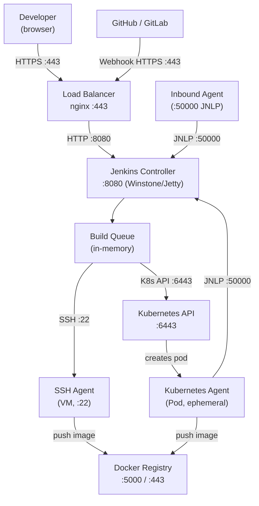
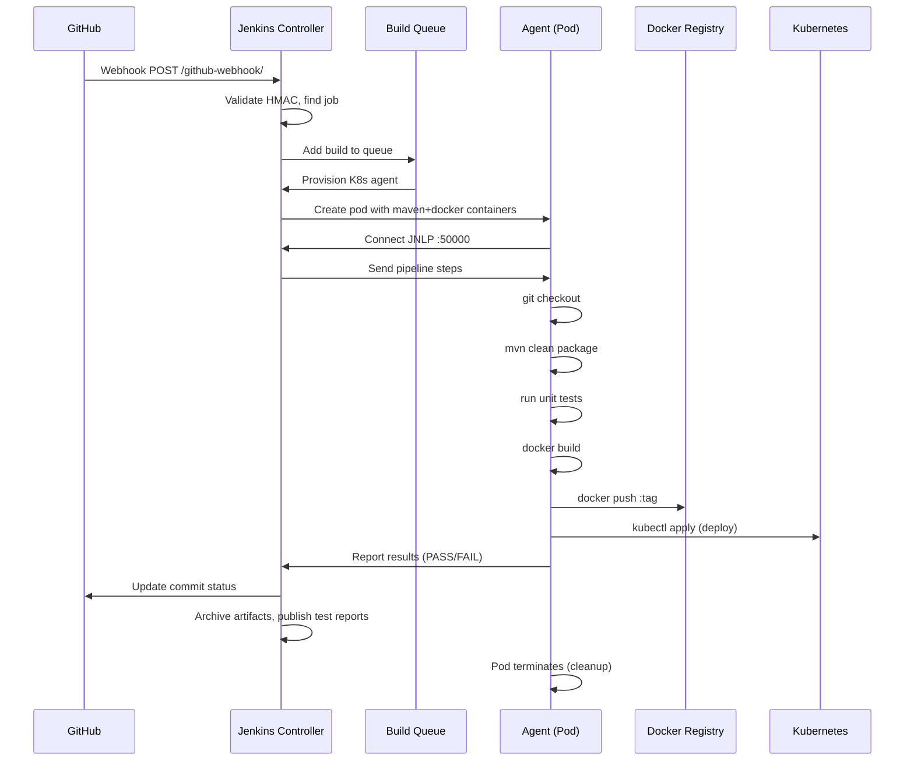
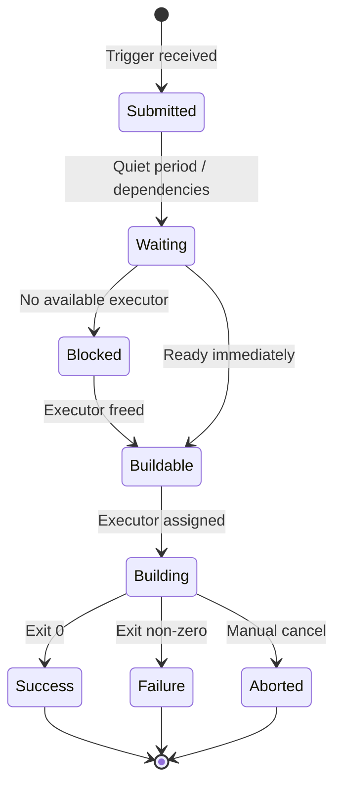

# Module 11: Jenkins Deep Internal Architecture

> **Phase:** 3 — CI/CD | **Level:** Beginner → Expert | **Prerequisites:** Modules 1, 2, 8 (Linux, Networking, Git)

---

## Table of Contents

1. [Introduction](#1-introduction)
2. [Internal Backend Architecture](#2-internal-backend-architecture)
3. [Pipeline Internals](#3-pipeline-internals)
4. [Agent Architecture](#4-agent-architecture)
5. [Plugin System](#5-plugin-system)
6. [Network Communication](#6-network-communication)
7. [Diagrams](#7-diagrams)
8. [Implementation](#8-implementation)
9. [Production Issues](#9-production-issues)
10. [Observability](#10-observability)
11. [Security](#11-security)
12. [Scaling & HA](#12-scaling--ha)
13. [Interview Questions](#13-interview-questions)
14. [Hands-On Labs](#14-hands-on-labs)

---

## 1. Introduction

### What is Jenkins?

Jenkins is an **open-source automation server** written in Java. It is the most widely deployed CI/CD tool in the world. Jenkins automates building, testing, and deploying software — the core of DevOps practice.

### Why Jenkins was created

- Hudson was created at Sun Microsystems in 2004 by Kohsuke Kawaguchi.
- After Oracle acquired Sun in 2010, the community forked Hudson → Jenkins (2011).
- Problem solved: automate the manual, error-prone process of: pull code → compile → test → package → deploy.

### What problem does Jenkins solve?

| Manual Process | Jenkins Solution |
|---|---|
| Developer manually runs tests | Triggered automatically on every push |
| Deployment requires SSH + manual commands | Pipeline stages execute automatically |
| Build environment differs per developer | Agents provide consistent environments |
| "Works on my machine" | Reproducible builds in isolated agents |
| No visibility into build status | Dashboard, notifications, history |

### Industry Adoption

- Used by: NASA, Netflix, LinkedIn, eBay, Bosch, thousands of companies.
- 300,000+ installations worldwide.
- 1,900+ plugins in the plugin ecosystem.

### Alternatives

| Tool | Trade-off vs Jenkins |
|---|---|
| GitHub Actions | Managed, SaaS, tight GitHub integration — less flexible |
| GitLab CI | Integrated with GitLab, good UX, less plugin ecosystem |
| CircleCI | Managed SaaS, fast, but costly at scale |
| TeamCity | JetBrains, polished UI, expensive |
| Tekton | Kubernetes-native, complex, very flexible |
| ArgoCD | GitOps CD only (not CI) |
| Drone CI | Lightweight, container-native, smaller community |

### When NOT to use Jenkins

- Small teams (< 5 devs): GitHub Actions is simpler.
- No Kubernetes/infrastructure expertise: managed CI/CD (GitHub Actions, CircleCI).
- Cloud-native only: Tekton + ArgoCD may be more native.
- When plugin maintenance overhead is unacceptable.

---

## 2. Internal Backend Architecture

### Jenkins Process Architecture

```
Jenkins runs as a Java process (JVM) — the "controller" (formerly "master").

JVM Memory Areas:
  Heap:      build queue, job configs, build history in memory
             Default: -Xms256m -Xmx512m (too low for prod!)
             Production: -Xms2g -Xmx4g minimum
  Metaspace: class definitions (plugins load many classes)
  Threads:   one thread per executor slot + HTTP handling threads

Process model:
  PID 1: java -jar jenkins.war
    ├── Winstone (built-in HTTP server / Jetty)
    │     Handles HTTP requests (GUI, API, webhooks)
    ├── Build Queue Manager
    │     Maintains queue of pending builds
    │     Assigns builds to available agents
    ├── Executor Threads
    │     # executors = # concurrent builds on controller
    │     (Production: set to 0 on controller — run on agents only)
    ├── SCM Polling Threads
    │     Poll Git/SVN for changes (avoid: use webhooks instead)
    ├── Plugin Classloaders
    │     Each plugin has isolated classloader
    │     Plugin isolation prevents class conflicts
    └── Persistence Layer
          XStream-serialized XML files in $JENKINS_HOME
```

### Jenkins Home Directory ($JENKINS_HOME)

```
$JENKINS_HOME/  (default: /var/lib/jenkins)
├── config.xml              — main Jenkins configuration
├── credentials.xml         — encrypted credentials store
├── secrets/
│   ├── master.key          — master encryption key
│   ├── hudson.util.Secret  — encrypted secrets
│   └── initialAdminPassword — first-time setup password
├── users/                  — user accounts
│   └── admin_*/
│       └── config.xml
├── plugins/                — installed plugins
│   ├── git/                — plugin directory
│   │   └── WEB-INF/lib/   — plugin JARs
│   └── *.jpi               — plugin package files
├── jobs/                   — job definitions and history
│   └── my-pipeline/
│       ├── config.xml      — job configuration (Jenkinsfile or inline)
│       └── builds/
│           ├── 1/          — build #1
│           │   ├── build.xml    — build metadata
│           │   ├── log          — console output
│           │   └── archive/     — archived artifacts
│           └── 2/
├── nodes/                  — agent definitions
│   └── my-agent/
│       └── config.xml
├── workspace/              — (if builds run on controller)
│   └── my-pipeline/        — checked-out source code
├── fingerprints/           — artifact fingerprint tracking
├── updates/                — plugin update metadata
└── logs/                   — Jenkins system logs
    └── tasks/
```

### Jenkins Internal Components

```
1. Winstone (HTTP Server)
   - Embedded Jetty servlet container
   - Handles: web UI, REST API, webhook receivers
   - Configured via: --httpPort=8080 --httpsPort=8443
   - Can be fronted by nginx/Apache in production

2. Build Queue
   - In-memory queue of pending build requests
   - Priority queue: quietPeriod, blocking items, dependencies
   - Persisted to queue.xml on shutdown
   
   Build lifecycle:
     SUBMITTED → WAITING (quiet period, dependencies)
     → BLOCKED (no available executor)
     → BUILDABLE (executor available)
     → BUILDING → COMPLETED

3. Executor
   - Thread within a Jenkins node that runs one build
   - Each node has N executors (configured per node)
   - One executor = one concurrent build slot
   
   Agent executors:
     SSH agents: builds run in separate process on agent
     Inbound agents: similar
     Kubernetes agents: builds run in pods (ephemeral)

4. SCM System
   - Monitors source repositories for changes
   - Poll-based: cron-like scanning of repos
   - Webhook-based (preferred): Git push → webhook → trigger

5. Fingerprint System
   - Tracks artifact usage across jobs
   - MD5 hash of artifacts
   - "Which build produced this JAR? Where was it used?"

6. Credentials System
   - Encrypted credential store
   - Types: username/password, SSH key, secret text, certificate
   - Scoped: global, folder, specific jobs
   - Never stored in plaintext (AES-128 encryption)
```

---

## 3. Pipeline Internals

### Declarative vs Scripted Pipeline

```groovy
// ── DECLARATIVE PIPELINE (recommended) ──────────────────────────
// Structured, linted, requires specific syntax
// Simpler, more opinionated

pipeline {
    agent any                   // where to run (any available agent)
    
    environment {               // environment variables
        APP_NAME = 'myapp'
        DOCKER_REGISTRY = 'registry.example.com'
    }
    
    options {
        timeout(time: 30, unit: 'MINUTES')  // pipeline timeout
        buildDiscarder(logRotator(numToKeepStr: '10'))
        disableConcurrentBuilds()           // no parallel runs of same job
        skipDefaultCheckout()               // don't auto-checkout
    }
    
    triggers {
        pollSCM('H/5 * * * *')            // poll every 5 minutes
        cron('H 2 * * *')                 // nightly build
    }
    
    stages {
        stage('Checkout') {
            steps {
                checkout scm
            }
        }
        
        stage('Build') {
            steps {
                sh 'mvn clean package -DskipTests'
            }
        }
        
        stage('Test') {
            parallel {                      // parallel execution
                stage('Unit Tests') {
                    steps { sh 'mvn test' }
                }
                stage('Integration Tests') {
                    agent { label 'integration-agent' }
                    steps { sh 'mvn verify -Pintegration' }
                }
            }
        }
        
        stage('Docker Build') {
            steps {
                script {
                    docker.build("${DOCKER_REGISTRY}/${APP_NAME}:${BUILD_NUMBER}")
                }
            }
        }
        
        stage('Deploy to Staging') {
            when {
                branch 'main'              // only on main branch
            }
            steps {
                sh 'kubectl apply -f k8s/staging/'
            }
        }
        
        stage('Approval') {
            when { branch 'main' }
            steps {
                input message: 'Deploy to production?', ok: 'Deploy'
            }
        }
        
        stage('Deploy to Production') {
            when { branch 'main' }
            steps {
                sh 'kubectl apply -f k8s/production/'
            }
        }
    }
    
    post {                          // always runs after all stages
        always {
            junit '**/target/surefire-reports/*.xml'  // publish test results
            archiveArtifacts 'target/*.jar'
        }
        success {
            slackSend color: 'good', message: "Build ${BUILD_NUMBER} succeeded"
        }
        failure {
            emailext to: 'team@example.com',
                     subject: "Build FAILED: ${JOB_NAME} #${BUILD_NUMBER}",
                     body: "${BUILD_URL}"
        }
        unstable {
            slackSend color: 'warning', message: "Build ${BUILD_NUMBER} unstable (test failures)"
        }
    }
}
```

```groovy
// ── SCRIPTED PIPELINE (advanced, flexible) ───────────────────────
// Full Groovy DSL — more power, less structure
// Used for complex logic not expressible in declarative

node('linux-agent') {
    try {
        stage('Checkout') {
            checkout scm
        }
        
        stage('Build') {
            def mvnHome = tool 'Maven-3.8'
            withEnv(["PATH+MAVEN=${mvnHome}/bin"]) {
                sh 'mvn clean package'
            }
        }
        
        stage('Deploy') {
            if (env.BRANCH_NAME == 'main') {
                withCredentials([
                    usernamePassword(credentialsId: 'k8s-sa',
                                     usernameVariable: 'USER',
                                     passwordVariable: 'PASS')
                ]) {
                    sh "kubectl --token=${PASS} apply -f k8s/"
                }
            }
        }
    } catch (e) {
        currentBuild.result = 'FAILURE'
        throw e
    } finally {
        stage('Cleanup') {
            cleanWs()
        }
    }
}
```

### Pipeline Execution Internals

```
How Jenkins executes a Declarative Pipeline:

1. Jenkins receives trigger (webhook, SCM poll, manual)
2. Creates a new Build object, adds to queue
3. Executor picks up the build
4. Pipeline Plugin parses Jenkinsfile:
   - Groovy CPS (Continuation-Passing Style) transformation
   - Pipeline code transformed to be interruptible/resumable
   
5. For each stage:
   a. Check `when` conditions
   b. Select agent (new pod/SSH connection)
   c. Execute steps sequentially
   d. If `parallel`: spawn multiple branches, wait for all
   
6. Steps execution:
   sh 'command'  → creates subprocess on agent
   → stdout/stderr captured → stored in build log
   → exit code 0 = success, non-zero = failure

CPS Transformation (why pipeline is resumable):
  Jenkins transforms Groovy pipeline code into CPS form.
  Each step becomes a "continuation" — a saved state.
  If Jenkins restarts: build can resume from last checkpoint.
  This is why you can't use all Groovy — only "CPS-safe" code.
  
  Non-CPS code must be in @NonCPS methods:
  @NonCPS
  def processData(list) {
    list.collect { it.toUpperCase() }  // regular Groovy, not resumed
  }
```

### Shared Libraries

```groovy
// Shared libraries: reusable pipeline code across jobs
// Directory structure in a Git repo:
// vars/           ← global variables / callable functions
//   buildAndPush.groovy
//   deployToK8s.groovy
// src/            ← Groovy classes (library code)
//   org/company/
//     Docker.groovy
// resources/      ← non-Groovy files (shell scripts, templates)
//   deploy.sh

// vars/buildAndPush.groovy
def call(Map config) {
    def image = config.image
    def registry = config.registry ?: 'registry.example.com'
    
    stage("Build Docker Image") {
        sh "docker build -t ${registry}/${image}:${env.BUILD_NUMBER} ."
    }
    
    stage("Push to Registry") {
        docker.withRegistry("https://${registry}", 'registry-credentials') {
            docker.image("${registry}/${image}:${env.BUILD_NUMBER}").push()
            docker.image("${registry}/${image}:${env.BUILD_NUMBER}").push('latest')
        }
    }
}

// Usage in Jenkinsfile:
@Library('company-shared-lib@main') _

pipeline {
    agent any
    stages {
        stage('Build & Push') {
            steps {
                buildAndPush(image: 'myapp', registry: 'registry.example.com')
            }
        }
    }
}
```

---

## 4. Agent Architecture

### Controller vs Agent

```
NEVER run builds on the Jenkins controller (security + stability).
Controller: orchestration only.
Agents: all build work.

Controller responsibilities:
  - Serve web UI
  - Store configuration and build history
  - Manage build queue
  - Dispatch jobs to agents
  - Collect results

Agent responsibilities:
  - Check out source code
  - Run build commands
  - Execute tests
  - Build Docker images
  - Store workspace files

Why separate?
  Security: agent compromise doesn't expose Jenkins secrets
  Stability: CPU-heavy builds don't affect controller responsiveness
  Scale: add more agents without touching controller
  Specialization: different agent types for different workloads
```

### Agent Connection Methods

```
1. SSH Agent (most common for VMs)
   Controller → SSH → Agent
   Controller connects to agent via SSH
   Runs: java -jar agent.jar
   
   Requirements on agent:
   - SSH server running
   - Java installed
   - Jenkins controller's SSH public key in authorized_keys
   
   Config:
     Name: linux-builder-01
     Host: 10.0.1.50
     Port: 22
     Credentials: SSH private key
     Remote root directory: /var/jenkins/agent

2. Inbound Agent (JNLP/WebSocket)
   Agent → JNLP/WebSocket → Controller
   Agent initiates connection to controller.
   Useful when agent is behind NAT/firewall.
   
   On agent:
   java -jar agent.jar \
     -url http://jenkins.example.com:8080 \
     -secret <secret-token> \
     -name my-agent \
     -workDir /var/jenkins

3. Kubernetes Agent (for container builds)
   Plugin: kubernetes-plugin
   Controller → Kubernetes API → creates Pod → runs build → destroys Pod
   
   Each build = fresh pod = clean environment
   No state pollution between builds
   Auto-scales with build queue
   
   PodTemplate:
   podTemplate(
     containers: [
       containerTemplate(
         name: 'maven',
         image: 'maven:3.8-openjdk-17',
         command: 'sleep',
         args: '99d'
       ),
       containerTemplate(
         name: 'docker',
         image: 'docker:dind',
         privileged: true
       )
     ]
   ) {
     node(POD_LABEL) {
       container('maven') {
         sh 'mvn clean package'
       }
       container('docker') {
         sh 'docker build -t myimage .'
       }
     }
   }

4. Docker Agent
   Plugin: docker-plugin
   Controller → Docker API → creates container → runs build → removes container
   Similar to Kubernetes but uses local/remote Docker daemon.
   
   agent {
     docker {
       image 'node:18-alpine'
       args '-v /tmp:/tmp'
     }
   }
```

### Build Workspace

```
Each build gets a workspace directory on the agent:
  Default: $AGENT_ROOT/workspace/$JOB_NAME/

Workspace content:
  - Checked-out source code
  - Build artifacts (before archiving)
  - Test reports (before publishing)
  - Temporary files

Workspace cleanup:
  post { always { cleanWs() } }    // clean after build
  options { skipDefaultCheckout() } // don't checkout automatically

Workspace on Kubernetes agents:
  Pod is ephemeral — workspace dies with pod.
  Artifacts must be archived/published during build.
  For shared build cache: use PersistentVolumeClaim or S3.
```

---

## 5. Plugin System

### Plugin Architecture

```
Jenkins functionality is almost entirely plugin-based.
Core Jenkins (< 100k LOC) + 1900+ plugins.

Plugin loading:
  1. Jenkins starts
  2. Reads installed plugins from $JENKINS_HOME/plugins/*.jpi
  3. Each plugin gets isolated ClassLoader
  4. Plugins register extension points (like Java interfaces)
  5. Jenkins discovers implementations via ServiceLoader

Key extension points:
  SCMDescriptor       → Git, SVN, Mercurial plugins
  BuildStepDescriptor → sh, bat, Maven, Gradle build steps
  Publisher           → JUnit, Cobertura, Slack publishers
  Trigger             → SCM polling, cron, GitHub webhook triggers
  NodeProvisioner     → EC2, Kubernetes, Docker agents

Plugin dependencies:
  Plugins can depend on other plugins.
  Example: Pipeline: Groovy requires Pipeline: API requires Pipeline: Step API
  Circular dependencies not allowed.

Critical plugins list (enterprise Jenkins):
  Pipeline Suite: workflow-aggregator
  Git: git
  Credentials: credentials, credentials-binding
  Docker: docker-workflow, docker-plugin
  Kubernetes: kubernetes
  GitHub: github, github-branch-source
  Blue Ocean: blueocean
  Notifications: slack, email-ext, mailer
  Security: role-strategy, matrix-auth
  Utilities: build-timeout, timestamper, ws-cleanup
  Shared Libraries: workflow-cps-global-lib
  Multibranch: branch-api, multibranch-pipeline
```

### Multibranch Pipeline

```
Multibranch Pipeline: automatically creates a pipeline for each branch/PR.

How it works:
  1. Configure: "Scan Repository" → GitHub/GitLab organization
  2. Jenkins scans repo for branches containing Jenkinsfile
  3. For each branch: creates a Pipeline job automatically
  4. When branch deleted: job removed automatically
  5. PRs get their own pipeline run

Organization Folder:
  Level above Multibranch.
  Scans all repos in a GitHub org/GitLab group.
  For each repo with Jenkinsfile: creates Multibranch pipeline.
  Truly "configuration as code" — no manual job creation.

Jenkinsfile discovery:
  Jenkins looks in: root of repo for Jenkinsfile
  Configurable: different name, different path

Branch sources:
  GitHub Branch Source: scan GitHub org, respects branch filters
  GitLab Branch Source: same for GitLab
  Bitbucket Branch Source: same for Bitbucket

Branch indexing triggers:
  Webhook: GitHub/GitLab notifies Jenkins on push/PR
  Periodic scan: every N minutes
```

---

## 6. Network Communication

### Jenkins Network Architecture

```
External connections TO Jenkins:
  Developers → HTTPS:443 → nginx → HTTP:8080 → Winstone (Jenkins)
  GitHub webhooks → HTTPS:443 → Jenkins API
  
Internal connections FROM Jenkins:
  Jenkins → SSH:22 → SSH Agents
  Jenkins → WebSocket/JNLP:50000 → Inbound Agents
  Jenkins → Kubernetes API:6443 → K8s Agents (pods)
  Jenkins → Docker API:2376 (TLS) → Docker Agents

Firewall requirements:
  Inbound to Jenkins controller:
    TCP 8080 (HTTP) or 443 (HTTPS behind proxy)
    TCP 50000 (JNLP agent connections)
  
  Outbound from Jenkins controller:
    TCP 22 (SSH to agents)
    TCP 443 (GitHub/GitLab webhooks, plugin updates)
    TCP 6443 (Kubernetes API for K8s agents)
    TCP 5000/443 (Docker registry)

Agent ↔ Controller communication:
  SSH agents: controller initiates SSH connection to agent
  Inbound agents: agent connects to controller:50000
  K8s agents: controller creates pod, pod connects back

Security groups / firewall rules (AWS example):
  Jenkins SG inbound:
    - port 8080 from load balancer SG
    - port 50000 from agent SG
    - port 22 from bastion/VPN SG
  
  Agent SG inbound:
    - port 22 from jenkins SG (for SSH agents)
  
  Agent SG outbound:
    - port 8080/50000 to jenkins SG (for inbound agents)
    - port 443 to 0.0.0.0/0 (to pull Docker images, dependencies)
```

### Webhook Flow

```
GitHub push event → Jenkins triggered:

1. Developer pushes to GitHub
2. GitHub sends HTTP POST to Jenkins webhook URL:
   POST https://jenkins.example.com/github-webhook/
   Headers:
     X-GitHub-Event: push
     X-Hub-Signature-256: sha256=<hmac>
   Body: JSON payload (repo, branch, commits, author)

3. Jenkins GitHub plugin:
   a. Validates HMAC signature (using configured secret)
   b. Parses payload: which repo, which branch
   c. Finds matching Multibranch job
   d. Triggers build for that branch

4. Build enters queue → dispatched to agent → Jenkinsfile executed

HMAC validation (important for security):
  GitHub sends: X-Hub-Signature-256: sha256=<HMAC-SHA256(secret, body)>
  Jenkins computes HMAC with configured secret → must match
  Prevents fake webhook triggers from attackers
```

---

## 7. Diagrams

### Mermaid: Jenkins Architecture



### Mermaid: Pipeline Stage Execution



### Mermaid: Build Queue Lifecycle



### ASCII: Jenkins Home Directory

```
$JENKINS_HOME/
├── config.xml               (Jenkins global config)
├── credentials.xml          (encrypted creds — NEVER back up to public)
├── secrets/
│   └── master.key           (AES key — protect this!)
├── plugins/
│   ├── git.jpi
│   ├── kubernetes.jpi
│   └── workflow-aggregator.jpi
├── jobs/
│   ├── my-service/
│   │   ├── config.xml       (job definition)
│   │   └── builds/
│   │       ├── 42/
│   │       │   ├── build.xml   (result, duration)
│   │       │   └── log         (console output)
│   │       └── lastSuccessful -> 42
├── nodes/
│   └── linux-builder-01/
│       └── config.xml
└── workspace/
    └── my-service/          (if controller runs builds — avoid this!)
```

---

## 8. Implementation

### Jenkins Installation (Production)

```bash
# Option 1: Official package (RHEL/CentOS)
sudo wget -O /etc/yum.repos.d/jenkins.repo \
  https://pkg.jenkins.io/redhat-stable/jenkins.repo
sudo rpm --import https://pkg.jenkins.io/redhat-stable/jenkins.io-2023.key
sudo dnf install java-17-openjdk jenkins -y
sudo systemctl enable --now jenkins

# Option 2: Docker (development)
docker run -d \
  --name jenkins \
  -p 8080:8080 \
  -p 50000:50000 \
  -v jenkins_home:/var/jenkins_home \
  jenkins/jenkins:lts-jdk17

# Option 3: Kubernetes (production recommended)
# Install via Helm
helm repo add jenkins https://charts.jenkins.io
helm repo update

# values.yaml for production
cat > jenkins-values.yaml << 'EOF'
controller:
  image:
    tag: "2.440.3-lts-jdk17"
  
  resources:
    requests:
      cpu: "1"
      memory: "2Gi"
    limits:
      cpu: "4"
      memory: "8Gi"
  
  javaOpts: >-
    -Xms2g
    -Xmx4g
    -XX:+UseG1GC
    -XX:MaxGCPauseMillis=200
    -Dhudson.slaves.NodeProvisioner.initialDelay=0
    -Dhudson.model.LoadStatistics.decay=0.9
  
  servicePort: 8080
  agentListenerPort: 50000
  
  installPlugins:
    - workflow-aggregator:latest
    - git:latest
    - kubernetes:latest
    - credentials-binding:latest
    - configuration-as-code:latest
    - github:latest
    - slack:latest
    - role-strategy:latest

  JCasC:
    configScripts:
      jenkins-config: |
        jenkins:
          systemMessage: "Production Jenkins"
          numExecutors: 0  # No builds on controller!
          mode: EXCLUSIVE
        
        security:
          globalJobDslSecurityConfiguration:
            useScriptSecurity: true

agent:
  enabled: true
  defaultsProviderTemplate: default

persistence:
  enabled: true
  storageClass: "fast-ssd"
  size: "50Gi"

rbac:
  create: true
  readSecrets: true
EOF

helm install jenkins jenkins/jenkins \
  -n jenkins --create-namespace \
  -f jenkins-values.yaml
```

### Jenkins Configuration as Code (JCasC)

```yaml
# jenkins.yaml — full declarative Jenkins configuration
# Plugin: configuration-as-code
# Apply: $JENKINS_HOME/casc_configs/ or CASC_JENKINS_CONFIG env var

jenkins:
  systemMessage: "Production Jenkins CI/CD"
  numExecutors: 0              # never run builds on controller
  mode: EXCLUSIVE
  
  clouds:
    - kubernetes:
        name: "kubernetes"
        serverUrl: "https://kubernetes.default.svc"
        namespace: "jenkins"
        jenkinsUrl: "http://jenkins.jenkins.svc:8080"
        jenkinsTunnel: "jenkins.jenkins.svc:50000"
        
        templates:
          - name: "default"
            label: "k8s-agent"
            namespace: "jenkins"
            
            containers:
              - name: "jnlp"
                image: "jenkins/inbound-agent:3107.v665000b_51092-5"
                resourceRequestCpu: "100m"
                resourceRequestMemory: "256Mi"
                resourceLimitCpu: "500m"
                resourceLimitMemory: "512Mi"
              
              - name: "maven"
                image: "maven:3.9-openjdk-17"
                command: "sleep"
                args: "99d"
                resourceRequestCpu: "500m"
                resourceRequestMemory: "1Gi"
                resourceLimitCpu: "2"
                resourceLimitMemory: "4Gi"
              
              - name: "docker"
                image: "docker:24-dind"
                privileged: true
                envVars:
                  - envVar:
                      key: "DOCKER_TLS_CERTDIR"
                      value: ""

security:
  globalJobDslSecurityConfiguration:
    useScriptSecurity: true

credentials:
  system:
    domainCredentials:
      - credentials:
          - usernamePassword:
              scope: GLOBAL
              id: "github-credentials"
              username: "jenkins-bot"
              password: "${GITHUB_TOKEN}"
          
          - string:
              scope: GLOBAL
              id: "slack-token"
              secret: "${SLACK_TOKEN}"

unclassified:
  location:
    url: "https://jenkins.example.com/"
    adminAddress: "jenkins-admin@example.com"
  
  slackNotifier:
    baseUrl: "https://example.slack.com/services/hooks/jenkins-ci/"
    teamDomain: "example"
    tokenCredentialId: "slack-token"
    room: "#builds"
```

### Production Jenkinsfile — Full Example

```groovy
@Library('company-shared-lib@main') _

pipeline {
    agent {
        kubernetes {
            label 'k8s-agent'
            defaultContainer 'maven'
            yaml """
apiVersion: v1
kind: Pod
spec:
  serviceAccountName: jenkins-agent
  containers:
  - name: maven
    image: maven:3.9-openjdk-17
    command: ['sleep', '99d']
    resources:
      requests:
        cpu: '500m'
        memory: '1Gi'
      limits:
        cpu: '2'
        memory: '4Gi'
    volumeMounts:
    - name: maven-cache
      mountPath: /root/.m2
  - name: docker
    image: docker:24-dind
    securityContext:
      privileged: true
    env:
    - name: DOCKER_TLS_CERTDIR
      value: ''
  volumes:
  - name: maven-cache
    persistentVolumeClaim:
      claimName: maven-cache-pvc
"""
        }
    }
    
    options {
        timeout(time: 45, unit: 'MINUTES')
        buildDiscarder(logRotator(numToKeepStr: '20'))
        disableConcurrentBuilds(abortPrevious: true)
        timestamps()
    }
    
    environment {
        APP_NAME         = 'payment-service'
        REGISTRY         = 'registry.example.com'
        K8S_NAMESPACE    = 'production'
        IMAGE_TAG        = "${REGISTRY}/${APP_NAME}:${BUILD_NUMBER}"
        SONAR_URL        = 'https://sonarqube.example.com'
    }
    
    stages {
        stage('Checkout') {
            steps {
                checkout scm
                script {
                    env.GIT_COMMIT_SHORT = sh(
                        script: 'git rev-parse --short HEAD',
                        returnStdout: true
                    ).trim()
                    env.IMAGE_TAG = "${REGISTRY}/${APP_NAME}:${BUILD_NUMBER}-${env.GIT_COMMIT_SHORT}"
                }
            }
        }
        
        stage('Build & Test') {
            steps {
                container('maven') {
                    sh 'mvn clean verify -B --no-transfer-progress'
                }
            }
            post {
                always {
                    junit 'target/surefire-reports/*.xml'
                    jacoco(
                        execPattern: 'target/*.exec',
                        classPattern: 'target/classes',
                        sourcePattern: 'src/main/java'
                    )
                }
            }
        }
        
        stage('Code Quality') {
            parallel {
                stage('SonarQube') {
                    steps {
                        container('maven') {
                            withSonarQubeEnv('sonarqube') {
                                sh "mvn sonar:sonar -Dsonar.projectKey=${APP_NAME}"
                            }
                            timeout(time: 5, unit: 'MINUTES') {
                                waitForQualityGate abortPipeline: true
                            }
                        }
                    }
                }
                stage('Dependency Check') {
                    steps {
                        container('maven') {
                            sh 'mvn org.owasp:dependency-check-maven:check'
                        }
                    }
                    post {
                        always {
                            dependencyCheckPublisher pattern: 'target/dependency-check-report.xml'
                        }
                    }
                }
            }
        }
        
        stage('Docker Build & Push') {
            steps {
                container('docker') {
                    withCredentials([usernamePassword(
                        credentialsId: 'registry-credentials',
                        usernameVariable: 'REGISTRY_USER',
                        passwordVariable: 'REGISTRY_PASS'
                    )]) {
                        sh """
                            docker login ${REGISTRY} -u ${REGISTRY_USER} -p ${REGISTRY_PASS}
                            docker build -t ${IMAGE_TAG} \
                                --build-arg BUILD_DATE=\$(date -u +%Y-%m-%dT%H:%M:%SZ) \
                                --build-arg GIT_COMMIT=${env.GIT_COMMIT_SHORT} \
                                --cache-from ${REGISTRY}/${APP_NAME}:latest \
                                .
                            docker push ${IMAGE_TAG}
                            docker tag ${IMAGE_TAG} ${REGISTRY}/${APP_NAME}:latest
                            docker push ${REGISTRY}/${APP_NAME}:latest
                        """
                    }
                }
            }
        }
        
        stage('Deploy to Staging') {
            when {
                anyOf { branch 'main'; branch 'develop' }
            }
            steps {
                container('maven') {
                    withCredentials([
                        file(credentialsId: 'kubeconfig-staging', variable: 'KUBECONFIG')
                    ]) {
                        sh """
                            kubectl set image deployment/${APP_NAME} \
                                ${APP_NAME}=${IMAGE_TAG} \
                                -n staging
                            kubectl rollout status deployment/${APP_NAME} \
                                -n staging \
                                --timeout=300s
                        """
                    }
                }
            }
        }
        
        stage('Integration Tests') {
            when { branch 'main' }
            steps {
                sh 'mvn verify -Pintegration -Dbase.url=https://staging.example.com'
            }
        }
        
        stage('Production Approval') {
            when { branch 'main' }
            steps {
                timeout(time: 24, unit: 'HOURS') {
                    input message: "Deploy ${IMAGE_TAG} to Production?",
                          ok: 'Deploy',
                          submitter: 'team-leads,devops-team',
                          submitterParameter: 'APPROVER'
                }
            }
        }
        
        stage('Deploy to Production') {
            when { branch 'main' }
            steps {
                container('maven') {
                    withCredentials([
                        file(credentialsId: 'kubeconfig-production', variable: 'KUBECONFIG')
                    ]) {
                        sh """
                            kubectl set image deployment/${APP_NAME} \
                                ${APP_NAME}=${IMAGE_TAG} \
                                -n production
                            kubectl rollout status deployment/${APP_NAME} \
                                -n production \
                                --timeout=300s
                        """
                    }
                }
            }
        }
    }
    
    post {
        always {
            cleanWs()
        }
        success {
            slackSend(
                channel: '#deployments',
                color: 'good',
                message: """
                    ✅ *${APP_NAME}* deployed successfully!
                    Version: `${IMAGE_TAG}`
                    Branch: `${BRANCH_NAME}`
                    Build: <${BUILD_URL}|#${BUILD_NUMBER}>
                """.stripIndent()
            )
        }
        failure {
            slackSend(
                channel: '#deployments',
                color: 'danger',
                message: "❌ *${APP_NAME}* build FAILED: <${BUILD_URL}|#${BUILD_NUMBER}>"
            )
            emailext(
                to: 'team@example.com',
                subject: "FAILED: ${JOB_NAME} #${BUILD_NUMBER}",
                body: "${BUILD_URL}"
            )
        }
    }
}
```

---

## 9. Production Issues

### Issue 1: OutOfMemoryError / Jenkins Slowness

```
Symptoms:
  - Jenkins UI extremely slow or unresponsive
  - Build queue not draining
  - java.lang.OutOfMemoryError in logs
  - GC overhead limit exceeded

Diagnosis:
  # Check Jenkins system info
  https://jenkins.example.com/systemInfo  (need admin)
  
  # JVM memory usage
  # Enable: Jenkins → Manage → System → JVM Options
  # Add: -verbose:gc -XX:+PrintGCDetails -Xloggc:/var/log/jenkins/gc.log
  
  # Heap dump on OOM
  -XX:+HeapDumpOnOutOfMemoryError
  -XX:HeapDumpPath=/tmp/jenkins-heapdump.hprof
  
  # Analyze with Eclipse MAT or VisualVM

Root causes:
  - Too many builds kept in memory (build history)
  - Large artifacts in memory
  - Plugin memory leaks
  - Too many concurrent builds

Fix:
  # Increase heap
  # /etc/default/jenkins or /etc/sysconfig/jenkins:
  JAVA_ARGS="-Xms4g -Xmx8g -XX:+UseG1GC -XX:MaxGCPauseMillis=200"
  systemctl restart jenkins
  
  # Limit build history (per-job):
  options {
    buildDiscarder(logRotator(
      numToKeepStr: '10',
      artifactNumToKeepStr: '5'
    ))
  }
  
  # Global: Manage Jenkins → System → Quiet Period, Concurrent builds
  
  # Enable G1GC (recommended for Jenkins):
  -XX:+UseG1GC
  -XX:+ExplicitGCInvokesConcurrent
  -XX:+ParallelRefProcEnabled
  -XX:+UseStringDeduplication
  -XX:+UnlockExperimentalVMOptions
```

### Issue 2: CrashLoopBackOff on Jenkins Kubernetes Agent Pods

```
Symptoms:
  - Builds start but agent pod immediately crashes
  - "Agent went offline" in build log
  - "Connection refused" or "NoSuchMethodError" in pod logs

Diagnosis:
  kubectl -n jenkins get pods
  kubectl -n jenkins describe pod <agent-pod>
  kubectl -n jenkins logs <agent-pod> -c jnlp
  kubectl -n jenkins logs <agent-pod> -c maven

Root causes:
  1. Version mismatch: Jenkins controller and agent jar versions differ
     Fix: use agent image matching controller version
     jenkins/inbound-agent:<JENKINS_VERSION>-jdk17
  
  2. Network connectivity: agent can't reach controller:50000
     Fix: check NetworkPolicy, Service exists for port 50000
     kubectl -n jenkins get svc jenkins-agent
  
  3. Resource limits too low: pod OOMKilled
     kubectl -n jenkins describe pod <pod> | grep -A5 "OOM\|Killed"
     Fix: increase memory limits in pod template
  
  4. JNLP secret mismatch:
     Each agent has a unique secret. Stale secrets if agent name reused.
     Fix: delete and recreate the agent node in Jenkins UI
  
  5. Docker-in-Docker needs privileged:
     dind container requires securityContext.privileged: true
     Ensure pod template has: privileged: true on docker container
```

### Issue 3: Pipeline Stuck / Not Progressing

```
Symptoms:
  - Build shows "Running" but no output for long time
  - input step waiting for approval nobody knows about
  - "Waiting for next available executor"

Diagnosis:
  # Check what step the build is on
  https://jenkins.example.com/job/<jobname>/<buildnum>/flowGraphTable/
  
  # Check queue
  https://jenkins.example.com/queue/api/json?pretty=true
  
  # Thread dump (for stuck executors)
  https://jenkins.example.com/threadDump

Root causes and fixes:
  1. Waiting for approval (input step):
     Check: Jenkins → Build → Paused for Input
     Fix: approve or abort from UI
     
  2. No available agents:
     Jenkins → Manage → Nodes: are agents online?
     Check executor count vs queue depth
     Fix: bring agents online, add more agents, or abort low-priority builds
     
  3. SonarQube webhook timeout (waitForQualityGate hanging):
     SonarQube → Administration → Webhooks → verify Jenkins URL configured
     Fix: configure webhook in SonarQube pointing to Jenkins
     
  4. Deadlock (builds waiting for each other):
     Build A uses resource X, waits for resource Y
     Build B uses resource Y, waits for resource X
     Fix: use Jenkins lockable-resources plugin with proper timeout
```

### Issue 4: "Script not permitted to use" Security Error

```
Symptoms:
  Scripts: Not permitted to use staticMethod org.codehaus.groovy.runtime...
  Script security approval required

Cause:
  Jenkins Groovy Sandbox: Groovy pipeline code runs in a sandbox.
  Unsafe methods require admin approval.

Fix:
  # Option 1: Approve the script
  Jenkins → Manage → In-process Script Approval
  Review and approve the specific method

  # Option 2: Move non-CPS code to @NonCPS method or shared library
  @NonCPS
  def parseJson(String text) {
    return new groovy.json.JsonSlurper().parseText(text)
  }
  
  # Option 3: Disable sandbox (NOT recommended — security risk)
  # Uncheck "Use Groovy Sandbox" on job configuration
  
  # Option 4: Use pipeline steps instead of raw Groovy:
  # Instead of: new File('/path').text
  # Use: readFile '/path'
  # Instead of: System.env.VAR
  # Use: env.VAR or withEnv
```

---

## 10. Observability

### Jenkins Monitoring

```bash
# Jenkins built-in APIs
# Health check
curl -s https://jenkins.example.com/api/json?pretty=true

# Build queue
curl -s https://jenkins.example.com/queue/api/json?pretty=true | \
  python3 -m json.tool | grep -c "blocked\|stuck"

# Node status
curl -s https://jenkins.example.com/computer/api/json?pretty=true | \
  python3 -c "
import json,sys
data=json.load(sys.stdin)
for c in data['computer']:
    print(f\"{c['displayName']}: offline={c['offline']} executors={len(c['executors'])}\")
"

# Prometheus metrics (requires prometheus plugin)
curl -s https://jenkins.example.com/prometheus/

# Key metrics:
  jenkins_builds_duration_milliseconds_summary   # build duration
  jenkins_builds_failed_build_count_total        # failed builds
  jenkins_executor_count_value                   # total executors
  jenkins_executor_free_value                    # free executors
  jenkins_queue_size_value                       # queue depth
  default_jenkins_plugins_failed                 # failed plugin loads
  jenkins_node_offline_value                     # offline nodes
```

### Grafana Dashboard Queries

```
# Build success rate (last 24h)
sum(rate(jenkins_builds_success_build_count_total[24h])) /
sum(rate(jenkins_builds_count_total[24h])) * 100

# Average build duration per job
avg by (jenkins_job) (
  jenkins_builds_duration_milliseconds_summary
)

# Queue depth over time
jenkins_queue_size_value

# Executor utilization
(jenkins_executor_count_value - jenkins_executor_free_value) 
/ jenkins_executor_count_value * 100

# Failed builds in last hour
increase(jenkins_builds_failed_build_count_total[1h])
```

### Important Logs

```bash
# Jenkins system log
journalctl -u jenkins -f
# or:
tail -f /var/log/jenkins/jenkins.log

# Kubernetes: Jenkins controller logs
kubectl -n jenkins logs deployment/jenkins -f

# Agent pod logs
kubectl -n jenkins logs <agent-pod> -c jnlp -f
kubectl -n jenkins logs <agent-pod> -c maven -f

# Build console output (via API)
curl https://jenkins.example.com/job/<job>/<build>/consoleText

# GC log (if configured)
tail -f /var/log/jenkins/gc.log
```

---

## 11. Security

### Jenkins Security Hardening

```groovy
// Security configuration via JCasC

security:
  // Disable CLI over remoting (security risk)
  globalJobDslSecurityConfiguration:
    useScriptSecurity: true
  
  // CSRF protection
  crumbIssuer:
    standard:
      excludeClientIPFromCrumb: false

jenkins:
  // Disable agent-to-master file access (critical!)
  remotingSecurity:
    enabled: true
  
  // Restrict anonymous access
  authorizationStrategy:
    roleBased:
      roles:
        global:
          - name: "admin"
            description: "Jenkins admins"
            permissions:
              - "Overall/Administer"
            assignments:
              - "admin-user"
          - name: "developer"
            permissions:
              - "Overall/Read"
              - "Job/Build"
              - "Job/Read"
              - "Job/Workspace"
              - "View/Read"
            assignments:
              - "authenticated"
```

```bash
# Jenkins security best practices

# 1. Never run Jenkins as root
id jenkins  # should be: uid=1000(jenkins) gid=1000(jenkins)

# 2. Limit controller executors to 0
# (in JCasC: numExecutors: 0)

# 3. Enable Agent-to-Master Security
# Manage Jenkins → Security → Agent
# "Enable Agent → Master Access Control" = ON

# 4. Disable deprecated protocols
# Manage Jenkins → Security → Agents
# Uncheck: JNLP1-connect, JNLP2-connect (keep only JNLP4-connect / WebSocket)

# 5. Enable CSRF Protection
# Manage Jenkins → Security → CSRF Protection = ON

# 6. Use credentials plugin (never plain text in Jenkinsfile)
# WRONG:
// withCredentials → environment { DB_PASS = 'hardcoded' }
# RIGHT:
withCredentials([string(credentialsId: 'db-password', variable: 'DB_PASS')]) {
    sh 'deploy.sh'
}
# DB_PASS is masked in logs automatically

# 7. Audit plugin — track all actions
# Install: audit-trail plugin
# Logs all: login, build trigger, config changes, credential access

# 8. Regular plugin updates
# Manage Jenkins → Plugins → Updates tab
# Or automate: jenkins-plugin-cli --plugin-file plugins.txt
```

---

## 12. Scaling & HA

### High Availability Jenkins

```
Single Jenkins controller is a SPOF (Single Point of Failure).

Options for HA:

Option 1: Active/Standby with shared storage
  - Two Jenkins instances share same $JENKINS_HOME (NFS/EFS)
  - Only ONE active at a time (leader election or manual)
  - Standby promotes on failure
  - Kubernetes: ReadWriteOnce PVC, use pod affinity
  - Problem: $JENKINS_HOME lock file, startup time after failover

Option 2: CloudBees CI (commercial)
  - Operations Center: multi-controller federation
  - Each team gets dedicated controller
  - Central configuration, SSO, shared agent cloud
  - True HA with CJE (CloudBees Jenkins Enterprise)

Option 3: GitOps approach (reduce Jenkins criticality)
  - Jenkins only does CI (build, test)
  - ArgoCD does CD (deploy from Git)
  - If Jenkins down: no new builds, but production stable
  - Reduces HA pressure on Jenkins itself

Option 4: Multiple independent Jenkins instances
  - One per team or domain
  - No single point of failure across all teams
  - More overhead to manage

Kubernetes Jenkins HA setup:
  # Use StatefulSet (not Deployment) for Jenkins
  # Single replica (active), fast pod replacement
  # PersistentVolume for $JENKINS_HOME (ReadWriteOnce SSD)
  # Pod Disruption Budget:
  apiVersion: policy/v1
  kind: PodDisruptionBudget
  spec:
    minAvailable: 1
    selector:
      matchLabels:
        app: jenkins
  
  # Liveness + readiness probes:
  livenessProbe:
    httpGet:
      path: /login
      port: 8080
    initialDelaySeconds: 120
    periodSeconds: 30
    failureThreshold: 5
  
  readinessProbe:
    httpGet:
      path: /login
      port: 8080
    initialDelaySeconds: 60
    periodSeconds: 10
```

### Scaling Build Throughput

```bash
# Scaling strategies:

# 1. More agents (horizontal)
# Add Kubernetes node groups / EC2 spot instances
# Jenkins Kubernetes plugin: auto-provisions pods on demand
# EC2 plugin: auto-provisions VMs from AMI

# 2. More executors per agent
# Increase executor count on large agents
# Only for non-interfering builds (stateless tests)

# 3. Parallel stages in pipeline
parallel {
  stage('Test Unit') { steps { sh 'mvn test' } }
  stage('Test Integration') { steps { sh 'mvn verify -Pit' } }
  stage('Lint') { steps { sh 'mvn checkstyle:check' } }
}

# 4. Build caching
# Maven: mount .m2 cache PVC
# Docker: use --cache-from, BuildKit cache
# Node.js: cache node_modules between builds

# 5. Test splitting (Parallel Test Executor plugin)
# Split test suite across N agents
# Significantly reduces test time for large suites

# 6. Ephemeral agents sizing
# Don't use tiny pods — agent startup overhead dominates
# For Java builds: minimum 2 CPU, 4GB RAM per pod

# Monitoring build throughput:
# Track: avg build duration, queue depth trend, agent utilization
# Alert: queue depth > 10 for > 5 minutes → need more agents
```

---

## 13. Interview Questions

### Beginner

**Q1: What is the difference between Freestyle and Pipeline jobs in Jenkins?**

```
Freestyle:
  - Configured entirely via GUI (web form)
  - Build steps: shell, Maven, Gradle, etc. — all in UI
  - Difficult to version control (stored in config.xml)
  - No code review for pipeline changes
  - Limited branching/PR support
  - Good for: simple, one-off jobs, legacy

Pipeline:
  - Defined in Jenkinsfile (code in repo)
  - Version controlled alongside application code
  - Code review via PRs
  - Supports: stages, parallel, agent selection, when conditions
  - Types: Declarative (structured), Scripted (Groovy DSL)
  - Good for: all modern CI/CD workflows

Pipeline-as-code advantages:
  - "If the pipeline is wrong, open a PR"
  - Reproducible: every branch gets the same pipeline
  - Auditable: who changed the pipeline and when
  - Testable: can lint Jenkinsfile with Jenkins CLI or plugins

Always use Pipeline for new projects.
```

**Q2: What is a Jenkins agent and why should you not run builds on the controller?**

```
Agent: A separate machine/container that executes build jobs.
Controller: The Jenkins server that orchestrates everything.

Why not run on controller:
  Security:
    Builds can access $JENKINS_HOME — credentials, configs, secrets.
    Compromised build could steal all Jenkins credentials.
    Untrusted code (from PRs) would run with Jenkins privileges.
  
  Stability:
    CPU-intensive builds block the controller's HTTP threads.
    Jenkins UI becomes unresponsive under heavy builds.
    OOM from build artifacts kills Jenkins itself.
  
  Scale:
    One machine has limited CPU/RAM.
    Agents scale horizontally — add as many as needed.
  
  Specialization:
    Different agents for: Linux, Windows, macOS, ARM, GPU.
    Different agents with different tools installed.

Best practice: Set controller numExecutors = 0.
               All work happens on agents.
```

### Intermediate

**Q3: Explain Jenkins CPS (Continuation-Passing Style) transformation and why it matters.**

```
Problem Jenkins solved:
  Pipeline builds can take hours.
  Jenkins must survive restarts during a build.
  Normal Groovy code can't be paused and resumed.

Solution: CPS transformation
  Jenkins transforms pipeline Groovy code into CPS form.
  Each step becomes a "continuation" — stored state.
  On restart: deserialize state, resume from last step.
  
  This is why pipeline code is "different" Groovy:
  - Can't use all Groovy constructs
  - Certain patterns cause "CPS transformation" errors
  - Variables must be serializable (no Closures as variables)

@NonCPS annotation:
  For code that must run without CPS:
  - Uses Java/Groovy methods not CPS-compatible
  - Runs atomically — cannot be resumed mid-function
  - Cannot call CPS steps from inside @NonCPS
  
  @NonCPS
  def sortList(list) {
    return list.sort { a, b -> a.name <=> b.name }
  }
  
Production implication:
  - Long-running sh steps are checkpointed
  - Network calls in pipeline code (not in sh) are risky
  - Keep pipeline logic simple — move complexity to shell/scripts
  - Use readFile, writeFile, readJSON rather than Groovy file I/O
```

**Q4: How would you implement a blue-green deployment pipeline in Jenkins?**

```groovy
// Blue-Green deployment pattern in Jenkins

pipeline {
    agent { label 'k8s-agent' }
    
    environment {
        APP = 'payment-service'
        REGISTRY = 'registry.example.com'
    }
    
    stages {
        stage('Build & Test') {
            steps {
                sh 'mvn clean package'
                sh 'docker build -t ${REGISTRY}/${APP}:${BUILD_NUMBER} .'
                sh 'docker push ${REGISTRY}/${APP}:${BUILD_NUMBER}'
            }
        }
        
        stage('Determine Current Color') {
            steps {
                script {
                    def currentColor = sh(
                        script: """kubectl get svc ${APP}-active \
                            -o jsonpath='{.spec.selector.color}'""",
                        returnStdout: true
                    ).trim()
                    env.CURRENT_COLOR = currentColor
                    env.NEW_COLOR = (currentColor == 'blue') ? 'green' : 'blue'
                    echo "Current: ${env.CURRENT_COLOR}, Deploying to: ${env.NEW_COLOR}"
                }
            }
        }
        
        stage('Deploy to Inactive') {
            steps {
                sh """
                    kubectl set image deployment/${APP}-${NEW_COLOR} \
                        ${APP}=${REGISTRY}/${APP}:${BUILD_NUMBER} \
                        -n production
                    kubectl rollout status deployment/${APP}-${NEW_COLOR} \
                        -n production --timeout=300s
                """
            }
        }
        
        stage('Smoke Test') {
            steps {
                sh """
                    # Test inactive color directly (not through main LB)
                    curl -f http://${APP}-${NEW_COLOR}.production.svc/health
                """
            }
        }
        
        stage('Switch Traffic') {
            steps {
                timeout(time: 1, unit: 'HOURS') {
                    input message: "Switch traffic to ${NEW_COLOR}?", ok: 'Switch'
                }
                sh """
                    kubectl patch svc ${APP}-active \
                        -p '{"spec":{"selector":{"color":"${NEW_COLOR}"}}}'
                """
                echo "Traffic switched to ${NEW_COLOR}"
            }
        }
        
        stage('Monitor & Verify') {
            steps {
                sleep 60   // watch for 60 seconds
                sh """
                    ERROR_RATE=\$(curl -s http://prometheus:9090/api/v1/query \
                        --data-urlencode 'query=rate(http_requests_total{status=~"5.."}[1m])' \
                        | jq '.data.result[0].value[1]')
                    if (( \$(echo "\$ERROR_RATE > 0.01" | bc -l) )); then
                        echo "ERROR: High error rate detected, rolling back"
                        exit 1
                    fi
                """
            }
        }
    }
    
    post {
        failure {
            sh """
                # Rollback: switch traffic back
                kubectl patch svc ${APP}-active \
                    -p '{"spec":{"selector":{"color":"${CURRENT_COLOR}"}}}'
            """
        }
    }
}
```

### Advanced

**Q5: How does Jenkins scale to handle 1000+ concurrent builds?**

```
Architecture for high-scale Jenkins:

1. Controller optimization:
   - Increase JVM heap: -Xms8g -Xmx16g
   - G1GC with tuning: -XX:+UseG1GC -XX:MaxGCPauseMillis=100
   - Increase Winstone threads: --handlerCountMax=300
   - numExecutors=0 on controller
   - Separate Jenkins home on fast SSD (NVMe)
   - Disable unused plugins (each adds overhead)

2. Agent infrastructure:
   - Kubernetes Cluster Autoscaler: auto-add nodes when agent pods pending
   - Spot/Preemptible instances: 60-90% cost reduction for batch builds
   - Node pools by workload type:
     * Small (2 CPU, 4GB): linting, unit tests
     * Medium (4 CPU, 8GB): integration tests, builds
     * Large (8 CPU, 32GB): load tests, large compilations
   
3. Build optimization:
   - Parallel stages: reduce build time by 50-70%
   - Build caching: Maven .m2, Docker layer cache, npm cache
   - Test splitting: Parallel Test Executor plugin
   - Incremental builds: only build changed modules

4. Pipeline efficiency:
   - Avoid SCM polling: use webhooks instead
   - Quiet period: batch rapid commits
   - Prioritize critical branches (main > feature)
   - Abort superseded builds: disableConcurrentBuilds(abortPrevious: true)

5. Monitoring and auto-scaling:
   - Alert when queue > 20 builds for > 5 min
   - KEDA (Kubernetes Event Driven Autoscaling) for agent nodes
   - Metrics: queue depth, executor utilization, build duration P95

6. Federation (for very large orgs):
   - Multiple Jenkins controllers (one per team)
   - CloudBees Operations Center for central management
   - Shared agent cloud across controllers
```

---

## 14. Hands-On Labs

### Lab 1: Beginner — First Pipeline

```groovy
// Create: New Item → Pipeline → name: "hello-pipeline"
// Pipeline script:

pipeline {
    agent any
    
    stages {
        stage('Hello') {
            steps {
                echo 'Hello from Jenkins Pipeline!'
                sh 'date'
                sh 'hostname'
                sh 'whoami'
            }
        }
        
        stage('Environment') {
            steps {
                sh 'env | sort'
                echo "Build number: ${BUILD_NUMBER}"
                echo "Job name: ${JOB_NAME}"
                echo "Workspace: ${WORKSPACE}"
            }
        }
        
        stage('Always Runs') {
            steps {
                echo 'This is a stage'
            }
        }
    }
    
    post {
        always {
            echo 'Pipeline finished!'
        }
    }
}
```

### Lab 2: Intermediate — Multibranch Pipeline

```bash
# Setup:
# 1. Create a Git repo with Jenkinsfile in root

cat > Jenkinsfile << 'EOF'
pipeline {
    agent any
    
    stages {
        stage('Build') {
            steps {
                sh 'echo Building branch: ${BRANCH_NAME}'
                sh 'echo Commit: ${GIT_COMMIT}'
            }
        }
        
        stage('Test') {
            steps {
                sh '''
                    echo "Running tests..."
                    # Simulate test: create JUnit XML
                    mkdir -p test-results
                    cat > test-results/results.xml << JUNIT
<testsuite name="MyTests" tests="3" failures="0">
  <testcase name="test1" classname="com.example.Test"/>
  <testcase name="test2" classname="com.example.Test"/>
  <testcase name="test3" classname="com.example.Test"/>
</testsuite>
JUNIT
                '''
            }
            post {
                always {
                    junit 'test-results/*.xml'
                }
            }
        }
        
        stage('Deploy') {
            when {
                branch 'main'
            }
            steps {
                echo 'Deploying to production (only on main)!'
            }
        }
    }
}
EOF

git add Jenkinsfile && git commit -m "Add Jenkinsfile"
git push origin main

# Create feature branch
git checkout -b feature/new-feature
echo "new feature" > feature.txt
git add . && git commit -m "Add new feature"
git push origin feature/new-feature

# 2. In Jenkins: New Item → Multibranch Pipeline
# Branch Sources: Git → your repo URL
# Save → Jenkins auto-discovers main and feature/new-feature
# Both get their own pipeline jobs
```

### Lab 3: Advanced — Parallel Stages + Credentials

```groovy
pipeline {
    agent any
    
    environment {
        APP = 'my-app'
    }
    
    stages {
        stage('Parallel Tests') {
            parallel {
                stage('Unit Tests') {
                    steps {
                        sh '''
                            echo "Running unit tests..."
                            sleep 5
                            echo "Unit tests passed"
                        '''
                    }
                }
                stage('Integration Tests') {
                    steps {
                        sh '''
                            echo "Running integration tests..."
                            sleep 8
                            echo "Integration tests passed"
                        '''
                    }
                }
                stage('Security Scan') {
                    steps {
                        sh '''
                            echo "Running security scan..."
                            sleep 3
                            echo "No vulnerabilities found"
                        '''
                    }
                }
            }
        }
        
        stage('Use Credentials') {
            steps {
                // First: add a secret text credential in Jenkins UI
                // Manage Jenkins → Credentials → Global → Add Credential
                // Kind: Secret text, ID: my-api-key, Secret: mysecretvalue
                
                withCredentials([string(credentialsId: 'my-api-key', variable: 'API_KEY')]) {
                    sh '''
                        echo "Using API key (masked): ${API_KEY}"
                        # API_KEY is masked in logs → shows as ****
                        echo "Length: ${#API_KEY}"
                    '''
                }
            }
        }
        
        stage('Approval Gate') {
            steps {
                timeout(time: 5, unit: 'MINUTES') {
                    input message: 'Proceed to deployment?',
                          ok: 'Deploy Now',
                          parameters: [
                              choice(name: 'ENV', choices: ['staging', 'production'], description: 'Target environment')
                          ]
                }
            }
        }
    }
    
    post {
        success { echo "✅ Pipeline succeeded" }
        failure { echo "❌ Pipeline failed" }
        always  { echo "Pipeline finished with: ${currentBuild.result}" }
    }
}
```

---

## Summary

| Concept | Key Takeaway |
|---|---|
| Architecture | Controller orchestrates, agents execute. Never build on controller. |
| Pipeline | Declarative (structured, recommended) vs Scripted (flexible). Jenkinsfile in Git. |
| CPS | Pipeline code is CPS-transformed for restart resilience. Use @NonCPS for non-resumable code. |
| Agents | SSH, Inbound (JNLP), Kubernetes (ephemeral pods), Docker. K8s agents preferred. |
| Plugins | Core is minimal — plugins add everything. 1900+ available. Keep them updated. |
| Security | Disable anonymous access, use credentials plugin, numExecutors=0 on controller. |
| JCasC | Configuration as Code plugin — Jenkins config in YAML, version controlled. |
| Shared Libraries | Reusable Groovy code across pipelines. Store in separate Git repo. |

---

> **Next Module:** [Module 12 — GitHub Actions](./phase3-module12-github-actions.md) | [Module 13 — GitLab CI](./phase3-module13-gitlab-ci.md)
