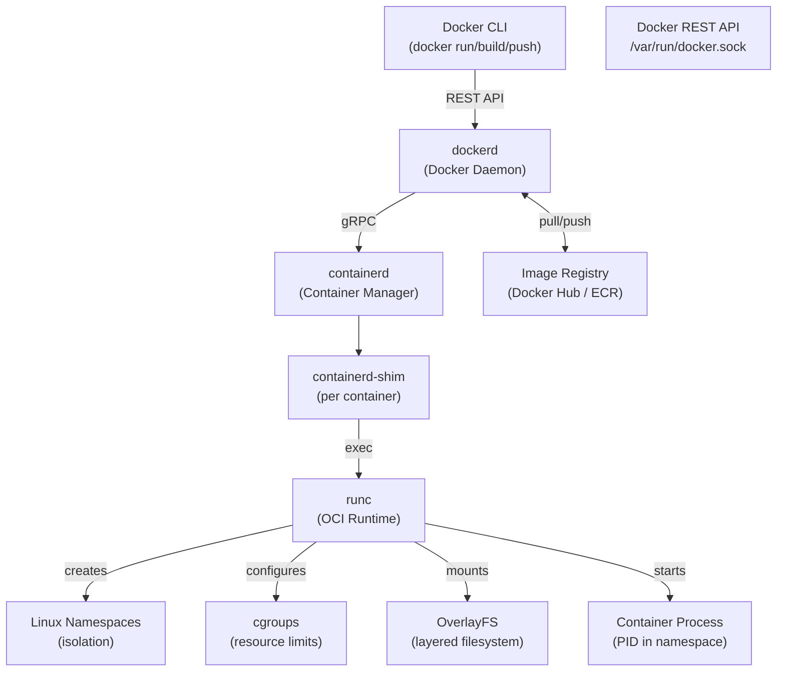
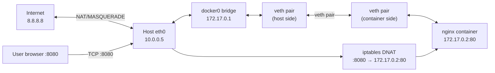
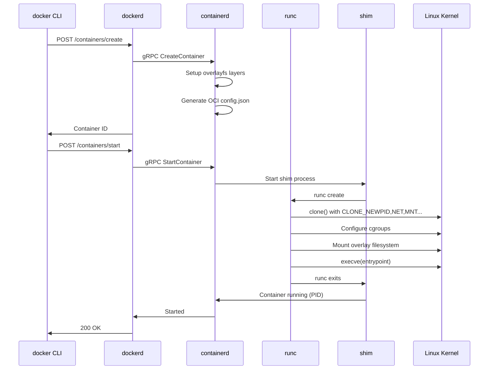

# Module 15: Docker Deep Internals

> **Phase:** 4 — Containers | **Level:** Beginner → Expert | **Prerequisites:** Modules 1, 2 (Linux, Networking)

---

## Table of Contents

1. [Introduction](#1-introduction)
2. [Internal Backend Architecture](#2-internal-backend-architecture)
3. [Linux Primitives — Namespaces & cgroups](#3-linux-primitives--namespaces--cgroups)
4. [Container Lifecycle Internals](#4-container-lifecycle-internals)
5. [Networking Deep Dive](#5-networking-deep-dive)
6. [Storage Internals](#6-storage-internals)
7. [Dockerfile Internals](#7-dockerfile-internals)
8. [Diagrams](#8-diagrams)
9. [Implementation](#9-implementation)
10. [Production Issues](#10-production-issues)
11. [Observability](#11-observability)
12. [Security](#12-security)
13. [Scaling & Performance](#13-scaling--performance)
14. [Interview Questions](#14-interview-questions)
15. [Hands-On Labs](#15-hands-on-labs)

---

## 1. Introduction

### What is Docker?

Docker is a **platform for packaging, distributing, and running applications in containers**. A container is a lightweight, isolated process that runs directly on the host kernel — not in a virtual machine.

**The key insight:** Docker doesn't create a new OS. It uses Linux kernel features (namespaces + cgroups) to isolate processes. A Docker container is just a **process with restrictions**.

### Why Docker was created

- Solomon Hykes created Docker at dotCloud (PaaS startup) in 2013.
- Problem: "It works on my machine" — dependency, environment, OS differences.
- Solution: Package application + ALL dependencies into one portable unit.
- The unit runs identically everywhere: laptop → CI → staging → production.

### What problem does Docker solve?

| Problem | Docker Solution |
|---|---|
| Dependency conflicts (Python 2 vs 3) | Each container has its own dependencies |
| "Works on my machine" | Image contains everything needed |
| Slow VM provisioning (minutes) | Container starts in milliseconds |
| OS sprawl in VMs | Containers share host kernel |
| Deployment consistency | Same image, same behavior everywhere |
| Microservice isolation | Each service in its own container |

### VMs vs Containers

```
Virtual Machine:
  Hardware
  └── Hypervisor (VMware, KVM, Hyper-V)
      ├── VM 1: Guest OS (Linux) + App A + deps
      ├── VM 2: Guest OS (Windows) + App B + deps
      └── VM 3: Guest OS (Linux) + App C + deps
  
  Each VM: full OS kernel → 1-10GB disk, seconds to start, 256MB+ overhead

Container:
  Hardware
  └── Host OS (Linux kernel)
      └── Container Runtime (containerd/Docker)
          ├── Container 1: App A + deps (namespaced process)
          ├── Container 2: App B + deps (namespaced process)
          └── Container 3: App C + deps (namespaced process)
  
  Each container: shared kernel → 10-100MB disk, milliseconds to start, minimal overhead

Key difference:
  VMs virtualize hardware → full OS per VM
  Containers virtualize OS → shared kernel, isolated processes
```

---

## 2. Internal Backend Architecture

### Docker Architecture (Daemon + Client + Registry)

```
Docker Client (CLI)
  docker build / run / push / pull / ...
       │
       │ UNIX socket: /var/run/docker.sock (local)
       │ TCP: 2375 (insecure) / 2376 (TLS) (remote)
       │ REST API (JSON over HTTP)
       ▼
Docker Daemon (dockerd)
  - Manages: images, containers, networks, volumes
  - Listens on unix:///var/run/docker.sock
  - Calls containerd via gRPC
       │
       │ gRPC: /run/containerd/containerd.sock
       ▼
containerd (container runtime manager)
  - Manages container lifecycle: create, start, stop, delete
  - Manages image storage (snapshots, layers)
  - Delegates to runc for actual container creation
  - OCI-compliant runtime interface (CRI for Kubernetes)
       │
       │ calls exec
       ▼
runc (low-level runtime)
  - Creates Linux namespaces
  - Configures cgroups
  - Sets up container filesystem (overlay mount)
  - Executes container's entrypoint process
  - Exits after container process starts (runc is not the parent)
       │
       ▼
shim (containerd-shim-runc-v2)
  - Becomes parent of container process after runc exits
  - Keeps container running even if containerd restarts
  - Reports container exit code to containerd
  - One shim per container
```

### Docker REST API

```bash
# Docker daemon exposes REST API on unix socket
# Any HTTP client can talk to Docker

# List containers (equivalent to docker ps)
curl --unix-socket /var/run/docker.sock http://localhost/containers/json

# Container info
curl --unix-socket /var/run/docker.sock \
  http://localhost/containers/<id>/json

# Start container
curl --unix-socket /var/run/docker.sock \
  -X POST http://localhost/containers/<id>/start

# Exec in container
curl --unix-socket /var/run/docker.sock \
  -X POST \
  -H "Content-Type: application/json" \
  -d '{"Cmd":["ls","/"],"AttachStdout":true,"AttachStderr":true}' \
  http://localhost/containers/<id>/exec

# This is why mounting /var/run/docker.sock into a container
# gives that container full Docker control → SECURITY RISK!
```

---

## 3. Linux Primitives — Namespaces & cgroups

### Namespaces — Isolation

```
Namespaces give each container its OWN VIEW of system resources.
The host and container see DIFFERENT things for the same resource.

Linux namespace types:

1. PID namespace
   Container sees: PID 1 = its init process
   Host sees: PID 12345 = container's init
   
   docker run ubuntu ps aux
   → Only sees its own processes (PID 1 = ps aux)
   
   ps aux on host:
   → 12345 /bin/bash (container's PID 1)
   → 12400 ps aux (container's PID 2, shown as 12400 on host)

2. Network namespace
   Container gets: own eth0, own IP, own iptables, own routing table
   Completely isolated network stack
   
   Container's eth0 = veth pair → host's docker0 bridge
   
   ip netns list        # list network namespaces
   ip netns exec <ns> ip addr  # run command in namespace

3. Mount namespace
   Container sees: its own filesystem (overlayfs mount)
   Host sees: container's rootfs at /var/lib/docker/overlay2/...
   
   Container's /etc/hosts is different from host's /etc/hosts
   
4. UTS namespace (Unix Timesharing System)
   Container has its own hostname
   Container's hostname doesn't affect host's hostname
   docker run --hostname myapp ubuntu hostname → myapp

5. IPC namespace (Inter-Process Communication)
   Container has isolated shared memory, semaphores, message queues
   Container processes can't IPC with host processes

6. User namespace
   Map container's root (UID 0) to non-root on host (e.g., UID 100000)
   Container thinks it's root, but host sees it as unprivileged user
   Rootless containers use this
   
7. Cgroup namespace (Linux 4.6+)
   Container sees only its own cgroup subtree

8. Time namespace (Linux 5.6+)
   Container has different system time
   Rarely used in Docker yet

Verify namespace isolation:
  # Run container
  docker run -d --name test nginx

  # Find container PID
  docker inspect test --format '{{.State.Pid}}'
  PID=<result>

  # See all namespaces for this process
  ls -la /proc/$PID/ns/
  # cgroup, ipc, mnt, net, pid, user, uts

  # Compare with host
  ls -la /proc/1/ns/
  # Different inode numbers = different namespaces
```

### cgroups — Resource Control

```
cgroups (control groups): limit and account for resource usage.
While namespaces provide isolation (what you see),
cgroups provide restriction (how much you can use).

cgroup v1 (legacy, still common):
  Separate hierarchy per resource: cpu, memory, blkio, net_cls
  /sys/fs/cgroup/memory/docker/<container-id>/
  /sys/fs/cgroup/cpu/docker/<container-id>/

cgroup v2 (modern, unified, kernel 4.5+, default Ubuntu 22+):
  Single unified hierarchy: /sys/fs/cgroup/
  All controllers in one place
  Better hierarchical resource management

Resource controllers:

1. Memory controller
   memory.limit_in_bytes       — hard limit (OOMKill if exceeded)
   memory.soft_limit_in_bytes  — soft limit (best effort)
   memory.swappiness           — swap behavior
   memory.oom_control          — OOM killer behavior
   
   # View container memory limit
   cat /sys/fs/cgroup/memory/docker/<id>/memory.limit_in_bytes
   
   # Container memory stats
   cat /sys/fs/cgroup/memory/docker/<id>/memory.stat

2. CPU controller
   cpu.cfs_period_us     — period (default 100000 = 100ms)
   cpu.cfs_quota_us      — quota within period
   # --cpus="1.5" sets quota = 1.5 * period = 150000
   # Container gets 1.5 CPUs worth of time per period
   
   cpu.shares            — relative weight (default 1024)
   # --cpu-shares=512: gets half the CPU of default-priority container
   
   # View CPU quota
   cat /sys/fs/cgroup/cpu/docker/<id>/cpu.cfs_quota_us

3. Block I/O controller
   blkio.throttle.read_bps_device   — read bytes/sec limit
   blkio.throttle.write_bps_device  — write bytes/sec limit
   blkio.weight                     — relative I/O weight

4. Network controller (tc, not cgroup)
   Network bandwidth via tc (traffic control)
   Not a cgroup controller — implemented via iptables + tc

Docker flags → cgroup settings:
  --memory="512m"          → memory.limit_in_bytes = 536870912
  --memory-swap="1g"       → memory.memsw.limit_in_bytes = 1073741824
  --cpus="1.5"             → cpu.cfs_quota_us = 150000
  --cpu-shares=512         → cpu.shares = 512
  --blkio-weight=300       → blkio.weight = 300
  --device-read-bps /dev/sda:10mb → blkio.throttle.read_bps_device
```

---

## 4. Container Lifecycle Internals

### What happens when you run `docker run nginx`

```
docker run nginx → docker pull (if not local) + docker create + docker start

Step 1: Image pull (if not cached)
  docker daemon → checks local image store
  → not found → contacts registry
  → GET https://registry-1.docker.io/v2/library/nginx/manifests/latest
  → Downloads manifest (list of layers)
  → Downloads each missing layer (parallel)
  → Stores layers in /var/lib/docker/overlay2/
  
Step 2: Container creation (docker create)
  docker daemon calls containerd
  containerd:
    a. Prepares rootfs (overlay filesystem):
       Lower layers: image layers (read-only)
       Upper layer: container-specific (read-write)
       Merged view: /var/lib/docker/overlay2/<id>/merged/
    
    b. Generates OCI runtime spec (config.json):
       Namespace specs (what namespaces to create)
       cgroup limits
       Mount points
       Capabilities to grant/drop
       Seccomp profile
       AppArmor profile
    
    c. Creates container bundle directory
  
Step 3: Container start (docker start)
  containerd calls runc:
  runc:
    a. Creates namespaces (clone syscall with CLONE_NEW* flags)
    b. Sets hostname in UTS namespace
    c. Mounts filesystems:
       /proc (procfs in PID namespace)
       /sys (sysfs)
       /dev (devtmpfs)
       Container rootfs (overlay)
       Bind mounts (volumes)
    d. Drops capabilities (default: non-root capabilities)
    e. Applies seccomp filter
    f. Sets cgroup limits
    g. Executes container's ENTRYPOINT/CMD
    h. runc exits (shim becomes new parent via PR_SET_CHILD_SUBREAPER)
  
  shim (containerd-shim-runc-v2):
    Stays as parent of container process
    Forwards signals, collects exit code
    Container can survive containerd restart

Step 4: Container runs
  Container PID 1 = ENTRYPOINT process
  If PID 1 exits → container exits
  Signals: docker stop sends SIGTERM to PID 1
  If SIGTERM ignored for 10s → SIGKILL

Step 5: Container stop/removal
  docker stop → SIGTERM to PID 1 → wait 10s → SIGKILL
  docker rm → containerd removes container state
  → overlayfs upper layer deleted
  → container's network namespace deleted
  → cgroup deleted
```

### The Overlay Filesystem

```
Every container gets a layered filesystem using overlayfs.

Image layers (read-only):
  Layer 3 (top): /etc/nginx/nginx.conf (from Dockerfile COPY)
  Layer 2:       /usr/sbin/nginx, /usr/lib/...
  Layer 1 (bottom): /bin, /lib, /usr, ... (base image: debian)

Container-specific layer (read-write):
  Container writes: log files, temp files, application data

Overlay mount:
  lowerdir = Layer1:Layer2:Layer3 (read-only, colon-separated)
  upperdir = Container's writable layer
  workdir  = Overlay working directory
  merged   = What container sees (union of all layers)

mount -t overlay overlay \
  -o lowerdir=/l/L1:/l/L2:/l/L3,\
     upperdir=/u/container1,\
     workdir=/w/container1 \
  /merged/container1

Copy-on-Write (CoW):
  Container reads /etc/nginx/nginx.conf → reads from lowerdir
  Container modifies /etc/nginx/nginx.conf:
    → kernel copies file to upperdir
    → container reads/writes from upperdir copy
    → original lowerdir file unchanged
  
  Result: multiple containers share same image layers → efficient

Verify:
  docker inspect <container> | grep -A5 GraphDriver
  # Shows: LowerDir, UpperDir, WorkDir, MergedDir

du -sh /var/lib/docker/overlay2/
# Total disk usage for all images and container layers
```

---

## 5. Networking Deep Dive

### Docker Network Modes

```
1. bridge (default)
   docker run nginx                    # uses bridge by default
   
   How:
     - docker0 bridge created at Docker start
     - Container gets veth pair: one end in container, one end on docker0
     - Container IP: 172.17.0.x (from docker0 subnet)
     - iptables NAT: container → internet via host IP (MASQUERADE)
   
   Communication:
     container → internet: SNAT via docker0 → eth0 → internet
     host → container: via docker0 bridge IP
     container → container (same bridge): direct via bridge
     internet → container: port publishing (iptables DNAT) required

2. host
   docker run --network=host nginx
   
   Container shares host network namespace.
   Container's process listens on host's eth0 directly.
   Port 80 in container = port 80 on host (no NAT needed).
   Maximum performance (no veth overhead).
   Security risk: container can see all host network interfaces.

3. none
   docker run --network=none nginx
   
   Container has only loopback interface.
   No network connectivity.
   Use: batch jobs that don't need network.

4. overlay (Docker Swarm / multi-host)
   Containers on DIFFERENT hosts can communicate.
   VXLAN tunneling: traffic encapsulated in UDP packets.
   Docker Swarm uses overlay for service networking.

5. macvlan
   Container gets its own MAC address on host network.
   Appears as physical device on the network.
   Gets IP directly from network (not NAT).
   Use: legacy apps expecting real network interface.

Custom bridge networks (preferred):
  docker network create myapp-net
  docker run --network=myapp-net --name db postgres
  docker run --network=myapp-net --name app myapp
  
  # On custom bridges: automatic DNS resolution by name!
  # app container can connect to "db" hostname
  # Default bridge: no DNS, must use IP
```

### Port Publishing Internals

```
docker run -p 8080:80 nginx
# Host port 8080 → Container port 80

How it works:
  1. Docker creates iptables DNAT rule:
     iptables -t nat -A DOCKER -p tcp --dport 8080 \
       -j DNAT --to-destination 172.17.0.2:80
  
  2. iptables FORWARD rule:
     iptables -A FORWARD -d 172.17.0.2/32 \
       -p tcp --dport 80 -j ACCEPT
  
  3. docker-proxy process:
     Listens on host:8080
     Forwards to container:80
     Used for edge cases (IPv6, host name resolution)
  
  Verify:
    iptables -t nat -L DOCKER -n --line-numbers
    iptables -L FORWARD -n | grep 172.17
    netstat -tlnp | grep docker-proxy
```

### Container DNS

```
DNS in containers:
  /etc/resolv.conf in container:
    nameserver 127.0.0.11     (embedded DNS in Docker daemon)
  
  Docker's embedded DNS server (127.0.0.11):
    - Runs inside Docker daemon
    - Resolves container names → IPs (on custom networks)
    - Forwards unknown queries to host DNS
  
  Custom network DNS resolution:
    docker network create mynet
    docker run -d --name db --network mynet postgres
    docker run -d --name app --network mynet myapp
    # Inside app container:
    curl http://db:5432  # "db" resolves to postgres container IP
    # Docker daemon answers DNS query: "db" → 172.18.0.2
  
  Default bridge: no automatic DNS
    Must use: docker inspect db | grep IPAddress → use IP directly
    Or: --link (deprecated)
```

---

## 6. Storage Internals

### Docker Volume Types

```
1. Named Volumes (managed by Docker)
   docker volume create mydata
   docker run -v mydata:/app/data myapp
   
   Storage: /var/lib/docker/volumes/mydata/_data/
   Managed by Docker: create, list, delete, inspect
   Survives container deletion
   Can be shared between containers
   
   Best for: persistent application data (DB data, uploads)

2. Bind Mounts (host path)
   docker run -v /host/path:/container/path myapp
   OR
   docker run --mount type=bind,source=/host/path,target=/container/path myapp
   
   Any host path → mounted in container
   Changes visible immediately (both ways)
   Host directory must exist
   
   Best for: development (source code, config files)
   Production caution: ties container to specific host path

3. tmpfs Mounts (in-memory)
   docker run --tmpfs /app/tmp myapp
   OR
   docker run --mount type=tmpfs,destination=/app/tmp myapp
   
   Mount in container → stored in host RAM
   Never written to disk
   Lost when container stops
   
   Best for: secrets in memory, sensitive temp files, performance

4. Docker storage drivers (what overlayfs uses):
   overlay2  — recommended for Linux (kernel 4.0+)
   devicemapper — legacy RHEL/CentOS
   aufs       — legacy Ubuntu/Debian
   btrfs/zfs  — filesystem-specific
   
   Check: docker info | grep "Storage Driver"
```

### Dockerfile Layer Caching

```
Each Dockerfile instruction creates a layer.
Docker caches layers — if instruction unchanged, use cached layer.
Cache invalidation: any change invalidates ALL subsequent layers.

CRITICAL ordering rule: most stable layers first, most changing last.

BAD (invalidates cache constantly):
  COPY . /app          ← any code change → all subsequent layers rebuilt
  RUN npm install      ← reinstalled every time!

GOOD (dependencies change rarely, code changes often):
  COPY package*.json /app/   ← only changes when deps change
  RUN npm install            ← only reinstalled when deps change
  COPY . /app               ← code changes don't affect npm install

Layer caching mechanism:
  For RUN/COPY/ADD: Docker hashes the instruction + context
  If hash matches cached layer → reuse
  If hash differs → run instruction, create new layer, invalidate rest

Docker BuildKit (modern build system):
  DOCKER_BUILDKIT=1 docker build .
  
  Improvements:
  - Parallel build stages (multi-stage)
  - Better cache invalidation
  - Build secrets (--secret) — not in image layers!
  - SSH forwarding during build
  - Improved output
  
  BuildKit cache:
  --mount=type=cache,target=/root/.m2   # persistent build cache
  --mount=type=cache,target=/root/.npm
```

---

## 7. Dockerfile Internals

### Dockerfile Instructions Deep Dive

```dockerfile
# Production-grade multi-stage Dockerfile for Java app

# ── Stage 1: Build ──────────────────────────────────────────────
FROM maven:3.9-openjdk-17 AS builder

# Set working directory
WORKDIR /build

# Copy dependency files first (cache optimization)
COPY pom.xml .
COPY .mvn/ .mvn/
COPY mvnw .

# Download dependencies (cached unless pom.xml changes)
RUN ./mvnw dependency:go-offline -B

# Copy source code (changes frequently — after dependency download)
COPY src/ src/

# Build application
RUN ./mvnw clean package -DskipTests -B

# ── Stage 2: Runtime ─────────────────────────────────────────────
# Use minimal JRE image (not full JDK)
FROM eclipse-temurin:17-jre-alpine AS runtime

# Security: Create non-root user
RUN addgroup -g 1001 -S appgroup && \
    adduser -u 1001 -S appuser -G appgroup

WORKDIR /app

# Copy only the artifact from builder (not source, not Maven)
COPY --from=builder /build/target/*.jar app.jar

# Set ownership
RUN chown -R appuser:appgroup /app

# Labels (OCI annotations)
LABEL org.opencontainers.image.title="payment-service"
LABEL org.opencontainers.image.version="1.0.0"
LABEL org.opencontainers.image.created="2024-01-01T00:00:00Z"

# Environment defaults (override at runtime)
ENV JAVA_OPTS="-XX:+UseContainerSupport -XX:MaxRAMPercentage=75.0"
ENV SERVER_PORT=8080

# Expose port (documentation only — doesn't publish)
EXPOSE 8080

# Healthcheck
HEALTHCHECK --interval=30s --timeout=10s --start-period=60s --retries=3 \
  CMD wget --quiet --tries=1 --spider http://localhost:8080/actuator/health || exit 1

# Switch to non-root user
USER appuser

# Entrypoint: runs as PID 1
ENTRYPOINT ["java", "-jar", "/app/app.jar"]

# CMD: default arguments (can be overridden)
CMD ["--spring.profiles.active=production"]
```

### ENTRYPOINT vs CMD

```dockerfile
# CMD only: can be overridden completely
CMD ["nginx", "-g", "daemon off;"]
docker run myimage /bin/bash   # overrides CMD completely

# ENTRYPOINT only: executable, arguments overridden
ENTRYPOINT ["nginx"]
docker run myimage -g "daemon off;"  # appended to nginx

# ENTRYPOINT + CMD: combined, CMD = default arguments
ENTRYPOINT ["nginx"]
CMD ["-g", "daemon off;"]
docker run myimage                        # runs: nginx -g "daemon off;"
docker run myimage -v                     # runs: nginx -v
docker run --entrypoint /bin/sh myimage  # overrides entrypoint

# Shell form vs Exec form:
# Exec form (array): runs directly, PID 1, receives signals properly
ENTRYPOINT ["java", "-jar", "app.jar"]     # CORRECT

# Shell form: runs via /bin/sh -c, signals go to shell not app
ENTRYPOINT java -jar app.jar              # WRONG for production
# docker stop sends SIGTERM to /bin/sh (PID 1), not to java
# Java doesn't get SIGTERM → graceful shutdown doesn't work
```

### Multi-stage Builds

```dockerfile
# Multi-stage: separate build and runtime environments
# Result: minimal production image (no build tools in production)

# Example: Node.js app
FROM node:18-alpine AS dependencies
WORKDIR /app
COPY package*.json .
RUN npm ci --only=production   # production deps only

FROM node:18-alpine AS builder
WORKDIR /app
COPY package*.json .
RUN npm ci                     # all deps (including dev)
COPY . .
RUN npm run build              # compile TypeScript, bundle, etc.

FROM node:18-alpine AS runtime
WORKDIR /app

# Only copy what's needed for production
COPY --from=dependencies /app/node_modules ./node_modules
COPY --from=builder /app/dist ./dist
COPY package*.json .

# No source code, no dev dependencies, no build tools in final image!
# Image size: 150MB vs 1GB+ with everything

RUN addgroup -S appgroup && adduser -S appuser -G appgroup
USER appuser

EXPOSE 3000
CMD ["node", "dist/server.js"]

# Build: docker build --target runtime -t myapp .
# Test specific stage: docker build --target builder -t myapp-debug .
```

---

## 8. Diagrams

### Mermaid: Docker Component Architecture



### Mermaid: Container Network Flow



### ASCII: Overlay Filesystem Layers

```
Container's View (/merged):
┌─────────────────────────────────────────────┐
│  /app/logs/access.log   (written by app)    │  ← Container layer (R/W)
│  /etc/nginx/nginx.conf  (modified config)   │  ← Container layer (CoW copy)
├─────────────────────────────────────────────┤
│  /etc/nginx/nginx.conf  (original)          │  ← Image Layer 3 (R/O)
│  /usr/sbin/nginx                            │  ← Image Layer 3 (R/O)
├─────────────────────────────────────────────┤
│  /usr/lib/nginx/...                         │  ← Image Layer 2 (R/O)
│  /usr/share/nginx/...                       │  ← Image Layer 2 (R/O)
├─────────────────────────────────────────────┤
│  /bin, /lib, /usr/bin (base debian/alpine)  │  ← Image Layer 1 (R/O)
└─────────────────────────────────────────────┘

On disk:
  /var/lib/docker/overlay2/<layer1>/diff/    (Layer 1)
  /var/lib/docker/overlay2/<layer2>/diff/    (Layer 2)
  /var/lib/docker/overlay2/<layer3>/diff/    (Layer 3)
  /var/lib/docker/overlay2/<container>/diff/ (R/W layer)
  /var/lib/docker/overlay2/<container>/merged/ (union view)
```

### Mermaid: Container Start Sequence



---

## 9. Implementation

### Production Docker Setup

```bash
# Install Docker (Ubuntu 22.04)
sudo apt-get update
sudo apt-get install -y ca-certificates curl gnupg
sudo install -m 0755 -d /etc/apt/keyrings
curl -fsSL https://download.docker.com/linux/ubuntu/gpg | \
  sudo gpg --dearmor -o /etc/apt/keyrings/docker.gpg

echo "deb [arch=$(dpkg --print-architecture) signed-by=/etc/apt/keyrings/docker.gpg] \
  https://download.docker.com/linux/ubuntu $(lsb_release -cs) stable" | \
  sudo tee /etc/apt/sources.list.d/docker.list > /dev/null

sudo apt-get update
sudo apt-get install -y docker-ce docker-ce-cli containerd.io docker-buildx-plugin

# Add user to docker group (avoid sudo)
sudo usermod -aG docker $USER
newgrp docker
```

### Production Docker Daemon Configuration

```json
// /etc/docker/daemon.json
{
  "log-driver": "json-file",
  "log-opts": {
    "max-size": "100m",
    "max-file": "5"
  },
  
  "storage-driver": "overlay2",
  
  "registry-mirrors": ["https://mirror.example.com"],
  
  "default-address-pools": [
    {"base": "172.30.0.0/16", "size": 24}
  ],
  
  "dns": ["8.8.8.8", "8.8.4.4"],
  
  "userns-remap": "default",
  
  "live-restore": true,
  
  "max-concurrent-downloads": 10,
  "max-concurrent-uploads": 5,
  
  "exec-opts": ["native.cgroupdriver=systemd"],
  
  "metrics-addr": "0.0.0.0:9323",
  "experimental": false
}
```

```bash
# Apply and restart
sudo systemctl daemon-reload
sudo systemctl restart docker
docker info  # verify settings
```

### Docker Compose — Production Pattern

```yaml
# docker-compose.yml — production multi-service setup
version: '3.8'

services:
  nginx:
    image: nginx:1.25-alpine
    ports:
      - "80:80"
      - "443:443"
    volumes:
      - ./nginx/nginx.conf:/etc/nginx/nginx.conf:ro
      - ./nginx/certs:/etc/nginx/certs:ro
      - nginx-logs:/var/log/nginx
    depends_on:
      app:
        condition: service_healthy
    networks:
      - frontend
    restart: unless-stopped
    logging:
      driver: json-file
      options:
        max-size: "50m"
        max-file: "3"
    deploy:
      resources:
        limits:
          cpus: '0.5'
          memory: 128M

  app:
    image: registry.example.com/payment-service:1.2.3
    environment:
      SPRING_PROFILES_ACTIVE: production
      DB_URL: jdbc:postgresql://db:5432/payments
      DB_USERNAME: ${DB_USERNAME}
      DB_PASSWORD_FILE: /run/secrets/db_password
    secrets:
      - db_password
    depends_on:
      db:
        condition: service_healthy
      redis:
        condition: service_healthy
    networks:
      - frontend
      - backend
    healthcheck:
      test: ["CMD", "wget", "--quiet", "--tries=1", "--spider", "http://localhost:8080/actuator/health"]
      interval: 30s
      timeout: 10s
      retries: 3
      start_period: 60s
    restart: unless-stopped
    deploy:
      resources:
        limits:
          cpus: '2'
          memory: 1G
        reservations:
          cpus: '0.5'
          memory: 512M
    logging:
      driver: json-file
      options:
        max-size: "100m"
        max-file: "5"

  db:
    image: postgres:15-alpine
    volumes:
      - postgres-data:/var/lib/postgresql/data
      - ./postgres/init.sql:/docker-entrypoint-initdb.d/init.sql:ro
    environment:
      POSTGRES_DB: payments
      POSTGRES_USER: ${DB_USERNAME}
      POSTGRES_PASSWORD_FILE: /run/secrets/db_password
    secrets:
      - db_password
    networks:
      - backend
    healthcheck:
      test: ["CMD-SHELL", "pg_isready -U ${DB_USERNAME} -d payments"]
      interval: 10s
      timeout: 5s
      retries: 5
    restart: unless-stopped
    deploy:
      resources:
        limits:
          cpus: '2'
          memory: 2G

  redis:
    image: redis:7-alpine
    command: redis-server --maxmemory 512mb --maxmemory-policy allkeys-lru
    volumes:
      - redis-data:/data
    networks:
      - backend
    healthcheck:
      test: ["CMD", "redis-cli", "ping"]
      interval: 10s
      timeout: 5s
      retries: 5
    restart: unless-stopped

volumes:
  postgres-data:
    driver: local
  redis-data:
    driver: local
  nginx-logs:
    driver: local

networks:
  frontend:
    driver: bridge
  backend:
    driver: bridge
    internal: true   # no internet access from backend network

secrets:
  db_password:
    file: ./secrets/db_password.txt
```

### Essential Docker Commands

```bash
#─────────────────────────────────────────────
# IMAGES
#─────────────────────────────────────────────
docker images                              # list local images
docker images --format "{{.Repository}}:{{.Tag}}\t{{.Size}}"
docker pull nginx:1.25-alpine             # pull from registry
docker push registry.example.com/myapp:1.0
docker build -t myapp:1.0 .               # build from Dockerfile
docker build -t myapp:1.0 --no-cache .   # force rebuild
docker tag myapp:1.0 registry.example.com/myapp:1.0

# Inspect image
docker inspect nginx:latest
docker history nginx:latest               # show layers
docker image inspect --format '{{.RootFS.Layers}}' nginx

# Cleanup
docker rmi myapp:1.0                      # remove image
docker image prune                        # remove dangling images
docker image prune -a                     # remove ALL unused images
docker system prune -af                   # remove everything unused (CAREFUL)

#─────────────────────────────────────────────
# CONTAINERS
#─────────────────────────────────────────────
docker ps                                  # running containers
docker ps -a                              # all containers
docker ps --format "table {{.Names}}\t{{.Status}}\t{{.Ports}}"

docker run -d \                           # detached mode
  --name myapp \                          # named container
  -p 8080:80 \                            # port mapping
  -e ENV_VAR=value \                      # environment variable
  -v /host/path:/container/path \         # bind mount
  -v myvolume:/data \                     # named volume
  --memory="512m" \                       # memory limit
  --cpus="1.5" \                          # CPU limit
  --restart=unless-stopped \              # restart policy
  --network=mynet \                       # custom network
  nginx:1.25-alpine

# Container lifecycle
docker start <name>
docker stop <name>            # SIGTERM → 10s → SIGKILL
docker stop -t 30 <name>      # custom timeout
docker restart <name>
docker kill <name>             # immediate SIGKILL

# Execute commands in running container
docker exec -it myapp bash              # interactive shell
docker exec myapp cat /etc/nginx/nginx.conf  # one-off command
docker exec -it myapp sh -c "ps aux"

# Logs
docker logs myapp                       # all logs
docker logs myapp -f                    # follow
docker logs myapp -n 100               # last 100 lines
docker logs myapp --since="1h"         # last hour
docker logs myapp 2>&1 | grep ERROR    # filter errors

# Stats
docker stats                            # live resource usage
docker stats --no-stream               # snapshot
docker top myapp                        # processes in container

# Copy files
docker cp myapp:/app/config.yaml ./config.yaml
docker cp ./config.yaml myapp:/app/config.yaml

# Cleanup
docker rm myapp                         # remove stopped container
docker rm -f myapp                      # force remove (even if running)
docker container prune                  # remove all stopped containers

#─────────────────────────────────────────────
# NETWORKS
#─────────────────────────────────────────────
docker network ls
docker network create --driver bridge mynet
docker network create --subnet=10.0.1.0/24 mynet2
docker network inspect mynet
docker network connect mynet mycontainer      # add container to network
docker network disconnect mynet mycontainer   # remove from network
docker network rm mynet
docker network prune

#─────────────────────────────────────────────
# VOLUMES
#─────────────────────────────────────────────
docker volume ls
docker volume create mydata
docker volume inspect mydata
docker volume rm mydata
docker volume prune

#─────────────────────────────────────────────
# SYSTEM
#─────────────────────────────────────────────
docker info                             # system info
docker system df                        # disk usage
docker system df -v                     # detailed disk usage
docker system prune -af --volumes       # DANGER: remove everything
```

---

## 10. Production Issues

### Issue 1: Container OOMKilled

```
Symptoms:
  docker ps shows: Status "Exited (137)"
  Exit code 137 = killed by signal 9 (SIGKILL) = OOMKilled
  Application logs stop suddenly with no error

Diagnosis:
  # Check container exit code
  docker inspect <container> --format '{{.State.ExitCode}}'
  # 137 = OOMKilled

  # Check OOM events in kernel
  dmesg | grep -i "oom\|killed process"
  journalctl -k | grep oom

  # Check container memory limit and usage
  docker stats --no-stream <container>
  docker inspect <container> | grep -i memory

  # If Kubernetes:
  kubectl describe pod <pod>  # look for: OOMKilled in state

Root causes:
  - Memory limit too low
  - Memory leak in application
  - JVM not respecting container memory limits (Java 8)

Fixes:
  # Increase memory limit
  docker run --memory=1g myapp

  # Java 8 (doesn't read cgroup limits by default):
  java -XX:+UseCGroupMemoryLimitForHeap -jar app.jar
  # Java 11+: automatic container support
  java -XX:+UseContainerSupport -XX:MaxRAMPercentage=75 -jar app.jar

  # Check for memory leaks:
  # Enable heap dump on OOM:
  java -XX:+HeapDumpOnOutOfMemoryError -XX:HeapDumpPath=/tmp/heapdump.hprof -jar app.jar
  docker cp <container>:/tmp/heapdump.hprof ./
  # Analyze with Eclipse MAT

Prevention:
  - Always set --memory limits
  - Monitor: docker stats, prometheus container metrics
  - Alert: container_memory_usage_bytes / container_spec_memory_limit_bytes > 0.9
```

### Issue 2: Container Won't Start — Port Already in Use

```
Symptoms:
  docker: Error response from daemon: driver failed programming external connectivity:
  Bind for 0.0.0.0:8080 failed: port is already allocated.

Diagnosis:
  ss -tlnp | grep 8080         # who owns port 8080?
  docker ps -a | grep 8080     # stopped container still mapped?
  
  # Another container or process using the port
  lsof -i :8080

Fix:
  # Remove stopped container with port mapping
  docker rm <stopped-container>
  
  # Kill the conflicting process
  kill -9 $(lsof -ti :8080)
  
  # Use different host port
  docker run -p 8081:8080 myapp
  
  # Use 0 for random port
  docker run -p 0:8080 myapp
  docker port myapp  # see which port was assigned
```

### Issue 3: Image Pull Failures

```
Symptoms:
  Error response from daemon: pull access denied for image
  Error: failed to pull image — no matching manifest for linux/arm64
  toomanyrequests: rate limited by Docker Hub

Diagnosis and fixes:

  # Authentication failure:
  docker login registry.example.com
  docker pull registry.example.com/myapp:1.0

  # Docker Hub rate limit (100 pulls/6h unauthenticated, 200/6h free):
  docker login   # with Docker Hub account (200 pulls/6h)
  # Or: use a paid Docker Hub account
  # Or: use a private registry (ECR, GCR, Harbor)
  
  # Architecture mismatch (Apple M1/M2):
  # Use multi-platform image build:
  docker buildx build --platform linux/amd64,linux/arm64 -t myapp:1.0 --push .
  
  # Pull for specific platform:
  docker pull --platform linux/amd64 myapp:1.0

  # Registry not reachable:
  curl -v https://registry.example.com/v2/
  # Check: DNS, TLS cert, firewall, registry auth
```

### Issue 4: Dockerfile Build Cache Misses

```
Symptoms:
  Every build reinstalls all dependencies (slow)
  "--->" shows all steps running, no "Using cache"

Why this happens:
  - COPY . . before installing dependencies → code change invalidates cache
  - Not ordering layers from stable to changing
  - Using ADD instead of COPY (ADD has different caching)
  - --no-cache flag used

Fix pattern:
  # BAD:
  COPY . .             # code changes → npm install always runs
  RUN npm install

  # GOOD:
  COPY package*.json .  # only changes when deps change
  RUN npm install       # cached unless deps change
  COPY . .              # code changes don't affect above

  # BuildKit cache mounts (persistent cache between builds):
  RUN --mount=type=cache,target=/root/.npm \
      npm install

  # Verify cache behavior:
  docker build --progress=plain .  # see which steps use cache
```

### Issue 5: Container Can't Connect to Database

```
Symptoms:
  Connection refused / Cannot connect to <hostname>
  works on host, fails in container

Diagnosis:
  # Check if DB is reachable from container
  docker exec -it myapp sh
  # Inside container:
  ping db                      # if on same custom network → should resolve
  nc -zv db 5432               # TCP check
  
  # Default bridge network: no DNS
  # Custom bridge: DNS works by container name
  docker network inspect bridge
  docker network inspect mynet

Root causes:
  1. Default bridge network: no DNS between containers
     Fix: use custom bridge (docker network create)
  
  2. DB listening on 127.0.0.1 only (host loopback)
     Container can't reach host's loopback
     Fix: DB must listen on 0.0.0.0 or bridge IP
     OR: use host.docker.internal (on Mac/Windows)
     OR: --network=host (Linux)
  
  3. Firewall blocking container traffic
     iptables -L DOCKER-USER -v -n
     Fix: iptables -I DOCKER-USER -j ACCEPT (broad) or specific rule
  
  4. Wrong network — containers on different networks
     docker network connect mynet db-container
     OR: use docker-compose (auto-creates shared network)
  
  5. DB not ready yet (timing issue)
     Add healthcheck + depends_on with condition: service_healthy
```

---

## 11. Observability

### Container Monitoring

```bash
# Built-in stats
docker stats                         # live: CPU%, MEM usage/limit, NET I/O, BLOCK I/O
docker stats --no-stream             # snapshot for scripting
docker stats --format "table {{.Name}}\t{{.CPUPerc}}\t{{.MemUsage}}"

# Events (real-time)
docker events                        # all events: start, stop, die, OOM, pull
docker events --filter type=container
docker events --filter event=oom     # only OOM events
docker events --since="1h"

# Inspect container state
docker inspect <container> | python3 -m json.tool

# cgroup metrics (direct from kernel)
# Memory usage:
cat /sys/fs/cgroup/memory/docker/<id>/memory.usage_in_bytes
cat /sys/fs/cgroup/memory/docker/<id>/memory.max_usage_in_bytes

# CPU stats:
cat /sys/fs/cgroup/cpuacct/docker/<id>/cpuacct.usage

# Network stats:
cat /proc/$(docker inspect --format '{{.State.Pid}}' <container>)/net/dev

# Prometheus + cAdvisor (recommended for production):
docker run -d \
  --name=cadvisor \
  --volume=/var/run/docker.sock:/var/run/docker.sock:ro \
  --volume=/sys:/sys:ro \
  --volume=/var/lib/docker/:/var/lib/docker:ro \
  -p 8080:8080 \
  gcr.io/cadvisor/cadvisor:latest

# cAdvisor exposes metrics at :8080/metrics
# Key metrics:
  container_cpu_usage_seconds_total
  container_memory_usage_bytes
  container_memory_working_set_bytes
  container_network_receive_bytes_total
  container_network_transmit_bytes_total
  container_fs_reads_bytes_total
  container_fs_writes_bytes_total
```

---

## 12. Security

### Container Security Best Practices

```dockerfile
# 1. Use minimal base images
FROM scratch          # empty (for static Go binaries)
FROM alpine:3.18      # tiny (5MB)
FROM debian:slim      # slightly larger but more compatible
FROM distroless       # Google's minimal images, no shell

# 2. Run as non-root user
RUN addgroup -S appgroup && adduser -S appuser -G appgroup
USER appuser          # ALWAYS set USER

# 3. Read-only filesystem
docker run --read-only --tmpfs /tmp myapp
# Or in compose:
#   read_only: true
#   tmpfs: /tmp

# 4. Drop all capabilities, add only needed ones
docker run --cap-drop=ALL --cap-add=NET_BIND_SERVICE myapp
# Common needed: NET_BIND_SERVICE (ports < 1024)
# Rarely needed: SYS_ADMIN, SYS_PTRACE

# 5. No new privileges
docker run --security-opt=no-new-privileges myapp

# 6. Seccomp profile (restrict syscalls)
docker run --security-opt seccomp=/etc/docker/seccomp-profile.json myapp
# Default: Docker applies a default seccomp profile (blocks ~44 syscalls)

# 7. AppArmor profile (Mandatory Access Control)
docker run --security-opt apparmor=docker-default myapp

# 8. Never mount Docker socket inside container
# DANGEROUS: gives container full Docker control
docker run -v /var/run/docker.sock:/var/run/docker.sock ...  # AVOID

# 9. Use secrets (not environment variables for passwords)
# Docker secrets (Swarm mode) or K8s secrets
# NOT: ENV DB_PASSWORD=mysecret (visible in docker inspect!)

# 10. Scan images for vulnerabilities
docker scout cves myapp:latest    # Docker Scout
trivy image myapp:latest          # Trivy (recommended)
grype myapp:latest                # Grype
snyk container test myapp:latest  # Snyk
```

### Docker Bench Security

```bash
# Run Docker Bench Security (CIS benchmark)
docker run -it --net host --pid host --userns host --cap-add audit_control \
  -e DOCKER_CONTENT_TRUST=$DOCKER_CONTENT_TRUST \
  -v /etc:/etc:ro \
  -v /usr/bin/containerd:/usr/bin/containerd:ro \
  -v /usr/bin/runc:/usr/bin/runc:ro \
  -v /usr/lib/systemd:/usr/lib/systemd:ro \
  -v /var/lib:/var/lib:ro \
  -v /var/run/docker.sock:/var/run/docker.sock:ro \
  --label docker_bench_security \
  docker/docker-bench-security

# Checks: Docker daemon config, container configs, image security
# Gives PASS/WARN/INFO for each check
```

---

## 13. Scaling & Performance

### Docker Performance Tuning

```bash
# 1. Storage driver performance
# overlay2 is fastest on Linux
docker info | grep "Storage Driver"

# For databases: use bind mounts or named volumes
# NOT the overlay filesystem (CoW overhead on every write)
docker run -v /fast-ssd/pgdata:/var/lib/postgresql/data postgres

# 2. Network performance
# For same-host communication: avoid bridge overhead
# Use host networking for maximum throughput (sacrifices isolation)
docker run --network=host myapp

# 3. Container resources
# Set CPU pinning for latency-sensitive workloads
docker run --cpuset-cpus=0,1 myapp   # pin to CPU 0 and 1
# Avoids NUMA latency

# 4. Build performance
# Enable BuildKit
export DOCKER_BUILDKIT=1

# Cache mount for package managers
RUN --mount=type=cache,target=/root/.m2 mvn package
RUN --mount=type=cache,target=/root/.npm npm ci

# Multi-platform builds
docker buildx create --use
docker buildx build --platform linux/amd64,linux/arm64 -t myapp .

# 5. Image size optimization
# Use multi-stage builds
# Alpine base images
# Delete package manager cache:
RUN apt-get install -y curl && \
    rm -rf /var/lib/apt/lists/*   # ← removes package cache from layer

# 6. Registry performance
# Mirror frequently-used images to private registry
# Use registry pull-through cache:
# /etc/docker/daemon.json: "registry-mirrors": ["https://mirror.example.com"]
```

---

## 14. Interview Questions

### Beginner

**Q1: What is the difference between a Docker image and a container?**

```
Image:
  Read-only template for creating containers.
  Contains: OS files, application code, dependencies, config.
  Built from Dockerfile. Stored in registry.
  Immutable — doesn't change while running.
  Like a class definition in OOP.

Container:
  Running instance of an image.
  Has: all image layers (read-only) + writable layer on top.
  Has: own namespaces (PID, network, mount, etc.).
  Has: own cgroup limits.
  Can be started, stopped, paused, deleted.
  Like an object instance in OOP.

Multiple containers from one image:
  docker run -d --name nginx1 nginx
  docker run -d --name nginx2 nginx
  Two containers, same image, independent writable layers.

Key difference:
  Image = template (disk).
  Container = running process (with isolated view + resource limits).
```

**Q2: What happens to data when a container is removed?**

```
Container's writable layer (overlay upperdir) is DELETED.
Any data written inside the container is LOST.

To persist data:
  1. Named volumes: -v myvolume:/data
     Survives container deletion.
     Managed by Docker. Lives in /var/lib/docker/volumes/
     
  2. Bind mounts: -v /host/path:/data
     Host directory survives. Not managed by Docker.
     
  3. External storage:
     S3, NFS, database → write data outside container

What survives removal:
  Named volumes: YES (must be explicitly removed: docker volume rm)
  Bind mounts: YES (it's a host directory)
  Container logs: NO (unless using log driver to external system)
  Environment variables: NO
  
Why containers are designed this way:
  Immutable infrastructure: treat containers as cattle, not pets.
  If you need to update → build new image, start new container.
  State lives in volumes/databases, not containers.
```

### Intermediate

**Q3: Explain Docker networking — how do two containers on the same host communicate?**

```
Default bridge network:
  Both containers on docker0 bridge.
  Each has veth pair: container side + bridge side.
  Direct layer-2 communication via bridge.
  NO DNS: must use IP addresses.
  
  Container A (172.17.0.2) → bridge → Container B (172.17.0.3)
  Packet traversal:
    Container A eth0 → veth A → docker0 bridge → veth B → Container B eth0
  
  iptables FORWARD: allows inter-container traffic on bridge.

Custom bridge network (recommended):
  docker network create mynet
  docker run --network=mynet --name db postgres
  docker run --network=mynet --name app myapp
  
  App can reach DB using: db:5432 (DNS by container name)
  Docker's embedded DNS (127.0.0.11) resolves "db" → 172.18.0.2
  
  Advantages over default bridge:
  - Automatic DNS by container name
  - Network isolation (only containers on same network can communicate)
  - Can have multiple isolated networks

For inter-network communication:
  Container must be connected to BOTH networks.
  docker network connect net2 container1
```

**Q4: What is the difference between COPY and ADD in Dockerfile?**

```
COPY: simple file copy. Recommended for almost all cases.
  COPY src.txt /dest/
  COPY ./local-dir/ /container-dir/
  Only copies local files.

ADD: COPY + extra features. Use only when you need those features.
  Feature 1: Auto-extract tar archives
    ADD archive.tar.gz /dest/  → extracts archive!
    COPY archive.tar.gz /dest/ → copies archive as-is
  
  Feature 2: Copy from URLs (not recommended)
    ADD https://example.com/file.txt /dest/
    Problem: downloads every build (no caching if URL content changes)
    Better: RUN curl -fsSL https://... > /dest/file.txt (explicit)

Cache behavior difference:
  COPY: cached based on local file content
  ADD tar: cached based on checksum of archive
  ADD URL: NEVER cached — always re-downloads

Best practice:
  Use COPY unless you specifically need tar extraction.
  For URL downloads: use RUN curl/wget (more explicit and cacheable).
  
  # Download + verify checksum:
  RUN curl -fsSL https://example.com/binary -o /usr/local/bin/binary && \
      echo "abc123  /usr/local/bin/binary" | sha256sum -c && \
      chmod +x /usr/local/bin/binary
```

### Advanced

**Q5: How do Linux namespaces and cgroups work together to create container isolation?**

```
They are complementary mechanisms:

Namespaces → WHAT you can see:
  PID namespace:    Process 1 in container = PID 4523 on host
  Network namespace: Container eth0 ≠ host eth0
  Mount namespace:  Container /etc ≠ host /etc
  UTS namespace:    Container hostname = "myapp" ≠ host hostname
  IPC namespace:    Container can't share memory with host processes
  User namespace:   Container root (UID 0) = host UID 100000
  
  Each namespace = isolated view of one resource type.
  Container thinks it's alone, but it's not.

cgroups → HOW MUCH you can use:
  memory: 512MB max (OOMKill if exceeded)
  cpu: 1.5 cores worth of time (throttled if exceeded)
  blkio: 10MB/s read limit
  
  cgroups don't affect what processes see, only resource consumption.

Together:
  Namespace makes container think it has the whole system (isolation).
  cgroups prevent container from using too much (restriction).
  
  Without namespaces: container could see host processes, network, files.
  Without cgroups: container could monopolize CPU/memory, starving others.
  
  runc creates both simultaneously:
  clone(CLONE_NEWPID | CLONE_NEWNET | CLONE_NEWNS | CLONE_NEWUTS | CLONE_NEWIPC)
  Then: writes PID to cgroup file, applies limits.

Container escape attacks target:
  Namespace escapes: exploit kernel bugs to break out of namespace
  cgroup escapes: bypass limits (less common)
  Mitigation: seccomp, AppArmor, capabilities dropping, user namespaces
```

**Q6: Walk me through what happens when you run `docker build`.**

```
docker build -t myapp:1.0 .

1. Docker client:
   - Reads Dockerfile
   - Creates "build context" — tars current directory (or --file path)
   - Sends build context to Docker daemon via API
   (Why context matters: large .git or node_modules → slow transfer → use .dockerignore)

2. Docker daemon receives context + Dockerfile.
   Calls BuildKit (DOCKER_BUILDKIT=1) or legacy builder.

3. For each Dockerfile instruction:
   
   FROM ubuntu:22.04:
     Pull image if not cached.
     Start with Ubuntu's layers as base.
   
   RUN apt-get install -y curl:
     Check build cache: hash of (previous layer hash + instruction)
     If cached: use cached layer (skip execution)
     If not: create temp container from previous state
             execute: /bin/sh -c "apt-get install -y curl"
             capture filesystem changes (new/modified files)
             create new immutable layer (sha256 hash)
             delete temp container
   
   COPY package.json .:
     Hash: previous layer hash + COPY instruction + file content hash
     If file unchanged: use cache
     If changed: copy file into new layer, invalidate all subsequent caches
   
   CMD ["node", "server.js"]:
     Metadata only — no new layer
     Stored in image manifest

4. Final image = all layers + metadata (entrypoint, env, ports, labels)
   Tagged: myapp:1.0
   Image ID = SHA256 of image manifest

Build context optimization:
  .dockerignore (like .gitignore):
    node_modules
    .git
    *.log
    dist/
    .env
  Reduces context size from 500MB to 1MB → much faster builds
```

---

## 15. Hands-On Labs

### Lab 1: Beginner — Build and Run

```bash
# Create a simple Node.js app
mkdir docker-lab && cd docker-lab

cat > server.js << 'EOF'
const http = require('http');
const os = require('os');

const server = http.createServer((req, res) => {
  res.writeHead(200, {'Content-Type': 'text/plain'});
  res.end(`Hello from container!\nHostname: ${os.hostname()}\nPID: ${process.pid}\n`);
});

server.listen(3000, () => console.log('Server running on port 3000'));
EOF

cat > package.json << 'EOF'
{"name":"docker-lab","version":"1.0.0","main":"server.js"}
EOF

# Write Dockerfile
cat > Dockerfile << 'EOF'
FROM node:18-alpine
WORKDIR /app
COPY package.json .
COPY server.js .
EXPOSE 3000
CMD ["node", "server.js"]
EOF

# Build
docker build -t myapp:1.0 .
docker images | grep myapp          # see the image

# Run
docker run -d --name myapp -p 3000:3000 myapp:1.0
docker ps                           # verify running
curl http://localhost:3000          # test it
docker logs myapp                   # see output

# Inspect container internals
docker inspect myapp | grep -E "IPAddress|Pid|Networks"
docker exec -it myapp sh            # enter container
# Inside: hostname, ps aux, ip addr (see isolated view)
exit

# Cleanup
docker stop myapp && docker rm myapp
docker rmi myapp:1.0
```

### Lab 2: Intermediate — Namespaces Exploration

```bash
# Objective: see namespaces and cgroups in action

# Run container
docker run -d --name nstest --memory=256m --cpus=0.5 nginx

# Get container PID on host
PID=$(docker inspect nstest --format '{{.State.Pid}}')
echo "Container PID on host: $PID"

# See its namespaces
ls -la /proc/$PID/ns/

# Compare with host process (PID 1)
echo "Container net ns inode: $(stat -L -c '%i' /proc/$PID/ns/net)"
echo "Host net ns inode: $(stat -L -c '%i' /proc/1/ns/net)"
# Different inodes = different namespaces!

# See cgroup limits
echo "=== Memory Limit ==="
cat /sys/fs/cgroup/memory/docker/$(docker inspect nstest --format '{{.Id}}')/memory.limit_in_bytes

echo "=== CPU Quota ==="
cat /sys/fs/cgroup/cpu/docker/$(docker inspect nstest --format '{{.Id}}')/cpu.cfs_quota_us
echo "Period: $(cat /sys/fs/cgroup/cpu/docker/$(docker inspect nstest --format '{{.Id}}')/cpu.cfs_period_us)"

# Network namespace exploration
# On host: can't see container's eth0 directly
ip addr show | grep docker

# Enter container network namespace
nsenter -n -t $PID ip addr show
# See container's network interfaces from host!

# Overlay filesystem
docker inspect nstest | grep -A10 GraphDriver
# See: LowerDir, UpperDir, MergedDir

docker stop nstest && docker rm nstest
```

### Lab 3: Advanced — Multi-stage Build + Security

```bash
# Objective: production-ready secure image

mkdir secure-lab && cd secure-lab

cat > main.go << 'EOF'
package main

import (
    "fmt"
    "net/http"
    "os"
)

func main() {
    http.HandleFunc("/health", func(w http.ResponseWriter, r *http.Request) {
        fmt.Fprintf(w, `{"status":"ok","hostname":"%s"}`, os.Getenv("HOSTNAME"))
    })
    http.ListenAndServe(":8080", nil)
}
EOF

cat > Dockerfile << 'EOF'
# Build stage
FROM golang:1.21-alpine AS builder
WORKDIR /build
COPY main.go .
RUN CGO_ENABLED=0 GOOS=linux go build -a -installsuffix cgo -o server main.go

# Runtime: scratch (empty) image — no OS at all!
FROM scratch
COPY --from=builder /build/server /server
EXPOSE 8080
ENTRYPOINT ["/server"]
EOF

# Build
docker build -t secure-app:1.0 .

# Image size
docker images secure-app
# Should be < 10MB (only the binary!)

# Run with strict security
docker run -d \
  --name secure-app \
  -p 8080:8080 \
  --read-only \
  --cap-drop=ALL \
  --security-opt=no-new-privileges \
  --memory=64m \
  --cpus=0.25 \
  secure-app:1.0

curl http://localhost:8080/health

# Verify security settings
docker inspect secure-app | grep -E "ReadonlyRootfs|CapDrop|NoNewPrivileges|Memory"

# Scan for vulnerabilities
# (requires trivy installed)
trivy image secure-app:1.0
# Should show: 0 vulnerabilities (empty OS = nothing to scan!)

docker stop secure-app && docker rm secure-app
```

### Lab 4: Production Simulation — Docker Compose + Networking

```bash
# Full stack: nginx + app + postgres + redis

mkdir compose-lab && cd compose-lab
mkdir -p app nginx

cat > app/server.js << 'EOF'
const http = require('http');
const redis = require('redis');

const client = redis.createClient({url: 'redis://redis:6379'});
client.connect().catch(console.error);

http.createServer(async (req, res) => {
  try {
    const count = await client.incr('requests');
    res.writeHead(200, {'Content-Type': 'application/json'});
    res.end(JSON.stringify({requests: count, host: require('os').hostname()}));
  } catch(e) {
    res.writeHead(500); res.end(e.message);
  }
}).listen(3000, () => console.log('App ready'));
EOF

cat > app/package.json << 'EOF'
{"name":"app","dependencies":{"redis":"4.6.0"}}
EOF

cat > app/Dockerfile << 'EOF'
FROM node:18-alpine
WORKDIR /app
COPY package.json .
RUN npm install
COPY server.js .
CMD ["node", "server.js"]
EOF

cat > nginx/nginx.conf << 'EOF'
events {}
http {
  upstream app { server app:3000; }
  server {
    listen 80;
    location / { proxy_pass http://app; }
  }
}
EOF

cat > docker-compose.yml << 'EOF'
version: '3.8'
services:
  nginx:
    image: nginx:alpine
    ports: ["80:80"]
    volumes: [./nginx/nginx.conf:/etc/nginx/nginx.conf:ro]
    depends_on: [app]
    networks: [frontend]

  app:
    build: ./app
    networks: [frontend, backend]
    depends_on: [redis]

  redis:
    image: redis:7-alpine
    networks: [backend]
    volumes: [redis-data:/data]

volumes:
  redis-data:

networks:
  frontend:
  backend:
    internal: true   # no internet access!
EOF

# Start everything
docker compose up -d
docker compose ps
docker compose logs -f &

# Test
for i in {1..5}; do curl -s http://localhost | python3 -m json.tool; done

# Verify network isolation (redis not reachable from frontend)
docker compose exec nginx wget -qO- http://redis:6379 || echo "Correctly blocked!"
docker compose exec app redis-cli -h redis ping   # should work from backend

# Cleanup
docker compose down -v
```

---

## Summary

| Concept | Key Takeaway |
|---|---|
| Architecture | dockerd → containerd → shim → runc → namespaces + cgroups |
| Namespaces | Isolation: what processes see (PID, network, mount, UTS, IPC, user) |
| cgroups | Restriction: how much they can use (CPU, memory, I/O) |
| Overlay FS | Layered filesystem: image layers (R/O) + container layer (R/W). CoW. |
| Networking | bridge (default), host, none, overlay. Custom bridges have DNS. |
| Dockerfile | COPY vs ADD, ENTRYPOINT exec form, multi-stage, layer ordering matters |
| Security | Non-root, read-only, cap-drop, seccomp, no privileged containers |
| Volumes | Named volumes persist, bind mounts for dev, tmpfs for secrets in memory |

---

> **Next Module:** [Module 20 — Kubernetes Full Internal Backend](./phase5-module20-kubernetes.md)
