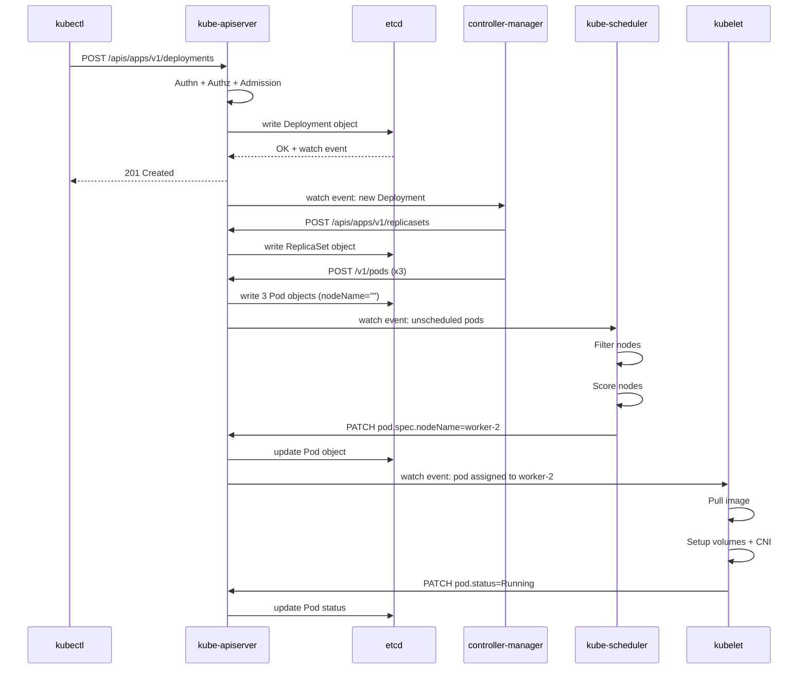
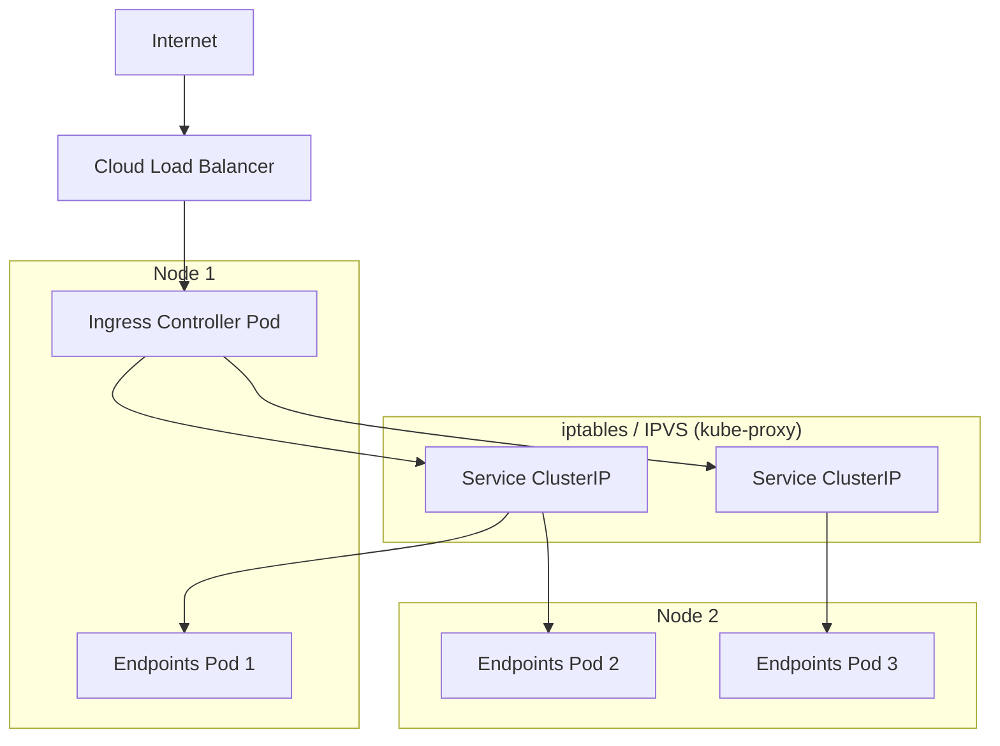
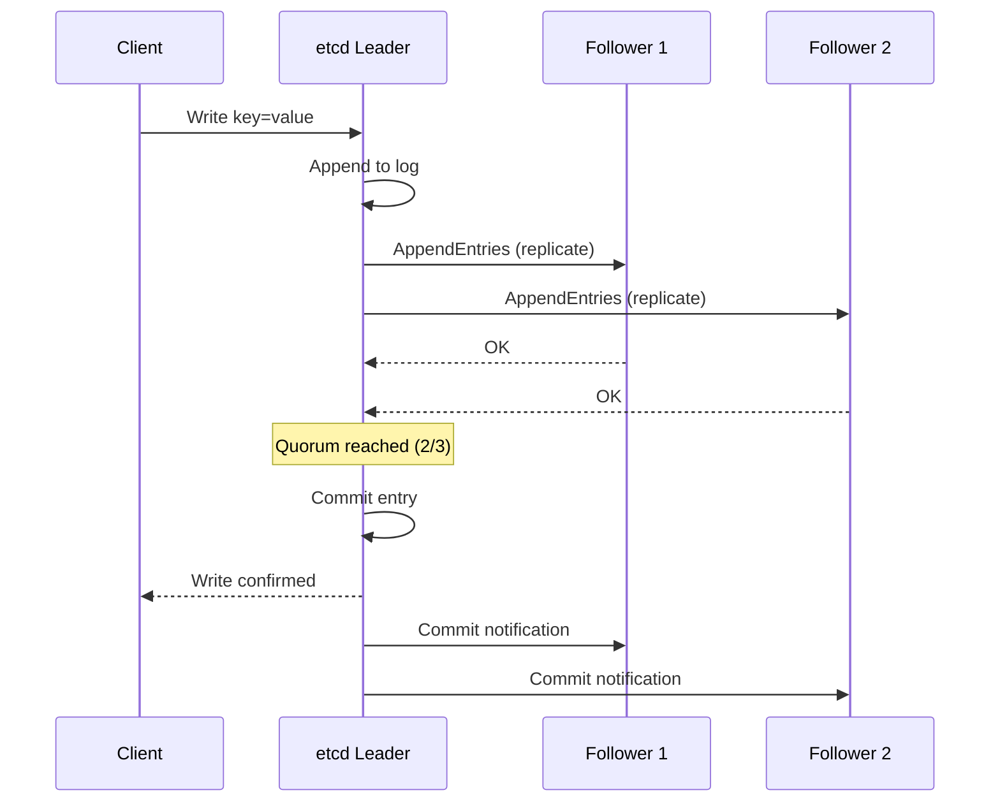

# Module: Kubernetes — Full Internal Backend Deep Dive

> **Phase:** 5 — Kubernetes | **Level:** Beginner → Expert | **Prerequisites:** Linux, Networking, Docker

---

## Table of Contents

1. [Introduction](#1-introduction)
2. [Internal Backend Architecture](#2-internal-backend-architecture)
3. [Control Plane Components](#3-control-plane-components)
4. [Worker Node Components](#4-worker-node-components)
5. [etcd Deep Dive](#5-etcd-deep-dive)
6. [kube-apiserver Deep Dive](#6-kube-apiserver-deep-dive)
7. [Scheduler Deep Dive](#7-scheduler-deep-dive)
8. [Controller Manager Deep Dive](#8-controller-manager-deep-dive)
9. [kubelet Deep Dive](#9-kubelet-deep-dive)
10. [Networking — CNI, Services, Ingress](#10-networking--cni-services-ingress)
11. [Storage — CSI, PV, PVC](#11-storage--csi-pv-pvc)
12. [Pod Lifecycle — Complete Internal Flow](#12-pod-lifecycle--complete-internal-flow)
13. [Service Mesh](#13-service-mesh)
14. [Diagrams](#14-diagrams)
15. [Implementation & Production Setup](#15-implementation--production-setup)
16. [Production Real-Time Issues](#16-production-real-time-issues)
17. [Observability](#17-observability)
18. [Security](#18-security)
19. [Scaling & Performance](#19-scaling--performance)
20. [System Design](#20-system-design)
21. [Interview Questions](#21-interview-questions)
22. [Hands-On Labs](#22-hands-on-labs)

---

## 1. Introduction

### What is Kubernetes?

Kubernetes (K8s) is an open-source **container orchestration platform** originally designed by Google (based on their internal Borg system) and donated to the CNCF in 2014.

It automates:
- **Deployment** of containerized applications
- **Scaling** (up and down based on load)
- **Self-healing** (restart failed containers, reschedule on node failure)
- **Service discovery** and **load balancing**
- **Rolling updates** and **rollbacks**
- **Secret and config management**

### Why Kubernetes Exists

Before Kubernetes:
- Teams ran containers manually with `docker run`
- No automatic restart on failure
- Manual load balancing
- Hard to scale across multiple servers
- No standard way to manage config/secrets

Kubernetes solves: **"How do I run hundreds/thousands of containers reliably across dozens/hundreds of servers?"**

### Why Companies Use It

| Benefit | Detail |
|---|---|
| Self-healing | Automatically restarts failed pods, reschedules on node failure |
| Horizontal scaling | HPA scales pods based on CPU/memory/custom metrics |
| Declarative | Describe desired state → Kubernetes makes it happen |
| Portability | Runs on AWS, GCP, Azure, on-prem — same YAML |
| Ecosystem | Helm, Istio, Prometheus, ArgoCD — massive ecosystem |
| Cost optimization | Bin-packing: fits more workloads on fewer servers |

### Industry Adoption

- **Google**: 2 billion containers/week on Borg (Kubernetes' ancestor)
- **Spotify**: migrated entire platform to Kubernetes
- **Airbnb, Twitter, GitHub, Shopify**: all run Kubernetes
- **86% of organizations** using containers use Kubernetes (CNCF Survey 2023)

### Alternatives

| Alternative | When to use it |
|---|---|
| Docker Swarm | Simple deployments, small teams, no complexity needed |
| Amazon ECS | AWS-only, simpler than K8s, less ecosystem |
| Nomad (HashiCorp) | Multi-workload (VMs, containers, batch jobs) |
| Mesos | Facebook-scale, largely replaced by K8s |

### When NOT to Use Kubernetes

- Small teams (< 5 engineers) — operational overhead too high
- Simple monolithic apps — overkill
- Budget-constrained — control plane costs money
- Teams with no Kubernetes expertise — steep learning curve
- Stateful workloads that need raw performance — overhead of overlay network

---

## 2. Internal Backend Architecture

### High-Level Architecture

```
┌─────────────────────────────────────────────────────────────────────┐
│                        CONTROL PLANE                                │
│                                                                     │
│  ┌──────────────┐  ┌───────────┐  ┌──────────────────────────────┐ │
│  │ kube-         │  │   etcd    │  │   kube-controller-manager    │ │
│  │ apiserver     │◄─┤ (cluster  │  │                              │ │
│  │               │  │  state)   │  │  Node Controller             │ │
│  │ REST API      │  │           │  │  Deployment Controller       │ │
│  │ Auth/Authz    │  │ Raft      │  │  ReplicaSet Controller       │ │
│  │ Admission     │  │ consensus │  │  Endpoints Controller        │ │
│  │ Validation    │  │           │  │  Job Controller              │ │
│  └──────┬───────┘  └───────────┘  └──────────────────────────────┘ │
│         │                                                           │
│  ┌──────▼───────┐                                                   │
│  │ kube-         │                                                   │
│  │ scheduler     │                                                   │
│  │               │                                                   │
│  │ Filtering     │                                                   │
│  │ Scoring       │                                                   │
│  │ Binding       │                                                   │
│  └──────────────┘                                                   │
└────────────────────────────┬────────────────────────────────────────┘
                             │ HTTPS (TLS)
         ┌───────────────────┼───────────────────┐
         │                   │                   │
┌────────▼───────┐  ┌────────▼───────┐  ┌────────▼───────┐
│   WORKER NODE 1│  │   WORKER NODE 2│  │   WORKER NODE 3│
│                │  │                │  │                │
│  kubelet       │  │  kubelet       │  │  kubelet       │
│  kube-proxy    │  │  kube-proxy    │  │  kube-proxy    │
│  Container RT  │  │  Container RT  │  │  Container RT  │
│  (containerd)  │  │  (containerd)  │  │  (containerd)  │
│                │  │                │  │                │
│  [Pod] [Pod]   │  │  [Pod] [Pod]   │  │  [Pod] [Pod]   │
└────────────────┘  └────────────────┘  └────────────────┘
```

### Request Flow — What happens when you run `kubectl apply`

```
kubectl apply -f deployment.yaml
    │
    │ 1. kubectl reads YAML, serializes to JSON
    │ 2. kubectl sends HTTP PUT/POST to kube-apiserver
    │    (reads ~/.kube/config for server URL + credentials)
    ▼
kube-apiserver
    │ 3. Authentication: verify who is making the request
    │    (certificate, bearer token, OIDC, webhook)
    │ 4. Authorization: RBAC check — is this user/SA allowed?
    │ 5. Admission Controllers: mutate + validate the object
    │    (LimitRanger, ResourceQuota, PodSecurity, etc.)
    │ 6. Validation: schema validation against API spec
    │ 7. Write to etcd: store the Deployment object
    │ 8. Return 200/201 to kubectl
    ▼
etcd (stores Deployment spec)
    │
    │ 9. etcd watch event fires (kube-apiserver watches etcd)
    ▼
kube-controller-manager (Deployment Controller)
    │ 10. Deployment Controller sees new Deployment
    │ 11. Creates/updates ReplicaSet object
    │ 12. ReplicaSet Controller sees new RS
    │ 13. Creates N Pod objects (with spec but no nodeName)
    │     Writes Pod objects to etcd via apiserver
    ▼
kube-scheduler (watches for unscheduled Pods)
    │ 14. Sees Pod with nodeName=""
    │ 15. Runs filtering: which nodes can run this pod?
    │ 16. Runs scoring: which node is best?
    │ 17. Binding: writes nodeName=worker-2 to Pod spec in etcd
    ▼
kubelet on worker-2 (watches for pods assigned to its node)
    │ 18. Sees Pod assigned to this node
    │ 19. Pulls container image (if not cached)
    │ 20. Sets up volumes, secrets, configmaps
    │ 21. Calls CNI plugin: set up pod networking
    │ 22. Calls container runtime (containerd): create containers
    │ 23. Starts containers
    │ 24. Runs liveness/readiness probes
    │ 25. Reports pod status back to apiserver → etcd
    ▼
Pod Running ✓
```

---

## 3. Control Plane Components

### Overview

```
Control Plane = the brain of Kubernetes
Runs on master nodes (typically 3 for HA)

Components:
  kube-apiserver        — REST API gateway, single source of truth
  etcd                  — distributed key-value store (cluster state)
  kube-scheduler        — assigns pods to nodes
  kube-controller-manager — runs control loops
  cloud-controller-manager — cloud provider integration (AWS, GCP, Azure)
```

### High Availability Control Plane

```
Production: 3 master nodes minimum (odd number for etcd quorum)

Master Node 1         Master Node 2         Master Node 3
┌────────────────┐    ┌────────────────┐    ┌────────────────┐
│ kube-apiserver │    │ kube-apiserver │    │ kube-apiserver │
│ (active)       │    │ (active)       │    │ (active)       │
│                │    │                │    │                │
│ scheduler      │    │ scheduler      │    │ scheduler      │
│ (standby)      │    │ (ACTIVE-lease) │    │ (standby)      │
│                │    │                │    │                │
│ controller-mgr │    │ controller-mgr │    │ controller-mgr │
│ (standby)      │    │ (ACTIVE-lease) │    │ (standby)      │
│                │    │                │    │                │
│ etcd           │◄──►│ etcd           │◄──►│ etcd           │
│ (follower)     │    │ (LEADER)       │    │ (follower)     │
└────────────────┘    └────────────────┘    └────────────────┘
         ▲                    ▲                    ▲
         └────────────────────┴────────────────────┘
                    Load Balancer (API)
                    (kubectl connects here)

Notes:
- All 3 apiservers are ACTIVE (load balanced)
- Only 1 scheduler is active at a time (leader election via etcd lease)
- Only 1 controller-manager active (same leader election)
- etcd has 1 leader (Raft consensus)
```

---

## 4. Worker Node Components

```
Worker Node = runs actual application workloads

Components:
  kubelet              — node agent, manages pods on this node
  kube-proxy           — network rules for Services
  container runtime    — runs containers (containerd, CRI-O)
  CNI plugin           — pod networking (Calico, Cilium, Flannel)
  CSI driver           — storage (EBS, NFS, Ceph)

Process hierarchy on a worker node:
  systemd
    └── kubelet
          └── containerd (via CRI gRPC)
                └── containerd-shim
                      └── runc (OCI runtime)
                            └── [container process]
```

---

## 5. etcd Deep Dive

### What is etcd?

etcd is a **distributed, strongly-consistent key-value store** that serves as Kubernetes' backing store for all cluster state.

- **All** Kubernetes objects live in etcd: Pods, Deployments, Services, Secrets, ConfigMaps, Nodes, etc.
- If etcd loses data → cluster state is lost → disaster
- etcd uses **Raft** consensus algorithm

### Raft Consensus

```
Raft ensures all etcd nodes agree on the same data.

Roles:
  Leader:   receives all writes, replicates to followers
  Follower: replicates state from leader, votes in elections
  Candidate: temporarily, during leader election

Write flow:
  1. Client sends write to any node
  2. Non-leader: redirects to leader
  3. Leader appends to local log
  4. Leader sends AppendEntries RPC to all followers
  5. Followers write to their logs, respond OK
  6. When quorum (majority) respond → entry committed
  7. Leader applies to state machine, returns to client
  8. Followers apply on next heartbeat

Quorum = (n/2) + 1
  3 nodes: quorum = 2  (can lose 1 node)
  5 nodes: quorum = 3  (can lose 2 nodes)
  7 nodes: quorum = 4  (can lose 3 nodes)

Leader election:
  If followers don't hear from leader (election timeout: 150-300ms):
  → Follower becomes Candidate
  → Increments term, votes for itself
  → Sends RequestVote to all other nodes
  → If majority vote for it → becomes Leader
  → Sends heartbeat to reset everyone's timeout

Split brain prevention:
  A node can only win if it has the most up-to-date log
  Even if network partitioned: minority partition cannot commit
  (needs quorum which it doesn't have)
```

### etcd Data Model

```
etcd stores data as key-value pairs.
Keys are hierarchical paths: /registry/pods/default/nginx-abc123

All Kubernetes objects stored under /registry/:
  /registry/pods/<namespace>/<name>
  /registry/deployments/<namespace>/<name>
  /registry/services/<namespace>/<name>
  /registry/secrets/<namespace>/<name>
  /registry/configmaps/<namespace>/<name>
  /registry/nodes/<name>
  /registry/namespaces/<name>

Values: protobuf-encoded Kubernetes objects (compressed)

Watch mechanism:
  kube-apiserver watches etcd for changes
  etcd streams events (PUT, DELETE) to watchers
  This is how controllers and kubelet get notified of changes
  → No polling! Pure event-driven.

Revision:
  Every write increments a global revision counter
  Enables consistent reads and watch-from-revision
```

### etcd Operations & Maintenance

```bash
# etcdctl — etcd CLI
export ETCDCTL_API=3
export ETCDCTL_ENDPOINTS="https://127.0.0.1:2379"
export ETCDCTL_CACERT="/etc/kubernetes/pki/etcd/ca.crt"
export ETCDCTL_CERT="/etc/kubernetes/pki/etcd/server.crt"
export ETCDCTL_KEY="/etc/kubernetes/pki/etcd/server.key"

# Cluster health
etcdctl endpoint health
etcdctl endpoint status --write-out=table
etcdctl member list --write-out=table

# Read data
etcdctl get /registry/pods/default/ --prefix --keys-only  # list all pods
etcdctl get /registry/namespaces/ --prefix --keys-only     # all namespaces
etcdctl get /registry/pods/default/nginx-abc --print-value-only | python3 -c "
import sys
data = sys.stdin.buffer.read()
print(data.decode('utf-8', errors='replace'))
"

# Watch for changes
etcdctl watch /registry/pods/default/ --prefix

# Backup etcd (CRITICAL — do this regularly!)
etcdctl snapshot save /backup/etcd-snapshot-$(date +%Y%m%d-%H%M%S).db
etcdctl snapshot status /backup/etcd-snapshot-xxx.db --write-out=table

# Restore from backup (disaster recovery)
systemctl stop kube-apiserver kube-controller-manager kube-scheduler
etcdctl snapshot restore /backup/etcd-snapshot.db \
  --data-dir /var/lib/etcd-restore \
  --name master-1 \
  --initial-cluster "master-1=https://10.0.0.1:2380" \
  --initial-cluster-token etcd-cluster-1 \
  --initial-advertise-peer-urls https://10.0.0.1:2380
# Update etcd service to use new data dir, restart

# Defragmentation (reclaim disk space — do periodically)
etcdctl defrag
etcdctl defrag --endpoints=https://10.0.0.1:2379,https://10.0.0.2:2379

# Compaction (remove old revisions)
etcdctl compact $(etcdctl endpoint status --write-out="json" | python3 -c "import json,sys; print(json.load(sys.stdin)[0]['Status']['header']['revision'])")
```

### etcd Performance Tuning

```yaml
# /etc/kubernetes/manifests/etcd.yaml — key parameters
- --heartbeat-interval=100        # ms, leader sends heartbeat
- --election-timeout=1000         # ms, follower timeout before election
- --quota-backend-bytes=8589934592  # 8GB max DB size
- --auto-compaction-mode=periodic
- --auto-compaction-retention=8h  # compact revisions older than 8h
- --snapshot-count=10000          # snapshot every 10000 transactions
- --max-request-bytes=10485760    # 10MB max request size

# etcd MUST be on fast disks:
# Required: < 10ms disk write latency
# Recommended: NVMe SSD on dedicated disk
# NEVER put etcd on same disk as container images
# AWS: io1/io2 EBS with 3000+ IOPS
# Check disk latency:
# fio --rw=write --ioengine=sync --fdatasync=1 --size=100m --bs=2300 --name=etcd-test
```

---

## 6. kube-apiserver Deep Dive

### What is kube-apiserver?

The **only** component that talks directly to etcd. All other components (scheduler, controller-manager, kubelet) talk to the API server. It:

- Serves the Kubernetes REST API
- Authenticates and authorizes all requests
- Runs admission controllers (validate + mutate objects)
- Serves as the communication hub

### Request Lifecycle

```
kubectl apply -f pod.yaml
    │
    ▼
kube-apiserver
    │
    ├── 1. AUTHENTICATION
    │   Who is this? Verify identity.
    │   Methods (tried in order):
    │   ├── X.509 Client Certificate (cn=username, org=group)
    │   ├── Bearer Token (ServiceAccount JWT, OIDC token)
    │   ├── Bootstrap Token
    │   ├── Webhook Token Authentication
    │   └── Anonymous (if enabled, not recommended)
    │
    ├── 2. AUTHORIZATION
    │   Is this identity allowed to do this action?
    │   Methods (any one that allows wins):
    │   ├── RBAC (Role-Based Access Control) ← most common
    │   ├── ABAC (Attribute-Based Access Control) ← legacy
    │   ├── Node Authorization (for kubelets)
    │   └── Webhook Authorization
    │
    ├── 3. ADMISSION CONTROLLERS (ordered pipeline)
    │   Mutating Admission (modify object):
    │   ├── MutatingAdmissionWebhook   ← custom webhooks
    │   ├── DefaultStorageClass        ← add default SC to PVC
    │   ├── DefaultTolerationSeconds   ← add default tolerations
    │   └── LimitRanger                ← add default limits
    │
    │   Validating Admission (validate, reject if invalid):
    │   ├── ValidatingAdmissionWebhook ← custom webhooks
    │   ├── ResourceQuota              ← enforce namespace quotas
    │   ├── PodSecurity                ← enforce pod security standards
    │   └── NamespaceLifecycle        ← block new objs in terminating NS
    │
    ├── 4. OBJECT VALIDATION
    │   Schema validation against OpenAPI spec
    │   Required fields, field types, enum values
    │
    ├── 5. WRITE TO etcd
    │   Serialize object to protobuf
    │   Write to etcd under /registry/<resource>/<namespace>/<name>
    │
    └── 6. RETURN RESPONSE
        HTTP 200/201/202 + created/updated object JSON
```

### kube-apiserver Configuration

```yaml
# /etc/kubernetes/manifests/kube-apiserver.yaml (static pod)
spec:
  containers:
  - command:
    - kube-apiserver
    - --advertise-address=10.0.0.1
    - --etcd-servers=https://10.0.0.1:2379,https://10.0.0.2:2379,https://10.0.0.3:2379
    - --etcd-cafile=/etc/kubernetes/pki/etcd/ca.crt
    - --etcd-certfile=/etc/kubernetes/pki/apiserver-etcd-client.crt
    - --etcd-keyfile=/etc/kubernetes/pki/apiserver-etcd-client.key
    
    # TLS for clients
    - --tls-cert-file=/etc/kubernetes/pki/apiserver.crt
    - --tls-private-key-file=/etc/kubernetes/pki/apiserver.key
    - --client-ca-file=/etc/kubernetes/pki/ca.crt
    
    # Authentication
    - --service-account-key-file=/etc/kubernetes/pki/sa.pub
    - --service-account-issuer=https://kubernetes.default.svc.cluster.local
    - --oidc-issuer-url=https://accounts.google.com          # OIDC (optional)
    - --oidc-client-id=kubernetes
    
    # Authorization
    - --authorization-mode=Node,RBAC
    
    # Admission controllers
    - --enable-admission-plugins=NodeRestriction,ResourceQuota,LimitRanger,PodSecurity,MutatingAdmissionWebhook,ValidatingAdmissionWebhook
    
    # Audit logging (IMPORTANT in production)
    - --audit-policy-file=/etc/kubernetes/audit-policy.yaml
    - --audit-log-path=/var/log/kubernetes/audit.log
    - --audit-log-maxage=30
    - --audit-log-maxsize=100
    - --audit-log-maxbackup=10
    
    # Performance
    - --max-requests-inflight=800
    - --max-mutating-requests-inflight=400
```

### Audit Policy

```yaml
# /etc/kubernetes/audit-policy.yaml
apiVersion: audit.k8s.io/v1
kind: Policy
rules:
  # Log all requests to secrets at RequestResponse level
  - level: RequestResponse
    resources:
    - group: ""
      resources: ["secrets"]

  # Log pod changes
  - level: RequestResponse
    resources:
    - group: ""
      resources: ["pods"]

  # Don't log read-only requests to certain resources
  - level: None
    verbs: ["get", "watch", "list"]
    resources:
    - group: ""
      resources: ["configmaps", "endpoints"]

  # Minimal logging for everything else
  - level: Metadata
```

---

## 7. Scheduler Deep Dive

### What Does the Scheduler Do?

The scheduler watches for **unscheduled Pods** (pods with `nodeName: ""`) and assigns them to a suitable node by writing `nodeName` to the Pod spec.

### Scheduling Algorithm

```
Phase 1: FILTERING (Predicates)
  Remove nodes that CANNOT run the pod.
  
  Built-in filters:
  ├── NodeName: if pod specifies nodeName, only that node
  ├── NodeUnschedulable: skip cordoned nodes
  ├── NodeResourcesFit: node has enough CPU/memory
  │     (requests — not limits — are used for scheduling)
  ├── NodeAffinity: node labels match pod's nodeAffinity
  ├── PodAffinity/PodAntiAffinity: co-locate or spread pods
  ├── TaintToleration: pod tolerates node's taints
  ├── VolumeBinding: node can bind required PVCs
  ├── NodePorts: required host ports available
  └── PodTopologySpread: enforce topology spread constraints

  Result: list of feasible nodes

Phase 2: SCORING (Priorities)
  Score each feasible node 0-100. Highest score wins.
  
  Built-in scorers:
  ├── LeastAllocated: prefer nodes with least CPU/memory used
  │     (spreads pods across nodes)
  ├── MostAllocated: prefer most-used nodes
  │     (packs pods to free up empty nodes — cost optimization)
  ├── NodeAffinity: preferred node affinity scoring
  ├── PodAffinityScore: preferred affinity scoring
  ├── InterPodAffinity: co-location preferences
  ├── ImageLocality: prefer nodes that already have the image
  └── TaintToleration: prefer nodes with fewer taints

  All scores weighted and summed.
  If tied: random selection.

Phase 3: BINDING
  Write nodeName to Pod spec via apiserver → etcd
  kubelet on that node picks it up
```

### Node Affinity

```yaml
# Schedule pod on nodes with label zone=us-east-1a
spec:
  affinity:
    nodeAffinity:
      # REQUIRED — pod won't schedule without this
      requiredDuringSchedulingIgnoredDuringExecution:
        nodeSelectorTerms:
        - matchExpressions:
          - key: kubernetes.io/arch
            operator: In
            values: ["amd64"]
      # PREFERRED — scheduler will try but not require
      preferredDuringSchedulingIgnoredDuringExecution:
      - weight: 50
        preference:
          matchExpressions:
          - key: topology.kubernetes.io/zone
            operator: In
            values: ["us-east-1a"]
```

### Pod Affinity and Anti-Affinity

```yaml
spec:
  affinity:
    # Co-locate with pods that have label app=cache
    podAffinity:
      requiredDuringSchedulingIgnoredDuringExecution:
      - labelSelector:
          matchExpressions:
          - key: app
            operator: In
            values: ["cache"]
        topologyKey: kubernetes.io/hostname

    # NEVER schedule on same node as another instance of this app
    podAntiAffinity:
      requiredDuringSchedulingIgnoredDuringExecution:
      - labelSelector:
          matchExpressions:
          - key: app
            operator: In
            values: ["web"]
        topologyKey: kubernetes.io/hostname

    # PREFER to spread across zones (soft)
    podAntiAffinity:
      preferredDuringSchedulingIgnoredDuringExecution:
      - weight: 100
        podAffinityTerm:
          labelSelector:
            matchExpressions:
            - key: app
              operator: In
              values: ["web"]
          topologyKey: topology.kubernetes.io/zone
```

### Taints and Tolerations

```bash
# Taints: mark a node so pods won't schedule there
kubectl taint nodes node1 gpu=true:NoSchedule
kubectl taint nodes node1 maintenance=true:NoExecute   # evicts existing pods too
kubectl taint nodes node1 disk=slow:PreferNoSchedule   # soft taint

# Remove taint
kubectl taint nodes node1 gpu=true:NoSchedule-

# Tolerations: allow pod to schedule on tainted node
spec:
  tolerations:
  - key: "gpu"
    operator: "Equal"
    value: "true"
    effect: "NoSchedule"
  - key: "maintenance"
    operator: "Exists"
    effect: "NoExecute"
    tolerationSeconds: 60   # stay for 60s then evict

# Built-in taints (added automatically):
# node.kubernetes.io/not-ready
# node.kubernetes.io/unreachable
# node.kubernetes.io/memory-pressure
# node.kubernetes.io/disk-pressure
# node.kubernetes.io/network-unavailable
```

### Topology Spread Constraints

```yaml
# Spread pods evenly across zones
spec:
  topologySpreadConstraints:
  - maxSkew: 1           # max difference between zones
    topologyKey: topology.kubernetes.io/zone
    whenUnsatisfiable: DoNotSchedule  # or ScheduleAnyway
    labelSelector:
      matchLabels:
        app: web
  - maxSkew: 1
    topologyKey: kubernetes.io/hostname   # also spread across nodes
    whenUnsatisfiable: ScheduleAnyway
    labelSelector:
      matchLabels:
        app: web
```

---

## 8. Controller Manager Deep Dive

### What is the Controller Manager?

A single binary running **multiple controllers** (control loops). Each controller watches the current state of some Kubernetes objects and reconciles them toward the desired state.

**Control loop pattern:**
```
while true:
  desired  = read desired state from apiserver
  actual   = observe actual state (from apiserver / direct probe)
  if desired != actual:
    take action to make actual → desired
  sleep (or wait for watch event)
```

### Key Controllers

#### Deployment Controller

```
Watches: Deployment objects
Does:
  1. Creates/updates ReplicaSet for current template
  2. Scales up new RS, scales down old RS (rolling update)
  3. Tracks rollout progress
  4. Handles rollback (--to-revision)

Rolling update flow:
  Deployment: replicas=5, maxSurge=1, maxUnavailable=1
  
  Initial: [v1][v1][v1][v1][v1]
  Step 1:  [v1][v1][v1][v1][v1][v2]    (surge: +1 new)
  Step 2:  [v1][v1][v1][v1][v2][v2]    (terminate 1 old)
  Step 3:  [v1][v1][v1][v1][v2][v2][v2](surge again)
  Step 4:  [v1][v1][v2][v2][v2][v2]    (terminate old)
  ...continues until all v2
  Final:   [v2][v2][v2][v2][v2]
```

#### ReplicaSet Controller

```
Watches: ReplicaSet objects + Pods (with matching labels)
Does:
  If current pods < desired replicas → create pods
  If current pods > desired replicas → delete pods
  
  Pod creation: creates Pod spec from RS template
  Pod is unscheduled at this point (nodeName="")
  
  Label selector is key:
    RS selector: {app: web}
    Pods must have: app=web label
    If you manually create pod with app=web → RS counts it!
```

#### Node Controller

```
Watches: Node objects + actual node health
Does:
  If node doesn't send heartbeat for 40s → mark NotReady
  If NotReady for 5m (pod-eviction-timeout):
    → Evict all pods on that node
    → Mark pods as Terminating/Unknown
    → Other controllers reschedule them

  Node condition monitoring:
    Ready: kubelet healthy
    MemoryPressure: node running low on memory
    DiskPressure: node running low on disk
    PIDPressure: too many processes
    NetworkUnavailable: network not configured
```

#### Endpoints Controller (Legacy) / EndpointSlice Controller

```
Watches: Services + Pods
Does:
  When Service selector matches running pods:
  → Create/update Endpoints (or EndpointSlice) object
  → Endpoints = list of pod IPs + ports that are Ready
  
  kube-proxy reads Endpoints → programs iptables/IPVS rules
  CoreDNS reads Endpoints → DNS resolution for headless services

  EndpointSlice (modern, v1.21+):
  → Chunks of max 100 endpoints per slice
  → More scalable than single Endpoints object
  → Required for large services (1000+ pods)
```

#### Job and CronJob Controller

```
Job Controller:
  Creates pods to run a task to completion
  Tracks successful/failed completions
  Retries on failure (backoffLimit)
  Parallel jobs: completions=10, parallelism=3

CronJob Controller:
  Creates Job objects on a cron schedule
  "*/5 * * * *" = every 5 minutes
  Manages concurrent policy: Allow/Forbid/Replace
  Keeps history: successfulJobsHistoryLimit, failedJobsHistoryLimit

Horizontal Pod Autoscaler Controller:
  Queries metrics (CPU, memory, custom)
  Calculates desired replicas:
    desiredReplicas = ceil(currentReplicas × (currentMetric/targetMetric))
  Updates Deployment/ReplicaSet replicas field
  Scale-up: immediate
  Scale-down: 5-minute cooldown (configurable)
```

---

## 9. kubelet Deep Dive

### What is kubelet?

kubelet is the **node agent** — runs on every worker node. It:

- Registers the node with the apiserver
- Watches for pods assigned to this node
- Starts/stops containers via container runtime
- Reports node and pod status to apiserver
- Runs health probes (liveness, readiness, startup)
- Manages volumes (mount/unmount)
- Rotates certificates

### kubelet Architecture

```
kubelet
  │
  ├── PodManager: tracks pods on this node (desired state)
  │
  ├── PLEG (Pod Lifecycle Event Generator):
  │     Polls container runtime every second
  │     Compares to previous state → generates events
  │     Events: ContainerStarted, ContainerDied, ContainerRemoved
  │
  ├── SyncLoop (main loop):
  │     Listens to events from:
  │     ├── apiserver (pod assignment/changes)
  │     ├── PLEG events (container state changes)
  │     ├── Probe manager (health check results)
  │     └── HTTP (static pods from /etc/kubernetes/manifests/)
  │
  ├── ProbeManager: runs health probes in goroutines
  │     liveness: restart container if fails
  │     readiness: remove from Service endpoints if fails
  │     startup: prevent other probes until started
  │
  ├── VolumeManager: mounts/unmounts volumes
  │     Works with CSI plugins via gRPC
  │
  ├── ContainerManager: manages cgroups, resource limits
  │
  └── CRI (Container Runtime Interface) gRPC client:
        Talks to containerd/CRI-O
        Creates/starts/stops/removes containers
        Manages images
```

### CRI — Container Runtime Interface

```
CRI = gRPC API between kubelet and container runtime
kubelet never calls Docker/containerd directly — uses CRI abstraction

CRI gRPC services:
  RuntimeService:
    RunPodSandbox()       → create pod network namespace + pause container
    StopPodSandbox()      → stop pod
    RemovePodSandbox()    → clean up pod
    CreateContainer()     → create container within pod sandbox
    StartContainer()      → start container
    StopContainer()       → stop container (SIGTERM → SIGKILL)
    RemoveContainer()     → remove container
    ListContainers()      → list running containers
    ContainerStatus()     → get container state + exit code
    ExecSync()            → kubectl exec
    Exec()                → streaming exec (kubectl exec -it)
    Attach()              → kubectl attach
    PortForward()         → kubectl port-forward

  ImageService:
    PullImage()           → pull image from registry
    ListImages()          → list cached images
    RemoveImage()         → remove image
    ImageStatus()         → check if image exists

Pause container ("infra" container):
  Every pod has a pause container (k8s.gcr.io/pause:3.x)
  It holds the network namespace
  All app containers in the pod join its network namespace
  If app container restarts: network namespace preserved
  Only deleted when pod is removed
```

### Health Probes

```yaml
spec:
  containers:
  - name: app
    image: myapp:1.0
    
    # Startup probe: checked first, until success
    # Prevents liveness from killing slow-starting apps
    startupProbe:
      httpGet:
        path: /health
        port: 8080
      failureThreshold: 30      # 30 * 10s = 300s max startup time
      periodSeconds: 10

    # Liveness probe: is the container alive?
    # Failure → container killed and restarted
    livenessProbe:
      httpGet:
        path: /health
        port: 8080
      initialDelaySeconds: 0    # 0 since startupProbe handles startup
      periodSeconds: 10
      timeoutSeconds: 5
      failureThreshold: 3       # 3 consecutive failures → restart

    # Readiness probe: is the container ready to serve traffic?
    # Failure → removed from Service endpoints (traffic stops)
    # Container NOT restarted
    readinessProbe:
      httpGet:
        path: /ready
        port: 8080
      initialDelaySeconds: 5
      periodSeconds: 5
      timeoutSeconds: 3
      failureThreshold: 3
      successThreshold: 1

    # Probe types:
    # httpGet: HTTP GET, success if 200-399
    # tcpSocket: success if TCP connection established
    # exec: success if command exits 0
    # grpc: success if gRPC health check passes
```

### Resource Management

```yaml
spec:
  containers:
  - name: app
    resources:
      # Requests: used for scheduling (guaranteed amount)
      requests:
        cpu: "500m"       # 0.5 CPU cores (millicores)
        memory: "256Mi"   # 256 megabytes
      # Limits: hard cap (cannot exceed)
      limits:
        cpu: "2000m"      # 2 CPU cores
        memory: "512Mi"   # 512 megabytes

# CPU behavior:
# Request: scheduler finds node with 0.5 CPU available
# Limit: Linux CFS quota enforced → process throttled if exceeds
# CPU throttling ≠ OOM kill → app just runs slower
# CPU is COMPRESSIBLE: throttled, not killed

# Memory behavior:
# Request: scheduler finds node with 256Mi available
# Limit: if process exceeds 512Mi → OOMKilled (SIGKILL immediately)
# Memory is INCOMPRESSIBLE: cannot throttle, must kill

# QoS Classes (affects eviction order):
# Guaranteed: requests == limits for all containers
#   → evicted LAST
# Burstable:  requests set, limits higher (or only requests)
#   → evicted second
# BestEffort: no requests or limits set
#   → evicted FIRST

# Check QoS:
kubectl get pod <name> -o jsonpath='{.status.qosClass}'
```

---

## 10. Networking — CNI, Services, Ingress

### CNI — Container Network Interface

```
CNI = standard for configuring container networking.
kubelet calls CNI plugin when pod starts/stops.

CNI plugin responsibilities:
  1. Create network interface in pod (veth pair)
  2. Assign IP address to pod
  3. Set up routing so pod can communicate
  4. Remove interface when pod stops

Popular CNI plugins:
┌──────────────┬─────────────────────────────────────────────────────┐
│ Plugin       │ Key Features                                         │
├──────────────┼─────────────────────────────────────────────────────┤
│ Calico       │ BGP routing, NetworkPolicy, no overlay needed        │
│ Cilium       │ eBPF-based, no iptables, advanced network policy     │
│ Flannel      │ Simple VXLAN overlay, easy setup, limited policy     │
│ Weave        │ Mesh overlay, encryption, NetworkPolicy              │
│ AWS VPC CNI  │ AWS-native, pods get real VPC IPs, no overlay        │
└──────────────┴─────────────────────────────────────────────────────┘

Pod network requirements (Kubernetes spec):
  1. Every pod has a unique IP
  2. Pods can communicate with every other pod without NAT
  3. Nodes can communicate with pods without NAT
  4. Pod IP is the same from inside and outside the pod
```

### Pod-to-Pod Networking (VXLAN example)

```
Node 1 (10.0.0.1)                Node 2 (10.0.0.2)
Pod A: 10.244.1.5                Pod B: 10.244.2.7

Pod A sends packet to 10.244.2.7:

1. Pod A eth0 (veth) → cni0 bridge on node1
2. Kernel routing: 10.244.2.0/24 not local → flannel
3. flannel0 / VXLAN tunnel device
4. Encapsulates packet:
   Inner: src=10.244.1.5, dst=10.244.2.7
   Outer: src=10.0.0.1,   dst=10.0.0.2, UDP port 8472
5. Sent as regular UDP packet over node network
6. Node2 flannel decapsulates UDP packet
7. Routes inner packet: 10.244.2.7 → cni0 bridge → veth → Pod B
```

### Kubernetes Services

```
Problem: Pods have ephemeral IPs (change when pod restarts).
Solution: Service provides a stable virtual IP (ClusterIP).

Service types:

ClusterIP (default):
  Virtual IP accessible only within cluster
  kube-proxy programs iptables/IPVS rules
  DNS: <service>.<namespace>.svc.cluster.local

NodePort:
  Exposes service on each node's IP at a static port (30000-32767)
  External traffic: NodeIP:NodePort → ClusterIP → Pod
  Not recommended for production (use LoadBalancer or Ingress)

LoadBalancer:
  Creates cloud load balancer (AWS ALB/NLB, GCP LB)
  External IP → LoadBalancer → NodePort → ClusterIP → Pod
  One LB per service (can be expensive)

ExternalName:
  Maps service to external DNS name (CNAME)
  No proxying — just DNS

Headless (clusterIP: None):
  No virtual IP
  DNS returns individual pod IPs directly
  Used for: StatefulSets, direct pod-to-pod (databases)
```

### Service Networking Internals (iptables mode)

```
Service: web-svc, ClusterIP: 10.96.45.23, port 80
Backends: pod1:10.244.1.5:8080, pod2:10.244.2.7:8080, pod3:10.244.3.2:8080

kube-proxy writes iptables rules:

-A KUBE-SERVICES -d 10.96.45.23/32 -p tcp --dport 80 -j KUBE-SVC-ABCD1234

# Load balance across 3 pods (random, ~33% each)
-A KUBE-SVC-ABCD1234 -m statistic --mode random --probability 0.33 -j KUBE-SEP-POD1
-A KUBE-SVC-ABCD1234 -m statistic --mode random --probability 0.50 -j KUBE-SEP-POD2
-A KUBE-SVC-ABCD1234 -j KUBE-SEP-POD3

# DNAT: replace destination IP with pod IP
-A KUBE-SEP-POD1 -p tcp -j DNAT --to-destination 10.244.1.5:8080
-A KUBE-SEP-POD2 -p tcp -j DNAT --to-destination 10.244.2.7:8080
-A KUBE-SEP-POD3 -p tcp -j DNAT --to-destination 10.244.3.2:8080

Connection tracking remembers the DNAT:
  Reply packets: pod IP → client (SNAT reversal done automatically)

IPVS mode (better at scale):
  Uses Linux IPVS (IP Virtual Server) — in-kernel L4 load balancer
  O(1) lookup vs O(n) iptables rules
  More algorithms: round-robin, least-conn, random, wrr
  Required for > 1000 services or > 10,000 endpoints
```

### DNS in Kubernetes (CoreDNS)

```
CoreDNS runs as Deployment in kube-system namespace.
Every pod's /etc/resolv.conf points to CoreDNS ClusterIP.

DNS resolution inside cluster:
  nslookup web-svc              → web-svc.default.svc.cluster.local
  nslookup web-svc.default      → web-svc.default.svc.cluster.local
  nslookup web-svc.default.svc.cluster.local → 10.96.45.23

/etc/resolv.conf in pod:
  nameserver 10.96.0.10                          # CoreDNS ClusterIP
  search default.svc.cluster.local svc.cluster.local cluster.local
  options ndots:5

ndots:5 behavior (important!):
  query "web-svc" → first tries appending search domains:
  1. web-svc.default.svc.cluster.local  → found! return
  
  query "external.example.com":
  Has 2 dots < 5 → tries search domains first (5 failed queries!)
  1. external.example.com.default.svc.cluster.local → NXDOMAIN
  2. external.example.com.svc.cluster.local → NXDOMAIN
  3. external.example.com.cluster.local → NXDOMAIN
  4. external.example.com. (absolute) → returns IP
  
  Fix: use fully qualified name: "external.example.com."
  Or set dnsConfig ndots: 2

CoreDNS Corefile configuration:
  .:53 {
    errors
    health
    ready
    kubernetes cluster.local in-addr.arpa ip6.arpa {
      pods insecure
      fallthrough in-addr.arpa ip6.arpa
    }
    prometheus :9153
    forward . /etc/resolv.conf     # external DNS
    cache 30
    loop
    reload
    loadbalance
  }
```

### Ingress

```
Ingress: L7 (HTTP/HTTPS) routing into the cluster.
One Ingress controller (e.g., nginx-ingress) handles all Ingress objects.
Much cheaper than LoadBalancer per service.

Architecture:
  Internet → Cloud LB (1x) → Ingress Controller → Services → Pods

Ingress resource:
  apiVersion: networking.k8s.io/v1
  kind: Ingress
  metadata:
    name: web-ingress
    annotations:
      nginx.ingress.kubernetes.io/rewrite-target: /
      nginx.ingress.kubernetes.io/ssl-redirect: "true"
  spec:
    ingressClassName: nginx
    tls:
    - hosts:
      - api.example.com
      secretName: api-tls-secret    # kubectl create secret tls
    rules:
    - host: api.example.com
      http:
        paths:
        - path: /v1
          pathType: Prefix
          backend:
            service:
              name: api-v1-svc
              port:
                number: 80
        - path: /v2
          pathType: Prefix
          backend:
            service:
              name: api-v2-svc
              port:
                number: 80
    - host: admin.example.com
      http:
        paths:
        - path: /
          pathType: Prefix
          backend:
            service:
              name: admin-svc
              port:
                number: 80

Popular Ingress controllers:
  nginx-ingress    — most widely used
  Traefik          — auto-discovers services, Let's Encrypt built-in
  HAProxy Ingress  — high performance
  AWS ALB Ingress  — uses AWS ALB, native AWS integration
  Istio Gateway    — service mesh gateway
  Kong             — API gateway features
```

---

## 11. Storage — CSI, PV, PVC

### Storage Architecture

```
CSI (Container Storage Interface) = standard API for storage plugins.
Same plugin interface works across any Kubernetes cluster.

Storage hierarchy:
  StorageClass → PersistentVolume (PV) → PersistentVolumeClaim (PVC) → Pod

StorageClass:
  Defines storage "type" (SSD, HDD, NFS, etc.)
  Provider creates PV dynamically when PVC requests it
  
  apiVersion: storage.k8s.io/v1
  kind: StorageClass
  metadata:
    name: fast-ssd
  provisioner: ebs.csi.aws.com    # CSI driver
  parameters:
    type: gp3
    iops: "3000"
    throughput: "125"
  reclaimPolicy: Delete           # or Retain
  volumeBindingMode: WaitForFirstConsumer  # provision when pod scheduled
  allowVolumeExpansion: true

PersistentVolume (PV):
  Represents actual storage resource
  Created by admin (static) or CSI driver (dynamic)
  Has: capacity, accessModes, reclaim policy, storageClass

PersistentVolumeClaim (PVC):
  Developer's request for storage
  Kubernetes finds matching PV or dynamically provisions one
  
  apiVersion: v1
  kind: PersistentVolumeClaim
  metadata:
    name: data-pvc
  spec:
    accessModes: [ReadWriteOnce]
    storageClassName: fast-ssd
    resources:
      requests:
        storage: 50Gi

Access modes:
  ReadWriteOnce (RWO):    single node read-write (block storage: EBS, GCE PD)
  ReadOnlyMany  (ROX):    multiple nodes read-only
  ReadWriteMany (RWX):    multiple nodes read-write (NFS, EFS, CephFS)
  ReadWriteOncePod (RWOP): single pod read-write (k8s 1.22+)
```

### CSI Driver Flow

```
When pod with PVC is scheduled:

1. Scheduler selects node (WaitForFirstConsumer mode)
2. PVC triggers CSI provisioner:
   CreateVolume() → cloud API creates disk (e.g., AWS EBS volume)
3. CSI attacher:
   ControllerPublishVolume() → attach disk to EC2 instance
4. kubelet:
   NodeStageVolume()  → format filesystem, mount to staging dir
   NodePublishVolume() → bind mount into pod's container path
5. Container sees mounted filesystem at /data

On pod deletion:
  NodeUnpublishVolume() → unmount from container
  NodeUnstageVolume()   → unmount from staging
  ControllerUnpublishVolume() → detach from EC2
  DeleteVolume() → delete EBS volume (if ReclaimPolicy=Delete)
```

### StatefulSet + Persistent Storage

```yaml
apiVersion: apps/v1
kind: StatefulSet
metadata:
  name: postgres
spec:
  serviceName: postgres-headless
  replicas: 3
  selector:
    matchLabels:
      app: postgres
  template:
    metadata:
      labels:
        app: postgres
    spec:
      containers:
      - name: postgres
        image: postgres:15
        volumeMounts:
        - name: data
          mountPath: /var/lib/postgresql/data
  # volumeClaimTemplates: creates PVC per pod
  volumeClaimTemplates:
  - metadata:
      name: data
    spec:
      accessModes: [ReadWriteOnce]
      storageClassName: fast-ssd
      resources:
        requests:
          storage: 100Gi

# StatefulSet guarantees:
# - Stable network identity: postgres-0, postgres-1, postgres-2
# - Ordered startup/shutdown (0 → 1 → 2, shutdown 2 → 1 → 0)
# - Stable storage: each pod gets its own PVC
# - PVCs survive pod deletion (must manually delete PVCs)
```

---

## 12. Pod Lifecycle — Complete Internal Flow

### Pod Phases

```
Pending:
  Pod accepted by apiserver
  Scheduler finding a node
  OR: image pulling
  OR: volumes being provisioned

Running:
  Pod bound to a node
  At least one container running

Succeeded:
  All containers exited with code 0
  Will not restart (for Jobs)

Failed:
  All containers exited, at least one non-zero exit code

Unknown:
  Node cannot be reached by apiserver
  kubelet not reporting (node failure)
```

### Container States

```
Waiting:
  Container not yet running
  Reason: PodInitializing, ContainerCreating, CrashLoopBackOff, ImagePullBackOff

Running:
  Container executing

Terminated:
  Container finished (exitCode + reason)
  Reason: Completed (exit 0), Error (exit non-0), OOMKilled, Evicted
```

### Pod Termination Flow

```
kubectl delete pod <name>   OR   graceful eviction

1. Pod phase = Terminating
2. Grace period starts (default 30s, set by terminationGracePeriodSeconds)
3. Three things happen simultaneously:
   a. preStop hook executes (if defined)
   b. SIGTERM sent to container PID 1
   c. Pod removed from Endpoints → traffic stops
4. Application should handle SIGTERM gracefully:
   - Stop accepting new connections
   - Finish in-flight requests
   - Close database connections
   - Exit
5. If pod still running after grace period:
   SIGKILL sent (immediate kill, no cleanup possible)
6. kubelet reports pod dead → apiserver removes Pod object

Best practice:
  terminationGracePeriodSeconds: 60   # longer for slow apps
  
  preStop hook:
    lifecycle:
      preStop:
        exec:
          command: ["/bin/sh", "-c", "sleep 5"]
        # or
        httpGet:
          path: /shutdown
          port: 8080
```

### Init Containers

```yaml
spec:
  initContainers:
  # Run to completion before app containers start
  - name: wait-for-db
    image: busybox:1.35
    command: ['sh', '-c', 'until nc -z postgres-svc 5432; do echo waiting; sleep 2; done']
  
  - name: db-migrate
    image: myapp:1.0
    command: ['./manage.py', 'migrate']
    env:
    - name: DATABASE_URL
      valueFrom:
        secretKeyRef:
          name: db-secret
          key: url
  
  containers:
  - name: app
    image: myapp:1.0
    # Only starts after ALL init containers complete successfully
```

---

## 13. Service Mesh

### What is a Service Mesh?

A service mesh adds a **sidecar proxy** to every pod that intercepts all network traffic. The mesh handles:

- **mTLS**: Mutual TLS between all services (zero-trust networking)
- **Observability**: Automatic metrics, traces, logs for all traffic
- **Traffic management**: Canary, circuit breaker, retries, timeouts
- **Load balancing**: L7 (header-based) load balancing

### Istio Architecture

```
Control Plane (istiod):
  Pilot:    service discovery, traffic rules → pushes to proxies
  Citadel:  certificate management (mTLS)
  Galley:   configuration validation

Data Plane (per-pod Envoy sidecar):
  Intercepts all inbound + outbound traffic
  Enforces mTLS
  Reports telemetry to control plane
  Applies traffic rules (retries, circuit breaking)

Traffic flow with Istio:
  Pod A (app) → Envoy sidecar A → (mTLS) → Envoy sidecar B → Pod B (app)
  
  iptables rules (injected by istio-init container):
    All outbound traffic redirected to Envoy port 15001
    All inbound traffic redirected to Envoy port 15006
    Envoy is transparent to the application

Envoy sidecar injection:
  Namespace label: istio-injection=enabled
  Or pod annotation: sidecar.istio.io/inject: "true"
  istio mutating webhook automatically adds:
    - initContainer: istio-init (sets up iptables)
    - container: istio-proxy (Envoy)
```

### Istio Traffic Management

```yaml
# VirtualService: define routing rules
apiVersion: networking.istio.io/v1alpha3
kind: VirtualService
metadata:
  name: web-vs
spec:
  hosts:
  - web-svc
  http:
  # Canary: 90% to v1, 10% to v2
  - route:
    - destination:
        host: web-svc
        subset: v1
      weight: 90
    - destination:
        host: web-svc
        subset: v2
      weight: 10
    # Timeout + retry
    timeout: 30s
    retries:
      attempts: 3
      perTryTimeout: 10s
      retryOn: "5xx,connect-failure"

---
# DestinationRule: define subsets (v1, v2)
apiVersion: networking.istio.io/v1alpha3
kind: DestinationRule
metadata:
  name: web-dr
spec:
  host: web-svc
  trafficPolicy:
    connectionPool:
      tcp:
        maxConnections: 100
      http:
        h2UpgradePolicy: UPGRADE
    outlierDetection:             # Circuit breaker
      consecutive5xxErrors: 5
      interval: 30s
      baseEjectionTime: 60s
      maxEjectionPercent: 50
  subsets:
  - name: v1
    labels:
      version: v1
  - name: v2
    labels:
      version: v2
```

---

## 14. Diagrams

### Mermaid: Full Pod Scheduling Flow



### Mermaid: Kubernetes Networking



### Mermaid: etcd Raft Consensus



### ASCII: Control Plane → Worker Node Communication

```
CONTROL PLANE                    WORKER NODES
─────────────                    ────────────

kube-apiserver ──HTTPS:6443──►  kubelet
  (apiserver listens              (kubelet initiates connection,
   on 6443 for kubelet)            polls/watches for pod changes)

kube-apiserver ──HTTPS:443───►  kubelet exec/logs
  (for kubectl exec,              (apiserver proxies to kubelet)
   kubectl logs)

kubelet ──────────────────────► kube-apiserver
  (kubelet watches pods,          (all status updates go to apiserver)
   reports status)

kube-apiserver ──gRPC──────►   etcd (2379)
  (all reads/writes go            (apiserver is only etcd client)
   through apiserver)

etcd ─────────Raft──────────►  etcd peers (2380)
  (peer communication             (leader election + replication)
   for consensus)
```

---

## 15. Implementation & Production Setup

### Production-Grade Cluster Setup (kubeadm)

```bash
# On all nodes:
# 1. Disable swap (required by kubelet)
swapoff -a
sed -i '/swap/d' /etc/fstab

# 2. Kernel modules
cat > /etc/modules-load.d/k8s.conf << EOF
overlay
br_netfilter
EOF
modprobe overlay
modprobe br_netfilter

# 3. Sysctl for networking
cat > /etc/sysctl.d/k8s.conf << EOF
net.bridge.bridge-nf-call-iptables  = 1
net.bridge.bridge-nf-call-ip6tables = 1
net.ipv4.ip_forward                 = 1
EOF
sysctl --system

# 4. Install containerd
apt-get install -y containerd.io
mkdir -p /etc/containerd
containerd config default > /etc/containerd/config.toml
# Enable systemd cgroup driver (required for kubelet)
sed -i 's/SystemdCgroup = false/SystemdCgroup = true/' /etc/containerd/config.toml
systemctl restart containerd
systemctl enable containerd

# 5. Install kubeadm, kubelet, kubectl
apt-get install -y kubelet kubeadm kubectl
apt-mark hold kubelet kubeadm kubectl

# On CONTROL PLANE ONLY:
# 6. Initialize cluster
kubeadm init \
  --control-plane-endpoint "k8s-api.example.com:6443" \  # LB DNS name
  --upload-certs \
  --pod-network-cidr=10.244.0.0/16 \
  --service-cidr=10.96.0.0/12 \
  --kubernetes-version=v1.29.0

# 7. Configure kubectl
mkdir -p ~/.kube
cp /etc/kubernetes/admin.conf ~/.kube/config

# 8. Install CNI (Calico example)
kubectl apply -f https://docs.projectcalico.org/manifests/calico.yaml

# Add additional control plane nodes (HA):
kubeadm join k8s-api.example.com:6443 \
  --token <token> \
  --discovery-token-ca-cert-hash sha256:<hash> \
  --control-plane \
  --certificate-key <cert-key>

# On WORKER NODES:
kubeadm join k8s-api.example.com:6443 \
  --token <token> \
  --discovery-token-ca-cert-hash sha256:<hash>
```

### Essential Kubernetes Objects

```yaml
#──────────────────────────────────────
# Deployment (stateless application)
#──────────────────────────────────────
apiVersion: apps/v1
kind: Deployment
metadata:
  name: web
  namespace: production
  labels:
    app: web
    version: v1.5.0
spec:
  replicas: 3
  selector:
    matchLabels:
      app: web
  strategy:
    type: RollingUpdate
    rollingUpdate:
      maxSurge: 1
      maxUnavailable: 0        # zero-downtime deployment
  template:
    metadata:
      labels:
        app: web
        version: v1.5.0
    spec:
      # Spread across zones
      topologySpreadConstraints:
      - maxSkew: 1
        topologyKey: topology.kubernetes.io/zone
        whenUnsatisfiable: DoNotSchedule
        labelSelector:
          matchLabels:
            app: web
      
      # Don't run 2 instances on same node
      affinity:
        podAntiAffinity:
          preferredDuringSchedulingIgnoredDuringExecution:
          - weight: 100
            podAffinityTerm:
              labelSelector:
                matchLabels:
                  app: web
              topologyKey: kubernetes.io/hostname
      
      containers:
      - name: web
        image: myregistry.io/web:v1.5.0
        ports:
        - containerPort: 8080
        
        env:
        - name: DB_PASSWORD
          valueFrom:
            secretKeyRef:
              name: db-secret
              key: password
        - name: APP_CONFIG
          valueFrom:
            configMapKeyRef:
              name: app-config
              key: config.json
        
        resources:
          requests:
            cpu: 100m
            memory: 128Mi
          limits:
            cpu: 500m
            memory: 256Mi
        
        livenessProbe:
          httpGet:
            path: /health
            port: 8080
          initialDelaySeconds: 10
          periodSeconds: 10
          failureThreshold: 3
        
        readinessProbe:
          httpGet:
            path: /ready
            port: 8080
          initialDelaySeconds: 5
          periodSeconds: 5
        
        lifecycle:
          preStop:
            exec:
              command: ["/bin/sh", "-c", "sleep 10"]
        
        securityContext:
          runAsNonRoot: true
          runAsUser: 1000
          readOnlyRootFilesystem: true
          allowPrivilegeEscalation: false
          capabilities:
            drop: ["ALL"]
      
      terminationGracePeriodSeconds: 60
      
      securityContext:
        fsGroup: 1000
      
      imagePullSecrets:
      - name: registry-secret

---
#──────────────────────────────────────
# Service
#──────────────────────────────────────
apiVersion: v1
kind: Service
metadata:
  name: web-svc
  namespace: production
spec:
  selector:
    app: web
  ports:
  - name: http
    port: 80
    targetPort: 8080
    protocol: TCP
  type: ClusterIP
  # sessionAffinity: ClientIP  # sticky sessions (optional)

---
#──────────────────────────────────────
# HorizontalPodAutoscaler
#──────────────────────────────────────
apiVersion: autoscaling/v2
kind: HorizontalPodAutoscaler
metadata:
  name: web-hpa
  namespace: production
spec:
  scaleTargetRef:
    apiVersion: apps/v1
    kind: Deployment
    name: web
  minReplicas: 3
  maxReplicas: 50
  metrics:
  - type: Resource
    resource:
      name: cpu
      target:
        type: Utilization
        averageUtilization: 70
  - type: Resource
    resource:
      name: memory
      target:
        type: Utilization
        averageUtilization: 80
  behavior:
    scaleUp:
      stabilizationWindowSeconds: 60
      policies:
      - type: Percent
        value: 100
        periodSeconds: 60
    scaleDown:
      stabilizationWindowSeconds: 300  # 5 min cooldown before scale down
      policies:
      - type: Percent
        value: 10
        periodSeconds: 60

---
#──────────────────────────────────────
# PodDisruptionBudget
#──────────────────────────────────────
apiVersion: policy/v1
kind: PodDisruptionBudget
metadata:
  name: web-pdb
  namespace: production
spec:
  minAvailable: 2        # or maxUnavailable: 1
  selector:
    matchLabels:
      app: web
# Prevents kubectl drain or eviction from taking down too many pods
```

### Namespace and RBAC

```yaml
#──────────────────────────────────────
# Namespace with ResourceQuota + LimitRange
#──────────────────────────────────────
apiVersion: v1
kind: Namespace
metadata:
  name: team-alpha
  labels:
    pod-security.kubernetes.io/enforce: restricted  # PodSecurity

---
apiVersion: v1
kind: ResourceQuota
metadata:
  name: team-alpha-quota
  namespace: team-alpha
spec:
  hard:
    requests.cpu: "20"
    requests.memory: "40Gi"
    limits.cpu: "40"
    limits.memory: "80Gi"
    pods: "100"
    services: "20"
    persistentvolumeclaims: "20"
    count/deployments.apps: "20"

---
apiVersion: v1
kind: LimitRange
metadata:
  name: team-alpha-limits
  namespace: team-alpha
spec:
  limits:
  - type: Container
    default:           # applied if limits not specified
      cpu: 500m
      memory: 256Mi
    defaultRequest:    # applied if requests not specified
      cpu: 100m
      memory: 128Mi
    max:
      cpu: "4"
      memory: 4Gi
    min:
      cpu: 50m
      memory: 64Mi

---
#──────────────────────────────────────
# RBAC
#──────────────────────────────────────
apiVersion: rbac.authorization.k8s.io/v1
kind: Role
metadata:
  name: developer
  namespace: team-alpha
rules:
- apiGroups: ["", "apps", "batch"]
  resources: ["pods", "deployments", "replicasets", "jobs", "configmaps"]
  verbs: ["get", "list", "watch", "create", "update", "patch"]
- apiGroups: [""]
  resources: ["pods/log", "pods/exec"]
  verbs: ["get", "create"]
- apiGroups: [""]
  resources: ["secrets"]
  verbs: []    # no access to secrets

---
apiVersion: rbac.authorization.k8s.io/v1
kind: RoleBinding
metadata:
  name: developer-binding
  namespace: team-alpha
subjects:
- kind: User
  name: alice@company.com
  apiGroup: rbac.authorization.k8s.io
- kind: Group
  name: team-alpha-devs
  apiGroup: rbac.authorization.k8s.io
roleRef:
  kind: Role
  name: developer
  apiGroup: rbac.authorization.k8s.io
```

---

## 16. Production Real-Time Issues

### Issue 1: CrashLoopBackOff

```
Symptoms:
  kubectl get pods shows STATUS=CrashLoopBackOff
  RESTARTS count keeps increasing
  Pod starts, crashes, waits, restarts (exponential backoff: 10s,20s,40s...5m)

Diagnosis:
  # Get events
  kubectl describe pod <name> -n <namespace>
  # Look for: Last State, Exit Code, Reason (OOMKilled, Error)
  
  # Get current logs
  kubectl logs <pod> -n <namespace>
  
  # Get PREVIOUS container logs (before crash)
  kubectl logs <pod> -n <namespace> --previous
  
  # Get all events in namespace
  kubectl get events -n <namespace> --sort-by='.lastTimestamp'

Exit codes:
  0   = success (not a crash)
  1   = application error
  127 = command not found (entrypoint wrong)
  128 = invalid exit argument
  130 = Ctrl+C (SIGINT)
  137 = OOMKilled (SIGKILL from OOM) or kill -9
  143 = SIGTERM (graceful termination)
  
Root causes:
  OOMKilled (exit 137):
    → Increase memory limit
    → Fix memory leak in app
    → kubectl top pod <name> to see current usage
  
  Application error (exit 1):
    → Check logs: kubectl logs --previous
    → Missing env var, DB connection refused, config error
  
  ImagePullBackOff (different from CrashLoop):
    → Wrong image tag
    → Missing imagePullSecrets
    → Registry unreachable
    kubectl describe pod shows: Failed to pull image
  
  Wrong entrypoint (exit 127):
    → ENTRYPOINT/CMD mismatch between Dockerfile and pod spec
```

### Issue 2: Pod Stuck in Pending

```
Symptoms:
  kubectl get pods shows STATUS=Pending for > 2 minutes

Diagnosis:
  kubectl describe pod <name>
  # Look at Events section at the bottom
  
  Common event messages:
  
  "0/3 nodes are available: 3 Insufficient cpu"
  → Not enough CPU requests available on any node
  → Solutions: scale cluster, reduce requests, delete unused pods
  
  "0/3 nodes are available: 3 node(s) didn't match Pod's node affinity"
  → nodeAffinity or nodeSelector doesn't match any node labels
  → kubectl get nodes --show-labels | grep <label>
  
  "0/3 nodes are available: 3 node(s) had taint {node=gpu:NoSchedule}"
  → Node tainted, pod missing toleration
  
  "0/3 nodes are available: 1 node(s) had volume node affinity conflict"
  → PVC is in a different AZ than available nodes
  
  "persistentvolumeclaim "data-pvc" not found"
  → PVC doesn't exist or wrong namespace
  
  "Unschedulable: 0/3 nodes are available: 3 Too many pods"
  → Nodes at max pod count (default 110 per node)

Fix approaches:
  # Add nodes
  kubectl scale nodegroup --replicas=5 (EKS)
  
  # Check node resources
  kubectl describe nodes | grep -A5 "Allocated resources"
  kubectl top nodes
  
  # Check PVC
  kubectl get pvc -n <namespace>
  kubectl describe pvc <name>
```

### Issue 3: Node NotReady

```
Symptoms:
  kubectl get nodes shows STATUS=NotReady
  Pods on node show Unknown or Terminating

Diagnosis:
  kubectl describe node <node-name>
  # Look at: Conditions, Events
  
  Conditions to check:
    Ready: False       → kubelet not healthy
    MemoryPressure: True → OOM on node
    DiskPressure: True   → disk full
    PIDPressure: True    → too many processes
  
  SSH to the node:
  systemctl status kubelet          # is kubelet running?
  journalctl -u kubelet -n 100     # kubelet logs
  journalctl -u containerd -n 50  # runtime logs
  df -h                            # disk space
  free -h                          # memory
  dmesg | tail -50                 # kernel errors

Common causes:
  Disk full:
    df -h shows /var or /var/lib/containerd full
    Fix: clean up images: crictl rmi --prune
    Fix: clean up logs: journalctl --vacuum-size=1G
    Fix: delete old pods: kubectl delete pod --field-selector=status.phase=Succeeded -A
  
  kubelet can't reach apiserver:
    Check network connectivity
    Check certificates: kubeadm certs check-expiration
    Rotate certs: kubeadm certs renew all
  
  OOM:
    dmesg | grep "Out of memory"
    Find OOM-killed processes
    Fix: add more memory or reduce pod memory usage
  
  Containerd/runtime issue:
    systemctl restart containerd
    # If severe: drain node and replace
    kubectl drain <node> --ignore-daemonsets --delete-emptydir-data
```

### Issue 4: Service Not Routing Traffic

```
Symptoms:
  curl to Service ClusterIP returns connection refused or no response
  But pods are Running

Diagnosis:
  # 1. Check endpoints — are pods in service?
  kubectl get endpoints <service-name> -n <namespace>
  # If "endpoints: <none>" — selector doesn't match pod labels
  
  # 2. Check service selector vs pod labels
  kubectl get svc <name> -n <namespace> -o yaml | grep selector
  kubectl get pod <name> -n <namespace> --show-labels
  
  # 3. Check pod readiness
  kubectl get pods -n <namespace>
  # If not Ready → readiness probe failing → not in endpoints
  kubectl describe pod <name> | grep -A10 "Readiness"
  
  # 4. Test from within cluster
  kubectl run debug --image=busybox --rm -it -- sh
  wget -qO- http://<service>.<namespace>.svc.cluster.local
  
  # 5. Check kube-proxy iptables rules
  iptables -t nat -L KUBE-SERVICES -n | grep <cluster-ip>
  iptables -t nat -L KUBE-SVC-<hash> -n

Root causes:
  No endpoints: label mismatch between svc selector and pod labels
  Pod not Ready: readiness probe failing (check logs)
  Wrong port: service port vs container port mismatch
  NetworkPolicy blocking: check NetworkPolicy objects
  kube-proxy not running: kubectl -n kube-system get pods | grep proxy
```

### Issue 5: OOMKilled Pods

```
Symptoms:
  Pods restarting with reason OOMKilled
  Exit code 137
  
Diagnosis:
  kubectl describe pod <name> | grep -A5 "Last State"
  # Shows: Reason: OOMKilled, Exit Code: 137
  
  # Current memory usage
  kubectl top pod <name> --containers
  
  # Node memory
  kubectl top node
  
  # Check limit vs actual usage
  kubectl get pod <name> -o jsonpath='{.spec.containers[0].resources}'

Fix:
  # Increase memory limit
  kubectl set resources deployment/<name> --limits=memory=512Mi
  
  # Or edit deployment
  kubectl edit deployment <name>
  
  # Long term: profile app memory usage
  # Java: add -XX:MaxRAMPercentage=75.0 (respect container limits)
  # Python: check for memory leaks
  # Node.js: --max-old-space-size=<MB>

Prevention:
  Set VPA (Vertical Pod Autoscaler) to recommend/auto-apply limits
  Monitor memory usage with Prometheus
  Alert: container_memory_working_set_bytes > 80% of limit
```

---

## 17. Observability

### Metrics with Prometheus

```yaml
# ServiceMonitor (Prometheus Operator)
apiVersion: monitoring.coreos.com/v1
kind: ServiceMonitor
metadata:
  name: web-monitor
  namespace: monitoring
spec:
  selector:
    matchLabels:
      app: web
  endpoints:
  - port: metrics
    path: /metrics
    interval: 15s
  namespaceSelector:
    matchNames:
    - production
```

### Essential Kubernetes Metrics

```
# Node metrics (from node-exporter)
node_cpu_seconds_total            → CPU usage
node_memory_MemAvailable_bytes    → available memory
node_filesystem_avail_bytes       → disk space
node_network_receive_bytes_total  → network in
node_network_transmit_bytes_total → network out

# Pod/Container metrics (from cAdvisor via kubelet)
container_cpu_usage_seconds_total           → container CPU
container_memory_working_set_bytes          → container memory (OOM uses this)
container_memory_rss                        → RSS memory
container_network_receive_bytes_total       → pod network in
container_fs_reads_bytes_total              → container disk reads
kube_pod_container_status_restarts_total    → restart count

# Kubernetes metrics (from kube-state-metrics)
kube_pod_status_phase                       → pod phase
kube_deployment_status_replicas_available   → available replicas
kube_deployment_spec_replicas               → desired replicas
kube_node_status_condition                  → node conditions
kube_persistentvolumeclaim_status_phase     → PVC status
kube_job_status_failed                      → failed jobs

# Key Prometheus queries:
# CPU throttling rate
rate(container_cpu_throttled_seconds_total[5m]) /
rate(container_cpu_usage_seconds_total[5m])

# Memory close to limit (alert if > 80%)
container_memory_working_set_bytes /
on(pod, container) kube_pod_container_resource_limits{resource="memory"} > 0.8

# Pod restarts in last 15m
increase(kube_pod_container_status_restarts_total[15m]) > 0

# Deployment not fully available
kube_deployment_status_replicas_available !=
kube_deployment_spec_replicas
```

### Essential kubectl Debugging Commands

```bash
# Cluster overview
kubectl get nodes -o wide
kubectl cluster-info
kubectl top nodes
kubectl top pods -A --sort-by=cpu

# Pod debugging
kubectl get pods -A -o wide                          # all pods, all namespaces
kubectl get pods -A --field-selector=status.phase=Failed  # failed pods
kubectl describe pod <name> -n <namespace>           # events + status
kubectl logs <pod> -n <ns> -c <container>           # container logs
kubectl logs <pod> -n <ns> --previous               # previous container logs
kubectl logs <pod> -n <ns> --since=1h --tail=100    # recent logs
kubectl exec -it <pod> -n <ns> -- bash              # shell into container
kubectl exec <pod> -n <ns> -- env                   # check env vars
kubectl port-forward pod/<name> 8080:8080 -n <ns>  # port forward for testing

# Resource inspection
kubectl get all -n <namespace>
kubectl get events -n <namespace> --sort-by='.lastTimestamp'
kubectl describe node <node-name>                   # node status + pods

# Deployment operations
kubectl rollout status deployment/<name> -n <ns>   # watch rollout
kubectl rollout history deployment/<name> -n <ns>  # revision history
kubectl rollout undo deployment/<name> -n <ns>     # rollback
kubectl rollout undo deployment/<name> --to-revision=2

# Scaling
kubectl scale deployment/<name> --replicas=5 -n <ns>

# Edit resources
kubectl edit deployment/<name> -n <ns>
kubectl set image deployment/<name> <container>=<image>:<tag> -n <ns>

# Drain/cordon nodes
kubectl cordon <node>          # mark unschedulable (no new pods)
kubectl drain <node> --ignore-daemonsets --delete-emptydir-data
kubectl uncordon <node>        # re-enable scheduling

# RBAC debugging
kubectl auth can-i create pods --as=alice@company.com -n production
kubectl auth can-i '*' '*'    # admin check
```

### Logging with Loki + Grafana

```yaml
# Promtail DaemonSet (collects logs from all nodes)
# Reads: /var/log/pods/**/*.log
# Labels logs with: namespace, pod, container, node

# Useful LogQL queries in Grafana:
# All errors in production namespace:
{namespace="production"} |= "ERROR"

# Logs for specific pod:
{pod="web-abc123"} | json | line_format "{{.message}}"

# Error rate over time:
sum(rate({namespace="production"} |= "ERROR" [5m])) by (pod)

# HTTP 500 errors in nginx ingress:
{app="nginx-ingress"} | json | status >= 500
```

---

## 18. Security

### Pod Security Standards

```yaml
# Three levels:
# privileged: no restrictions (for system pods)
# baseline:   prevents known privilege escalations
# restricted: most secure, follows best practices

# Apply at namespace level:
kubectl label namespace production \
  pod-security.kubernetes.io/enforce=restricted \
  pod-security.kubernetes.io/warn=restricted \
  pod-security.kubernetes.io/audit=restricted

# Restricted profile requires:
# - runAsNonRoot: true
# - runAsUser: > 0
# - allowPrivilegeEscalation: false
# - capabilities: drop: [ALL]
# - seccompProfile: RuntimeDefault or Localhost
# - readOnlyRootFilesystem: true (recommended)

# Example restricted pod:
spec:
  securityContext:
    runAsNonRoot: true
    runAsUser: 1000
    runAsGroup: 3000
    fsGroup: 2000
    seccompProfile:
      type: RuntimeDefault
  containers:
  - name: app
    securityContext:
      allowPrivilegeEscalation: false
      readOnlyRootFilesystem: true
      capabilities:
        drop: ["ALL"]
    volumeMounts:
    - name: tmp
      mountPath: /tmp   # readOnlyRootFilesystem needs writable tmp
  volumes:
  - name: tmp
    emptyDir: {}
```

### Network Policies

```yaml
# Default deny all ingress in namespace
apiVersion: networking.k8s.io/v1
kind: NetworkPolicy
metadata:
  name: default-deny-ingress
  namespace: production
spec:
  podSelector: {}     # applies to all pods
  policyTypes:
  - Ingress

---
# Allow only specific traffic
apiVersion: networking.k8s.io/v1
kind: NetworkPolicy
metadata:
  name: web-allow-ingress
  namespace: production
spec:
  podSelector:
    matchLabels:
      app: web
  policyTypes:
  - Ingress
  - Egress
  ingress:
  # Allow from ingress controller
  - from:
    - namespaceSelector:
        matchLabels:
          kubernetes.io/metadata.name: ingress-nginx
    ports:
    - protocol: TCP
      port: 8080
  egress:
  # Allow to database
  - to:
    - podSelector:
        matchLabels:
          app: postgres
    ports:
    - protocol: TCP
      port: 5432
  # Allow DNS
  - to: []
    ports:
    - protocol: UDP
      port: 53
    - protocol: TCP
      port: 53
```

### Secrets Management

```bash
# Built-in Kubernetes secrets (base64 encoded, NOT encrypted by default)
kubectl create secret generic db-secret \
  --from-literal=password=mysecretpassword \
  --from-literal=username=dbuser

# Enable encryption at rest (important!)
# /etc/kubernetes/encryption-config.yaml:
apiVersion: apiserver.config.k8s.io/v1
kind: EncryptionConfiguration
resources:
- resources:
  - secrets
  providers:
  - aescbc:
      keys:
      - name: key1
        secret: <base64-encoded-32-byte-key>
  - identity: {}   # fallback for unencrypted

# Add to kube-apiserver:
# --encryption-provider-config=/etc/kubernetes/encryption-config.yaml

# Better: External secrets with Vault or AWS Secrets Manager
# External Secrets Operator syncs external secrets into K8s secrets

# Example: External Secrets + AWS Secrets Manager
apiVersion: external-secrets.io/v1beta1
kind: ExternalSecret
metadata:
  name: db-credentials
  namespace: production
spec:
  refreshInterval: 1h
  secretStoreRef:
    name: aws-secret-store
    kind: ClusterSecretStore
  target:
    name: db-secret
  data:
  - secretKey: password
    remoteRef:
      key: prod/myapp/db
      property: password
```

### Service Account Security

```yaml
# Least-privilege Service Account
apiVersion: v1
kind: ServiceAccount
metadata:
  name: web-sa
  namespace: production
  annotations:
    # AWS IRSA: maps SA to IAM role
    eks.amazonaws.com/role-arn: arn:aws:iam::123456789:role/web-s3-readonly

---
# Disable automounting default SA token (security best practice)
spec:
  automountServiceAccountToken: false
  serviceAccountName: web-sa

# OIDC token projection (short-lived, audience-bound)
  volumes:
  - name: aws-token
    projected:
      sources:
      - serviceAccountToken:
          audience: sts.amazonaws.com
          expirationSeconds: 86400
          path: token
```

---

## 19. Scaling & Performance

### Cluster Autoscaler

```
Cluster Autoscaler (CA):
  Watches for: Pending pods due to insufficient resources
  Action: Add nodes to the cluster (calls cloud API)
  
  Also watches for: Underutilized nodes
  Action: Drain and remove nodes (scale down)

Scale-up trigger:
  Pod pending for 10 seconds → CA evaluates
  Finds node group that can satisfy pod → adds node
  New node joins cluster → kubelet registers → pod scheduled

Scale-down trigger:
  Node utilization < 50% for 10 minutes → candidate for removal
  All pods on node can be scheduled elsewhere
  No local storage (emptyDir)
  No pods with restrictive PDB
  → CA drains node → cloud terminates instance

Cluster Autoscaler annotation on pods:
  cluster-autoscaler.kubernetes.io/safe-to-evict: "false"  # prevent eviction

Karpenter (AWS-native, faster):
  Watches pending pods directly
  Provisions nodes in seconds (vs minutes for CA)
  Supports diverse instance types
  Consolidates nodes more aggressively
```

### Vertical Pod Autoscaler

```yaml
# VPA automatically adjusts pod resource requests
apiVersion: autoscaling.k8s.io/v1
kind: VerticalPodAutoscaler
metadata:
  name: web-vpa
  namespace: production
spec:
  targetRef:
    apiVersion: apps/v1
    kind: Deployment
    name: web
  updatePolicy:
    updateMode: "Auto"     # Auto, Off, Initial
    # Off: only recommend, don't apply
    # Initial: apply on pod creation only
    # Auto: apply + restart pods as needed
  resourcePolicy:
    containerPolicies:
    - containerName: web
      minAllowed:
        cpu: 100m
        memory: 128Mi
      maxAllowed:
        cpu: 4
        memory: 4Gi

# Check VPA recommendations:
kubectl describe vpa web-vpa
# Shows: Lower Bound, Target, Upper Bound for requests
```

### Performance Tuning

```bash
# kubelet performance flags
--max-pods=250                      # max pods per node (default 110)
--kube-reserved=cpu=500m,memory=1Gi  # reserve for kubelet itself
--system-reserved=cpu=500m,memory=1Gi # reserve for OS

# etcd performance
# Use dedicated NVMe SSD for etcd
# Benchmark: fio --rw=write --ioengine=sync --fdatasync=1 --size=100m --bs=2300 --name=test
# Target: < 10ms p99 write latency

# apiserver tuning
--max-requests-inflight=800         # concurrent non-mutating requests
--max-mutating-requests-inflight=400 # concurrent mutating requests

# Large cluster tuning (1000+ nodes):
# Increase etcd memory: --quota-backend-bytes=8589934592
# Increase apiserver: more replicas, more memory
# Use EndpointSlices instead of Endpoints
# Enable API Priority and Fairness (APF) for request prioritization

# Node tuning for pods:
sysctl -w net.core.somaxconn=65535           # socket listen backlog
sysctl -w net.ipv4.ip_local_port_range="1024 65535"  # ephemeral ports
sysctl -w fs.inotify.max_user_watches=524288  # inotify watches (for many pods)
sysctl -w fs.inotify.max_user_instances=512   # increase if many containers
```

---

## 20. System Design

### Small Scale (Startup — < 50 microservices)

```
Managed Kubernetes: EKS/GKE/AKS
  - 3 master nodes (managed by cloud)
  - 3-10 worker nodes (m5.xlarge or similar)
  - Single region
  - nginx-ingress + cert-manager (Let's Encrypt)
  - Prometheus + Grafana for monitoring
  - Loki for logs
  - Helm for deployments
  - ArgoCD for GitOps

Cost: ~$500-2000/month (depending on node sizes)
```

### Mid Scale (Growth — 50-500 microservices)

```
Multi-AZ EKS/GKE:
  - 3 AZs, 3+ nodes per AZ
  - Separate node groups: general, memory-optimized, GPU
  - Cluster Autoscaler or Karpenter
  - AWS ALB Ingress + WAF
  - Istio service mesh for mTLS + observability
  - External Secrets (Vault or AWS Secrets Manager)
  - Thanos for long-term metrics storage
  - Multiple environments: dev/staging/prod (separate clusters)
  - Dedicated etcd on NVMe SSDs

Cost: $5,000-30,000/month
```

### Enterprise Scale (Netflix/Uber style)

```
Multi-cluster, multi-region:
  - Dozens of clusters across regions
  - Cluster federation or multi-cluster service mesh
  - Custom CNI (Cilium with BGP)
  - Custom scheduler plugins
  - eBPF for observability (no sidecar overhead)
  - Karpenter for instant node provisioning
  - OPA/Gatekeeper for policy enforcement
  - SPIFFE/SPIRE for workload identity
  - Custom admission controllers
  - Dedicated observability clusters
  - Chaos engineering (chaos-mesh)
  - Progressive delivery (Argo Rollouts)

Netflix approach:
  - Kubernetes on AWS (EKS + custom tooling)
  - Spinnaker for deployment
  - Atlas for metrics
  - Per-service auto-scaling
  
Uber approach:
  - Custom scheduler for their multi-tenant setup
  - Peloton for batch/ML workloads
  - M3 for metrics at scale
```

---

## 21. Interview Questions

### Beginner

**Q1: What is the difference between a Pod, Deployment, and ReplicaSet?**

```
Pod:
  Smallest deployable unit in Kubernetes.
  Contains 1+ containers sharing network namespace + volumes.
  Ephemeral — if deleted, it's gone.
  Directly creating pods = bad practice (no self-healing).

ReplicaSet:
  Ensures N copies of a pod are always running.
  Watches pods with matching labels.
  If pod dies → creates new one.
  Rarely created directly.

Deployment:
  Manages ReplicaSets.
  Provides: rolling updates, rollbacks, revision history.
  Creates RS for each version.
  Rolling update: creates new RS, scales up, scales down old RS.
  The right way to run stateless applications.

Hierarchy:
  Deployment → manages → ReplicaSet → manages → Pods
```

**Q2: What is a Service and why do we need it?**

```
Pods have dynamic IPs — they change every restart.
Service provides a stable virtual IP (ClusterIP) + DNS name.
Load balances traffic across matching pods.

Without Service:
  App A needs to connect to App B.
  App B's pod IP changes every restart.
  App A would need to constantly discover the new IP.

With Service:
  App A connects to web-svc:80 (always the same).
  Service routes to whichever pod is currently running.
  kube-proxy programs iptables rules to do the DNAT.
  CoreDNS provides web-svc.namespace.svc.cluster.local DNS.
```

### Intermediate

**Q3: Walk me through what happens when a Deployment is updated (rolling update)**

```
1. kubectl set image deployment/web web=myapp:v2
   OR kubectl apply -f updated-deployment.yaml

2. kube-apiserver receives PATCH/PUT request
   Updates Deployment spec (image changed)
   Writes to etcd

3. Deployment Controller sees change:
   Current RS: rs-v1 (replicas=5, image=v1)
   Creates new RS: rs-v2 (replicas=0, image=v2)

4. Rolling update begins (maxSurge=1, maxUnavailable=0):
   Scale rs-v2 to 1 → new pod created
   Wait for new pod to be Ready (readinessProbe passes)
   Scale rs-v1 to 4 → old pod terminated
   Repeat until rs-v2=5, rs-v1=0

5. If readiness probe fails on v2:
   Rollout pauses automatically
   kubectl rollout status shows: waiting for pods

6. kubectl rollout undo deployment/web → back to rs-v1

Key insight: readinessProbe prevents traffic to unhealthy pods.
Without it: traffic sent to v2 even if it's crashing.
```

**Q4: How does Kubernetes handle node failure?**

```
Node failure timeline:

0s:      Node stops sending heartbeat (kubelet crash/network)

40s:     kube-apiserver marks node condition Unknown
         (node-monitor-grace-period default: 40s)

40s:     Node taints added automatically:
         - node.kubernetes.io/not-ready:NoExecute
         - node.kubernetes.io/unreachable:NoExecute

300s:    pod-eviction-timeout (default: 5 minutes)
         Pods on failed node marked for eviction
         Pods moved to Terminating/Unknown state

300s+:   ReplicaSet Controller sees pods are gone
         Creates replacement pods
         Scheduler places them on healthy nodes

For faster recovery (reduce timeouts):
  --node-monitor-grace-period=20s
  --default-not-ready-toleration-seconds=60
  --default-unreachable-toleration-seconds=60

Stateful workloads (StatefulSet):
  Do NOT automatically reschedule on node failure
  Must manually delete stuck pods:
  kubectl delete pod <name> --force --grace-period=0
```

### Advanced

**Q5: Explain how iptables-based Service routing works and when would you use IPVS instead?**

```
iptables mode:
  kube-proxy writes DNAT rules in iptables NAT table.
  Every connection: kernel traverses iptables rules linearly.
  Complexity: O(n) where n = number of Services × Endpoints.
  1000 services × 10 endpoints = 10,000 iptables rules.
  Performance degrades at scale.
  Load balancing: random (statistic module, probability-based).
  No health checking — stale endpoints cause failed connections.

IPVS mode:
  kube-proxy uses Linux IPVS (IP Virtual Server).
  In-kernel L4 load balancer.
  O(1) lookup using hash tables.
  More load balancing algorithms:
    rr (round-robin), lc (least-conn), random, wrr, sh, dh
  Better performance at 10,000+ Services.
  Requires: ipvs kernel modules loaded.

Enable IPVS:
  kubectl edit configmap kube-proxy -n kube-system
  mode: "ipvs"
  ipvs:
    scheduler: "lc"  # least connections

When to use IPVS:
  > 1000 Services
  Need specific load balancing algorithm
  High-performance requirements

Cilium (eBPF):
  Bypasses iptables AND IPVS entirely.
  eBPF programs at XDP layer → O(1), kernel bypass.
  10x performance vs iptables at large scale.
```

**Q6: How would you implement zero-downtime deployments? What can still go wrong?**

```
Zero-downtime deployment requirements:

1. Readiness probe:
   Container MUST pass readiness before receiving traffic.
   If not set: pod gets traffic immediately on start (requests fail!).

2. minReadySeconds:
   Deployment waits N seconds after Ready before marking pod available.
   Extra buffer: ensures app is truly stable.
   
3. PodDisruptionBudget:
   Prevents too many pods taken down simultaneously.
   minAvailable: 2 ensures at least 2 always running.

4. maxUnavailable: 0
   Never take down old pod until new pod is ready.
   Slower but zero downtime.

5. preStop hook:
   Handles graceful shutdown.
   "sleep 10" ensures pod is removed from endpoints before SIGTERM.
   Without it: load balancer may still send traffic during shutdown.

6. terminationGracePeriodSeconds: 60
   App has 60s to finish in-flight requests.

What can still go wrong:
  - Database migrations break old code (run migration → deploy app)
  - Config changes that break backward compatibility
  - Connection draining not implemented in app
  - Load balancer endpoint propagation delay (solution: preStop sleep)
  - Health check passes but app not truly ready (check business logic)
  - Other service calling this service not handling reconnection

Best practice order:
  1. Deploy DB migration (backward compatible)
  2. Deploy new app version (reads both old+new schema)
  3. Deploy cleanup migration (remove old schema)
```

### Scenario Questions

**Q7: Pods are OOMKilled repeatedly. Users are experiencing errors. What do you do right now?**

```
Immediate (stop the bleeding):
  # 1. How bad is it?
  kubectl get pods -n production | grep OOMKill
  kubectl top pods -n production --sort-by=memory | head -20
  
  # 2. Temporarily increase limits (buys time)
  kubectl set resources deployment/web --limits=memory=1Gi -n production
  
  # 3. Verify fix
  kubectl rollout status deployment/web -n production
  kubectl top pods -n production

Investigate (find root cause):
  # When did it start? Correlate with deploys
  kubectl rollout history deployment/web -n production
  
  # Is this a leak (growing over time) or spike?
  # Check Grafana: container_memory_working_set_bytes trend
  
  # Check what's allocating memory
  kubectl exec -it <pod> -- /bin/sh
  # Java: jmap -heap <pid> or jcmd <pid> VM.native_memory
  # Python: memory_profiler, tracemalloc
  # Node.js: --inspect + Chrome DevTools heap snapshot
  
  # Check recent code changes (memory leak?)
  # git log --oneline -20

Fix (permanent):
  Proper memory limits based on actual usage + 20% buffer
  Add JVM flags if Java: -XX:MaxRAMPercentage=75.0
  Fix memory leak in code
  Set up VPA to auto-tune limits
  Alert on memory > 80% of limit (not 100% — too late)
```

**Q8: Design a Kubernetes architecture for a high-traffic e-commerce platform**

```
Requirements:
  - 10M daily users, peaks at 100k concurrent
  - 50 microservices
  - < 100ms p99 latency
  - 99.99% availability (< 53min/year downtime)
  - Multi-region

Architecture:

Multi-region active-active:
  Region US-East:  EKS cluster
  Region US-West:  EKS cluster  
  Region EU-West:  EKS cluster
  Global LB: AWS Global Accelerator / Cloudflare

Per cluster:
  Control plane: 3 masters across 3 AZs
  
  Node groups:
    general:    m5.2xlarge (8 CPU, 32GB) — most services
    memory:     r5.2xlarge (8 CPU, 64GB) — caches, data processing
    compute:    c5.4xlarge (16 CPU, 32GB) — order processing
    spot:       mixed (non-critical batch)
  
  Networking:
    Cilium CNI (eBPF — no iptables overhead at this scale)
    AWS VPC CNI for pod IPs in VPC (direct routing, no overlay)
  
  Ingress:
    AWS ALB (per region) → nginx-ingress → Services
    TLS termination at ALB
    WAF attached to ALB
  
  Service mesh:
    Istio with Envoy sidecars
    mTLS between all services
    Circuit breaking, retries, timeouts configured
    Distributed tracing with Jaeger/Zipkin
  
  Autoscaling:
    HPA: CPU + RPS metrics for all services
    Karpenter: node provisioning in 60s (vs CA 3min)
    KEDA: for event-driven scaling (queue depth)
  
  Storage:
    RDS Aurora + read replicas (not in K8s)
    Redis Cluster for caching (not in K8s or separate K8s cluster)
    S3 for static assets + media
  
  Observability:
    Metrics: Prometheus + Thanos (multi-cluster)
    Logs: Loki + Grafana
    Traces: Jaeger with Elasticsearch backend
    Alerts: PagerDuty integration
  
  Security:
    PodSecurity: restricted profile on all app namespaces
    NetworkPolicy: default deny, explicit allow
    OPA/Gatekeeper: policy enforcement
    External Secrets Operator + AWS Secrets Manager
    Falco: runtime threat detection

  GitOps:
    ArgoCD: 1 management cluster → deploys to all clusters
    Helm charts: per service
    Kustomize: per environment overlays

  Disaster recovery:
    Velero: cluster backup to S3
    Multi-region: traffic shifted by Global LB if region fails
    RTO: < 5 minutes (autoscaling in healthy region)
    RPO: < 1 minute (Aurora global database)
```

---

## 22. Hands-On Labs

### Lab 1: Beginner — Deploy and Explore

```bash
# Prerequisites: kubectl configured, cluster available (minikube/kind/cloud)

# 1. Create a namespace
kubectl create namespace lab1

# 2. Deploy an application
kubectl create deployment nginx --image=nginx:1.25 --replicas=3 -n lab1

# 3. Watch deployment rollout
kubectl rollout status deployment/nginx -n lab1

# 4. Explore the objects
kubectl get all -n lab1
kubectl get pods -n lab1 -o wide    # which node?
kubectl describe deployment nginx -n lab1

# 5. Expose with a Service
kubectl expose deployment nginx --port=80 --type=ClusterIP -n lab1

# 6. Test the service from within cluster
kubectl run debug --image=busybox --rm -it -n lab1 -- sh
# Inside: wget -qO- http://nginx
# exit

# 7. Scale up
kubectl scale deployment nginx --replicas=5 -n lab1
kubectl get pods -n lab1

# 8. Rolling update
kubectl set image deployment/nginx nginx=nginx:1.26 -n lab1
kubectl rollout status deployment/nginx -n lab1

# 9. Rollback
kubectl rollout undo deployment/nginx -n lab1

# 10. Cleanup
kubectl delete namespace lab1
```

### Lab 2: Intermediate — Debug Broken Deployment

```bash
# Create a broken deployment (intentionally misconfigured)
kubectl create namespace lab2

cat <<EOF | kubectl apply -f -
apiVersion: apps/v1
kind: Deployment
metadata:
  name: broken-app
  namespace: lab2
spec:
  replicas: 2
  selector:
    matchLabels:
      app: broken
  template:
    metadata:
      labels:
        app: broken
    spec:
      containers:
      - name: app
        image: nginx:nonexistent-tag    # bad tag
        resources:
          limits:
            memory: "10Mi"             # too low → OOMKilled
          requests:
            memory: "10Mi"
        livenessProbe:
          httpGet:
            path: /nonexistent         # will fail → restarts
            port: 80
          initialDelaySeconds: 2
          failureThreshold: 1
EOF

# Diagnose:
kubectl get pods -n lab2
kubectl describe pod <pod-name> -n lab2
kubectl get events -n lab2 --sort-by='.lastTimestamp'

# Fix 1: image tag
kubectl set image deployment/broken-app app=nginx:1.25 -n lab2

# Fix 2: memory limit
kubectl patch deployment broken-app -n lab2 --patch='
{"spec":{"template":{"spec":{"containers":[{"name":"app","resources":{"limits":{"memory":"128Mi"},"requests":{"memory":"64Mi"}}}]}}}}'

# Fix 3: liveness probe
kubectl patch deployment broken-app -n lab2 --patch='
{"spec":{"template":{"spec":{"containers":[{"name":"app","livenessProbe":{"httpGet":{"path":"/","port":80}}}]}}}}'

# Verify
kubectl rollout status deployment/broken-app -n lab2
kubectl get pods -n lab2

kubectl delete namespace lab2
```

### Lab 3: Advanced — NetworkPolicy and RBAC

```bash
kubectl create namespace lab3
kubectl label namespace lab3 env=lab

# Deploy frontend and backend
kubectl run frontend --image=nginx:1.25 --labels=app=frontend -n lab3
kubectl run backend --image=nginx:1.25 --labels=app=backend -n lab3
kubectl expose pod frontend --port=80 -n lab3
kubectl expose pod backend --port=80 -n lab3

# Test connectivity (should work without NetworkPolicy)
kubectl exec -n lab3 frontend -- wget -qO- http://backend

# Apply default deny
cat <<EOF | kubectl apply -f -
apiVersion: networking.k8s.io/v1
kind: NetworkPolicy
metadata:
  name: default-deny
  namespace: lab3
spec:
  podSelector: {}
  policyTypes:
  - Ingress
  - Egress
EOF

# Test again (should fail now)
kubectl exec -n lab3 frontend -- wget -qO- --timeout=3 http://backend

# Allow frontend to talk to backend
cat <<EOF | kubectl apply -f -
apiVersion: networking.k8s.io/v1
kind: NetworkPolicy
metadata:
  name: allow-frontend-to-backend
  namespace: lab3
spec:
  podSelector:
    matchLabels:
      app: backend
  ingress:
  - from:
    - podSelector:
        matchLabels:
          app: frontend
    ports:
    - port: 80
  egress:
  - to:
    - podSelector:
        matchLabels:
          app: frontend
EOF

# Also allow DNS egress for backend
cat <<EOF | kubectl apply -f -
apiVersion: networking.k8s.io/v1
kind: NetworkPolicy
metadata:
  name: allow-dns
  namespace: lab3
spec:
  podSelector: {}
  egress:
  - ports:
    - port: 53
      protocol: UDP
    - port: 53
      protocol: TCP
EOF

# Test (should work now)
kubectl exec -n lab3 frontend -- wget -qO- http://backend

# Create RBAC: read-only role
kubectl create role pod-reader --verb=get,list,watch --resource=pods -n lab3
kubectl create serviceaccount readonly-sa -n lab3
kubectl create rolebinding pod-reader-binding --role=pod-reader --serviceaccount=lab3:readonly-sa -n lab3

# Test RBAC
kubectl auth can-i list pods --as=system:serviceaccount:lab3:readonly-sa -n lab3
kubectl auth can-i delete pods --as=system:serviceaccount:lab3:readonly-sa -n lab3

kubectl delete namespace lab3
```

### Lab 4: Production Simulation — HPA and Rolling Update

```bash
# Requires metrics-server: kubectl apply -f https://github.com/kubernetes-sigs/metrics-server/releases/latest/download/components.yaml

kubectl create namespace lab4

# Deploy app with HPA
cat <<EOF | kubectl apply -f -
apiVersion: apps/v1
kind: Deployment
metadata:
  name: web
  namespace: lab4
spec:
  replicas: 2
  selector:
    matchLabels:
      app: web
  template:
    metadata:
      labels:
        app: web
    spec:
      containers:
      - name: web
        image: nginx:1.25
        resources:
          requests:
            cpu: 100m
            memory: 64Mi
          limits:
            cpu: 500m
            memory: 128Mi
        readinessProbe:
          httpGet:
            path: /
            port: 80
          initialDelaySeconds: 5
          periodSeconds: 5
---
apiVersion: v1
kind: Service
metadata:
  name: web-svc
  namespace: lab4
spec:
  selector:
    app: web
  ports:
  - port: 80
    targetPort: 80
---
apiVersion: autoscaling/v2
kind: HorizontalPodAutoscaler
metadata:
  name: web-hpa
  namespace: lab4
spec:
  scaleTargetRef:
    apiVersion: apps/v1
    kind: Deployment
    name: web
  minReplicas: 2
  maxReplicas: 10
  metrics:
  - type: Resource
    resource:
      name: cpu
      target:
        type: Utilization
        averageUtilization: 50
EOF

# Watch HPA
kubectl get hpa -n lab4 -w &

# Generate load (simulate traffic)
kubectl run load-gen --image=busybox --rm -it -n lab4 -- sh -c \
  "while true; do wget -q -O- http://web-svc; done" &

# Watch pods scale up
sleep 60
kubectl get pods -n lab4
kubectl top pods -n lab4

# Stop load
kill %2

# Watch scale down (takes ~5 minutes due to stabilization window)
kubectl get hpa -n lab4 -w

# Cleanup
kill %1
kubectl delete namespace lab4
```

---

## Summary

| Component | Role | Key Points |
|---|---|---|
| etcd | Cluster state store | Raft consensus, 3-node quorum, back up regularly |
| kube-apiserver | API gateway | Auth→Authz→Admission→etcd, only etcd client |
| kube-scheduler | Pod placement | Filter→Score→Bind, affinity/taint/topology |
| controller-manager | Control loops | Deployment, RS, Node, Endpoints controllers |
| kubelet | Node agent | CRI gRPC, health probes, reports to apiserver |
| kube-proxy | Service networking | iptables/IPVS DNAT rules per Service |
| CNI | Pod networking | veth pairs, overlay/underlay, NetworkPolicy |
| CSI | Storage | Dynamic provisioning, attach/mount lifecycle |
| Ingress | L7 routing | One LB for all services, TLS termination |
| HPA | Auto-scaling | CPU/memory/custom metrics → replica count |

---

> **Next Modules:** [Terraform](./phase6-terraform.md) | [Helm](./phase6-helm.md) | [ArgoCD](./phase3-argocd.md)
